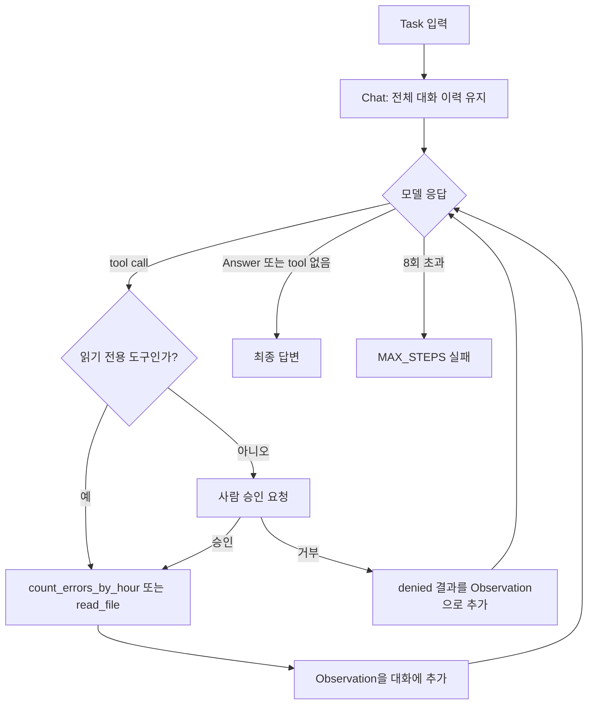
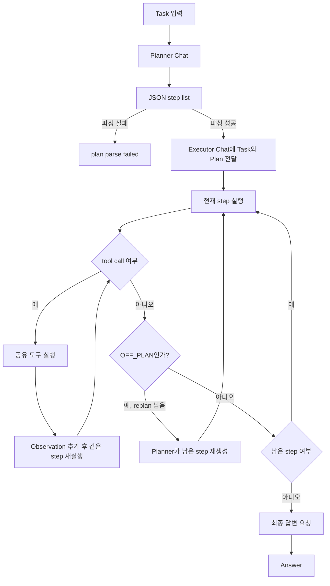

# Week 02 — ReAct vs Plan-then-Execute

## 1. Variant definition

두 harness는 같은 `app.log`, 같은 모델, 같은 `tools_shared.py`를 사용했다. 현재 도구 세트는 `read_file(path)`와 `count_errors_by_hour(path)`다. 기존 정규식 기반 `count_pattern` 대신 로그 형식을 직접 분해해 한 번에 시간별 ERROR 개수를 JSON으로 반환하도록 바꿨다. `LSP`는 이 저장소에 설정된 Python language server가 없어 사용할 수 없었고, 로그 집계에는 코드 인덱싱 도구보다 전용 결정적 도구가 적합하다.

- **Context management:** ReAct는 한 대화에 task, 응답, tool observation을 계속 누적한다. Plan-then-Execute는 planner와 executor를 분리하고 executor에 plan을 전달한다.
- **Tool granularity:** 두 variant 모두 동일한 전용 집계 도구를 사용한다. 한 호출로 `HH:00 -> ERROR count`를 반환하므로 정규식으로 시간별 재호출하는 방식보다 모델 호출과 입력 토큰을 줄인다.
- **Termination:** ReAct는 모델 종료 또는 `max_steps=8`이다. Plan-then-Execute는 plan 단계, plan 길이, step별 `max_tool_rounds=3`, `max_replan=1`의 제한을 함께 사용한다.
- **Error recovery:** ReAct는 tool error를 다음 Observation으로 돌려준다. Plan-then-Execute는 `OFF_PLAN`을 감지해 한 번만 남은 plan을 재생성한다.
- **Human intervention:** 두 harness 모두 읽기 전용 도구만 허용하므로 `interventions=0`이다.

### ReAct 구조



### Plan-then-Execute 구조



재현 명령은 다음과 같다. API key 자체는 저장하지 않았다.

```bash
source ~/.zshrc
export OPENAI_API_KEY="$OPENROUTER_API_KEY"
export OPENAI_BASE_URL=https://openrouter.ai/api/v1
export AGENT_MODEL=nvidia/nemotron-3.5-lightning:free
python3 run_ab.py --runs 3
```

## 2. Measurements

`results.csv`의 인증 실패 1–6번은 잘못된 endpoint 설정으로 모델 호출 전에 실패한 setup 기록이다. 실패를 삭제하지 않고 보존했으며, 아래 비교표에서는 토큰과 iteration이 기록된 실행만 표시했다.

| run | harness | success | tokens | iters | interventions | note |
|---:|---|:---:|---:|---:|---:|---|
| 7 | react | O | 4532 | 2 | 0 | |
| 8 | react | X | 23492 | 8 | 0 | max steps |
| 9 | react | O | 3838 | 2 | 0 | |
| 10 | plan_exec | O | 60360 | 18 | 0 | replans=1 |
| 11 | plan_exec | O | 20379 | 8 | 0 | replans=0 |
| 12 | react | O | 1158 | 2 | 0 | |
| 13 | react | O | 1160 | 2 | 0 | |
| 14 | react | X | 787 | 2 | 0 | empty final answer |
| 15 | plan_exec | O | 8967 | 8 | 0 | replans=0 |
| 16 | plan_exec | X | 4656 | 1 | 0 | invalid JSON plan |
| 17 | plan_exec | O | 13549 | 7 | 0 | replans=0 |

정상적으로 측정된 실행 기준으로 ReAct는 6회 중 4회 성공, Plan-then-Execute는 5회 중 4회 성공했다. ReAct의 iteration은 2–8회였고, Plan-then-Execute는 1–18회였다. 두 harness 모두 intervention은 0회였다.

## 3. Interpretation

이번 기록에서는 ReAct가 평균적으로 더 적은 iteration과 token을 사용했다. 전용 `count_errors_by_hour`가 시간별 정규식 재호출을 제거한 것이 두 harness의 비용을 낮추는 공통 요인이다. ReAct의 강점은 observation을 받은 뒤 바로 답할 수 있다는 점이지만, run 8처럼 iteration cap에 걸릴 수 있고 run 14처럼 모델이 빈 최종 답을 낼 수 있다. Plan-then-Execute는 plan 단계와 executor 분리, `OFF_PLAN` 재계획이라는 error-recovery 축을 추가해 실패를 복구할 여지가 있지만, run 10에서는 재계획으로 18 iteration과 60,360 tokens까지 증가했다. run 16의 invalid JSON은 구조화된 plan 형식이라는 termination/context 경계가 실패 지점이 된 사례다. 따라서 이 데이터에서는 ReAct가 비용·단순성에서 우세하고, Plan-then-Execute는 명시적 계획과 제한된 복구가 필요한 작업에서 더 많은 제어를 제공하지만 계획 파싱 비용과 형식 실패를 부담한다.
