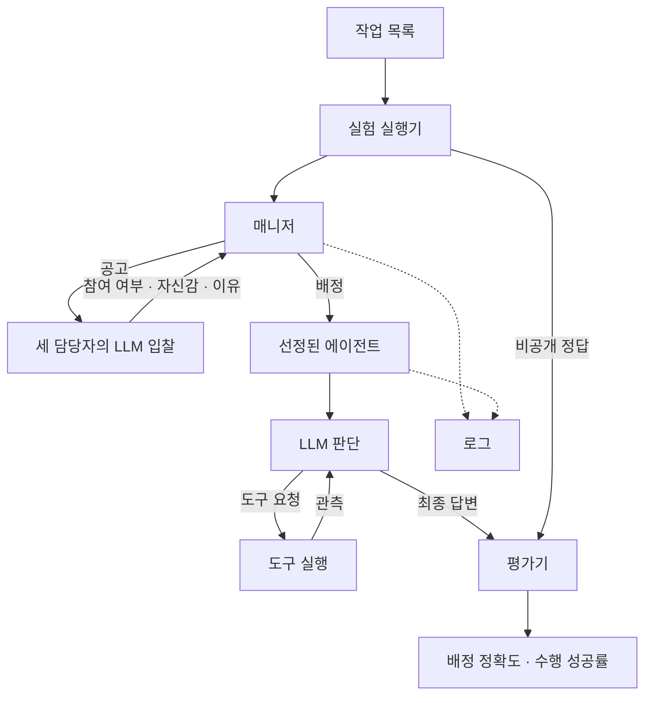

# Week 3: 수행까지 연결하는 Contract Net 실습

기존 과제에 실제 수행과 검증을 더한 강의 검증본이다.

## 구현 순서와 완료 기준

1. 아키텍처: 매니저는 일반 Python 코드, 담당자는 동일 모델에 역할 프롬프트가 다른 LLM 호출이다. 평가기는 LLM과 분리한다.
2. 작업·프로토콜: tasks.json을 실험 전에 커밋한다. 최소 5개 작업과 2종 이상의 gold를 포함한다. 공고에는 id와 desc만 전달한다.
3. 에이전트: 1주차처럼 LLM → 도구 → 관측을 반복한다. 최종 답변 또는 최대 6회 호출에서 종료한다. 미등록 도구와 잘못된 인자는 오류 관측으로 돌려준다.
4. Contract Net: 세 입찰을 수집하고 최고 자신감의 참여자를 선정한다. 동점은 이름순, 참여자가 없으면 미배정이다. 선정자만 실행한다.
5. 검증: 프로토콜·선정·오류·도구 루프 자동 테스트, 실제 모델의 세 조건 각 3회 실행, 기존 구조 검사, 로그와 집계 대조.

## 프로토콜

- announcement: `{id, desc}`. gold와 expected는 평가기만 읽는다.
- bid: `{participate: bool, confidence: number [0,1], reason: string}`. 모델이 담당자 이름을 지정하지 못하며 호출자가 신원을 부여한다. 잘못된 JSON은 불참으로 기록한다.
- award: `{task, contractor}`. 선정 후 실제 작업을 수행하라는 사용자 메시지를 보낸다.
- tool request: OpenAI 호환 function calling. 도구 결과를 같은 대화에 tool 메시지로 추가한다.
- result: `{status: completed|failed, answer, steps}`. 답은 JSON 값 하나로 반환한다.
- evaluation: 배정과 gold 비교, 답을 JSON으로 파싱해 expected와 비교. 오류와 실행 한도는 수행 실패다.

## 실험 통제와 지표

세 담당자는 arithmetic, extraction, sorting 역할이다. 모든 조건에서 같은 도구를 사용할 수 있다. baseline은 다른 전문 역할, homogeneous는 동일 범용 역할, overconfident는 arithmetic의 입찰 지시만 변경한다. 수행 프롬프트, 작업, 모델, temperature=0은 고정한다. 이는 역할 지시의 효과이며 실제 능력의 차이를 보장하지 않는다.

results.csv는 원 과제 형식을 유지한다. messages는 공고 3개 + 수신한 입찰 응답(불참·잘못된 JSON 포함) + 배정 1개이며 API 전송 실패는 수신 응답으로 세지 않는다. 도구와 수행 호출은 이 협상 메시지 지표에 포함하지 않는다. execution.csv에 수행 성공과 호출 수를 별도 기록한다. 실패한 실행의 results.csv 수치는 비우고 note에 오류 종류를 남긴다. 원본 로그는 수정하지 않는다.

실습에서는 전체 흐름을 한 작업으로 연결하고, 과제로 작업 확장·세 조건 반복·실패 분석을 수행한다. 정답 배정과 작업 성공은 다른 지표다. homogeneous에서 gold 일치율은 전문 능력 평가가 아니다.
