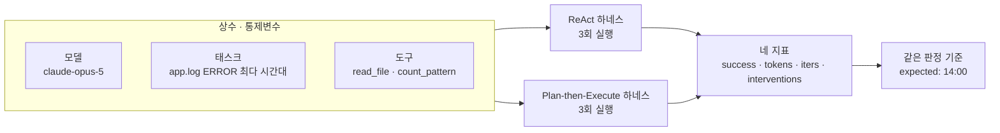
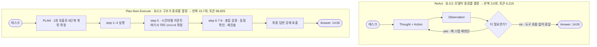

# Week 02 — Harness A/B: ReAct vs Plan-then-Execute

- Student ID: 23530007
- Task: `app.log`에서 ERROR가 가장 많은 시간대를 HH:00 형태로 답하기
- Success criterion: 최종 답변에 `14:00`이 포함되면 O. 기준은 실행 전 커밋(`TASK.md`)에 고정
- Provider / model: Anthropic Messages API, `claude-opus-5` (`AGENT_MODEL`로 지정), `max_tokens=1024`
- Tools: `read_file(path)`, `count_pattern(path, pattern)` — 두 하네스가 `tools_shared.py`에서 동일하게 import
- How to run:
  ```bash
  export ANTHROPIC_API_KEY=...          # 커밋 금지, 환경변수로만
  export AGENT_MODEL=claude-opus-5
  python run_ab.py --runs 3 --workers 6 # --workers 1 이면 순차, 지표는 동일
  ```

재현성 관련 두 가지를 미리 밝힌다. 첫째, 스타터 `tools_shared.py`의 기본 모델명
`claude-sonnet-4-5`는 이 계정의 `models.list()`에 존재하지 않아(날짜가 붙은
`claude-sonnet-4-5-20250929`만 있다) 그대로 실행하면 404가 난다. 그래서 모델을
`AGENT_MODEL=claude-opus-5`로 명시했고, 코드는 고치지 않았다. 둘째, `run_ab.py`를
병렬 실행으로 바꿨다(6회 동시). 각 실행이 자기 `Chat`과 자기 `Meter`를 새로 만들어
상태를 공유하지 않으므로 네 지표는 동시 실행에 영향받지 않는다. 벽시계로는 362초가
146초로 줄었다(2.5배). 병렬화는 러너의 성질이고 다섯 요소 중 어느 것도 아니다.

## 1. 변형 정의 — 무엇이 같고 무엇이 다른가

독립변수는 하네스 하나다. 모델, 태스크, 도구 집합은 상수로 고정했다. 두 하네스는
같은 `tools_shared.py`에서 `Chat`, `Meter`, `TOOLS_IMPL`, `TOOL_SPECS`, `MODEL`을
import하므로 도구 구현·스키마·모델명·토큰 계측이 모두 동일하다.

다섯 요소 중 실제로 다르게 잡은 것은 1·3·4이고, 2는 의도적으로 고정, 5는 두 하네스
모두 비활성이다.



FIG. 1 — 독립변수는 하네스 하나. 모델·태스크·도구는 상수로 묶여 있고, 두 하네스는
같은 판정 기준으로 같은 네 지표를 낸다.

| 요소 | ReAct | Plan-then-Execute | 같음/다름 |
|---|---|---|---|
| 1 컨텍스트 관리 | `Chat` 하나. 전체 history를 매 호출에 전달 | `Chat` 둘. planner(`tools=False`)와 executor 분리. executor는 계획을 받고 단계마다 `Execute step i` 지시가 누적된다 | **다름** |
| 2 도구 granularity | `read_file`, `count_pattern` | 동일 (같은 모듈) | 같음 (통제변수) |
| 3 종료 조건 | 모델이 도구 호출 없이 답하면 종료, 아니면 `max_steps=8` | 계획의 단계 수가 실행 횟수를 결정. 단계당 도구 라운드 `max_tool_rounds=3`, 마지막에 최종 답변 강제 1회. 종료가 모델 판단이 아니라 구조로 정해진다 | **다름** |
| 4 에러 복구 | 도구 예외를 Observation으로 되돌려 매 스텝 재판단 | 예외 처리는 공유(동일)하되 계획 이탈은 `OFF_PLAN` → 재계획 1회(`max_replan=1`)로 상한 | **다름** |
| 5 개입 지점 | `IRREVERSIBLE = set()` — 비어 있어 승인 미발동 | 개입 훅 없음 | 같음 (둘 다 0) |

요소 5는 스타터 도구가 둘 다 읽기 전용이라 되돌릴 수 없는 행동이 없다. 따라서
`interventions`는 구조적으로 0이며 이 지표로는 하네스가 갈리지 않는다. 살리려면
쓰기/삭제 도구를 양쪽에 똑같이 넣고 `IRREVERSIBLE`에 등록해야 하는데 그러면 도구
집합이 흔들려 통제변수가 깨진다. 이번 실험에서는 0으로 고정된 지표로 보고한다.

## 2. 측정표

`results.csv` 원본:

| run | harness | success | tokens | iters | interventions | note |
|---|---|---|---|---|---|---|
| 1 | react | O | 6,185 | 3 | 0 | |
| 2 | react | O | 6,333 | 3 | 0 | |
| 3 | react | O | 6,139 | 3 | 0 | |
| 4 | plan_exec | O | 81,904 | 15 | 0 | replans=0 |
| 5 | plan_exec | O | 90,030 | 15 | 0 | replans=0 |
| 6 | plan_exec | O | 124,542 | 17 | 0 | replans=0 |

집계와 로그에서 센 부수 지표:

| | success | tokens 평균 | tokens 변동폭 | iters 평균 | 도구 호출 | 계획 단계 |
|---|---|---|---|---|---|---|
| react | 3/3 | 6,219 | 3% (6,139–6,333) | 3.0 | 5–6회 | — |
| plan_exec | 3/3 | 98,825 | 43% (81,904–124,542) | 15.7 | 19–44회 | 8 / 7 / 8 |

plan_exec는 react의 **15.9배** 토큰을 썼다. 재계획은 세 번 모두 0회다.

## 3. 해석



FIG. 2 — 답을 아는 시점과 멈추는 시점의 거리. ReAct는 둘이 같은 스텝에서 만나고,
Plan-then-Execute는 step 5와 step 8로 벌어진다. 이 거리가 반복 횟수의 차이이고,
누적 history 재전송(요소 1)이 그것을 토큰 차이로 증폭한다.


이 태스크에서 **성공률은 두 하네스를 가르지 못했다**(3/3 대 3/3). 갈린 것은 토큰과
반복 횟수이고, 차이는 15.9배와 5.2배로 우연이라 보기 어렵다. 움직인 요소는 **요소 3
(종료 조건)** 이고, 그것을 증폭한 것이 **요소 1(컨텍스트 관리)** 이다. ReAct는
`logs/react-01.txt`에서 보듯 파일을 한 번 읽고, 두 번째 스텝에서 `count_pattern`을
한 턴에 네 개 병렬 호출해 필요한 숫자만 집은 뒤 세 번째 스텝에서 답했다 — 3회 반복,
도구 5회. 종료 시점을 모델이 직접 골랐기 때문에 "이 정도면 답이 나왔다"는 판단이
바로 종료로 이어졌다. Plan-then-Execute는 planner가 8단계 계획을 세웠고
(`"For each hour 00-23..."`, `"verify the totals sum to the overall ERROR line count"`,
`"noting any tie"` 같은 검증 단계 포함), executor는 그 8단계를 끝까지 걸어갔다.
`logs/plan_exec-04.txt`를 보면 5단계에서 이미 시간대별 카운트가 나와 14시=6으로 답이
확정되는데, 6·7·8단계가 그대로 이어져 총합 검증, 동점 확인, 재진술을 수행한다.
답을 아는 시점과 멈추는 시점이 분리된 것이 반복 횟수 15~17의 직접 원인이다. 여기에
요소 1이 곱으로 작용한다. executor는 단계마다 누적된 history를 다시 전송하고, 각
단계의 응답이 마크다운 표를 포함한 장문이어서, 단계가 늘 때 토큰이 선형이 아니라
초선형으로 불어난다. 주목할 점은 **강의가 예상한 방향이 뒤집혔다**는 것이다.
Plan-then-Execute가 "토큰이 적게 들고 흐름이 예측 가능"하다는 서술과 달리, 여기서는
토큰이 15.9배 많았고 변동폭도 43% 대 3%로 훨씬 덜 예측 가능했다. 계획을 미리
굳히는 것이 절약이 되는 조건은 계획 단계 수가 실제 필요한 작업량에 맞을 때인데,
단계 분할을 모델이 정하므로 그 수가 통제되지 않는다. 이 태스크는 도구 호출 네다섯
번이면 끝나는 크기여서, 8단계 계획은 그 자체가 초과 비용이었다. 마지막으로 요소 4의
유연성 상한(`max_replan=1`)은 이번 실험에서 **한 번도 발동하지 않았다**(replans=0
×3). 즉 plan_exec의 비용은 재계획 때문이 아니라 과다 계획 때문이며, 이 태스크에서는
유연성 상한이라는 설계 선택 자체가 지표에 영향을 주지 않았다. 요소 5는 도구가 모두
읽기 전용이라 양쪽 0으로 묶여 있어 비교에 기여하지 못했다.
