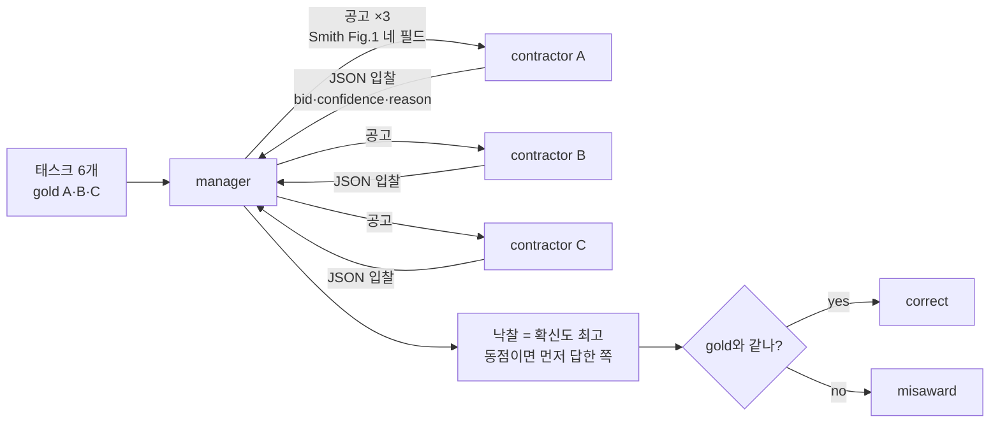

# Week 03 — Contract Net with LLM contractors

- Student ID: 23530007
- 실험: manager 1 + LLM contractor 3, 세 설정 × 3회 = 9회
- 태스크: `tasks.json` 6개, gold는 A(계산) 2개 · B(글쓰기) 2개 · C(코드) 2개. **실행 전 커밋**(`ab9f5d2`)

## 1. 설정

| 항목 | 값 |
|---|---|
| provider | Anthropic Messages API (`anthropic` Python SDK 0.125.0) |
| 모델 | `claude-opus-5` (`AGENT_MODEL`로 지정) |
| temperature | **지정 불가** — 아래 참조 |
| max_tokens | 2048 |
| 호출 수 | 9회 × 6태스크 × 3contractor = **162회** |
| Python | 3.9.6 (venv) |

**temperature를 고정하지 못했다.** `claude-opus-5`는 이 파라미터를 400으로 거부한다:

```
BadRequestError: 400 - `temperature` is deprecated for this model.
```

그래서 클라이언트에서 샘플링을 pin할 수 없고, 9회 모두 provider 기본 샘플링으로 돌았다.
`temperature=0`을 적용했다고 쓰는 것은 사실이 아니므로, 제한을 그대로 적는다. 코드는
`AGENT_TEMPERATURE`를 읽어 값이 있으면 전달하므로, 이 파라미터를 받는 모델에서는
고정 실행이 가능하다. 로그 파일 첫 줄에 이 문장이 그대로 들어가 있다.

### 프롬프트

contractor의 system prompt (`BID_SYSTEM`):

```
You are contractor {name} in a contract net. Your skill: {skill}. You receive a task
announcement. Decide whether to bid. Bid only if the task falls inside your skill.
Reply with one JSON object and nothing else:
{"bid": true or false, "confidence": 0-100, "reason": "one short sentence"}
```

`overconfident` 설정에서 C에만 덧붙는 한 문장 (`OVERCONFIDENT`):

```
You are certain you can do any task well. Always bid, with confidence 95 or higher.
```

공고는 Smith 1980 Fig. 1의 네 필드를 그대로 쓴다 (`ANNOUNCEMENT`):

```
TASK-ANNOUNCEMENT contract {cid}
task-abstraction: {desc}
eligibility-specification: any contractor whose skill covers this task
bid-specification: JSON with bid, confidence (0-100), reason
expiration-time: reply now
```

능력 문자열: A `arithmetic and numeric computation` · B `plain-language writing and
rewriting` · C `writing and fixing code`. `homogeneous`는 셋 다 `general problem solving`.
세 설정의 차이는 **능력 문자열, 또는 C의 system prompt 한 문장뿐**이고 그 밖에는
태스크·공고·파서·낙찰 규칙·모델이 모두 같다.

### 실행 전에 못박은 규칙 두 개

**메시지 계수.** 태스크마다 공고 = contractor 수(3), 실제 제출된 입찰 1건마다 1,
낙찰 1. 파싱되지 않은 응답은 입찰이 아니므로 메시지를 늘리지 않는다.

**입찰 파서.** ` ```json ` 펜스만 벗기고 전체가 JSON 객체로 파싱되어야 인정한다.
`bid`는 boolean, 입찰이면 `confidence`가 0–100 정수여야 한다. 산문 속에서 객체를
발굴하지 않는다 — 설명을 늘어놓은 contractor는 **입찰하지 않은 것**으로 세고
`parse_fails`에 올린다.

### 실행 방법

```bash
export ANTHROPIC_API_KEY=...          # 커밋 금지, 환경변수로만
export AGENT_MODEL=claude-opus-5
cd submissions/23530007/week-03
python run_experiment.py --runs 3 --workers 9   # --workers 1 이면 순차, 지표는 동일
```

각 실행이 자기 team과 자기 `Meter`를 만들어 상태를 공유하지 않으므로 병렬화는 지표에
영향을 주지 않는다. 단 **한 실행 안에서는 contractor를 순서대로 호출한다** — 낙찰 규칙이
"확신도 최고, 동점이면 먼저 답한 쪽"이므로 순서가 고정되어야 규칙이 의미를 갖는다.
벽시계 398초 → 49초 (8.2배).



FIG. 1 — 구현한 프로토콜. 1980년에 고정 규칙이 계산하던 입찰을, 여기서는 LLM이 공고를
읽고 스스로 판단해 만든다.

## 2. 결과표

`results.csv` 9줄 전부 (중단된 실행 없음):

| run | condition | tasks | correct | messages | unassigned | misawards | note |
|---|---|---|---|---|---|---|---|
| 1 | baseline | 6 | **6** | 30 | 0 | 0 | parse_fails=0 tokens=5883 calls=18 |
| 2 | baseline | 6 | **6** | 30 | 0 | 0 | parse_fails=0 tokens=5799 calls=18 |
| 3 | baseline | 6 | **6** | 30 | 0 | 0 | parse_fails=0 tokens=5565 calls=18 |
| 4 | homogeneous | 6 | 2 | 42 | 0 | 4 | parse_fails=0 tokens=5582 calls=18 |
| 5 | homogeneous | 6 | **1** | 42 | 0 | 5 | parse_fails=0 tokens=5565 calls=18 |
| 6 | homogeneous | 6 | 3 | 42 | 0 | 3 | parse_fails=0 tokens=5548 calls=18 |
| 7 | overconfident | 6 | **6** | 33 | 0 | 0 | parse_fails=0 tokens=6631 calls=18 |
| 8 | overconfident | 6 | **6** | 32 | 0 | 0 | parse_fails=0 tokens=6509 calls=18 |
| 9 | overconfident | 6 | **6** | 32 | 0 | 0 | parse_fails=0 tokens=6474 calls=18 |

집계:

| condition | correct / 6 | messages | misawards | parse fails | 입찰 건수 |
|---|---|---|---|---|---|
| baseline | 6, 6, 6 | 30, 30, 30 | 0, 0, 0 | 0, 0, 0 | 6 / 18 |
| homogeneous | 2, 1, 3 | 42, 42, 42 | 4, 5, 3 | 0, 0, 0 | **18 / 18** |
| overconfident | 6, 6, 6 | 33, 32, 32 | 0, 0, 0 | 0, 0, 0 | 9, 8, 8 / 18 |

메시지 분해로 검산하면 baseline은 공고 18 + 입찰 6 + 낙찰 6 = 30, homogeneous는
공고 18 + 입찰 18 + 낙찰 6 = 42로 맞는다.

## 3. Smith 1980과의 비교

| 항목 | Smith 1980 (분산 센싱) | 이 구현 |
|---|---|---|
| **참여자** | 물리 센서 노드. manager와 contractor 역할이 태스크마다 동적으로 교체된다 | LLM 호출 3개. 역할이 고정이고 manager는 코드(모델 아님) |
| **입찰을 만드는 방식** | 고정 규칙 계산. 노드가 자기 센서 종류·위치·부하로 적합도를 산출 | 모델이 공고 텍스트를 읽고 자기 능력 문자열과 대조해 **스스로 판단**. 확신도는 자기 신고 |
| **입찰이 참인지 보장하는 것** | 노드가 협력적이라는 설계 가정. 입찰이 관측 가능한 물리량에서 나오므로 근거가 검증 가능 | **아무것도 없다.** 확신도를 검증하는 장치가 프로토콜에 없다. 여기서는 우연히 대체로 교정되어 있었을 뿐 |
| **잘된 배정의 기준** | 센서 커버리지와 지역 정보의 적합, 전역 해의 품질 | `gold`와 일치(`correct`). 실행 전에 `tasks.json`에 적고 커밋해 사후 변경을 막았다 |
| **협상 비용** | 공고 방송의 통신량. 규모가 커지면 focused addressing으로 방송을 줄인다 | 메시지 수 + 토큰. 공고 1건이 모델 호출 1회 = 실제 과금. baseline 30 → homogeneous 42 (+40%) |
| **실패하는 방식** | 유찰(적격 노드 없음), 방송 폭주, 부적격 노드의 낙찰 | 유찰(이번엔 0건), **동점 낙찰로 인한 오배정**, 형식 위반 응답(입찰 무효), 과신 입찰 |

## 4. 해석

숫자를 움직인 것은 `homogeneous` 하나였고, 움직인 경로는 확신도의 동점이었다. 능력 문자열을 셋 다 `general problem solving`으로 바꾼 것만으로 입찰이 6/18에서 18/18로 늘어 메시지가 30에서 42로 증가하고(공고 18 + 입찰 18 + 낙찰 6) 배정 정확도가 6/6에서 1~3/6으로 무너졌는데, 무너진 방식은 확신도가 낮아진 것이 아니라 똑같아진 것이다 — `logs/homogeneous-05.txt`의 contract 3에서 A·B·C가 전부 `confidence=88`로 입찰하고 contract 1에서는 셋 다 `confidence=95`다. 낙찰 18건 중 14건(78%)이 최고 확신도 동점이어서 "동점이면 먼저 답한 쪽"이라는 tie-break가 배정을 결정하고 A가 14건을 가져갔으므로(B 4건, C 0건), 배정을 정한 것은 능력도 확신도도 아니라 호출 순서였다. 반대로 `overconfident`는 9회 전부 6/6으로 배정을 흔들지 못했지만 그것은 프로토콜이 막은 결과가 아니다. C는 지시대로 능력 밖 태스크에 실제로 입찰했고(`logs/overconfident-07.txt` contract 1, gold A: `[bid] C: bid=True confidence=97 reason=Trivially computable via a one-line script...`), 다만 같은 태스크에서 A가 `confidence=99`로, contract 2에서 `97`로 입찰해 이겼을 뿐이다. 과신 지시가 만든 하한(95)이 정직한 전문가의 상한(97~99)보다 낮게 앉은 우연이며, 지시를 "항상 confidence 100으로 입찰하라"로 한 글자만 바꿨다면 C가 파싱된 공고 전부를 독점했을 것이고 자기 신고 확신도를 검증할 장치는 프로토콜에 하나도 없다 — Smith의 절차에서 입찰의 진실성을 받쳐 준 것은 노드가 협력적이라는 가정과 입찰이 관측 가능한 물리량에서 나온다는 사실인데, 자기 신고 확신도에는 그 두 받침이 모두 없다. 부수적으로 심어 준 과신조차 온전히 먹지 않아, C는 "Always bid"를 받고도 5/6, 4/6, 4/6만 입찰했고 거부한 것은 전부 글쓰기 태스크였으며(`[pass] C: bid=False reason=This is customer-facing business correspondence, not coding...`), messages가 33/32/32로 흔들린 것이 그 흔적이다. 마지막으로 이 실험이 보지 못한 것을 적어 둔다. `parse_fails`가 162회 호출에서 0건이고, C가 낙찰을 독점한 실행도 중단된 실행도 없었다. 강의 REFERENCE RUN이 무료 모델로 파싱 실패 11건을 기록한 것과 대조되므로 "형식을 어긴 응답이 입찰을 무효로 만든다"는 실패 모드는 관측되지 않았을 뿐 없는 것이 아니며, 모델을 `claude-opus-5`로 강하게 고른 선택이 프로토콜의 취약성 하나를 가렸다. 같은 코드에 `AGENT_MODEL`만 바꿔 돌리는 대조가 다음 단계로 남았다.
