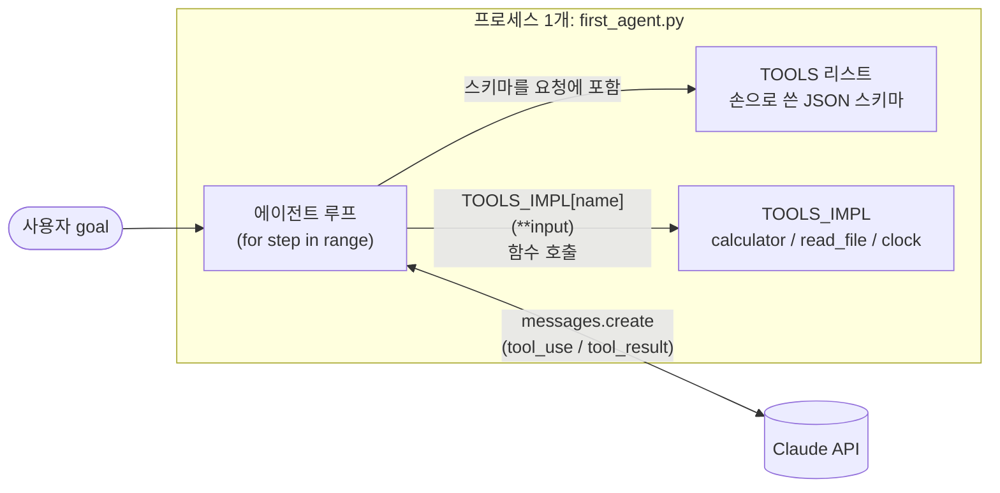
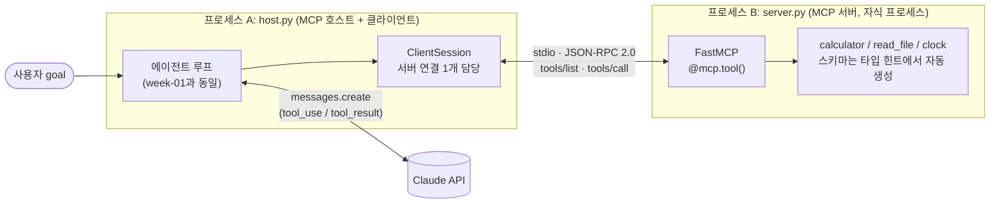
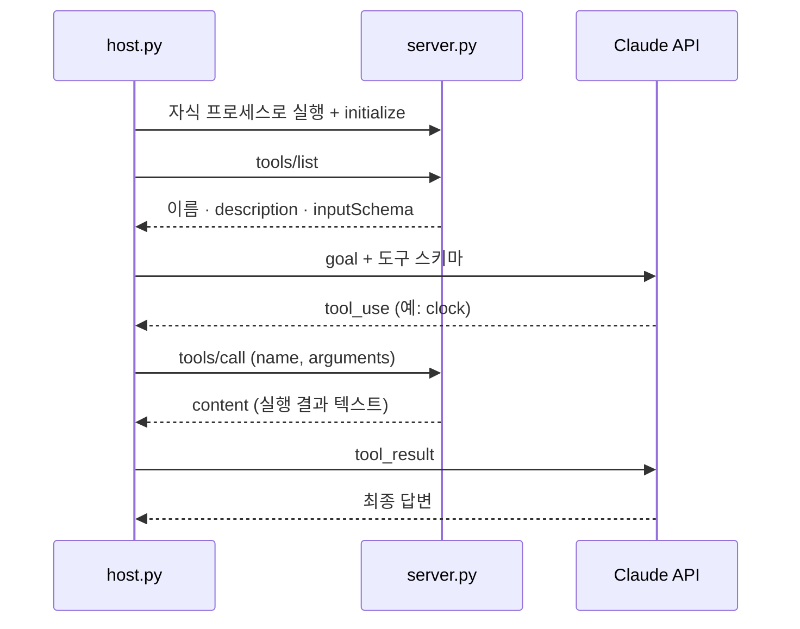

# week-01 에이전트: MCP 전환 전 / 후

## 전 — week-01 `first_agent.py` (프로세스 1개)

도구 정의(스키마), 도구 구현, 에이전트 루프가 한 파일·한 프로세스에 섞여 있다.
스키마는 `TOOLS` 리스트에 손으로 쓰고, 구현은 `TOOLS_IMPL[name](**input)`으로 직접 호출한다.

## 후 — `host.py` + `server.py` (프로세스 2개, MCP stdio)

루프는 그대로 호스트에 남고, 도구는 서버로 나갔다.
호스트는 도구를 하나도 모른다. 시작할 때 `tools/list`로 물어보고, 모델이 부르면 `tools/call`로 넘길 뿐이다.

## 한 스텝의 흐름 (후)

## 무엇이 어디로 갔나

| 항목 | 전 (`first_agent.py`) | 후 |
|---|---|---|
| 도구 구현 | 에이전트 파일 안의 함수 | `server.py` |
| 도구 스키마 | `TOOLS` 리스트에 손으로 작성 | `@mcp.tool()`이 시그니처에서 생성, `tools/list`로 전달 |
| 도구 호출 | `TOOLS_IMPL[name](**input)` | `session.call_tool(name, input)` (JSON-RPC) |
| 에이전트 루프 | 같은 파일 | `host.py` (로직 동일) |
| 도구 실행 위치 | 에이전트 프로세스 | 별도 자식 프로세스 |
| 도구 추가 | 에이전트 코드 수정 | 서버에만 추가, 호스트는 그대로 |
| `DROP_CLOCK` | 스키마 리스트에서 제거 | `tools/list` 결과에서 제거 (호스트 쪽) |
| `CLOCK_DESC` | 에이전트가 읽음 | 서버가 읽음 (호스트가 환경 변수를 자식에게 전달) |

## 바뀌지 않은 것

- 모델, `max_tokens=1024`, `max_steps=8`, 기본 goal, 도구 설명 문구.
- `read_file`의 작업 디렉터리 제한. 이제는 서버 프로세스의 cwd 기준이며, 호스트를 `week-05/`에서 실행하면 같은 범위다.

## 아직 확인되지 않은 것

이 환경에는 Python 3.10 이상과 `mcp` SDK, API 키가 없어서 `py_compile`만 통과시켰고 **실제 실행은 하지 않았다.** `logs/`에 실행 로그가 없는 이유다.
