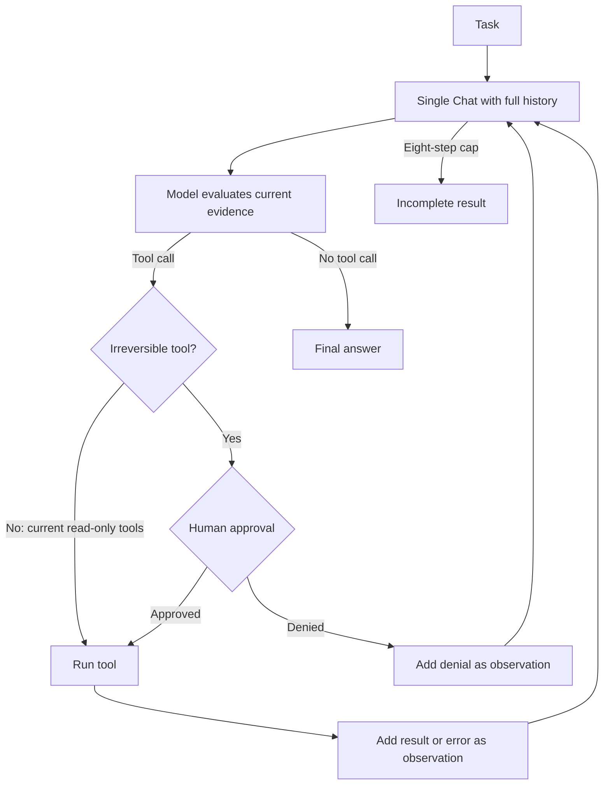
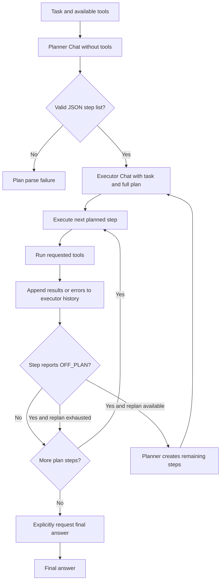

# Week 02 — Harness A/B Report

## 1. Variant definition and reproducibility

The task, success criterion, model, and tools were held constant inside each
A/B batch. The provider was OpenRouter through its OpenAI-compatible endpoint
(`https://openrouter.ai/api/v1`) with OpenAI Python SDK 3.8.0. Runs 1–6 were an
initial pilot with `poolside/laguna-s-2.1:free`; provider rate limits and a 400
response made that batch unusable for a clean comparison, but the failed runs
remain in the data. Runs 7–12 were the first batch with
`nvidia/nemotron-3.5-lightning:free`. Runs 13–18 repeated both harnesses with
that same model and `PYTHONUTF8=1`; this is the primary comparison batch because
the setting prevents the Windows CP949 console from terminating a run while
printing model output. The shared tools were `read_file(path)` (return the
UTF-8 file contents) and `count_pattern(path, pattern)` (count regex-matching
lines). No API key is stored in the repository.

### What the two harnesses hold constant

Both harnesses solve the same task: find the hour with the most `ERROR` lines
in `app.log` and answer in `HH:00` format. They also use the same tool set from
`tools_shared`: `read_file(path)` and `count_pattern(path, pattern)`. ReAct
chooses among these tools directly, while the Plan-then-Execute planner is told
which tools the executor can use. The observed differences therefore come
primarily from orchestration rather than tool capability.

Neither harness starts over after every call. ReAct keeps the task, thoughts,
actions, and observations in one full-history `Chat`. Plan-then-Execute splits
the context into a planner and an executor, but the executor still accumulates
the task, full plan, step requests, and tool results. ReAct uses the history to
choose its next action dynamically; Plan-then-Execute uses it while prioritizing
the next step of the previously generated plan. In both harnesses, tool results
and tool errors are returned to the model. ReAct treats errors as observations,
whereas Plan-then-Execute can report `OFF_PLAN` and request a replan.

No human approval was required for this read-only task. ReAct's `IRREVERSIBLE`
set is empty, and Plan-then-Execute has no approval gate. All measured
intervention counts were therefore zero, so interventions cannot explain the
performance difference in this experiment.

### How the five harness axes differ

**1. Context management.** ReAct maintains a single full-history conversation.
Plan-then-Execute separates planning from execution, then repeatedly sends the
executor's growing history as it works through the plan. Across successful
runs, ReAct averaged 4,684 tokens while Plan-then-Execute averaged 41,454.3
tokens, about 8.9 times as many. The gap comes from the combination of a plan
generation call, calls for individual plan steps, possible tool-call rounds
within each step, a final-answer call, and retransmission of the accumulated
executor history. ReAct also retransmits history, but it usually finished in
only two or three iterations.

**2. Action and tool-call granularity.** Tool functionality is identical, but
the control granularity differs. ReAct decides at each iteration whether to
read, count, or answer. Plan-then-Execute first decomposes the task into a list
of steps and executes every step separately, allowing up to three tool-call
rounds inside a step. For this short, linear log-analysis task, the extra layer
of decomposition added overhead; ReAct compressed the work into two or three
decisions.

**3. Termination.** ReAct stops when the model returns no tool call, with an
eight-step safety cap. Plan-then-Execute processes the planned steps in order,
then explicitly requests a final answer and may make another call if the model
still asks for a tool. This means ReAct can stop as soon as it believes it has
enough evidence, while Plan-then-Execute may continue after already finding the
answer. Successful ReAct runs took 2, 3, 2, 3, and 2 iterations; successful
Plan-then-Execute runs took 10, 10, and 15.

**4. Error recovery and flexibility.** ReAct feeds a tool error back as an
observation and lets the next iteration adapt, so small replanning decisions
are implicit in its loop. Plan-then-Execute requires an `OFF_PLAN` response to
enter its explicit recovery path, permits at most one replan, and converts more
than three tool-call rounds in one step into `OFF_PLAN: step exceeded the
tool-call budget`. Two successful Plan runs used no replan; the run with one
replan was the most expensive at 46,918 tokens and 15 iterations. The harness
can recover from a bad plan, but recovery has a visible cost.

**5. Human intervention point.** ReAct contains an explicit extension point:
tools added to `IRREVERSIBLE` require approval before execution, and a denial is
fed back as an observation. Plan-then-Execute records interventions through
`Meter` but has no approval logic in the current harness. The measured result
is a tie at zero interventions, although ReAct makes the human-control point
more explicit as a design capability.

### Harness structures

The ReAct harness uses one continuously growing conversation and decides the
next action after every observation:



The Plan-then-Execute harness separates plan construction from execution and
follows the generated steps before explicitly requesting a final answer:



Reproduce the comparison from this directory after setting
`OPENAI_BASE_URL`, `OPENAI_API_KEY`, and `AGENT_MODEL`:

```powershell
$env:OPENAI_BASE_URL = "https://openrouter.ai/api/v1"
$env:AGENT_MODEL = "nvidia/nemotron-3.5-lightning:free"
$env:PYTHONUTF8 = "1"
& "C:\venvs\submissions\Scripts\python.exe" run_ab.py --runs 3
```

The shared OpenAI client uses a 120-second per-call timeout with automatic SDK
retries disabled, so a stalled provider call becomes a recorded failed run.

## 2. Measurements

| run | harness | success | tokens | iters | interventions | note |
|---:|---|:---:|---:|---:|---:|---|
| 1 | react | X | — | — | — | provider 429 |
| 2 | react | X | — | — | — | provider 400 (`reasoning_content`) |
| 3 | react | X | — | — | — | provider 429 |
| 4 | plan_exec | X | 175 | 1 | 0 | plan parse failed; `replans=0` |
| 5 | plan_exec | X | — | — | — | provider 429 |
| 6 | plan_exec | X | — | — | — | provider 429 |
| 7 | react | O | 3974 | 2 | 0 | |
| 8 | react | O | 5347 | 3 | 0 | |
| 9 | react | O | 3801 | 2 | 0 | |
| 10 | plan_exec | X | 73 | 1 | 0 | plan parse failed; `replans=0` |
| 11 | plan_exec | X | 794 | 1 | 0 | plan parse failed; `replans=0` |
| 12 | plan_exec | X | — | — | — | CP949 console encoding crash after producing `14:00` |
| 13 | react | X | 3455 | 2 | 0 | final response was truncated before `14:00` |
| 14 | react | O | 6578 | 3 | 0 | |
| 15 | react | O | 3720 | 2 | 0 | |
| 16 | plan_exec | O | 38104 | 10 | 0 | `replans=0` |
| 17 | plan_exec | O | 39341 | 10 | 0 | `replans=0` |
| 18 | plan_exec | O | 46918 | 15 | 0 | `replans=1` |

In the primary comparison batch (runs 13–18), ReAct succeeded 2/3 times,
averaged 4,584.3 tokens and 2.3 iterations, and required zero interventions.
Plan-then-Execute succeeded 3/3 times, averaged 41,454.3 tokens and 11.7
iterations, and also required zero interventions. Plan-then-Execute therefore
used about 9.0 times the tokens and 5.0 times the iterations in this batch.

### Result caveats

The recorded results include crashes caused by provider and execution
conditions rather than harness control logic. These conditions were retained
in `results.csv` and the run logs as required:

1. HTTP `429 Rate Limit` responses.
2. Temporary upstream throttling by the model provider.
3. OpenRouter's free-model requests-per-minute limit.
4. An HTTP `400` provider error caused by a duplicate `reasoning_content`
   field.
5. A Windows CP949 `UnicodeEncodeError` when the console could not encode a
   character in model output.

These crashes count in the overall success rates, but they are separated from
harness-level failures in the adjusted success-rate comparison below.

## 3. Interpretation

ReAct won on overall success rate: it succeeded in 5 of 9 runs (55.6%), while
Plan-then-Execute succeeded in 3 of 9 (33.3%). Each harness had three crashes
attributable to external provider or execution-environment failures; after
excluding those crashes, ReAct still led at 5/6 (83.3%) versus 3/6 (50.0%).
This task favors reacting to observed file contents and intermediate counts
over committing to an abstract plan before execution. The three metered
one-iteration Plan failures used only 73, 175, and 794 tokens, suggesting that
they failed before establishing a useful execution flow, although the CSV
alone does not justify attributing every one of them specifically to JSON plan
parsing. ReAct also won decisively on efficiency among successful runs: it
averaged 4,684 tokens compared with 41,454 for Plan-then-Execute, an 8.9-fold
difference, while the medians were 3,974 and 39,341 tokens, respectively, a
9.9-fold difference. Plan-then-Execute pays separately for plan generation,
per-step execution, tool-call rounds within a step, optional replanning, and a
final-answer call; for this short task, those coordination costs exceeded any
savings from reduced trial and error. The same pattern appears in iterations:
successful ReAct runs averaged 2.4 iterations with a median of 2, whereas
Plan-then-Execute averaged 11.7 with a median of 10. ReAct can terminate as soon
as the task is resolved, while Plan-then-Execute structurally revisits the
model for planned steps and finalization, making it substantially more costly
for this workload.

The result should therefore be generalized by workload type rather than taken
as evidence that either harness is universally superior. **ReAct is better
suited to short, observation-driven log-analysis tasks, whereas
Plan-then-Execute may provide stronger structural control for complex tasks
that must coordinate multiple systems and long sequences of work.**
