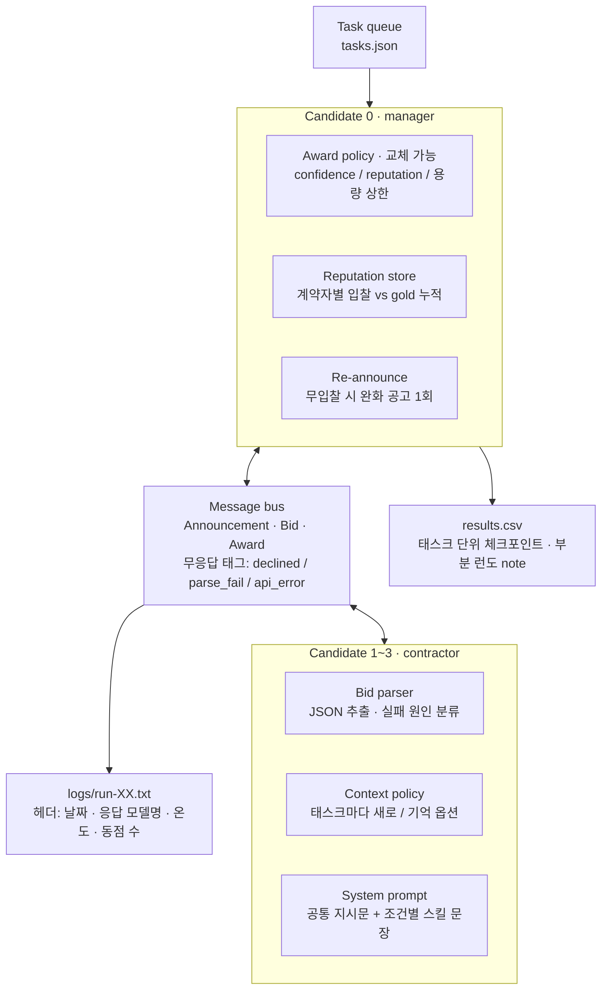

# Week 03 설계 v2 — 문제 상황을 반영한 구조

> [DESIGN.md](DESIGN.md)의 Candidate · 역할 · message protocol 베이스는 그대로 두고,
> 실행 시 예상되는 문제 상황 20개(아래 §6)를 흡수할 자리를 구조에 넣는다.
> 과제의 세 조건(baseline · homogeneous · overconfident)은 이 구조에서 **플러그인을 모두 꺼둔 상태**로 돌린다.
> 독창적 조건은 플러그인 하나를 켠 네 번째 조건으로 추가한다.

## 1. 구조도



## 2. 매니저 쪽 플러그인

### 2.1 Award policy (교체 가능)

```
AwardPolicy.choose(bids, reputation) -> winner | None, tie: bool
```

| 정책 | 규칙 | 기본값 | 겨냥한 문제 |
|---|---|---|---|
| `confidence` | participate=true 중 confidence 최댓값, 동점은 등록 순 + `tie=True` | **on** | 8 (동점 편향 기록) |
| `reputation` | confidence × 계약자 평판 가중치 | off | 4, 11 (정직성 방어) |
| `capacity` | 한 런에서 계약자당 낙찰 상한 `ceil(tasks / 3) + 1`, 초과 시 다음 순위 | off | 9 (독식) |

세 조건은 `confidence`만 켠다. 정책은 함수로 주입하므로 조건 이름 → 정책 매핑만 바꾸면 된다.

### 2.2 Reputation store

- 런 안에서만 유지(런 간 공유 없음, 재현성 때문).
- 태스크 t의 낙찰이 끝나면 `record(contractor, participated, won, was_gold)`.
- 가중치: `w = (correct_when_won + 1) / (won + 2)` — Laplace 평활, 첫 태스크는 0.5.
- `reputation` 정책이 off일 때도 **기록은 항상 한다** → 리포트 4부에서 "과신 계약자의 평판이 어떻게 떨어졌을지" 사후 계산 가능.

### 2.3 Re-announce

- 1차 공고에 participate=true가 0건이면, 공고문 끝에 "정확히 맞는 전문가가 없어도 가장 가까운 사람이 맡아야 합니다"를 붙여 1회 재공고.
- 재공고 메시지는 버스에 `Announcement(round=2)`로 기록 → 메시지 수에 포함. `unassigned` 감소와 `messages` 증가의 트레이드오프를 그대로 드러낸다.
- 기본 off. 세 조건에서는 1차 무입찰 = `unassigned`.

## 3. 계약자 쪽 플러그인

### 3.1 Bid parser

응답을 다음 순서로 시도하고, 실패하면 원인을 태그한다.

1. 전체가 JSON → 파싱
2. 첫 `{ ... }` 블록 추출 → 파싱
3. ```json 코드펜스 안쪽 → 파싱
4. 실패 → `NoBid(reason="parse_fail", raw=원문)`

무응답 종류는 세 가지로 구분해 버스에 남긴다.

| 태그 | 뜻 | messages 카운트 | 별도 카운터 |
|---|---|---|---|
| `declined` | participate=false를 정상 반환 | 안 셈 | — |
| `parse_fail` | 응답은 왔으나 JSON 아님 | 안 셈 | `parse_failures` |
| `api_error` | 타임아웃·한도·5xx | 안 셈 | `api_errors` |

두 카운터는 `results.csv`의 `note`에 `parse_fail=2 api_error=0` 형태로 들어간다.

### 3.2 Context policy

| 정책 | 동작 | 기본값 | 겨냥한 문제 |
|---|---|---|---|
| `fresh` | 태스크마다 새 `Chat` | **on** | 7 (누수 차단) |
| `memory` | 이전 태스크의 자기 입찰·낙찰 결과 요약을 유저 메시지 앞에 붙임 | off | 7 (기억 기반 행동 관찰) |

### 3.3 System prompt

```
[공통 지시문]  역할 설명 + 응답 형식(JSON 필드 4개, 다른 텍스트 금지)
[스킬 문장]    조건별로 교체
[추가 문장]    overconfident 조건에서 한 명에게만 붙임
```

confidence는 0~1 소수로 요구하고, 정수(80)나 백분율("80%")이 오면 파서가 0~1로 정규화하고 로그에 `normalized`를 남긴다 (문제 2의 스케일 혼동).

## 4. Message bus

- 모든 메시지는 `bus.send(msg)`로만 오간다. 매니저·계약자가 직접 서로를 호출하지 않는다.
- `messages` 지표 = `bus.count(kind in {Announcement, Bid(participate=True), Award})`.
- 무응답 세 태그는 `bus.events`에 남지만 카운트되지 않는다. 카운트 규칙을 바꾸고 싶으면 이 한 줄만 바꾼다 (문제 12).
- 매니저는 항상 계약자 전원에게 공고한다(브로드캐스트, 문제 13). 대상 필터링은 이번 주 범위 밖으로 두되 `bus.broadcast(targets=...)` 시그니처만 남긴다.

## 5. 실행 기록

### 5.1 로그 헤더 (문제 18, 19)

```
run=04 condition=baseline date=2026-09-16T21:03+09:00
model_requested=nvidia/nemotron-3.5-lightning:free
model_reported=<응답 JSON의 model 필드, 첫 호출에서 캡처>
temperature=0.2 seed=none policy=confidence context=fresh reannounce=off
```

### 5.2 태스크 단위 체크포인트 (문제 20)

- 태스크 하나가 끝날 때마다 `logs/run-XX.partial.json`에 누적 지표를 덤프.
- 런이 중간에 죽으면 `results.csv`에는 빈 카운트 + `note="RateLimit at task 3/5; parse_fail=1"`.
- 세 조건 각 3런은 완주한 런만 세고, 크래시 런은 행으로 남긴다 (README 규정).

### 5.3 homogeneous 전용 기록 (문제 15)

- 동점 발생 수를 로그 헤더 하단과 `note`에 `ties=N`으로 남긴다. 이 조건에서 `correct`는 우연 수준이 기대값이므로 해석은 `ties`와 `misawards` 중심으로 한다.

## 6. 문제 상황 → 반영 위치

| # | 문제 상황 | 반영 위치 | 기본 조건에서 |
|---|---|---|---|
| 1 | JSON 대신 추론문 | 3.1 파서 3단계 + `parse_fail` 태그 | 켜짐 |
| 2 | 확신도 압축·스케일 혼동 | 3.3 정규화 + 로그 `normalized` | 켜짐 |
| 3 | reason ≠ confidence | 로그에 둘 다 원문 기록, 정책은 confidence만 | 기록만 |
| 4 | 스킬 자기기만 | 2.2 평판 기록(항상) + `reputation` 정책 | 기록만 |
| 5 | 전원 무입찰 | 2.3 Re-announce | 꺼짐 |
| 6 | 런 간 분산 | 조건당 3런, 헤더에 온도 고정 명시 | 켜짐 |
| 7 | 컨텍스트 누수 | 3.2 `fresh` 기본 | 켜짐 |
| 8 | 동점 편향 | `tie=True` 기록, 등록 순서 명시 | 켜짐 |
| 9 | 독식 | `capacity` 정책 | 꺼짐 |
| 10 | 낙찰 후 검증 없음 | `trajectory: []` 자리만 | 비워둠 |
| 11 | 정직성 방어 부재 | `reputation` 정책 | 꺼짐 (이게 이번 주의 관찰 대상) |
| 12 | 메시지 정의 모호 | 4절 한 줄 규칙 | 켜짐 |
| 13 | 브로드캐스트 비용 | `broadcast(targets=)` 시그니처만 | 전원 |
| 14 | 지연·타임아웃 | `api_error` 태그, 타임아웃 30s | 켜짐 |
| 15 | homogeneous의 gold 의미 | 5.3 `ties` 기록 | 켜짐 |
| 16 | gold 라벨링 주관성 | tasks.json에 `gold_reason` 필드 추가(선택) | 켜짐 |
| 17 | 표본 크기 | 리포트에서 건수 차이로만 서술 | — |
| 18 | 날짜별 모델 드리프트 | 5.1 `model_reported` | 켜짐 |
| 19 | 시드 미보장 | 5.1 `seed=none` 명시 | 켜짐 |
| 20 | 크래시 런 | 5.2 체크포인트 | 켜짐 |

## 7. 조건 표 (네 번째 조건 후보 포함)

| 조건 | 프롬프트 | Award policy | Context | Re-announce | 상태 |
|---|---|---|---|---|---|
| `baseline` | 스킬 A/B/C | confidence | fresh | off | 필수 |
| `homogeneous` | 제너럴리스트 ×3 | confidence | fresh | off | 필수 |
| `overconfident` | A에 과신 문장 | confidence | fresh | off | 필수 |
| `reputation` (후보) | overconfident와 동일 | **reputation** | fresh | off | 선택 — 과신에 대한 방어가 작동하는지 |
| `reannounce` (후보) | baseline과 동일 | confidence | fresh | **on** | 선택 — unassigned vs messages 트레이드오프 |

네 번째 조건은 하나만 고른다. 두 후보 모두 세 조건과 프롬프트를 공유하므로 "바뀐 것은 플러그인 하나"라는 비교 구조가 유지된다.

## 8. 파일 배치 (v1 대비 변경)

| 파일 | 역할 | v1 대비 |
|---|---|---|
| `tools_shared.py` | `Chat`, `Meter` | 동일 |
| `protocol.py` | 메시지 3종, `NoBid` 태그, `MessageBus`, `BidParser` | 파서·태그 추가 |
| `policies.py` | `AwardPolicy` 3종, `ReputationStore` | **신규** |
| `candidate.py` | `Candidate`, `ContextPolicy` | 컨텍스트 정책 추가 |
| `prompts.py` | 공통 지시문 + 조건별 스킬 문장 | 동일 |
| `conditions.py` | 조건 이름 → (프롬프트, 정책, 컨텍스트, 재공고) 묶음 | **신규** |
| `run.py` | 1런 실행, 헤더, 체크포인트, CSV | 헤더·체크포인트 추가 |
| `tasks.json` | 태스크 5개 이상, gold 3종, `gold_reason` | 필드 추가 |

## 9. 자원 계산 (변경 없음 + 재공고 시)

- 기본 조건 1런 = 5 × 3 = 15회
- `reannounce` 조건은 무입찰 태스크당 +3회 → 최악 30회. 하루 50회 한도에서 이 조건은 하루 1런.
- 네 조건 × 3런 = 12런, 최소 4일 분산.
