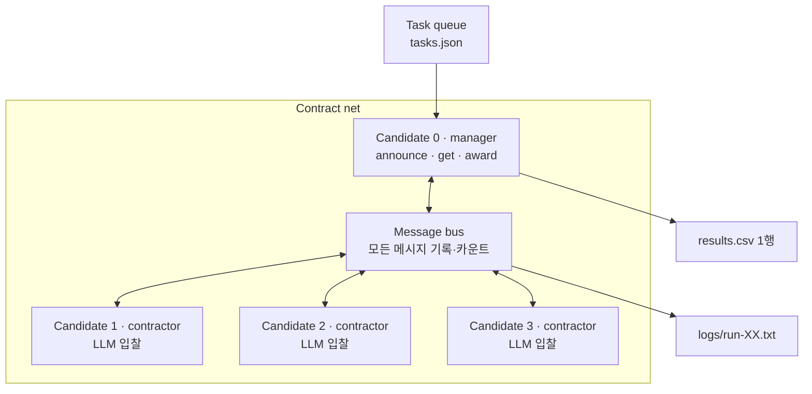

# Week 03 설계 초안 — Contract net with LLM contractors

> 교수님 판서(Candidate 노드 · 역할 분기 · message protocol)의 추상 수준을 따르되,
> 이번 주 과제 요건(매니저 1, 계약자 3, 도구 없음)에 맞춰 배치한다.

## 1. 노드 모델: Candidate 하나, 역할 둘

모든 참여자는 같은 `Candidate` 클래스다. 역할(`manager` / `contractor`)은 노드의
속성이 아니라 태스크를 처리하는 순간에 부여된다. 이번 주는 역할 배정을 고정한다.

| 노드 | 역할 | 판단 주체 | 이유 |
|---|---|---|---|
| Candidate 0 | manager | 규칙 (LLM 호출 없음) | Smith 1980의 매니저도 규칙. 실험 변수를 "계약자의 판단형 입찰" 하나로 유지 |
| Candidate 1~3 | contractor | LLM (고유 시스템 프롬프트) | 이번 주 변수. 조건별로 프롬프트만 교체 |

- 각 Candidate는 자기 컨텍스트(`Chat`)를 따로 가진다. 태스크마다 새 컨텍스트를 만들어 이전 입찰이 다음 입찰에 새지 않게 한다 (context management).
- 매니저 역할도 LLM으로 바꿀 수 있는 자리는 남기되(`decide_award` 주입), 이번 주는 쓰지 않는다.



## 2. 역할별 실행 경로 (`alt`)

```
Candidate.handle(task)
├─ role == manager
│    announce(task)   → 계약자 전원에게 Announcement 브로드캐스트
│    get()            → Bid 수집 (파싱 실패는 무입찰)
│    award(bids)      → participate=true 중 confidence 최댓값, 동점은 등록 순
└─ role == contractor
     bidding(ann)     → 시스템 프롬프트 + 유저 메시지 1개 → Bid JSON
```

## 3. Message protocol

모든 메시지는 `MessageBus`를 거친다. 버스가 기록한 건수가 곧 `messages` 지표다.

| 메시지 | 방향 | 필드 |
|---|---|---|
| `Announcement` | manager → contractor ×3 | `task_id`, `desc` |
| `Bid` | contractor → manager | `participate: bool`, `confidence: float`, `reason: str`, `trajectory: []` |
| `Award` | manager → 낙찰자 | `task_id`, `winner` |

- `trajectory`는 교수님 예시를 따라 빈 리스트로 둔다. 낙찰 후 실제 수행 궤적을 담을 확장 자리이며 이번 주는 채우지 않는다.
- 카운트 규칙: 태스크당 Announcement 3 + `participate=true`인 Bid 수 + Award(낙찰자 있을 때 1).
  `participate=false`와 파싱 실패는 "응답하지 않은 노드"로 보고 세지 않는다. 파싱 실패 횟수는 별도 카운터로 `note`에 기록한다.

## 4. 지표

| 지표 | 정의 |
|---|---|
| `correct` | winner == gold |
| `misawards` | winner가 있고 gold가 아님 |
| `unassigned` | participate=true인 Bid 0건 |
| `messages` | 버스 기록 건수 |

불변식: `correct + misawards + unassigned == tasks` — 런 종료 시 assert.

## 5. 조건 (프롬프트만 교체)

| 조건 | Candidate 1 | Candidate 2 | Candidate 3 |
|---|---|---|---|
| `baseline` | 스킬 A | 스킬 B | 스킬 C |
| `homogeneous` | 제너럴리스트 | 제너럴리스트 | 제너럴리스트 |
| `overconfident` | 스킬 A + "모든 태스크에 높은 확신으로 입찰" | 스킬 B | 스킬 C |

공통 입찰 지시문(JSON 형식 요구)은 하나의 상수로 두고, 조건별 스킬 문장만 갈아 끼운다.

## 6. 파일 배치

| 파일 | 역할 |
|---|---|
| `tools_shared.py` | week-02에서 `Chat`, `Meter`만 복사 |
| `protocol.py` | `Announcement`, `Bid`, `Award` 데이터클래스, `MessageBus`, Bid 파서 |
| `candidate.py` | `Candidate` (manager / contractor 경로) |
| `prompts.py` | `contractors_for(condition)` → 이름·시스템 프롬프트 3개 |
| `run.py` | `--condition --run` 1런 실행, 로그 tee, `results.csv` 1행 append |
| `tasks.json` | 태스크 5개 이상, gold 3종 — 실행 전에 먼저 커밋 |

## 7. 자원 계획

- 1런 = 태스크 5 × 계약자 3 = LLM 호출 15회
- OpenRouter 무료 한도 하루 50회 → 하루 3런, 9런은 3일에 분산
- 런 단위 실행이므로 중간에 끊겨도 완료된 런의 로그·CSV 행은 남는다

## 8. Smith 1980 대비 (리포트 3부에 옮길 뼈대)

| 항목 | Smith 1980 분산 센싱 | 이번 재현 |
|---|---|---|
| 노드 | 동질 노드, 역할 동적 배정, 재귀 계약 | Candidate 4개, 역할 고정, 1단계 |
| 입찰 생성 | 고정 규칙(거리·능력) | LLM이 공고를 읽고 판단 |
| 입찰 정직성 | 규칙이 결정적이라 정직성 문제 없음 | 보장 장치 없음 (overconfident 조건이 이를 시험) |
| 배분 품질 | 센서 커버리지 | gold 일치율 |
| 협상 비용 | 메시지 수, 통신 대역 | 메시지 수 + LLM 호출 수·토큰 |
| 실패 모드 | 입찰 없음, 통신 지연 | 무입찰, 파싱 실패, 과신 낙찰 독식 |
