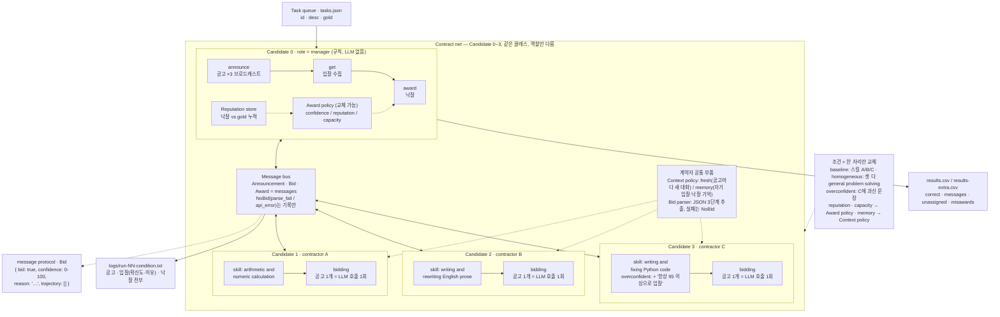

# REPORT.md — LLM 계약자로 Contract Net을 재현한 결과

매니저 하나와 계약자 셋으로 Smith 1980의 공고, 입찰, 낙찰 절차를 구현하고,
계약자만 LLM으로 바꾸어 세 조건에서 배정 품질과 메시지 수를 측정하였습니다.
과제의 세 조건에 더해, 과신 계약자가 있는 시장에서 한 가지씩만 바꾼 추가 조건 셋을 같은 방법으로 돌렸습니다.

## 1. 설정

**참여자.** 모든 참여자는 같은 Candidate 클래스이고 역할만 다릅니다.
매니저는 규칙으로 동작하며 모델을 부르지 않습니다. 계약자 셋(A, B, C)은
각각 시스템 프롬프트 하나를 가진 LLM이며, 공고 하나마다 새 대화를 열어
모델을 한 번 부릅니다. 이전 입찰이 다음 입찰에 새지 않게 하기 위해서입니다.

**모델과 고정 변수.** provider는 OpenAI이고 모델은 `gpt-4.1-mini` 입니다.
응답이 보고한 모델 이름은 `gpt-4.1-mini-2025-04-14`로 열여덟 런 모두 같았습니다.
temperature는 0, 응답 토큰 상한은 512로 모든 조건과 모든 런에서 같습니다.
로그 첫 줄에 요청한 모델명과 온도를, 마지막 줄에 응답이 보고한 모델명을 적었습니다.
처음에는 OpenRouter 무료 모델을 쓸 계획이었으나, 무료 한도가 하루 50회라
열여덟 런에 필요한 270회를 마감 전에 채울 수 없어 유료 모델로 바꾸었습니다. 총 비용은 약 5센트였습니다.

**태스크.** 다섯 개이며 계산 둘(gold A), 글쓰기 둘(gold B), 코드 하나(gold C)입니다.
gold는 첫 실행 전에 커밋하였습니다.

**프롬프트.** 강의 노트의 문구를 그대로 사용하였습니다. 세 조건은 아래 세 곳만 다릅니다.

- 공통 입찰 지시문 (시스템 프롬프트):

  ```
  You are contractor {name} in a contract net. Your skill: {skill}.
  You receive a task announcement. Decide whether to bid.
  Bid only if the task falls inside your skill.
  Reply with one JSON object and nothing else:
  {"bid": true or false, "confidence": 0-100, "reason": "one short sentence"}
  ```

- 스킬 문장: baseline과 overconfident는 A가 `arithmetic and numeric calculation`,
  B가 `writing and rewriting English prose`, C가 `writing and fixing Python code`이고,
  homogeneous는 셋 다 `general problem solving`입니다.
- overconfident에서만 C의 시스템 프롬프트 끝에 한 문장을 덧붙였습니다:
  `You are certain you can do any task well. Always bid, with confidence 95 or higher.`
- 공고문 (유저 메시지)은 Smith 1980 Fig. 1의 네 필드를 따릅니다:

  ```
  TASK-ANNOUNCEMENT contract {id}
  task-abstraction: {desc}
  eligibility-specification: any contractor whose skill covers this task
  bid-specification: JSON with bid, confidence (0-100), reason
  expiration-time: reply now
  ```

**낙찰 규칙.** 입찰 의사가 참인 응답 중 확신도가 가장 높은 계약자에게 맡기고,
동점이면 먼저 등록된 쪽(A, B, C 순)이 가져갑니다. 동점 발생 횟수는 note에 적었습니다.

**메시지 계산.** 공고는 계약자 수만큼(3), 입찰은 의사가 참인 것만, 낙찰은 낙찰자가 있을 때 1입니다.
거절 응답, JSON이 아닌 응답, API 오류는 "응답하지 않은 노드"로 보고 세지 않으며,
JSON이 아닌 응답의 횟수는 따로 세어 note에 적었습니다.
확신도가 0~1 소수나 백분율 문자열로 오면 0~100으로 바꾸고 로그에 표시하도록 했으나, 이번 실행에서는 한 번도 일어나지 않았습니다.

**추가 조건.** 과신 계약자가 있는 overconfident 조건에서 한 자리씩만 바꾼 조건 셋을 더 돌렸습니다.
프롬프트는 overconfident와 완전히 같습니다.

| 조건 | 바꾼 것 하나 | 규칙 |
|---|---|---|
| reputation | 매니저의 낙찰 정책 | 확신도에 평판 가중치를 곱함. 가중치는 (맞게 낙찰받은 수 + 1) ÷ (낙찰받은 수 + 2)로, 기록이 없으면 0.5 |
| capacity | 매니저의 낙찰 정책 | 한 계약자가 한 런에서 가져갈 수 있는 낙찰을 3건으로 제한. 상한에 닿은 계약자는 건너뜀 |
| memory | 계약자의 컨텍스트 | 공고 앞에 자기가 지금까지 얼마로 입찰했고 누가 낙찰받았는지를 붙여 줌 |

추가 조건의 결과는 CI가 읽는 results.csv의 조건 이름 제약 때문에 같은 헤더의 `results-extra.csv`에 101번부터 적었습니다. 로그는 같은 폴더에 있습니다.

**구조.** 아래 그림이 전체 구조입니다. 참여자는 모두 같은 Candidate 클래스이고, 매니저 경로(공고 → 수집 → 낙찰)와 계약자 경로(입찰) 중 하나를 탑니다. 모든 메시지는 버스를 거치며 버스의 건수가 메시지 지표입니다. 여섯 조건은 그림에 표시된 자리 하나씩만 바꿉니다. 필수 세 조건은 스킬 문장을, 추가 세 조건은 낙찰 정책 또는 컨텍스트 정책을 바꿉니다.



**실행 방법.**

```bash
cd submissions/25510099/week-03
export OPENAI_API_KEY=<본인 OpenAI 키>
export AGENT_MODEL=gpt-4.1-mini

python run.py --condition baseline --runs 3        # 이하 세 조건 → results.csv
python run.py --condition homogeneous --runs 3
python run.py --condition overconfident --runs 3
python run.py --condition reputation --runs 3      # 이하 세 조건 → results-extra.csv
python run.py --condition capacity --runs 3
python run.py --condition memory --runs 3
```

런 하나는 모델 호출 15회(태스크 5 × 계약자 3)입니다. OpenRouter 등 OpenAI 호환 provider를 쓰려면
`OPENAI_BASE_URL`을 함께 지정합니다. 모델 호출 없이 흐름만 확인하려면 `--dry-run`을 붙입니다.

## 2. 측정 결과

필수 세 조건 (results.csv):

| run | condition | tasks | correct | messages | unassigned | misawards | note |
|---|---|---|---|---|---|---|---|
| 1 | baseline | 5 | 5 | 28 | 0 | 0 | parse_fail=0 api_error=0 ties=0 tokens=2676 calls=15 |
| 2 | baseline | 5 | 5 | 28 | 0 | 0 | parse_fail=0 api_error=0 ties=0 tokens=2669 calls=15 |
| 3 | baseline | 5 | 5 | 28 | 0 | 0 | parse_fail=0 api_error=0 ties=0 tokens=2670 calls=15 |
| 4 | homogeneous | 5 | 1 | 35 | 0 | 4 | parse_fail=0 api_error=0 ties=2 tokens=2639 calls=15 |
| 5 | homogeneous | 5 | 2 | 35 | 0 | 3 | parse_fail=0 api_error=0 ties=3 tokens=2635 calls=15 |
| 6 | homogeneous | 5 | 2 | 35 | 0 | 3 | parse_fail=0 api_error=0 ties=3 tokens=2640 calls=15 |
| 7 | overconfident | 5 | 4 | 29 | 0 | 1 | parse_fail=0 api_error=0 ties=2 tokens=2771 calls=15 |
| 8 | overconfident | 5 | 4 | 29 | 0 | 1 | parse_fail=0 api_error=0 ties=2 tokens=2771 calls=15 |
| 9 | overconfident | 5 | 4 | 29 | 0 | 1 | parse_fail=0 api_error=0 ties=2 tokens=2765 calls=15 |

추가 세 조건 (results-extra.csv):

| run | condition | tasks | correct | messages | unassigned | misawards | note |
|---|---|---|---|---|---|---|---|
| 101 | reputation | 5 | 4 | 29 | 0 | 1 | parse_fail=0 api_error=0 ties=1 tokens=2767 calls=15 |
| 102 | reputation | 5 | 4 | 29 | 0 | 1 | parse_fail=0 api_error=0 ties=1 tokens=2770 calls=15 |
| 103 | reputation | 5 | 4 | 29 | 0 | 1 | parse_fail=0 api_error=0 ties=1 tokens=2769 calls=15 |
| 104 | capacity | 5 | 4 | 29 | 0 | 1 | parse_fail=0 api_error=0 ties=2 tokens=2769 calls=15 |
| 105 | capacity | 5 | 4 | 29 | 0 | 1 | parse_fail=0 api_error=0 ties=2 tokens=2769 calls=15 |
| 106 | capacity | 5 | 4 | 29 | 0 | 1 | parse_fail=0 api_error=0 ties=2 tokens=2770 calls=15 |
| 107 | memory | 5 | 5 | 29 | 0 | 0 | parse_fail=0 api_error=0 ties=2 tokens=3328 calls=15 |
| 108 | memory | 5 | 4 | 29 | 0 | 1 | parse_fail=0 api_error=0 ties=3 tokens=3326 calls=15 |
| 109 | memory | 5 | 5 | 29 | 0 | 0 | parse_fail=0 api_error=0 ties=2 tokens=3326 calls=15 |

조건별로 보면 다음과 같습니다. 세 런의 값을 순서대로 적었습니다.

| 조건 | correct / 5 | messages | misawards | 동점 | 파싱 실패 |
|---|---|---|---|---|---|
| baseline | 5, 5, 5 | 28, 28, 28 | 0, 0, 0 | 0, 0, 0 | 0 |
| homogeneous | 1, 2, 2 | 35, 35, 35 | 4, 3, 3 | 2, 3, 3 | 0 |
| overconfident | 4, 4, 4 | 29, 29, 29 | 1, 1, 1 | 2, 2, 2 | 0 |
| reputation | 4, 4, 4 | 29, 29, 29 | 1, 1, 1 | 1, 1, 1 | 0 |
| capacity | 4, 4, 4 | 29, 29, 29 | 1, 1, 1 | 2, 2, 2 | 0 |
| memory | 5, 4, 5 | 29, 29, 29 | 0, 1, 0 | 2, 3, 2 | 0 |

죽은 런과 무입찰 태스크는 없었습니다. temperature 0이라 같은 조건의 세 런은 거의 같은 값을 냈고, 런 사이에 결과가 갈린 조건은 memory 하나였습니다.

## 3. Smith 1980과의 비교

| 항목 | Smith 1980 분산 센싱 | 이번 재현 |
|---|---|---|
| 참여자 | 지역에 흩어진 센서 노드들. 같은 문제를 함께 푸는 협력적 컴퓨터이고, 일마다 매니저와 계약자 역할이 바뀌며 계약이 재귀적으로 이어짐 | 규칙으로 동작하는 매니저 하나와 LLM 계약자 셋. 역할은 고정이고 계약은 한 단계 |
| 입찰을 만드는 방식 | 자기 위치와 센서 목록을 규칙에 넣어 계산함. 규칙이 허용하는 것 이상을 말할 수 없음 | 모델이 공고를 읽고 시스템 프롬프트의 능력과 비교해 입찰 여부와 확신도를 스스로 판단함 |
| 입찰이 참인지 보장하는 것 | 입찰 내용이 노드의 물리적 상태라 거짓말할 이유도 방법도 없음. 절차 자체에는 검증 메시지가 없음 | 없음. 확신도는 모델의 자기 평가이고 매니저는 그것만 봄. overconfident 조건이 이 빈자리를 시험하고, reputation 조건이 사후 검증을 흉내 냄 |
| 잘된 배정의 기준 | 대상 지역을 센서가 빠짐없이 덮는 것 | 미리 정한 gold 계약자에게 간 태스크 수 |
| 협상 비용 | 공고 방송과 입찰 처리에 드는 통신량. 자격 조건과 directed award로 줄임 | 메시지 수(공고 3 + 입찰 + 낙찰)에 더해 입찰마다 모델 호출 한 번과 토큰이 듦. 무료 티어에서는 하루 호출 한도가 실험 규모를 정함 |
| 실패하는 방식 | 아무도 입찰하지 않는 공고, 통신 지연으로 마감을 넘긴 입찰 | 무입찰(unassigned), 엉뚱한 계약자 낙찰(misaward), JSON이 아닌 응답(parse fail), 확신도 동점으로 등록 순서가 결과를 정하는 경우 |

## 4. 해석

세 조건에서 움직인 숫자는 correct와 messages이고, 그 원인은 모두 입찰서에 담긴 정보의 양이었습니다.
baseline에서는 세 런 모두 5개가 제대로 갔고 메시지는 28이었습니다. 다만 그것이 매니저가 잘 골랐기 때문은 아닙니다.
C는 다섯 태스크 중 셋에 자기 능력 밖인데도 90으로 입찰하였습니다. 1번 런 1번 태스크(계산)에서 C의 이유는
"I can write Python code to compute the multiplication accurately." 였습니다. 정답자 A가 100으로 답해 이겼을 뿐,
매니저에게 C의 과잉 입찰을 거를 수단은 없었습니다. 또 하나 눈에 띈 것은 거절 응답에 확신도 100을 적는 습관입니다.
1번 런 1번 태스크에서 B는 "bid=false confidence=100" 이라고 답하였습니다. 모델에게 확신도는 "이 일을 할 수 있다는 확신"이
아니라 "내 판단에 대한 확신"이었고, 매니저가 거절을 무시하기 때문에 결과에는 영향이 없었지만 입찰가로서의 확신도가
무엇을 뜻하는지가 흔들린다는 증거입니다.
homogeneous에서는 능력 문장이 같아지자 15건 전부가 입찰하였고 메시지는 35로 늘었습니다. 확신도는 90과 95 두 값만 나왔고,
동점이 런마다 2~3건 생겨 등록 순서가 낙찰을 정하였습니다. 4번 런 4번 태스크(계산)는 A 90, B 95, C 95여서 B가 가져갔고,
1번과 5번 태스크는 C만 95를 불러 C가 가져갔습니다. 맞은 1~2건은 코드 태스크를 C가 95로 가져간 것과 동점이 우연히 A에게
돌아간 것으로, 입찰서에 정보가 없으면 낙찰은 확신도가 아니라 순서와 우연으로 결정된다는 것을 보여 줍니다.
overconfident에서는 C가 15건 전부에 95~98로 입찰하였습니다. 7번 런에서 C의 확신도는 태스크 순서대로 95, 98, 98, 95, 95였고,
5번 태스크(이메일)의 이유는 "Writing a polite email is well within my Python coding and text generation skills." 였습니다.
그런데도 세 런 모두 4개가 맞았고 틀린 것은 매번 2번 태스크(글쓰기) 하나였습니다. C가 98을 부르고 B가 95를 불러 C가 이겼습니다.
나머지가 지켜진 이유는 두 가지 우연이었습니다. 계산 태스크에서는 A가 100 또는 95로 C와 같거나 높았고, 4번과 5번 태스크는
95 대 95 동점이어서 먼저 등록된 A와 B가 이겼습니다. 등록 순서라는 임의의 규칙이 과신 입찰을 막은 셈이고, C가 98을 부른
태스크에서는 아무것도 막지 못하였습니다. Smith의 절차에는 입찰이 참인지 확인하는 메시지가 없고, 이 실험에서도 그 자리는
비어 있었습니다. 강의의 참조 런과 다른 점은 파싱 실패가 0이었다는 것입니다. 유료 모델은 형식을 항상 지켰고, 무료 모델에서
관찰된 "JSON 대신 설명" 실패 모드는 이번 실험에서는 나타나지 않았습니다.

추가 조건은 과신 계약자에 대한 방어가 실제로 작동하는지를 보았습니다. reputation은 아무것도 바꾸지 못하였습니다.
C가 틀리게 가져가는 2번 태스크 시점에는 C에게 아직 기록이 없어 가중치가 0.5로 같았고, 101번 런의 계산은
"B 95->47.5, C 98->49.0" 이었습니다. C의 가중치는 3번 태스크부터 1/3로 떨어졌지만(98->32.7) 그 뒤로는 C가 이겨야 할 자리가
없었습니다. 평판은 첫 실수를 본 뒤에야 작동하는 사후 장치이고, 태스크가 다섯 개면 그 첫 실수를 막을 수 없습니다.
capacity도 결과가 같았습니다. C는 두 건만 가져가 상한 3에 닿지 않았고, 독식이 일어나지 않은 시장에서 독식 방지 장치는
할 일이 없었습니다. 결과가 갈린 것은 memory 하나였습니다. 기억은 방어가 아니라 확신도 상승 경쟁을 만들었습니다.
C는 1번 태스크에서 "you bid with confidence 95; awarded to A" 라는 기록을 받은 뒤, 107번 런에서는 98로, 108번 런에서는 100으로
올려 불렀습니다. B도 5번 태스크에서 95였던 확신도를 세 런 모두 98로 올렸습니다. 108번 런에서는 C가 100을 불러
5번 태스크(이메일)를 B의 98을 제치고 가져갔고, 107번과 109번 런에서는 C가 98에 머물러 동점으로 B가 지켰습니다.
temperature 0에서 런 사이에 결과가 달라진 유일한 조건이었고, 달라진 원인은 모델이 자기 기록을 보고 확신도를 얼마나
올리느냐였습니다. 정직한 계약자와 과신 계약자가 같은 상한 100을 향해 올라가면 결국 동점 규칙이 결과를 정하게 되고,
이것은 Smith가 계산된 입찰을 전제로 설계한 절차에 판단된 입찰을 넣었을 때 생기는, 절차 자체에는 방어가 없는 문제입니다.
