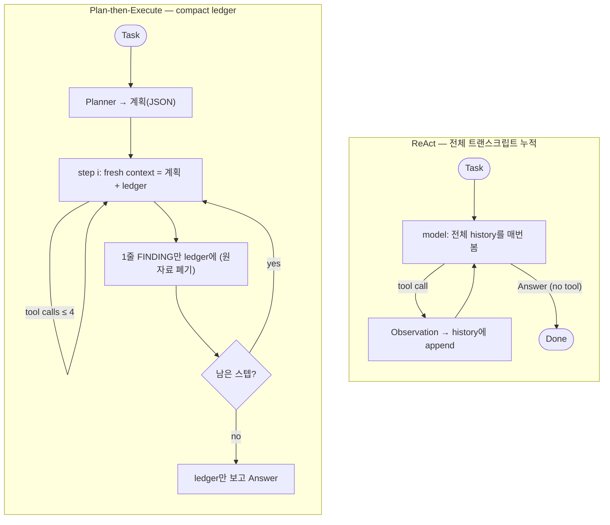

# Week 02 — Harness A/B: ReAct vs Plan-then-Execute (직접 재구현)

스타터를 그대로 쓰지 않고 두 하네스를 **직접 재구현**했음. 재구현의 핵심 변형은 **맥락 관리** 임 — ReAct는 전체 트랜스크립트를 누적하고, Plan-then-Execute는 스텝별 원자료를 버리고 **compact ledger**만 이월함. 스타터 실행 결과는 `lab/`에 그대로 보존함(실습).

## 재현 조건 (모델·태스크·툴 고정, 하네스만 변화)

- Provider·model: OpenRouter(OpenAI 호환), `AGENT_MODEL=nvidia/nemotron-3.5-lightning:free`. API 키는 저장소에 없음(환경변수).
- 환경변수: `OPENAI_BASE_URL=https://openrouter.ai/api/v1` · `OPENAI_API_KEY=<본인 키>`.
- Task(`TASK.md`): "app.log에서 ERROR 줄이 가장 많은 시각(HH:00)" · `expected: 14:00`.
- Tools(`tools_shared.py`, 두 하네스 공유·고정): `read_file(path)`(앞 4000자) · `count_pattern(path, pattern)`(정규식 매칭 줄 수).
- 모델 호출: `call_model(messages, meter)` — 요청 타임아웃 90s·retries 1(느린 콜은 실패로 기록, 두 하네스에 동일 적용).
- 실행: `python run_ab.py --runs 3` (하네스당 3회) · 판정: 최종 답변에 `expected` 포함 시 성공(O).

## 1. 변형 정의 — 다섯 축 중 무엇을 다르게 뒀나

| 축 | ReAct (`harness_react.py`) | Plan-then-Execute (`harness_plan_execute.py`) |
|---|---|---|
| **1. 맥락 관리** ⭐ | 전체 트랜스크립트 누적 → **매 콜 전체 재전송** | **compact ledger** — 스텝별 원자료 폐기, `FINDING:` 한 줄만 이월 |
| **2. 툴 입도** | `read_file`, `count_pattern` — **공유(고정)** | **동일** |
| **3. 종료 조건** | `Answer`(툴콜 없음) 또는 `max_steps=10` | 계획 스텝 소진. 스텝 내부 `max_tool_rounds=4` 예산 |
| **4. 에러 복구** | 에러가 Observation으로 히스토리에 편입 | `OFF_PLAN:` → `max_replan=1` 재계획 |
| **5. 인간 개입** | 읽기전용 툴 → 개입 0 | 읽기전용 툴 → 개입 0 |

- ⭐ 의도적으로 다르게 잡은 축 = 1(맥락 관리). 스타터/lab에서 plan_exec 토큰 폭증(40k→84k)의 주범이 "매 콜 전체 히스토리 재전송"이었으므로, 그 지점을 정면으로 바꿈.
- 축 3·4는 ReAct(반응형 단일 루프) vs Plan-Execute(선계획) 구조상 자연히 다름. 축 2·5는 고정.
- 스타터(#lab)와의 차이: 스타터는 두 하네스 모두 전체 히스토리를 누적하는 `Chat` 객체를 공유했음. 재구현본은 맥락 관리를 하네스별로 분리해 축 1을 실험 변수로 만듦.

## 2. 측정치 (`results.csv`)

| run | harness | success | tokens | iters | interventions | note |
|---|---|---|---|---|---|---|
| 1 | react | O | 3,853 | 2 | 0 | |
| 2 | react | O | 3,759 | 2 | 0 | |
| 3 | react | X | 3,357 | 2 | 0 | |
| 4 | plan_exec | O | 19,623 | 10 | 0 | replans=0 |
| 5 | plan_exec | O | 21,367 | 13 | 0 | replans=0 |
| 6 | plan_exec | X | 2,104 | 3 | 0 | replans=0 |

| 평균 | 성공률 | tokens | iters | interventions |
|---|---|---|---|---|
| **react** | 2/3 | ~3,656 | 2.0 | 0 |
| **plan_exec** | 2/3 | ~14,365 | ~8.7 | 0 |

참고(축1 효과) — **lab(스타터, 전체 히스토리)** vs **재구현(compact ledger)**, 같은 태스크:
- **토큰** ↓ — plan_exec 40,464 / 59,650 / 83,520 → 재구현 성공 런 19,623 / 21,367 (절반 이하).
- **성공률** ↓ — plan_exec **3/3 → 2/3** (react는 양쪽 2/3로 동일). lab에서 plan_exec가 react보다 안정적이던 우위가 재구현에선 사라짐.
- 단 lab은 프롬프트·`max_tool_rounds`(3→4)·타임아웃·파서도 달라 완전 통제 비교는 아님 → 정황상 축1이 주 원인.

## 3. 해석 

효율(tokens·iters)은 ReAct가, 맥락 관리 개선 폭은 재구현 Plan-then-Execute가 가져감. ReAct는 `app.log`가 4000자 이내여서 한 번 읽고 바로 답 → 2콜·평균 3,656토큰으로 끝남. compact-ledger Plan-then-Execute 성공 런은 10~13콜·약 2만 토큰으로 ReAct의 ~5배지만, 같은 하네스가 lab(전체 히스토리 누적)에서 40k~84k였던 것 대비 절반 이하(≈2만)로 떨어짐 = 축1에서 "매 콜 전체 히스토리 재전송"을 "compact ledger"로 바꾼 것이 plan_exec 토큰을 직접 끌어내림. 그러나 성공률 감소. plan_exec가 lab의 3/3에서 2/3로 회귀함. 즉 토큰뿐 아니라 plan_exec 안정성도 깎았고, lab에서 plan_exec가 react보다 안정적이던 우위(3/3 vs 2/3)가 재구현에선 소멸(둘 다 2/3). 또한 두 하네스의 실패 축이 다름. ReAct 실패(run3)는 축3(종료): 집계 방법을 고민하다 툴을 더 안 쓰고 2콜 만에 불완전한 답으로 멈춤(멈출 자유 = 조기 종료). Plan-then-Execute 실패(run6)는 축1: planner가 `read_file` 한 스텝짜리 빈약한 계획을 내 스텝이 FINDING을 못 남겼고 → ledger가 빈 채 최종 답변이 "the file contents were not provided in the findings" 라며 스스로 포기함(2,104토큰·3콜). full-history였다면 step1에서 읽은 원문이 문맥에 남아 답할 수 있었을 것으로 보임. ledger-only 설계가 빈약한 계획을 하드 실패로 키움(전체 트랜스크립트를 쥔 ReAct엔 없는 실패 모드). 단 n=3이라 2/3 비율 자체는 노이즈, 실패 메커니즘은 설계 고유. 이 작은 태스크에선 ReAct가 효율로 이기고, 축1을 바꾼 Plan-then-Execute는 lab 대비 토큰을 크게 줄이나 ledger 증류 실패라는 대가를 드러냄. 다만 효율성 측면에서의 분명한 개선을 토대로 보완을 해나간다면 두 방법보다 우월한 하네스를 구축할 수 있을 것으로 보임. 벽시계(29~962초)는 무료풀 혼잡 변동이라 지표로 안 씀.
