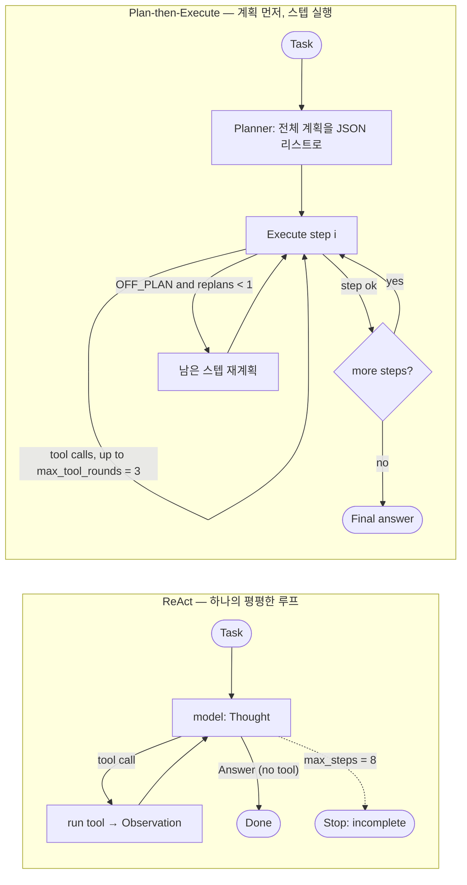

# Week 02 — Harness A/B: ReAct vs Plan-then-Execute

## Reproducibility (모델·태스크·툴은 고정, 하네스만 변화)

- **Provider / model**: OpenRouter (OpenAI-compatible API), `AGENT_MODEL=nvidia/nemotron-3.5-lightning:free`
  - `OPENAI_BASE_URL=https://openrouter.ai/api/v1`, `OPENAI_API_KEY=<본인 키>` (키는 저장소에 없음)
- **Task** (`TASK.md`): "In app.log, which hour (HH:00) has the most ERROR lines?" — `expected: 14:00`
- **Tools** (`tools_shared.py`, 두 하네스 공유): `read_file(path)` (앞 4000자), `count_pattern(path, pattern)` (정규식 매칭 줄 수)
- **Runs**: 하네스당 3회, `python run_ab.py --runs 3`
- **Judge**: 최종 답변에 `expected` 문자열(대소문자 무시) 포함되면 O
- 모델·태스크·툴·판정 기준을 전부 동일하게 두고 **하네스만** 바꿨음 → 이 실험은 하네스 비교이지 툴 비교가 아님.

## 1. 변형 정의 — 다섯 축 중 무엇을 다르게 뒀나

| 축 | ReAct (`harness_react.py`) | Plan-then-Execute (`harness_plan_execute.py`) |
|---|---|---|
| **1. 맥락 관리** | 단일 대화. 매 콜마다 전체 히스토리 재전송 | 대화 2개(planner / executor)로 분리. executor도 히스토리 누적 |
| **2. 툴 입도** | `read_file`, `count_pattern` — **공유(동일)** | **동일** (의도적으로 고정) |
| **3. 종료 조건** | tool_call 없으면 종료, 아니면 `max_steps=8` 상한 | 계획 스텝 소진 시 종료. **스텝 내부는 `max_tool_rounds=3` 예산** |
| **4. 에러 복구** | 에러가 Observation으로 돌아와 다음 Thought에서 반응 | `OFF_PLAN:` 신호 → `max_replan=1`로 계획 1회 재작성 |
| **5. 인간 개입 지점** | `IRREVERSIBLE=∅` → 개입 0 | 개입 지점 없음(플래너·실행기 모두 자동) |

→ 실제로 달라진 축은 **1(맥락)·3(종료)·4(에러복구)**. 축 2는 고정, 축 5는 읽기 전용 툴이라 두 하네스 모두 발동 안 됨.

## 2. 측정치 (`results.csv`)

| run | harness | success | tokens | iters | interventions | note |
|---|---|---|---|---|---|---|
| 1 | react | O | 4,747 | 2 | 0 | |
| 2 | react | O | 4,154 | 2 | 0 | |
| 3 | react | X | 6,903 | 4 | 0 | |
| 4 | plan_exec | O | 40,464 | 11 | 0 | replans=0 |
| 5 | plan_exec | O | 59,650 | 18 | 0 | replans=1 |
| 6 | plan_exec | O | 83,520 | 20 | 0 | replans=1 |

| 평균 | 성공률 | tokens | iters | interventions |
|---|---|---|---|---|
| **react** | 2/3 | ~5,268 | ~2.7 | 0 |
| **plan_exec** | **3/3** | ~61,211 | ~16.3 | 0 |

## 3. 해석 (초안 — 제출 전 로그 대조 후 본인 언어로 재작성할 것)

지표에 따라 승자가 갈린다. **효율(tokens·iters)에서는 ReAct가 압승**(평균 약 5.3k토큰·2.7콜 vs 약 61k토큰·16콜 → 토큰 약 12배, 콜 약 6배)이고, **성공률에서는 Plan-then-Execute가 이겼다**(3/3 vs 2/3). 이 격차를 만든 것은 **고정된 툴 입도(축 2)와 종료 조건(축 3)의 상호작용**이다. `count_pattern`이 "시간대별 집계"를 한 번에 못 해주기 때문에, 어느 하네스든 시간마다 한 번씩 세어야 한다. ReAct는 이 작업을 하나의 평평한 루프에서 흡수해 파일을 한 번 읽고 곧장 답으로 단락(short-circuit)지었지만(성공 런은 2콜), Plan-then-Execute는 스텝마다 `max_tool_rounds=3` 예산에 걸려 `09:`,`10:`,`11:`,`14:`…를 세다 예산을 초과하고 `OFF_PLAN`을 뱉어 **재계획(축 4)**을 돌렸다(run5·run6 로그에서 "step exceeded the tool-call budget" → replan 확인). 재계획은 곧 추가 모델 콜이고, **매 콜이 전체 히스토리를 재전송(축 1)**하므로 토큰이 눈덩이처럼 불어났다(run4→5→6: 40k→60k→84k). 반대로 ReAct의 유일한 실패(run3)도 종료 조건(축 3)에서 나왔다 — `09:`,`10:`만 세고 **빈 답으로 종료**(`Answer:` 라인 없이 멈춤)했다. 즉 "언제든 멈출 자유"가 ReAct의 효율이자 실패 원인이고, Plan-then-Execute의 스텝 구조는 느리고 비싼 대신 조기 종료를 막아 이 태스크에서 더 안정적이었다. **축 5(인간 개입)는 어떤 지표도 움직이지 못했다** — 읽기 전용 툴에 `IRREVERSIBLE`이 비어 6런 모두 interventions=0. 벽시계 시간은 지표로 쓰지 않았다(plan_exec 505→406→266초로 줄었지만 토큰은 오히려 증가 → 무료풀 혼잡도 변동일 뿐 하네스 성질이 아님).
