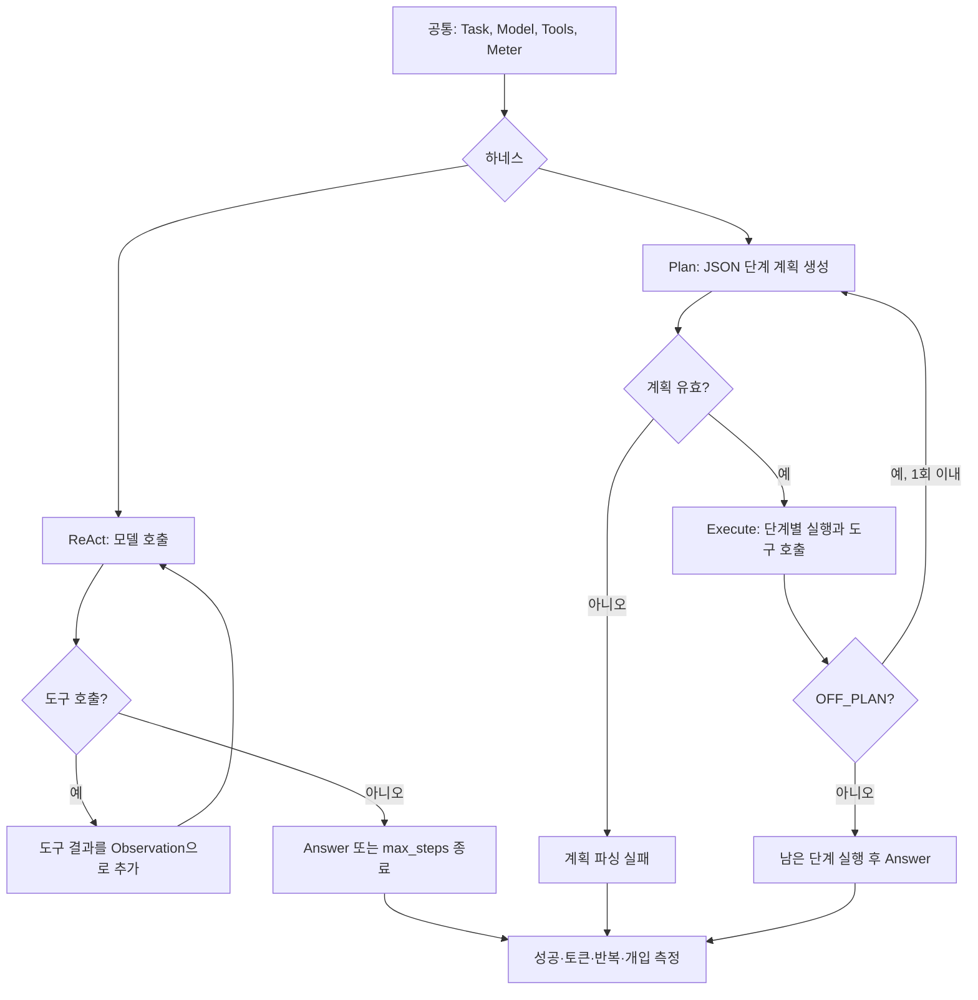

# Week 02 보고서: ReAct와 Plan-then-Execute 하네스 비교

## 1. 변형 정의와 통제 조건

이 실험의 목적은 모델의 능력이나 도구 구성의 차이가 아니라, 에이전트를
운영하는 **하네스 구조의 차이**가 결과에 어떤 영향을 주는지 관찰하는 것이다.
따라서 두 조건에서 모델, 태스크, 도구, 성공 판정 기준을 고정하고 하네스만
독립변수로 두었다.

### 공통으로 고정한 조건

| 항목 | 고정한 내용 |
| --- | --- |
| 모델/공급자 | OpenRouter의 `nvidia/nemotron-3.5-lightning:free` |
| 태스크 | `app.log`에서 `ERROR` 행이 가장 많은 시간대를 찾아 `HH:00` 형식으로 답하기 |
| 정답 기준 | 최종 답변에 `14:00`이 포함되면 성공 |
| 도구 | `read_file(path)`, `count_pattern(path, pattern)` |
| 도구 구현·스키마 | 두 하네스가 같은 `tools_shared.py`를 import하여 공유 |
| 측정기 | 같은 `Meter`로 토큰 수, 모델 호출 반복 수, 사람 개입 횟수를 기록 |
| 종료·안전 조건 | 읽기 전용 도구만 사용하므로 사람 승인 대상은 없고, 개입 횟수는 0회가 정상 |

두 도구는 모두 현재 작업 폴더 안의 파일만 읽는다. `read_file`은 로그 내용을
최대 4,000자까지 제공하고, `count_pattern`은 정규표현식에 맞는 행 수를 센다.
따라서 도구 자체의 기능 차이가 아니라, 모델이 같은 도구를 언제·어떤 순서로
호출하도록 만드는지가 비교 대상이다.
### 하네스 구조 비교

### ReAct 조건

ReAct 하네스는 최초 태스크를 대화 이력에 넣은 뒤, 매 모델 호출마다 응답을
확인한다. 모델이 도구를 요청하면 결과를 Observation으로 대화 이력에 추가하고,
다음 호출에서 모델이 다시 다음 행동을 결정한다. 모델이 도구 호출 없이 답하면
종료하며, 무한 반복을 막기 위해 `max_steps=8`을 둔다. 즉 이 조건은 문맥을
매 단계 갱신하고, 관찰 결과에 따라 다음 행동을 유연하게 바꾸는 방식이다.

### Plan-then-Execute 조건

Plan-then-Execute 하네스는 먼저 도구 없이 전체 계획을 요청한다. 이 첫 응답은
짧은 단계 문자열의 **순수 JSON 리스트**여야 한다. JSON으로 해석된 계획을 받은
뒤에만 별도의 실행 대화가 각 단계를 순서대로 처리하며 공통 도구를 호출한다.
실행 단계가 `OFF_PLAN:`을 반환하면 남은 단계를 다시 계획할 수 있지만,
`max_replan=1`로 재계획은 한 번만 허용한다. 또한 한 단계에서 도구 호출이
계속 이어지는 경우를 제한하기 위해 `max_tool_rounds=3`을 사용한다. 즉 이
조건은 계획을 먼저 고정해 흐름을 예측 가능하게 만들지만, 계획 형식이나 초기
가정이 맞지 않을 때는 그 제약이 실패 원인이 될 수 있다.

## 2. 측정 결과와 로그 근거

`run_ab.py --runs 3`은 각 하네스를 세 번씩 실행하고, 각 실행의 성공 여부,
토큰 수, 반복 수, 개입 수를 `results.csv`에 한 행으로 추가한다. 성공 여부는
`TASK.md`의 `expected: 14:00` 문자열이 최종 답변에 포함되는지로 자동 판정했다.
콘솔 출력은 각 실행별로 `logs/`에 저장했다.

### 환경 설정 실패 기록

`results.csv`의 1--6번은 기본 Python에서 `openai` 패키지를 찾지 못해 발생한
설정 실패다. 이 행과 로그는 재현 과정의 기록으로 삭제하지 않았다. 이후
`uv run --with openai`로 동일한 실행 환경을 준비한 뒤 모델 호출이 가능해졌다.
하네스 성능 비교에는 환경 문제가 해결된 뒤 한 번의 3회 A/B 실행에서 나온
ReAct 10--12번과 Plan-then-Execute 13--15번을 중심으로 사용했다. 7--9번은
환경 수정 후 추가로 발생한 ReAct 반복 기록이며, 동일 조건에서의 성공 사례로
보존했다.

### 비교에 사용한 6회 실행

| 하네스 | 실행 번호 | 성공 | 토큰 수 | 반복 횟수 | 개입 횟수 | 핵심 로그 |
| --- | --- | --- | --- | --- | --- | --- |
| ReAct | 10 | O | 4,772 | 2 | 0 | `app.log`를 읽은 뒤 `Answer: 14:00` 반환 |
| ReAct | 11 | O | 4,012 | 2 | 0 | `app.log`를 읽은 뒤 `Answer: 14:00` 반환 |
| ReAct | 12 | O | 4,225 | 2 | 0 | `app.log`를 읽은 뒤 `Answer: 14:00` 반환 |
| Plan-then-Execute | 13 | X | 500 | 1 | 0 | 계획 응답이 JSON 리스트가 아닌 `read_file(path="app.log")`여서 실패 |
| Plan-then-Execute | 14 | X | 74 | 1 | 0 | 계획 응답이 빈 문자열이어서 JSON 파싱 실패 |
| Plan-then-Execute | 15 | O | 47,550 | 12 | 0 | 5단계 JSON 계획을 받은 뒤 최종 `Answer: 14:00` 반환 |

비교 묶음에서 ReAct의 성공률은 3/3이고, 각 실행은 모두 두 번의 모델 호출로
끝났다. 토큰 수는 4,012--4,772 범위였다. 반면 Plan-then-Execute의 성공률은
1/3이었다. 13번과 14번은 첫 계획 응답의 JSON 파싱 단계에서 실패했으므로
도구 실행 전 종료되었고, 이 때문에 토큰·반복 수가 낮게 기록됐다.

15번은 계획 생성에 성공한 사례다. 계획은 파일 읽기, ERROR 행 식별, 시각
추출, 시간대별 집계, 최다 시간대 결정의 다섯 단계였다. 실행기는 이 단계들을
순서대로 처리하면서 `read_file`과 `count_pattern`을 여러 번 호출했고, 최종
답변에 도달하기까지 모델을 12번 호출했다. 이 성공 실행은 47,550토큰을
사용했으며, 로그 기준 실행 시간은 523.3초였다. 모든 완료 실행에서 도구는
읽기 전용이었으므로 개입 횟수는 0회였다.

## 3. 해석

ReAct는 3번의 실행 동안 Answer : 14:00를 성공적으로 반환하였다.
반면 Plan-then-Execute하네스는 3번 중 2번을 실패하여 ReAct 하네스가 더 안정적이었다.
ReAct의 일반적인 비용은 2회 호출에 약 4천 토큰이었고, 
Plan-then-Execute는 도구 실행 전에 JSON 형식의 계획을 요구했는데, 13번과 14번은 이 계획 단계에서 각각 비JSON응답과 빈 응답을 반환해 실행전 실패하였다. 15번 실행은 성공했지만 이미 14:00 라는 답을 낸 뒤에도 5단계 계획을 끝까지 수행하여 12회 호출 및 47,550토큰이 사용되었다.
2번의 실패는 초기부터 실패하여 1번의 반복횟수와 500개 이하의 적은 비용을 소모하였다.
이 결과는 하나의 고정된 태스크에서 무료 모델의 3회 확률적 실행 결과 이므로, 보편적 승자가 가려진 것은 아니다.
