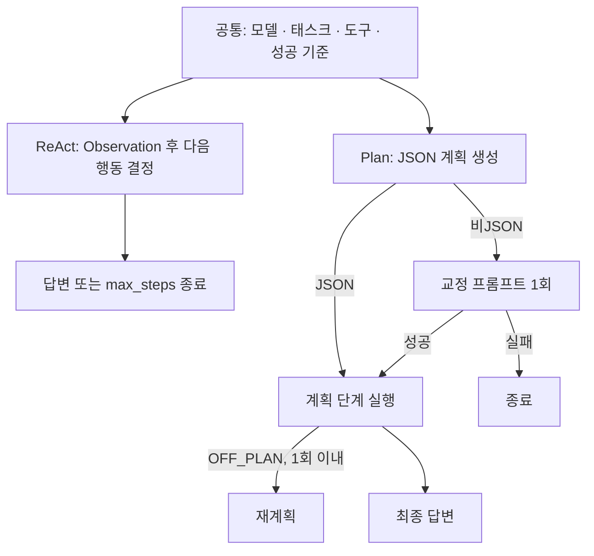

# Week 02 보고서: ReAct와 Plan-then-Execute 하네스 비교

## 1. 변형 정의와 통제 조건

같은 모델, 태스크, 도구, 성공 기준을 유지하고 하네스만 비교했다. 공급자와
모델은 OpenRouter의 `nvidia/nemotron-3.5-lightning:free`이고, 태스크는
`app.log`에서 `ERROR`가 가장 많은 시간을 `HH:00` 형식으로 답하는 것이다.
`TASK.md`의 사전 성공 기준인 `expected: 14:00`이 최종 출력에 포함되면 성공으로
판정했다. 두 조건은 같은 `tools_shared.py`, `read_file(path)`,
`count_pattern(path, pattern)`, `Meter`를 공유하며, 실행은
`uv run --with openai python run_ab.py --runs 3`으로 했다.

v2는 v1의 초기 계획 JSON 형식 실패를 근거로 Plan-then-Execute만 수정한 조건이다.
첫 계획이 JSON 배열이 아니면 고정된 교정 프롬프트로 1회만 다시 요청하고, 두 번째
응답도 실패하면 종료한다. 모델·태스크·도구·성공 기준과 ReAct 코드는 바꾸지 않았다.

| 하네스 설계 축 | ReAct | Plan-then-Execute v2 |
| --- | --- | --- |
| 문맥 관리 | 매 Observation을 대화 이력에 넣고 다음 행동을 다시 결정한다. | 먼저 JSON 계획을 만들고 그 순서대로 실행한다. |
| 도구 세분성 | 공용 도구 2개를 사용한다. | 같은 공용 도구 2개를 사용한다. |
| 종료 조건 | 도구 호출 없이 응답하거나 `max_steps=8`이면 종료한다. | 계획 완료, 초기 계획 재시도 후 파싱 실패, 또는 실행 상한에서 종료한다. |
| 오류 복구 | Observation을 근거로 다음 행동을 다시 결정한다. | 초기 계획 JSON 오류는 교정 프롬프트로 1회 재시도하고, `OFF_PLAN`은 재계획 최대 1회다. |
| 사람 개입 | 읽기 전용 도구만 사용하므로 0회다. | 읽기 전용 도구만 사용하므로 0회다. |

## 2. v2 측정 결과

v1의 10--15번 실행은 `results.csv`와 `logs/`에 보존했다. v1에서는 ReAct 3/3,
Plan-then-Execute 1/3 성공이었고, 13--14번의 초기 계획 비JSON 실패를 계기로
v2를 설계했다. 아래는 수정 후 새로 실행한 v2의 6회 묶음이다.

| 하네스 | 실행 | 성공 | 토큰 | 반복 | 개입 | 핵심 결과 |
| --- | --- | --- | --- | --- | --- | --- |
| ReAct | 16 | X | 3,638 | 2 | 0 | 로그를 읽었지만 `14:00`을 출력하지 못함 |
| ReAct | 17 | O | 4,223 | 2 | 0 | `Answer: 14:00` |
| ReAct | 18 | O | 7,533 | 3 | 0 | 도구 2회 뒤 `Answer: 14:00` |
| Plan-then-Execute | 19 | O | 19,571 | 9 | 0 | 비JSON 첫 계획을 1회 교정 후 성공 |
| Plan-then-Execute | 20 | X | 측정 불가 | 측정 불가 | 측정 불가 | 2단계에서 `TypeError` 발생 |
| Plan-then-Execute | 21 | X | 26,181 | 12 | 0 | 초기 복구 뒤 `OFF_PLAN` 재계획이 비JSON으로 실패 |

## 3. v2 해석

v2에서 Plan-then-Execute의 초기 계획 오류 복구는 19번 실행에서 실제로 작동했다.
첫 응답 `read_file(app.log)`거부는 v1이라면 즉시 실패했지만, 고정된 교정 프롬프트
1회 뒤 JSON 계획을 받아 `Answer: 14:00`까지 도달했다. 그러나 Plan-then-Execute의
성공률은 1/3으로 v1과 같아 이 변경이 성공률을 개선했다고 결론 내릴 수는 없다.
21번은 초기 계획 복구 뒤에도 실행 단계의 `OFF_PLAN` 재계획에서 비JSON 응답으로
실패했고, 20번은 원인이 확정되지 않은 `TypeError`로 측정값 없이 실패했다. 따라서
이 고정 태스크와 3회 표본에서는 초기 형식 오류 복구가 한 실패 모드를 줄일 수 있었음을 확인할 수 있었지만
전체 실행 안정성에는 실행 단계의 재계획과 예외 처리도 영향을 준다고 확인 할 수 있었다.
V2에서 ReAct는 성공률이 2/3으로 지난 V1에서 100% 성공률과 차이가있었다.
실패한 16번 실행에서 최종적으로 14:00을 출력하지 못하였다.

V1와 V2에서 모두 성공률은 ReAct가 높았다.
Plan-then-Excute하네스에서 실패한 문제를 재시도하도록
개선했음에도 다른 실패 지점이 발생하여 29번, 21번 문제를 해결하지 못했다.

## 4. 실습의 A/B 실험을 Meta-Harness처럼 바깥 루프에 맡겨 자동화한다면, 어느 지점에 사람의 판단을 남겨 두겠는가.

Meta-Harness는 코드와 전체 trace를 바탕으로 예상하지 못한 실패까지 분석하고 다음 하네스 수정을 제안할 수 있다.
그러나 Meta-Harness에 맡기기전 사람은 성공기준과 변경 가능 범위를 먼저 정해야하고
예상 밖의 실패가 나왔을때 하네스 개선 대상인지, 환경문제인지, 성공 기준 문제인지 판단하면서, 루프의 개선이
올바른 방향(점수만 올리는 과적합 방향 등)으로 이루어지고 있는지 판단해야한다.
