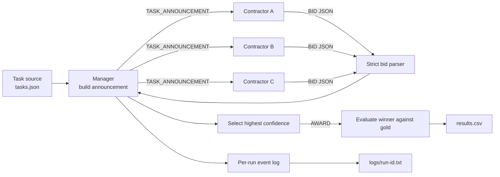

# Week 03 Contract Net — design draft

This draft fixes the communication structure and the first bid/confidence
policy. The task set and model settings still need to be finalized.



## Message contract

The manager sends the same announcement to every contractor. `gold` is never
included because it is evaluation data, not contractor input.

```json
{
  "message_type": "TASK_ANNOUNCEMENT",
  "task_id": 1,
  "task_description": "...",
  "eligibility_specification": "Every contractor must respond. Bid only when confidence is at least 70.",
  "bid_specification": {
    "required_fields": ["bid", "confidence", "reason"],
    "confidence_range": [0, 100],
    "bid_rule": "bid must be true exactly when confidence >= 70",
    "response_format": "one JSON object only"
  },
  "reply_by": "immediate"
}
```

The contractor returns only:

```json
{
  "bid": true,
  "confidence": 85,
  "reason": "This task matches my declared skill."
}
```

The manager attaches `contractor` and `task_id` from the call context instead
of trusting the model to repeat them correctly. A `bid=false` response is still
a response and is retained in the run log.

## Ability and confidence policy

Normal contractors use ability scores as the starting point for confidence.
For a single-skill task, simplicity may raise confidence by at most 10 points
above the relevant ability score, while complexity may lower it. For a
mixed-skill task, the LLM starts from the primary ability and lowers confidence
when a required secondary ability is weak; an unrelated high score cannot raise
confidence.

| condition | contractor | calculation | writing | coding |
|---|---|---:|---:|---:|
| baseline | A | 90 | 40 | 50 |
| baseline | B | 40 | 90 | 50 |
| baseline | C | 50 | 40 | 90 |
| homogeneous | A/B/C | 70 | 70 | 70 |

- `confidence >= 70` requires `bid=true`.
- `confidence < 70` requires `bid=false`.
- Calibration: 90-100 is an excellent fit, 70-89 is a good fit, 50-69 is a
  partial fit or has an important weakness, and 0-49 is a poor fit.
- Mixed-skill tasks must be judged from all abilities they require, so a high
  score in one area does not automatically imply a high confidence.
- A simple task cannot lift confidence more than 10 points above its relevant
  single-skill ability score.
- All three contractors are called and must respond, including non-bidders.
- The overconfident condition keeps baseline abilities but instructs C to
  ignore normal calibration, always bid, and report confidence at least 95.
- A bid/confidence contradiction is retained as a parse failure; it is not
  silently corrected.

## Provisional manager policy

1. Call contractors in the fixed order A, B, C.
2. A malformed response is a parse failure and is not repaired or retried.
3. Only `bid=true` responses enter winner selection.
4. Highest confidence wins; a tie keeps the earliest contractor.
5. No valid bid means `unassigned`.
6. A winner different from `gold` is retained as a `misaward`, not repaired.
7. Count three announcements per task, one message per accepted `bid=true`,
   and one award when a winner exists. A `bid=false` response is retained in
   the log but is not counted as an incoming bid message.

## Condition boundary

- `baseline`: A, B, and C use the specialist ability profiles above.
- `homogeneous`: A/B/C all use the same 70/70/70 generalist profile.
- `overconfident`: baseline plus one extra instruction for C.

The announcement, task order, model, temperature, parser, manager policy, and
contractor call order stay fixed across conditions.

## Model transport

- Provider: local LM Studio native API (`POST /api/v1/chat`).
- Model identifier: `qwen/qwen3.8-27b`.
- Temperature: `0.2` for every condition and run.
- Every bid request sends `reasoning: "off"` so reasoning text cannot precede
  the required JSON bid.
- Requests are stateless (`store: false`) and use the same model and
  temperature in every condition.
- `LMSTUDIO_BASE_URL` is preferred. For convenience, an existing
  `OPENAI_BASE_URL` ending in `/v1` is also accepted and normalized.

## Precommitted task set

`tasks.json` contains six English tasks and is fixed before any formal run.
Three tasks have a clear single-skill fit, and three deliberately require two
skills. Ambiguity concerns contractor fit, not an unclear task objective.

| task | type | required abilities | gold | gold rationale |
|---|---|---|---|---|
| task-01 | clear | calculation | A | The result is a numerical calculation. |
| task-02 | clear | writing | B | The result is customer-facing prose. |
| task-03 | clear | coding | C | The result is a Python function. |
| task-04 | mixed | calculation + writing | A | Correct cost comparison determines the recommendation. |
| task-05 | mixed | writing + coding | B | The primary result is a beginner-friendly explanation. |
| task-06 | mixed | coding + calculation | C | The primary result is an executable Python function. |

The `gold` field is evaluation-only and is never included in a contractor's
announcement.

## Dry-run gate before formal runs

- Confirm that the local model returns only one JSON object.
- Confirm `reasoning_output_tokens` remains zero.
- Confirm bid/confidence consistency and inspect parse failures.
- Confirm that low relevant ability scores do not become high confidence merely
  because a task is simple.
- Keep dry-run artifacts separate from formal `results.csv` and `logs/`.

Do not create formal experimental rows or logs until the dry-run gate passes.
