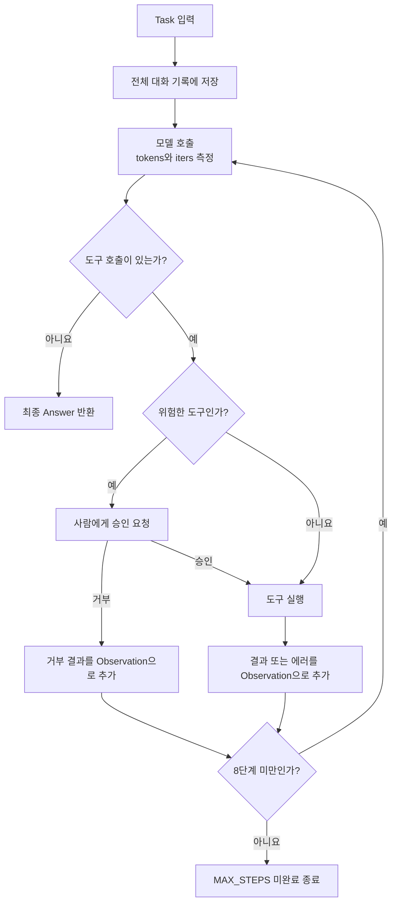
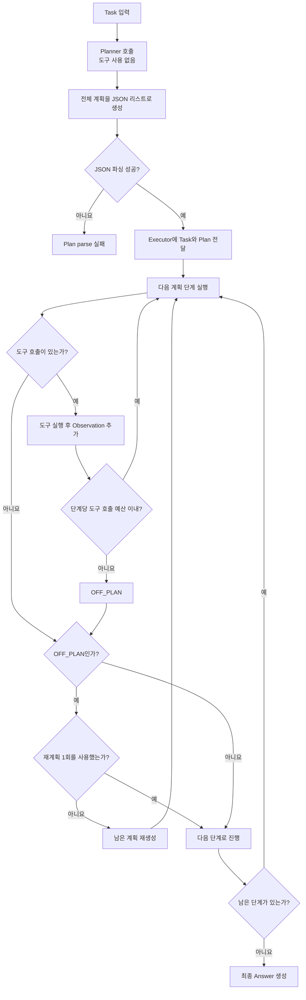

# Week 02 — Harness A/B 실험 보고서

## 1. 변형 정의와 실험 조건

이 실험은 모델, 태스크, 도구, 성공 판정 기준을 고정하고 하네스만 바꾼
A/B 실험이다. 두 하네스 모두 OpenRouter의
`nvidia/nemotron-3.5-lightning:free` 모델과 `tools_shared.py`의
`read_file(path)`, `count_pattern(path, pattern)` 도구를 사용했다. 태스크는
`app.log`에서 `ERROR`가 가장 많은 시간대를 `HH:00` 형식으로 찾는 것이며,
실행 전에 `TASK.md`에 `expected: 14:00`을 고정했다. 실행 환경은 Python
3.13.12와 OpenAI-compatible API였다.

ReAct는 전체 대화 기록을 컨텍스트로 유지하면서 Observation을 받을 때마다
다음 행동을 다시 결정한다. 도구 호출이 없으면 답변을 반환하고, 그렇지 않으면
최대 8단계까지 반복한다. Plan-then-Execute는 도구 없이 전체 계획을 JSON으로
먼저 생성한 뒤 각 단계를 순서대로 실행한다. 한 단계의 도구 호출은 3라운드로
제한하고 재계획은 1회만 허용했다. 따라서 두 변형은 주로 컨텍스트 구성,
종료 조건, 계획의 유연성에서 다르다. 도구 granularity와 에러를 Observation으로
되돌리는 복구 방식은 동일하다. 도구가 모두 읽기 전용이므로 인간 개입은 두
하네스 모두 0회로 예상했다.

### ReAct 하네스 구조

### Plan-then-Execute 하네스 구조

## 2. 측정 결과

먼저 `python run_ab.py --runs 1`로 각 하네스를 1회 실행하고, 이어서
`python run_ab.py --runs 2`로 각각 2회를 추가했다. `results.csv`는 기존
결과에 행을 추가하므로 총 6회가 한 표에 기록되었다.

| run | harness | success | tokens | iters | interventions | note |
|---:|---|:---:|---:|---:|---:|---|
| 1 | react | O | 3,941 | 2 | 0 | |
| 2 | plan_exec | O | 31,558 | 11 | 0 | replans=0 |
| 3 | react | O | 3,910 | 2 | 0 | |
| 4 | react | O | 3,978 | 2 | 0 | |
| 5 | plan_exec | O | 48,920 | 12 | 0 | replans=0 |
| 6 | plan_exec | O | 60,633 | 20 | 0 | replans=1 |
| **평균: ReAct** |  | **100%** | **3,943** | **2.0** | **0** | |
| **평균: Plan-then-Execute** |  | **100%** | **47,037** | **14.3** | **0** | |

두 하네스의 성공률은 모두 100%였지만, Plan-then-Execute는 평균적으로
ReAct보다 약 11.9배 많은 토큰과 약 7.2배 많은 모델 호출을 사용했다. ReAct의
토큰 범위는 3,910~3,978로 좁았지만 Plan-then-Execute는
31,558~60,633으로 실행별 차이도 컸다.

## 3. 해석

이 태스크에서는 ReAct가 성공률을 유지하면서 토큰과 반복 횟수에서 이겼다.
세 ReAct trace는 모두 첫 호출에서 `read_file("app.log")`를 실행하고, 두 번째
호출에서 Observation의 로그를 직접 집계해 `14:00`을 답한 뒤 종료했다. 즉,
새 정보가 들어올 때마다 다음 행동을 정하는 구조와 “도구 호출이 없으면 종료”라는
조건이 단순한 태스크에 잘 맞아 모든 실행이 2 iterations로 끝났다.

반대로 Plan-then-Execute는 계획을 별도로 생성한 뒤 이미 정답을 찾았어도 계획의
남은 단계를 계속 실행했다. `plan_exec-02.txt`에서는 1단계부터 `Answer: 14:00`을
생성했지만 여섯 단계와 최종 답변 호출까지 수행했으며, 중간에 14시 오류를 실제
6개가 아닌 5개로 잘못 세기도 했다. 성공 판정만 보면 드러나지 않는 오류가 전체
trace에서는 확인된 사례다. `plan_exec-06.txt`에서는 모델이 잘못된 파일 경로를
만들어 `FileNotFoundError`에 해당하는 Observation을 받았고, 올바른 경로로
재시도해 복구했다. 이후 한 단계에서 도구 호출 예산을 초과해 `OFF_PLAN`이
발생했고 허용된 재계획 1회를 사용했다. 이 실행은 20 iterations와 60,633
tokens로 가장 비쌌다. 따라서 계획 생성 비용, 정답을 얻은 뒤에도 남은 단계를
수행하는 종료 정책, 오류 복구와 재계획이 누적되어 Plan-then-Execute의 비용과
분산을 키웠다고 판단한다. 다만 두 방식 모두 최종 정답에는 성공했으므로 이번
결과는 Plan-then-Execute가 항상 열등하다는 뜻이 아니다. 중간 결과가 복잡하게
의존하거나 실행 전 전체 순서를 통제해야 하는 태스크에서는 계획의 예측 가능성이
장점이 될 수 있으며, 이번처럼 파일 하나를 읽고 바로 답할 수 있는 짧은 태스크에서는
ReAct의 적응적 종료가 더 적합했다.
