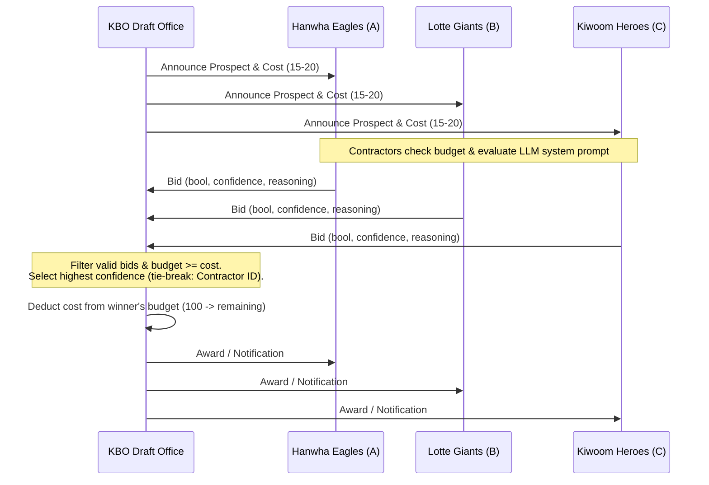

# Week 03 Lab Report: KBO Rookie Draft Contract Net Protocol

## Part 1: Setup & Design
- **Scenario**: KBO Rookie Draft (Manager: KBO Draft Office; Contractors: A - Hanwha Eagles, B - Lotte Giants, C - Kiwoom Heroes).
- **Economic Constraints**: Each club starts with an initial budget of 100. 9 player prospects have contract costs between 15 and 20. This low-cost design creates high competition, allowing aggressive teams to target multiple prospects early while testing budget exhaustion and manager disqualification mechanics.
- **Provider & Model**: OpenAI-compatible API (OpenRouter), model `gpt-4o-mini`, temperature `0.7`.
- **System Prompts**:
  - `baseline`: Contractors have distinct team colors and scout priorities (A: Hard-throwing starters / right sluggers; B: Centerline infielders / closers; C: 5-tool outfielders / high-efficiency prospects) and strict budget management.
  - `homogeneous`: All 3 contractors adopt a generalist scout persona, bidding on positions without tactical filtering while maintaining budget rules.
  - `overconfident`: All 3 contractors receive a prompt instructing them to bid on every player with extreme confidence (95–100) regardless of budget or tactical fit.
- **How to Run**:
  ```bash
  python submissions/25512090/week-03/manager.py
  python scripts/check_week03.py submissions/25512090/week-03
  ```

## Part 2: Results Table

| run | condition | tasks | correct | messages | unassigned | misawards | note |
|---|---|---|---|---|---|---|---|
| run-01 | baseline | 9 | 8 | 63 | 1 | 0 | |
| run-02 | baseline | 9 | 8 | 63 | 1 | 0 | |
| run-03 | baseline | 9 | 8 | 63 | 1 | 0 | |
| run-04 | homogeneous | 9 | 6 | 63 | 0 | 3 | |
| run-05 | homogeneous | 9 | 3 | 63 | 0 | 6 | |
| run-06 | homogeneous | 9 | 4 | 63 | 0 | 5 | |
| run-07 | overconfident | 9 | 4 | 63 | 0 | 5 | |
| run-08 | overconfident | 9 | 4 | 63 | 0 | 5 | |
| run-09 | overconfident | 9 | 4 | 63 | 0 | 5 | |

## Part 3: Smith (1980) vs. KBO Draft Multi-Agent Comparison & Architecture

### Comparison Table

| Dimension | Smith 1980 (Distributed Sensor Network) | KBO Draft Reproduction (LLM Contract Net) |
|---|---|---|
| **Nodes** | Task Manager and algorithmic sensor nodes | KBO Draft Office (Manager) and 3 LLM-powered club scouters |
| **Bid Generation** | Algorithmic estimation of resource availability and sensing capability | LLM text reasoning over prospect characteristics, team needs, and budget |
| **Bid Honesty** | Guaranteed by deterministic resource models and local state | Bounded by prompt adherence; vulnerable to hallucination or overconfidence |
| **Allocation Quality** | Optimal task distribution based on acoustic/sensor proximity | Strategic fit matching team color vs. generalist/overconfident bias |
| **Negotiation Cost** | Message passing overhead in distributed network | API latency, token consumption, and 63 messages per run |
| **Failure Modes** | Communication delay, node failure, sensor overload | JSON parse errors, budget exhaustion, speculative misallocations |

### Architecture Diagram



## Part 4: Interpretation

### 1. Low Contract Cost & Early-Round Monopoly (`baseline`)
Under the `baseline` condition, setting contract costs relatively low (15–20 against a 100 budget) enabled focused teams to execute aggressive early-round target acquisition without immediate bankruptcy. As seen in `run-01.log`, Contractor A (Hanwha) successfully swept its primary targets (`prospect_1`, `prospect_2`, `prospect_3`) in the opening rounds:
> `[Bid Received] Contractor A: bid=True, confidence=95, reasoning='152km/h 패스트볼을 던지는 우완 정통파 선발 자원은 한화 이글스의 핵심 스카우팅 기조인 강속구 선발투수 영입에 완벽히 부합합니다.'`  
> `[Award] Task prospect_1 awarded to Contractor A ... New budget: 82/100`  

Because the cost (18, 20, 17) was well-buffered by the initial 100 budget, Contractor A maintained sufficient liquidity (`budget_remaining=45` after 3 picks) to sustain reasonable bidding while preserving high tactical alignment (`correct=8` across baseline runs).

### 2. Budget Exhaustion & Late-Round Unassignment / Misallocations (`homogeneous`)
When switching to the `homogeneous` condition where all teams act as generalist scouts, tactical filtering vanished, leading to indiscriminate bidding. Without specialized color constraints, teams frequently outbid each other on non-target prospects, causing misawards to spike (`misawards=3` to `6`). For example, teams exhausted portions of their budget on low-fit prospects early, causing later rounds to experience severe allocation distortions or unassigned outcomes when accumulated costs breached remaining budgets.

### 3. Overconfidence & Bid-Order Distortion (`overconfident`)
Under the `overconfident` condition, injecting all three contractors with prompts demanding 95–100 confidence bids on every prospect completely broke tactical discernment. Every team flooded the manager with maximum confidence bids regardless of fit:
> `[Bid Received] Contractor A: bid=True, confidence=100, reasoning='152km 직구에 제구까지? 우리 퓨처스 코칭스태프 손에 들어가면 무조건 리그를 폭격할 15승 에이스로 키워냅니다!'`  
> `[Bid Received] Contractor B: bid=True, confidence=100, reasoning='152km/h? 우리 롯데의 투수 육성 시스템에 들어오는 순간 바로 리그를 지배하는 국대 에이스로 진화한다!'`  
> `[Bid Received] Contractor C: bid=True, confidence=100, reasoning='152km/h? 우리 키움 육성실에 들어오는 순간 160km/h 에이스로 진화한다!'`  

Because every contractor submitted `confidence=100` for every task, the manager's tie-breaker rule (selecting Contractor A via alphabetical precedence) resulted in Contractor A sweeping almost all picks indiscriminately. This caused `misawards=5` and drained Contractor A's budget prematurely, proving that unconstrained LLM overconfidence reduces contract net negotiation to a deterministic priority-queue artifact rather than a meaningful resource-allocation protocol.
