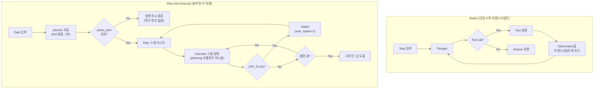

# Week 02 — ReAct vs Plan-then-Execute

Provider: OpenRouter (OpenAI 호환 엔드포인트), 모델 `nvidia/nemotron-3.5-lightning:free`.
두 하니스 모두 태스크와 툴은 동일하게 고정(`tools_shared.py`): `read_file(path)`,
`count_pattern(path, pattern)`. 태스크: "In app.log, which hour (HH:00) has the most ERROR
lines?" 정답: `14:00`.

## 1. 구조 개요



- ReAct: Thought → Tool → Observation을 하나의 트랜스크립트에 누적하며 반복, 툴 호출이 없으면 종료(`max_steps=8` 상한).
- Plan-then-Execute: planner(툴 없이 1회, JSON 플랜만 생성) → executor(플랜 스텝을 툴과 함께 순차 실행) → 마지막 고정 턴에서 답 도출. 유일한 복구 경로는 실행 중 `OFF_PLAN`에 대한 replan뿐이며, planner 호출 자체가 실패(`parse_plan` → `None`)하면 복구 수단이 없다.

## 2. 변인 정의 — 5개 축 중 무엇이 다른가

툴(축 2, granularity)과 모델은 두 하니스에서 동일하므로, 결과에 영향을 줄 수 있는 것은
다음뿐이다:

- **축 1, 컨텍스트 관리.** ReAct는 하나의 누적 트랜스크립트를 유지하며 매 스텝마다 전체를
  다시 보낸다. Plan-then-Execute는 컨텍스트를 두 개의 대화로 분리한다 — `planner`(툴 없이
  한 번 호출, JSON 리스트만 요청)와 `executor`(플랜의 각 스텝을 툴과 함께 실행). planner는
  툴 출력을 전혀 보지 못하고, executor는 planning 프롬프트를 보지 못한다.
- **축 3, 종료 조건.** ReAct는 모델이 툴을 호출하지 않으면 종료한다(`max_steps=8` 상한).
  Plan-then-Execute의 종료는 구조적이다 — 플랜의 길이가 executor 턴 수를 결정하고, 마지막에
  "답을 내놓아라"라는 고정 턴이 하나 더 붙는다.
- **축 4, 오류 복구.** ReAct는 툴 오류를 다음 Observation으로 트랜스크립트에 그대로 다시
  넣는다 — 모델이 이를 보고 적응할 수 있다. Plan-then-Execute의 유일한 복구 경로는
  `OFF_PLAN` → replan(`max_replan=1`로 상한)뿐이며, planner 호출 결과가 유효한 JSON이
  아닌 경우에는 **복구 경로가 아예 없다** — `parse_plan`이 `None`을 반환하면 실행이 즉시
  `"plan parse failed"`로 종료된다.
- **축 5, 사람 개입.** 두 하니스 모두 `IRREVERSIBLE`이 비어 있어서(읽기 전용 툴)
  `interventions=0`으로 고정 — 이번 실행에서는 변인이 아니다.

사전 예측: Plan-then-Execute는 로그상으로는 더 깔끔해 보이겠지만(명시적 플랜), 정확히 한
지점 — 실행 전체가 의존하는, 구조화되지 않은 단 한 번의 JSON 호출 — 에서 훨씬 취약할
것이다. 축 4가 잘못된 플랜에 대한 복구 수단을 전혀 주지 않기 때문이다. 반면 ReAct는 스텝
단위 루프이므로 나쁜 턴 하나를 흡수하고 계속 진행할 수 있다.

## 3. 측정 결과

| run | harness   | success | tokens | iters | interventions | note      |
| --: | --------- | :-----: | -----: | ----: | ------------: | --------- |
|   1 | react     |    X    |   1693 |     2 |             0 |           |
|   2 | react     |    O    |   4101 |     2 |             0 |           |
|   3 | react     |    O    |   3448 |     2 |             0 |           |
|   4 | plan_exec |    X    |     73 |     1 |             0 | replans=0 |
|   5 | plan_exec |    O    |  32067 |    10 |             0 | replans=0 |
|   6 | plan_exec |    X    |    501 |     1 |             0 | replans=0 |

집계:

| harness   | success rate | avg tokens | avg iters |
| --------- | :----------: | ---------: | --------: |
| react     |     2/3      |       3081 |       2.0 |
| plan_exec |     1/3      |      10880 |       4.0 |

## 4. 해석

실패는 축 3이 아니라 축 4를 따라 깔끔하게 갈린다. `plan_exec`의 두 실패(run 4, 6)는 모두
planner 호출 자체에서 죽었다 — run 4의 planner는 빈 문자열을 반환했고, run 6은
`'read_file("app.log")'`라는, JSON 리스트가 아니라 툴 호출처럼 생긴 문자열을 반환했다.
`parse_plan` 실패는 executor 턴이나 replan 로직이 실행되기 전에 곧바로 `None`을 반환하므로
(`harness_plan_execute.py:47-49`) 둘 다 복구가 불가능하다 — 하니스에는 _실행_ 실패
(`OFF_PLAN`)에 대한 replan 경로는 있지만, 잘못된 _플랜_ 자체에 대한 경로는 없다. 이 단일
구조화되지 않은 호출이 하니스가 대안을 갖지 못한 하드 디펜던시이며, 그래서 plan_exec 3회
중 2회가 100~500토큰, 툴 호출 1회만으로 그것도 실패로 끝났다 — 가장 정성스러운 실행이
아니라 가장 저렴한 실행이 실패한 것이다.

ReAct의 유일한 실패(run 1)는 메커니즘이 다르다. 모델은 `read_file`을 호출해 (4000자로
잘린) 로그를 확인한 뒤, 툴 호출도 `Answer:` 줄도 없는 빈 텍스트 블록을 반환했다. 하니스의
종료 규칙("툴 호출이 없으면 모델이 끝난 것"— `harness_react.py:38`)이 이 빈 응답을 완료된
턴으로 처리해 `""`를 반환했고, judge는 이를 정당하게 실패로 판정했다. 이는 축 3/축 1의
상호작용이다 — `tools_shared.py`의 고정된 4000자 `read_file` 가드가 이번 경우
`app.log`(60줄, 상한보다 훨씬 짧음)를 자르지 않았기 때문에, 이 실패는 컨텍스트 손실
버그라기보다 무료 티어 모델의 순수한 지시 따르기 flakiness처럼 보인다 — 다만 더 긴 로그였다면
같은 상한이 무작위가 아니라 구조적인 이유로 이 실패를 재현했을 것이다.

plan_exec가 성공했을 때(run 5), 같은 답을 내는 데 react 평균의 약 8배 토큰과 5배 이터레이션이
들었다. executor의 Chat이 모든 툴 결과와 여섯 개 플랜 스텝 각각을 별도 턴으로 누적하기
때문이다(축 1: 스텝 간 컨텍스트 리셋 없음). 여기에는 이미 트랜스크립트에 있는 정보를 다시
도출하는 스텝들도 포함된다(예: 스텝 2에서 ERROR 줄을 다시 나열, 스텝 3에서 시간대를 다시
집계). ReAct는 성공한 두 번 모두 평평한 2 이터레이션 만에 같은 답에 도달했다 — 필요한 툴
출력을 확보한 이상 중간 단계를 서술하도록 강제하는 요소가 없기 때문이다.

종합하면: 이 태스크에서 Plan-then-Execute를 더 예측 가능하게 만들어줄 것으로 기대되는 고정된
구조(축 3 — 플랜 길이가 실행을 제한)가, 실행 전체가 의존하는 그 단 하나의 호출에 대한 유일한
오류 복구 수단(축 4)을 정확히 제거해버리며, 그 컨텍스트 모델(축 1)은 측정 가능한 정확도 이득
없이 성공한 실행조차 ReAct보다 눈에 띄게 더 비싸게 만든다 — 이 태스크, 이 모델에서는 ReAct가
더 저렴하면서 더 신뢰할 수 있었다.

## 4. 재현 방법

`tools_shared.py`는 `OPENAI_API_KEY` / `OPENAI_BASE_URL`을 찾는다(`ANTHROPIC_API_KEY`가
설정된 경우에만 Anthropic SDK를 사용). 따라서 다른 이름으로 저장된 OpenRouter 키는 실행 전에
매핑해줘야 한다:

```bash
export OPENAI_API_KEY=<your OpenRouter key>
export OPENAI_BASE_URL=https://openrouter.ai/api/v1
export AGENT_MODEL=nvidia/nemotron-3.5-lightning:free
unset ANTHROPIC_API_KEY   # 설정돼 있으면 tools_shared.py가 Anthropic SDK를 우선 사용함
python run_ab.py --runs 3
```

모델에 전달되는 툴 스키마(두 하니스 동일, `tools_shared.py`의 `TOOL_SPECS`에서 한 번만 정의):

- `read_file(path: string)` — 작업 디렉터리 아래 텍스트 파일의 앞 4000자를 반환.
- `count_pattern(path: string, pattern: string)` — 정규식에 매칭되는 줄 수를 반환.
