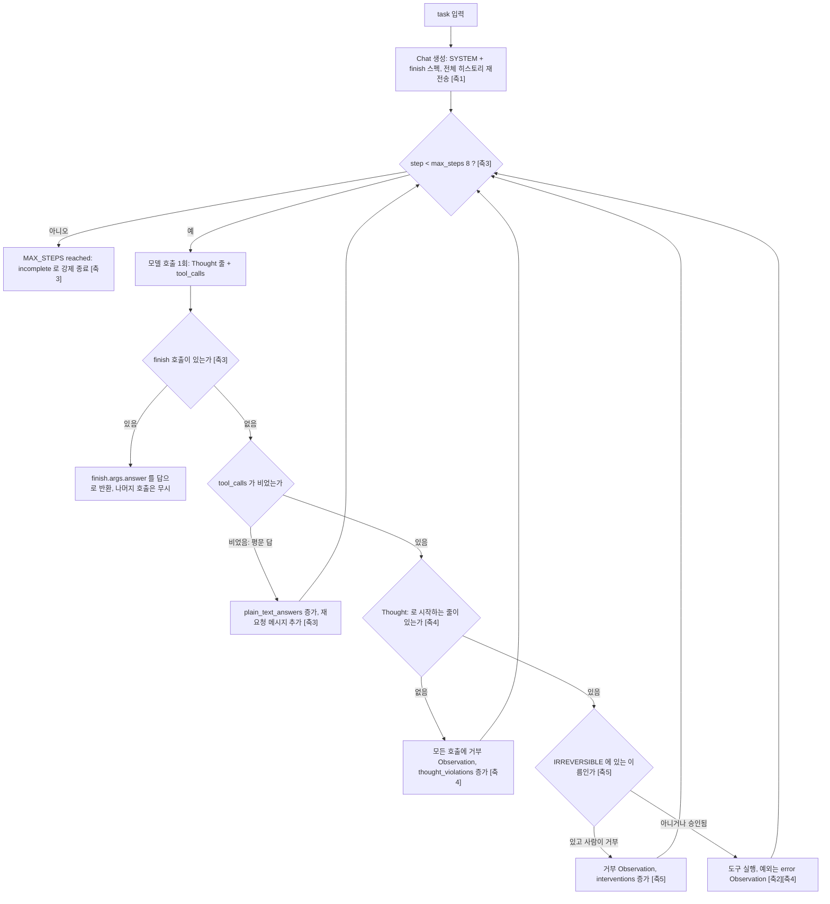
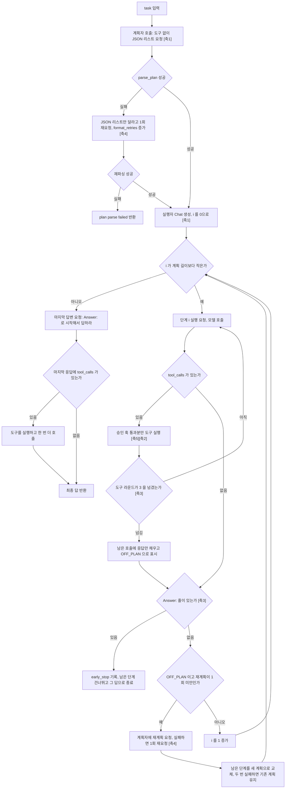

# Week 02 실습: 하네스 두 개를 직접 구현해 비교하기

모델과 태스크와 도구를 고정하고 하네스만 바꾸는 A/B 실험이다. 태스크와 성공
판정 기준은 `TASK.md`에, 축별 결정과 그 이유는 `decisions.md`에 있다.

강사 배포본은 `reference/harness_react.py`, `reference/harness_plan_execute.py`에
그대로 두었다. 최상위의 두 하네스가 이번 실습에서 직접 구현한 버전이고,
아래 표의 "스타터와 같은가" 열이 둘의 차이를 그대로 옮긴 것이다.

## 무엇이 스타터와 다른가

| 축 | 선택 | 스타터와 같은가 | 코드 위치 |
| --- | --- | --- | --- |
| C1 도구 집합 (요소2) | `read_file`은 앞 4000자까지, `count_pattern`은 정규식에 걸리는 줄 수. 두 하네스가 같은 것을 import | 같음 | `tools_shared.py:read_file`, `tools_shared.py:count_pattern` |
| R1 컨텍스트 (요소1) | 매 호출마다 전체 히스토리를 다시 보냄. 요약이나 잘라내기 없음 | 같음 | `harness_react.py:run_react` (`Chat` 생성) |
| R2 종료 조건 (요소3) | 명시적 `finish(answer)` 도구 호출만 종료로 인정. 도구 없는 평문 답은 종료가 아니라 재요청 메시지를 붙이고 한 스텝을 소비 | 다름 | `harness_react.py:FINISH_SPEC`, `harness_react.py:run_react` (finish 분기) |
| R3 반복 상한 (요소3) | `max_steps=8` | 같음 | `harness_react.py:run_react` |
| R4 에러 복구 (요소4) | 도구 예외는 `error: ...` Observation으로 되돌림. 여기에 더해 `Thought:` 줄 없이 도구를 부르면 그 호출을 실행하지 않고 거부 Observation을 돌려줌 | 다름 (형식 강제가 추가) | `tools_shared.py:Chat.run_tools`, `harness_react.py:run_react` (`THOUGHT_RE` 분기) |
| R5 개입 지점 (요소5) | `IRREVERSIBLE` 승인 훅은 두되 읽기 전용 도구뿐이라 집합은 비움. 개입 횟수는 0으로 기록 | 같음 | `harness_react.py:IRREVERSIBLE`, `harness_react.py:ask_human` |
| P1 계획 형식 | JSON 문자열 리스트. 파싱 실패 자체를 관측 대상으로 남김 | 같음 | `harness_plan_execute.py:parse_plan` |
| P2 계획자와 실행자 분리 | 계획자는 도구 없이, 실행자는 도구를 가지고, 서로 다른 `Chat` 인스턴스 | 같음 | `harness_plan_execute.py:run_plan_execute` |
| P3 단계별 도구 예산 | `max_tool_rounds=3`. 넘기면 그 단계를 `OFF_PLAN`으로 처리 | 같음 | `harness_plan_execute.py:run_plan_execute` |
| P4 재계획 상한 | `max_replan=1`. 유연성의 상한을 숫자로 명시 | 같음 | `harness_plan_execute.py:run_plan_execute` |
| P5 조기 종료 | 실행자가 어떤 단계에서든 `Answer:` 줄을 내면 남은 단계를 건너뛰고 그 답으로 종료. 마지막 답변 요청 호출도 생략 | 다름 | `harness_plan_execute.py:run_plan_execute` (`ANSWER_RE` 분기) |
| P6 계획 형식 복구 | 계획이나 재계획이 JSON 리스트가 아니면 "JSON 리스트만" 이라고 1회 재요청. 두 번째도 실패하면 초기 계획은 포기, 재계획은 기존 계획으로 계속 | 다름 | `harness_plan_execute.py:request_plan` |
| P7 개입 지점 대칭 | 실행자의 도구 루프에도 ReAct와 같은 `IRREVERSIBLE` 승인 훅을 둠. 거부된 호출은 거부 Observation을 받고 개입 횟수가 올라감 | 다름 | `harness_plan_execute.py:run_step_tools` |

R2, R4, P5, P6, P7 다섯 곳만 바꾸고 나머지는 스타터 그대로 두었다. 비교의
기준선을 남겨 두어야 지표 차이를 그 다섯 곳에 귀속시킬 수 있기 때문이다.

## ReAct 루프

매 스텝 Thought와 도구 호출을 한 번에 받고, 관찰 결과를 다음 스텝의 입력으로
되돌린다. 대괄호 안의 번호는 강의의 다섯 요소다.



## Plan-then-Execute 루프

계획을 먼저 굳히고 단계를 순서대로 실행한다. 도중에 답이 나오면 남은 단계는
건너뛴다.



## 실행 방법

Python 3.10 이상이면 되고 표준 라이브러리만 쓴다. 모델 백엔드는 Claude Code
구독 로그인을 그대로 쓰는 `claude -p`다.

```bash
export AGENT_PROVIDER=claude_cli
python3 harness_react.py            # 한 번만 돌려 볼 때
python3 harness_plan_execute.py
python3 run_ab.py --runs 3          # 하네스당 3회, results.csv 와 logs/ 에 기록
```

`run_ab.py`는 실행마다 `results.csv`에 한 줄을 덧붙이고 콘솔 출력을
`logs/<하네스>-<번호>.txt`로 남긴다. 실패한 실행도 지우지 않는다.

토큰 수치를 읽을 때 주의할 점이 하나 있다. `claude_cli` 백엔드의 토큰에는
Claude Code 자체의 컨텍스트 오버헤드가 섞여 들어간다. 첫 호출의 캐시 생성분이
크고 이후 호출에도 고정 비용이 붙어서, 다른 백엔드의 숫자와 직접 비교하면 안
된다. 같은 백엔드 안에서 두 하네스를 비교하는 용도로만 쓴다. 호출마다 실제로
보낸 프롬프트 크기는 `Meter.prompt_chars`로 따로 세서 `note` 열에 적는다.

## 결과

실행 날짜 2026-09-09, 백엔드 claude_cli(Claude Code 구독 로그인, 모델 claude-sonnet-4-5), 태스크와 도구는 스타터 그대로. results.csv 6행을 그대로 옮기고 벽시계 시간은 각 로그의 [judge] 줄에서 읽었다.

| run | 하네스 | 성공 | 모델 호출 | 토큰(CC 오버헤드 포함) | 하네스 프롬프트 글자수 | 벽시계(초) | 비고 | 로그 |
|---|---|---|---|---|---|---|---|---|
| 1 | react | O | 4 | 141,519 | 17,356 | 94.2 | thought_violations=0,plain_text_answers=1 | logs/react-01.txt |
| 2 | react | O | 2 | 122,147 | 5,345 | 49.1 | thought_violations=0,plain_text_answers=0 | logs/react-02.txt |
| 3 | react | O | 4 | 372,241 | 17,035 | 109.8 | thought_violations=0,plain_text_answers=1 | logs/react-03.txt |
| 4 | plan_exec | O | 7 | 179,865 | 30,282 | 137.8 | replans=1,early_stop=1,format_retries=0 | logs/plan_exec-04.txt |
| 5 | plan_exec | O | 7 | 287,835 | 33,406 | 136.0 | replans=1,early_stop=1,format_retries=0 | logs/plan_exec-05.txt |
| 6 | plan_exec | O | 6 | 179,957 | 36,961 | 99.6 | replans=0,early_stop=1,format_retries=0 | logs/plan_exec-06.txt |

하네스별 요약이다. n=3이라 평균과 최소~최대만 적는다.

| 하네스 | 성공 | 호출 평균(범위) | 토큰 평균(범위) | 프롬프트 글자수 평균(범위) | 벽시계 평균(범위) |
|---|---|---|---|---|---|
| react | 3/3 | 3.3 (2~4) | 211,969 (122,147~372,241) | 13,245 (5,345~17,356) | 84.4 (49.1~109.8) |
| plan_exec | 3/3 | 6.7 (6~7) | 215,886 (179,865~287,835) | 33,550 (30,282~36,961) | 124.5 (99.6~137.8) |

Plan-then-Execute 대비 ReAct 기준으로 호출 2.0배, 하네스 프롬프트 글자수 2.5배, 토큰 1.02배, 벽시계 1.5배 차이다. 토큰 열은 Claude Code가 매 호출에 싣는 자기 컨텍스트(첫 호출 캐시 생성 약 11만 토큰, 이후 호출당 수천)를 포함하므로 하네스 비용으로 읽으면 안 되고, 하네스가 실제로 만든 컨텍스트는 프롬프트 글자수 열이 보여 준다.

## 해석

성공은 3/3 대 3/3으로 같고, 개입은 두 하네스 모두 0이다. 차이는 모델 호출 수와 하네스가 만든 컨텍스트 크기에서 났고 둘 다 ReAct가 적다. 토큰 열은 두 하네스가 거의 같은데(약 21만 대 약 22만), 이것은 하네스 차이가 아니라 Claude Code 오버헤드가 지배한 결과라서 이 백엔드에서는 토큰을 비교 지표로 쓰지 않는다. 대신 프롬프트 글자수를 보면 Plan-then-Execute가 2.5배다. 계획 문장과 "Execute step i" 메시지가 매 호출 다시 전송되고(축1), 실행 단계마다 호출이 한 번씩 추가되기 때문이다(축3).

결정 다섯 곳이 실제로 어떻게 작동했는지는 로그에 그대로 있다. R2 finish 도구는 세 번 중 두 번(logs/react-01.txt 2스텝, logs/react-03.txt 1스텝)에서 모델이 평문으로 답하려는 것을 거부했고, 두 번 모두 다음 스텝에 도구를 부르거나 finish로 회복했다. 비용은 스텝 1회씩이다. react-02는 읽기 한 번 뒤 finish로 끝나 2회 호출이 최소 경로임을 보여 준다. R4 Thought 강제는 여섯 실행에서 한 번도 발동하지 않았다. 이 모델은 형식을 지켰으므로 강제 장치의 비용은 0이었고, 이 장치의 가치는 모델에 따라 달라진다는 뜻이다. P5 조기 종료는 세 실행 모두 발동해 각각 2, 5, 4단계를 건너뛰었다(logs/plan_exec-04~06.txt의 [early-stop] 줄). 스타터가 1단계에서 답이 나와도 계획 끝까지 실행하던 낭비가 사라진 자리다. P6 재계획 재요청은 필요하지 않았고(format_retries 0), P7 개입 훅은 읽기 전용 도구라 관측되지 않았다.

재계획은 세 실행 중 둘에서 일어났고 원인이 각각 다르다. logs/plan_exec-04.txt에서는 모델이 read_file의 4000자 상한을 보고 파일이 잘렸다고 오해해 OFF_PLAN을 냈다. 파일은 3022자로 전체가 들어 있었다. 도구 설명이 "first 4000 characters"라고만 말하고 실제 길이를 알려 주지 않아 생긴 착각이라 축2의 문제다. logs/plan_exec-05.txt에서는 모델이 "read_file은 없고 사용 가능한 도구는 MCP 서버(GitHub, Notion, Gmail)"라고 답했다. 이것은 하네스가 준 정보가 아니라 claude -p가 함께 싣는 Claude Code 컨텍스트가 새어 들어온 것이고, logs/react-03.txt 1스텝의 "도구가 없어 못 한다"도 같은 원인이다. 여섯 실행 중 두 실행의 첫 스텝이 오염되었으니 이 백엔드로 얻은 수치는 그만큼 흔들리고, 반대로 두 번 모두 하네스의 복구 장치(재계획, 평문 거부)가 잡아냈다는 점은 축4가 왜 필요한지 보여 준다.

도구 예산(P3, 단계당 3라운드)에는 한 번도 걸리지 않았다. 이 모델은 시간대별 count_pattern 24개를 한 턴에 묶어 부르기 때문에 라운드 수가 1로 끝난다. 스타터 실행에 쓴 모델은 한 턴에 하나씩 불러 같은 예산에 걸렸으니, 라운드 예산의 실질 의미는 모델의 병렬 호출 습관에 따라 달라진다. 판정에서도 발견이 하나 있다. logs/plan_exec-05.txt의 최종 답은 "Answer: " 뒤가 비어 있는데 본문 표에 14:00이 있어 O가 되었다. 성공 기준을 "최종 답 어딘가에 14:00"에서 "Answer: 줄의 값"으로 좁혀야 이런 우연 성공을 걸러낼 수 있다. react-02는 14시 오류를 7건으로 세었지만 순위는 맞아 정답이 되었다.

한계는 다음과 같다. n=3이고 단일 모델이다. 토큰은 Claude Code 오버헤드가 섞여 백엔드 간 비교에 쓸 수 없다. 교수님 스타터 하네스와의 직접 비교는 모델이 달라(nemotron 대 sonnet) 여기서는 할 수 없고, 같은 모델에서 스타터와 이 구현을 나란히 돌리는 것이 다음 실험이다.
