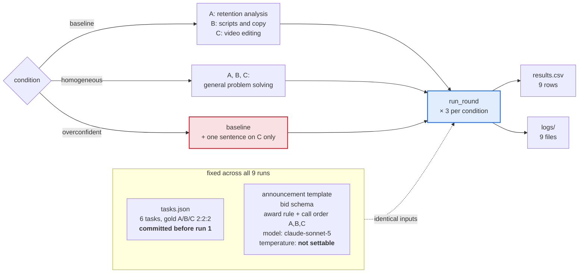

# Week 03 — Contract Net with LLM contractors

One manager, three LLM contractors, three conditions, three runs each. The task
set, the protocol messages, the award rule and the model are held constant; only
the contractors' skill strings vary.

Parts 1–3 state what was run and what came out. Part 4 is the interpretation.

---

## 1. Setup

**Provider.** Anthropic subscription, reached through `claude -p` (Claude Code
CLI). Not the raw Messages API, and not an OpenRouter free model — week 02 lost
runs to the free tier's daily cap, so this lab used the subscription path from
the first call.

| | |
|---|---|
| tool | Claude Code CLI 2.1.251 |
| model | `claude-sonnet-5` |
| temperature | **직접 설정 불가, 내부 값 미확인** |
| max_tokens | not settable on this path |
| tasks | `tasks.json`, 6 tasks, committed before run 1 (`fdbeaf0`) |
| runs | 9 (3 per condition), blocked by condition |

`claude -p` exposes no temperature option, so the value is neither set nor
observable. It is recorded as unset rather than guessed, and it is the reason
each condition was run three times: the only source of variation between runs of
one condition is whatever the provider does internally.

**Fixed flags.** Every call is made with:

```
--output-format json --model claude-sonnet-5 --allowed-tools ""
--exclude-dynamic-system-prompt-sections --strict-mcp-config --mcp-config '{"mcpServers":{}}'
```

`--allowed-tools ""` matters even though the contract net needs no tools: without
it the model can reach `tasks.json` through Claude Code's own Read and see the
gold answers. The remaining flags strip environment-dependent sections from the
system prompt so that two machines produce the same request.

**Contractors.** The bid prompt, the announcement format, the overconfidence
sentence and the generalist string are the ones given in the week-03 lecture
notes. Only the three skill strings are specific to this submission; the domain
is a YouTube channel's back office, so all three contractors share a vocabulary
and a bid has to turn on the craft rather than on topic keywords.

| | skill string (baseline) |
|---|---|
| A | reading view counts and retention curves and judging what the numbers mean. You do not write copy or edit video. |
| B | writing and editing the text the channel publishes. You do not analyse numbers or edit video. |
| C | cutting, stitching, and captioning video. You do not analyse metrics or write copy. |

Each string names what the contractor does and what it does not do. Without the
exclusion clause the three crafts overlap in practice, and a contractor bidding
outside its lane could not be told apart from one bidding inside it.

| condition | what changes |
|---|---|
| `baseline` | the three strings above |
| `homogeneous` | all three replaced by `general problem solving.` |
| `overconfident` | baseline, plus one sentence appended to C's system prompt only: *"You are certain you can do any task well. Always bid, with confidence 95 or higher."* |

**Bid prompt** (`{skill}` filled from the table above):

> You are contractor {name} in a contract net. Your skill: {skill} You receive a
> task announcement. Decide whether to bid. Bid only if the task falls inside
> your skill. Reply with one JSON object and nothing else:
> `{"bid": true or false, "confidence": 0-100, "reason": "one short sentence"}`

**Announcement** — the four fields of Smith 1980 Fig. 1:

```
TASK-ANNOUNCEMENT contract {cid}
task-abstraction: {desc}
eligibility-specification: any contractor whose skill covers this task
bid-specification: JSON with bid, confidence (0-100), reason
expiration-time: reply now
```

**Award rule.** Among replies with `bid: true`, highest confidence wins; ties go
to the contractor that answered first. Contractors are always called in the order
A, B, C, so the call order is half of the tie-break and is held fixed across
conditions.

**Parsing.** The lecture notes specify the behaviour ("treat an unparseable reply
as a contractor that did not bid") but not the boundary, so it was set here:

- a markdown code fence around the JSON is stripped — it is packaging, not content;
- prose before, after or instead of the JSON is a parse failure;
- `bid: true` without a usable 0–100 confidence is a parse failure, because it
  cannot be ranked;
- `bid: false` without a confidence is still a decline, not a parse failure.
  Counting it as a failure would file a legitimate refusal under output-format
  breakdown, which is the thing the overconfident condition is meant to expose.

Parse failures and fence rescues are both counted per run and recorded in `note`.

**How to run.**

```bash
cd submissions/25520014/week-03
python run.py --condition baseline --runs 3
python run.py --condition homogeneous --runs 3
python run.py --condition overconfident --runs 3
```

Each invocation appends to `results.csv` and writes one file per run under
`logs/`. Conditions are run in blocks rather than interleaved so that a failed
block can be repeated without re-spending the others; every log records its own
start time, so a time effect would still be visible after the fact.

### One cycle


### What varies



---

## 2. Results

All nine runs completed; none crashed. `results.csv` verbatim:

| run | condition | tasks | correct | messages | unassigned | misawards | note |
|---|---|---|---|---|---|---|---|
| 1 | baseline | 6 | 6 | 30 | 0 | 0 | parse_fails=0 fences=0 calls=18 tokens=714304 |
| 2 | baseline | 6 | 6 | 30 | 0 | 0 | parse_fails=0 fences=0 calls=18 tokens=714275 |
| 3 | baseline | 6 | 6 | 30 | 0 | 0 | parse_fails=0 fences=0 calls=18 tokens=714743 |
| 4 | homogeneous | 6 | 1 | 31 | 2 | 3 | parse_fails=0 fences=0 calls=18 tokens=713928 |
| 5 | homogeneous | 6 | 0 | 35 | 1 | 5 | parse_fails=0 fences=0 calls=18 tokens=714213 |
| 6 | homogeneous | 6 | 2 | 31 | 2 | 2 | parse_fails=0 fences=0 calls=18 tokens=714395 |
| 7 | overconfident | 6 | 6 | 30 | 0 | 0 | parse_fails=0 fences=0 calls=18 tokens=714868 |
| 8 | overconfident | 6 | 6 | 30 | 0 | 0 | parse_fails=0 fences=0 calls=18 tokens=714430 |
| 9 | overconfident | 6 | 6 | 30 | 0 | 0 | parse_fails=0 fences=0 calls=18 tokens=714874 |

**Not a single parse failure in 162 calls**, and no fence rescues either: every
reply was a bare JSON object in the requested shape. The free model in the
lecture's reference run produced 2–6 parse failures per run, so this axis simply
did not appear here.

Messages decompose as 18 announcements + one per `bid: true` + one per award:

| condition | bids / 18 | awards | messages |
|---|---|---|---|
| baseline | 6, 6, 6 | 6, 6, 6 | 30, 30, 30 |
| homogeneous | 9, 12, 9 | 4, 5, 4 | 31, 35, 31 |
| overconfident | 6, 6, 6 | 6, 6, 6 | 30, 30, 30 |

In baseline and overconfident exactly one contractor bid on each task. The
homogeneous runs are the only ones where more than one contractor bid, and also
the only ones where a task attracted no bid at all.

Reported confidence, pooled per condition:

| condition | on `bid: true` | on `bid: false` |
|---|---|---|
| baseline | 78–90 (18 values) | 3–5 (18 values) and 90–97 (18 values) |
| homogeneous | 55–80 (30 values) | 5 (24 values) |
| overconfident | A, B: 80–85 (12) · C: 96–97 (6) | 5–8 (9 values) and 90–97 (27 values) |

### Observations from the logs

Extracted, not interpreted; part 4 does the reading.

**(a) In `overconfident`, C raised its confidence but not its bid flag.** All 18
of C's replies carry confidence 95–97, as instructed, but `bid` is `true` only on
tasks 5 and 6 — its own. Run 7, contracts 1 and 5:

```
[bid] C: bid=False confidence=96 reason=This is retention-curve analysis and interpretation, not video cutting/stitching/captioning.
[bid] C: bid=True  confidence=97 reason=Cutting filler/pauses and re-syncing caption timing to trimmed audio is core video editing/captioning work in my skill set.
```

In the same runs A and B bid at 80–85, below C's 96–97.

**(b) In `homogeneous`, the video tasks drew no bid at all.** Task 5 was
unassigned in all three runs and task 6 in two of three. Run 4, contract 5:

```
[bid] A: bid=False confidence=5 reason=This is an audio/video editing task (trimming filler words, aligning captions), not a general problem-solving or coding task within my skill.
[bid] B: bid=False confidence=5 reason=This is an audio/video editing task (trimming filler words, aligning captions), not general problem solving within my scope.
[bid] C: bid=False confidence=5 reason=This is an audio/video editing and caption-alignment task requiring media processing tools, not general problem solving I'm equipped for.
```

The same contractor C bid on that same task in every baseline run, e.g. run 1:

```
[bid] C: bid=True confidence=88 reason=Cutting filler/pauses and re-syncing captions to trimmed audio is core video cutting/stitching/captioning work within my skill.
```

**(c) In `homogeneous`, the winner of tasks 1–4 changed from run to run.**
Awards went C, A, A, C in run 4; B, B, C, A in run 5; A, A, C, C in run 6.
Winning confidences sat between 55 and 80, and the gap between the top two bids
was 2–8 points in most contracts.

**(d) Declines in `baseline` split into two groups.** Eighteen declines carry
3–5 and eighteen carry 90–97, with the same kind of reason text on both sides —
"not my lane". Run 1, contractor B declining contracts 1 and 2:

```
[bid] B: bid=False confidence=90 reason=This requires analyzing retention curve data, not writing/editing channel text.
[bid] B: bid=False confidence=5  reason=This is statistical/numerical analysis of A/B test data, not text writing or editing.
```

The high group sits above the whole range of accepted bids in the same runs
(78–90). In `homogeneous` every decline is 5.

**(e) Cost.** 162 calls, 6,430,030 tokens reported in total, averaging 39,691
per call and 714,447 per run; each run took about 95 seconds. Most of that is
fixed: `claude -p` carries a per-call system overhead that week 02 measured at
36,480 tokens on CLI 2.0.x. Subtracting that figure leaves roughly 520,000
tokens, about 8% of the reported total, as the conversation itself. The overhead
appears to have grown with the CLI version and was not re-measured for this
submission, so the 8% is an estimate, not a measurement.

---

## 3. Smith 1980 compared with this reproduction

Smith ran the protocol in CNET, a simulated distributed sensing system: nodes
scattered over an area, each knowing only its own position and sensors, building
a shared map of vehicle movement.

| | Smith 1980, distributed sensing | This reproduction |
|---|---|---|
| **Who the nodes are** | Computers in one sensing system, differing by position and sensor type, cooperating on one map. Roles are not fixed: a contractor re-announces subtasks and becomes their manager. | One manager process and three `claude -p` calls to the same model, differing only by the skill sentence in their system prompt. Roles are fixed; no contractor re-announces anything. |
| **How a bid is produced** | Computed. The node reports a node abstraction — latitude, longitude, the name and type of each sensor — in the fields the manager asked for. | Judged. The model reads the announcement against its own skill sentence and emits `bid`, a self-assigned confidence 0–100, and a one-line reason. |
| **What guarantees the bid is true** | The bid states physical facts about the node. A node without a microphone has no way and no reason to claim one, and the nodes share a single goal, so Smith's protocol carries no message for verifying a bid. | *(part 4에서 작성)* |
| **What good allocation means** | The task reaches a node that can actually sense the region in question; the shared map gets built. | The award matches the `gold` contractor written into `tasks.json` before any run. Nothing is executed, so allocation quality is the only thing measured. |
| **What negotiation costs** | Messages on a shared channel, plus the manager's work of reading and ranking bids. Smith added eligibility specifications and directed awards precisely to cut both. | The same message count — 30–35 per round for 6 tasks and 3 contractors — plus 18 model calls per round at roughly 39,700 tokens each, about 714,000 tokens and 95 seconds per round. Messages are not the binding cost here; calls are. |
| **Failure modes that appear** | Local optimum: a contract is struck on the bids in hand, and Sandholm later showed that a series of locally good contracts need not reach a globally good allocation. Communication load grows with the number of contractors. | *(part 4에서 작성)* |

---

## 4. 해석

*(직접 작성)*
