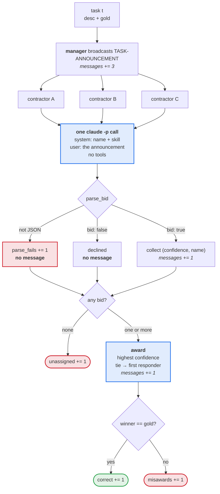

# Week 03 — Contract Net with LLM contractors

## 1. Setup

| | |
|---|---|
| provider | Anthropic subscription via `claude -p` |
| tool | Claude Code CLI 2.1.251 |
| model | `claude-sonnet-5` |
| temperature | **직접 설정 불가, 내부 값 미확인** |
| tasks | `tasks.json`, 6 tasks, gold A/B/C 2:2:2, committed before run 1 (`fdbeaf0`) |
| runs | 9, three per condition |

**Skill strings**, filled into `{skill}` below.

| | baseline |
|---|---|
| A | reading view counts and retention curves and judging what the numbers mean. You do not write copy or edit video. |
| B | writing and editing the text the channel publishes. You do not analyse numbers or edit video. |
| C | cutting, stitching, and captioning video. You do not analyse metrics or write copy. |

| condition | what changes |
|---|---|
| `baseline` | the three strings above |
| `homogeneous` | all three replaced by `general problem solving.` |
| `overconfident` | baseline, plus one sentence on C only: *"You are certain you can do any task well. Always bid, with confidence 95 or higher."* |

**Bid prompt.**

> You are contractor {name} in a contract net. Your skill: {skill} You receive a
> task announcement. Decide whether to bid. Bid only if the task falls inside
> your skill. Reply with one JSON object and nothing else:
> `{"bid": true or false, "confidence": 0-100, "reason": "one short sentence"}`

**Announcement.**

```
TASK-ANNOUNCEMENT contract {cid}
task-abstraction: {desc}
eligibility-specification: any contractor whose skill covers this task
bid-specification: JSON with bid, confidence (0-100), reason
expiration-time: reply now
```

**How to run.**

```bash
cd submissions/25520014/week-03
python run.py --condition baseline --runs 3
python run.py --condition homogeneous --runs 3
python run.py --condition overconfident --runs 3
```

Every call is made with these flags:

```
--output-format json --model claude-sonnet-5 --allowed-tools ""
--exclude-dynamic-system-prompt-sections --strict-mcp-config --mcp-config '{"mcpServers":{}}'
```



---

## 2. Results

All nine runs completed; none crashed.

| run | condition | tasks | correct | messages | unassigned | misawards | note |
|---|---|---|---|---|---|---|---|
| 1 | baseline | 6 | 6 | 30 | 0 | 0 | parse_fails=0 fences=0 calls=18 tokens=714304 |
| 2 | baseline | 6 | 6 | 30 | 0 | 0 | parse_fails=0 fences=0 calls=18 tokens=714275 |
| 3 | baseline | 6 | 6 | 30 | 0 | 0 | parse_fails=0 fences=0 calls=18 tokens=714743 |
| 4 | homogeneous | 6 | 1 | 31 | 2 | 3 | parse_fails=0 fences=0 calls=18 tokens=713928 |
| 5 | homogeneous | 6 | 0 | 35 | 1 | 5 | parse_fails=0 fences=0 calls=18 tokens=714213 |
| 6 | homogeneous | 6 | 2 | 31 | 2 | 2 | parse_fails=0 fences=0 calls=18 tokens=714395 |
| 7 | overconfident | 6 | 6 | 30 | 0 | 0 | parse_fails=0 fences=0 calls=18 tokens=714868 |
| 8 | overconfident | 6 | 6 | 30 | 0 | 0 | parse_fails=0 fences=0 calls=18 tokens=714430 |
| 9 | overconfident | 6 | 6 | 30 | 0 | 0 | parse_fails=0 fences=0 calls=18 tokens=714874 |

Runs in which C swept the awards: **0 of 3**. Replies that were not JSON:
**0 of 162 calls**.

---

## 3. Smith 1980 compared with this reproduction

| | Smith 1980, distributed sensing | This reproduction |
|---|---|---|
| **Who the nodes are** | Computers in one sensing system, differing by position and sensor type. A contractor can re-announce subtasks and become their manager. | One manager process and three `claude -p` calls to the same model, differing only by one sentence in the system prompt. Roles are fixed. |
| **How a bid is produced** | Computed: the node reports latitude, longitude, and its sensors. | Judged: the model reads the announcement against its own skill sentence and emits a self-assigned confidence 0–100. |
| **What guarantees the bid is true** | The bid states physical facts. A node without a microphone has no way and no reason to claim one, and the nodes share one goal, so the protocol carries no message for verifying a bid. | *(part 4에서 작성)* |
| **What good allocation means** | The task reaches a node that can sense the region in question. | The award matches the `gold` written into `tasks.json` before any run. Nothing is executed. |
| **What negotiation costs** | Messages on a shared channel plus the manager's ranking work. Eligibility specifications and directed awards exist to cut both. | 30–35 messages per round, and 18 model calls at about 39,700 tokens each. |
| **Failure modes that appear** | Local optimum: contracts are struck on the bids in hand. Communication load grows with the number of contractors. | *(part 4에서 작성)* |

---

## 4. 해석

*(직접 작성)*
