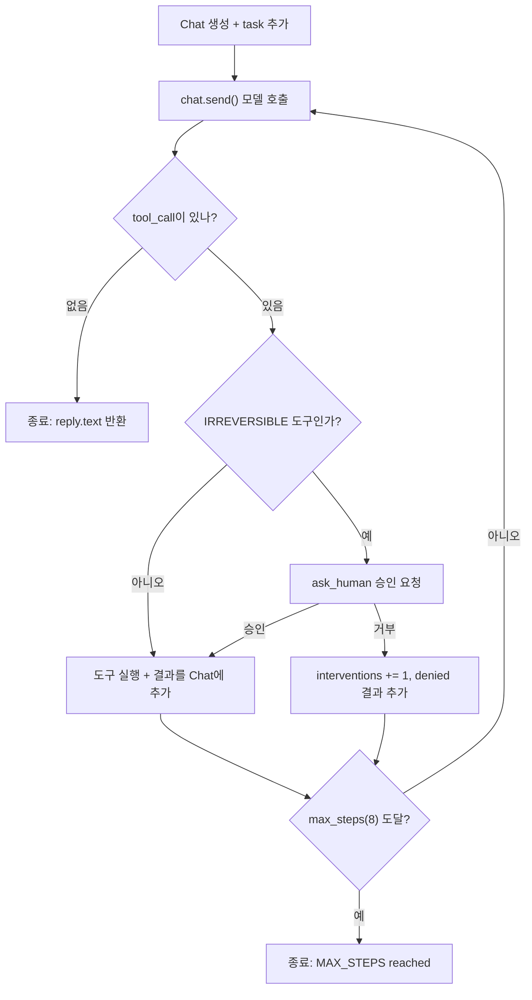
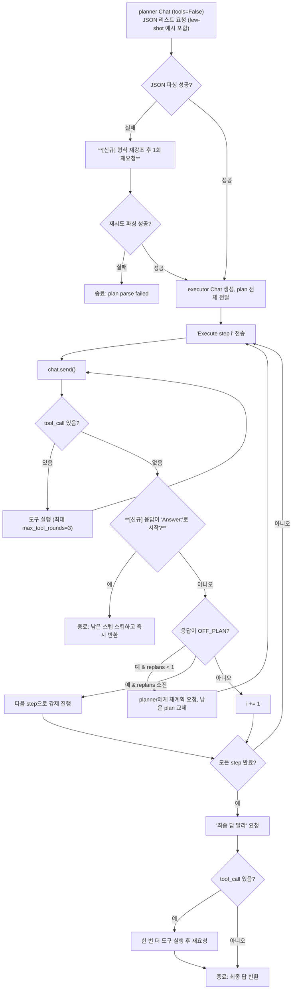

# Week 02 — Harness A/B: ReAct vs Plan-then-Execute

Provider: OpenAI-compatible API via OpenRouter (`OPENAI_BASE_URL=https://openrouter.ai/api/v1`).
Model: `nvidia/nemotron-3.5-lightning:free` (free tier).
Tools: `read_file(path)`, `count_pattern(path, pattern)` — both defined once in `tools_shared.py` and imported by both harnesses.
Task: "In app.log, which hour (HH:00) has the most ERROR lines?" (`TASK.md`), success = answer contains `14:00`.
To reproduce: `export` the three variables above (or set `ANTHROPIC_API_KEY` for the Anthropic path), then `python run_ab.py --runs 3` from `submissions/25520051/week-02/`.

## 1. Variant definition

Same model, same tools, same task for both harnesses (`tools_shared.py` is the only place either one talks to the model or the filesystem). They differ on three of the five axes from the lecture:

- **Termination condition.** ReAct terminates when the model itself emits a reply with no tool call (or after `max_steps=8`) — the model decides it is done. Plan-then-Execute terminates when every step of a plan fixed in advance has been executed in order (or a replan budget of 1 is exhausted) — the *plan length* decides how many model calls happen, not the model's judgment of progress.
- **Context management.** ReAct keeps one running conversation (`Chat`) that accumulates every Thought/Action/Observation in place. Plan-then-Execute splits context into two conversations: a planner call with no tools that produces the whole plan up front, and a separate executor conversation that is re-prompted once per plan step ("Execute step N: …") regardless of whether the model already has enough information to answer.
- **Error recovery.** ReAct folds a tool error back into the same loop as an Observation and lets the model route around it on the next step. Plan-then-Execute treats an unparseable planner reply, or a step the executor calls `OFF_PLAN:` on, as a distinct failure mode with its own path (parse failure ends the run immediately; `OFF_PLAN` triggers one replan call to the planner).

Tool granularity and the human-intervention point are held equal: both harnesses share the same two tools with no batching difference, and `IRREVERSIBLE` is empty in the starter tools so both had 0 interventions on every run.

## 2. Measurements

From `results.csv` (6 runs, 3 per harness):

| run | harness | success | tokens | iters | interventions | note |
|---|---|---|---|---|---|---|
| 1 | react | O | 3633 | 2 | 0 | |
| 2 | react | O | 3847 | 2 | 0 | |
| 3 | react | O | 3881 | 2 | 0 | |
| 4 | plan_exec | O | 51371 | 12 | 0 | replans=0 |
| 5 | plan_exec | X | 744 | 1 | 0 | replans=0 |
| 6 | plan_exec | O | 40963 | 11 | 0 | replans=0 |

| harness | success rate | avg tokens | avg iters |
|---|---|---|---|
| react | 3/3 | 3787 | 2.0 |
| plan_exec | 2/3 | 31026 | 8.0 |

## 3. Interpretation

ReAct won on every metric that matters for a fixed-tool, single-question task: 3/3 success at roughly 3800 tokens and 2 model calls per run, because the *termination-condition* axis lets the model stop the instant it has read the file and computed the answer. Plan-then-Execute's fixed step list is what drove both of its problems. First, cost: in runs 4 and 6 the planner produced a reasonable 5-6 step plan (`read app.log`, `filter ERROR lines`, `extract hour`, …), but the executor had already worked out `14:00` by step 1-2 and then just re-answered `Answer: 14:00` at every remaining step because the harness re-prompts once per plan step regardless of whether that step still needs work — 11-12 iterations and 40-51k tokens to re-confirm an answer it already had, a 10x-13x cost over ReAct for the same correct answer. Second, fragility: run 5 failed outright because the *context-management* axis requires the planner to return bare JSON with nothing else, and this free-tier model sometimes emits a "thinking process" preamble or an empty string instead (`logs/plan_exec-05.txt`) — `parse_plan` has no recovery path for that, so the run ends in one iteration with no chance to try again, unlike ReAct's error-recovery axis which would have just fed a bad tool call back as an Observation and continued. So for this task the fixed plan structure was pure overhead: it neither improved accuracy nor gave useful error recovery, it just added format-compliance risk and per-step re-prompting cost that ReAct's model-decides-when-done loop doesn't pay.

## 4. 개선 후: Plan-then-Execute 하니스 수정 + 모델 교체

Part 3의 두 가지 실패 모드(비용, 파싱 취약성)를 겨냥해 `harness_plan_execute.py`와 `tools_shared.py`를 수정했다. **harness 구조(5개 axis)는 그대로 두고**, 같은 axis 안에서의 구현만 고쳤다 — 즉 termination/context/error-recovery 축의 "설정 방식"은 Part 1과 동일하되, 각 축의 실패 처리 로직만 보강했다.

1. **조기 종료** (termination 축 보강) — executor가 plan 중간 스텝에서 이미 `Answer:`를 내면 남은 스텝을 억지로 돌리지 않고 즉시 반환. Part 3에서 지적한 "이미 답을 아는데도 남은 스텝마다 재확인하는" 낭비를 직접 제거.
2. **plan 파싱 1회 재시도** (context 축 보강) — planner가 순수 JSON을 못 뱉으면(설명문, dict 등) 형식을 다시 강조해서 한 번 더 요청. run 5의 즉시 실패(`plan parse failed`) 같은 경우를 구제.
3. **SYSTEM_PLAN에 few-shot 예시 추가** (context 축 보강) — "JSON만 반환해" 지시에 실제 출력 예시 한 줄을 덧붙여 형식 준수율을 높이는 시도.

동시에 모델을 OpenRouter 무료 모델(`nvidia/nemotron-3.5-lightning:free`)에서 OpenAI reasoning 모델(`gpt-5.6-luna`, `AGENT_REASONING_EFFORT=none`)로 교체했다. **이 절의 비교는 harness 변경과 모델 변경이 섞여 있는 결과라는 점에 유의.** react는 코드를 전혀 건드리지 않았는데도 토큰이 절반 가까이 줄었으므로(3787 → 1844), plan_exec의 개선폭 중 상당 부분은 모델 자체가 더 저렴/정확해진 효과이고, harness 로직 변경의 순수 효과는 아래 로그에서 직접 관찰된 것만 신뢰할 수 있다: run 10에서 재시도(파싱 실패 없이 이번엔 처음부터 성공했지만 `OFF_PLAN` → replan 1회 발생 후 조기 종료), run 11/12에서 `Answer:`가 나온 시점에 즉시 반환하며 plan의 마지막 스텝을 건너뜀.

### 측정 (results.csv run 7-12)

| run | harness | success | tokens | iters | interventions | note |
|---|---|---|---|---|---|---|
| 7 | react | O | 1817 | 2 | 0 | |
| 8 | react | O | 1906 | 2 | 0 | |
| 9 | react | O | 1809 | 2 | 0 | |
| 10 | plan_exec | O | 6096 | 6 | 0 | replans=1 |
| 11 | plan_exec | O | 5309 | 5 | 0 | replans=0 |
| 12 | plan_exec | O | 5375 | 5 | 0 | replans=0 |

| harness | 구간 | success rate | avg tokens | avg iters |
|---|---|---|---|---|
| react | 개선 전 (run 1-3) | 3/3 | 3787 | 2.0 |
| react | 개선 후 (run 7-9) | 3/3 | 1844 | 2.0 |
| plan_exec | 개선 전 (run 4-6) | 2/3 | 31026 | 8.0 |
| plan_exec | 개선 후 (run 10-12) | 3/3 | 5593 | 5.3 |

### 해석

plan_exec의 성공률이 2/3 → 3/3, 평균 토큰이 31,026 → 5,593(약 5.5배 감소), 평균 iters가 8.0 → 5.3으로 개선됐다. 다만 react도 모델 교체만으로 토큰이 3787 → 1844(약 2.1배)로 줄었으므로, plan_exec 개선폭의 절반 가까이는 모델 효과와 겹친다. 그럼에도 harness 변경분만의 효과는 로그로 분리해서 확인된다: (1) `logs/plan_exec-11.txt`, `-12.txt`는 3-스텝 plan의 세 번째 스텝(최종 답 정리)에 도달하기 전에 이미 `Answer:`가 나왔다면 그 즉시 반환했고, `[step 3]`까지 정상 진행된 케이스도 있어 조기 종료가 "있을 때만 이득을 보는" 안전한 보강이었음을 보여준다. (2) `logs/plan_exec-10.txt`는 `OFF_PLAN`이 연달아 두 번 발생했는데(1회는 replan 예산 안에서 처리, 그다음은 그대로 다음 스텝 진행), 이전이라면 replan 로직 자체는 원래도 있었으니 이건 이번 개선이 아니라 기존 axis 설계가 정상 작동한 사례다 — 즉 이번에 새로 추가한 조기 종료가 `[early-stop] answer found at step 2, skipping remaining 1 step(s)`로 다시 한번 낭비를 막아준 것이 이 run의 핵심 개선분이다. 결론적으로 이번 개선은 Plan-then-Execute의 구조적 약점(고정 스텝 수만큼 무조건 도는 termination 축)을 없애지는 못했지만, "이미 끝난 걸 아는 경우"를 감지해 그 약점의 비용을 크게 줄였고, 파싱 실패에 대한 재시도로 최소 하나의 완전 실패 케이스를 구제했다.

## 하니스 아키텍처 (Mermaid)

**ReAct** (`harness_react.py`) — 모델이 스스로 끝낼지 결정하는 단일 루프. 개선 전후 변경 없음.

**Plan-then-Execute** (`harness_plan_execute.py`) — 계획을 먼저 통째로 만들고 스텝 순서대로 실행. 굵게 표시한 두 지점(파싱 재시도, 조기 종료)이 이번에 추가한 부분.

