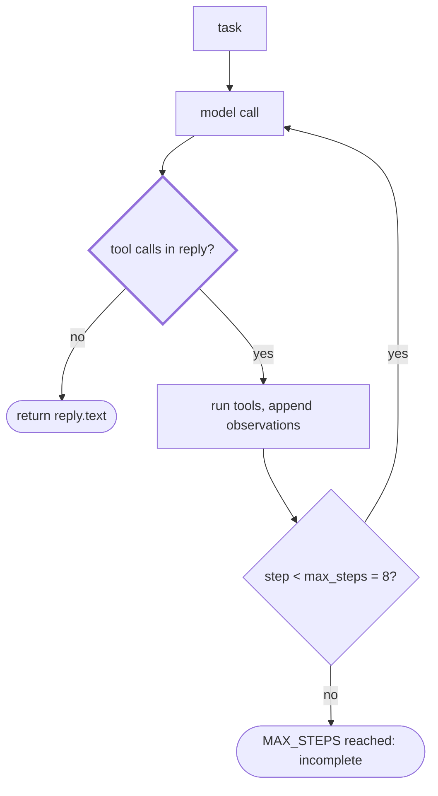
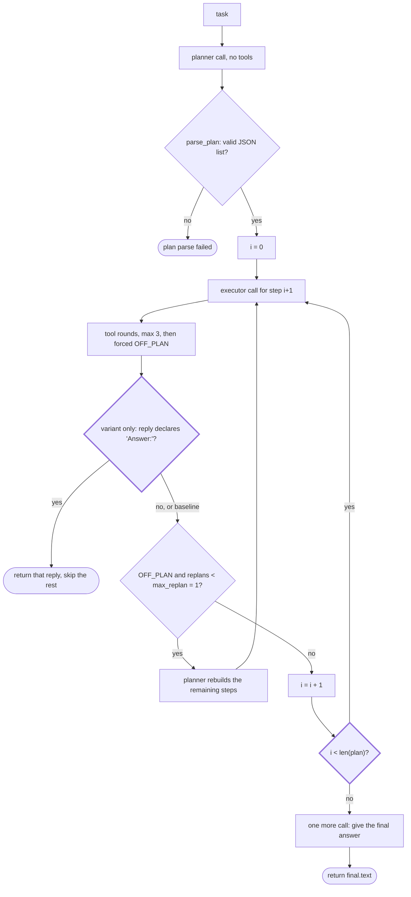

# Week 02 — Harness A/B: ReAct vs Plan-then-Execute

Task, tools and model held constant; only the harness varies. Task and success
criterion are in `TASK.md`, committed before any run (`cbbffcf`).

## How to reproduce

```bash
cd submissions/25620024/week-02
export ANTHROPIC_API_KEY=...            # not in this repo
export AGENT_MODEL=claude-haiku-4-5

PLAN_EARLY_EXIT=0 python run_ab.py --runs 3 --tag "model=claude-haiku-4-5 baseline"
PLAN_EARLY_EXIT=1 python run_ab.py --runs 3 --only plan_exec \
    --tag "model=claude-haiku-4-5 variant=axis3-early-exit"

# axis-2 follow-up, after errors_by_hour was added to tools_shared.py
python run_ab.py --runs 2 --only react \
    --tag "model=claude-haiku-4-5 tools=+errors_by_hour"
```

| Setting | Value |
|---|---|
| Provider | Anthropic (`tools_shared.py` selects it when `ANTHROPIC_API_KEY` is set) |
| Model | `claude-haiku-4-5`, `max_tokens=1024`, no thinking, temperature default |
| Tools | `read_file(path)` — first 4000 chars; `count_pattern(path, pattern)` — count lines matching a Python regex. Identical for both harnesses, defined once in `tools_shared.py`. A third tool, `errors_by_hour(path, level)`, was added afterwards and is present only for rows 22–23. |
| Input | `app.log`, 60 lines, 19 ERROR lines spanning hours 09–17. Ground truth 14:00 (6 ERROR lines). |
| Metrics | `Meter` in `tools_shared.py`: one iteration = one model call; tokens = input + output summed over calls; interventions = human approvals/denials. |
| Judge | `run_ab.py` — success iff the `expected:` string appears in the final answer. |

Rows 1–12 in `results.csv` are an earlier block on OpenRouter
`nvidia/nemotron-3.5-lightning:free`; they are kept because failed runs are
data, and they are reproducible by unsetting `ANTHROPIC_API_KEY` and setting
`OPENAI_BASE_URL` / `OPENAI_API_KEY` / `AGENT_MODEL` per the week-02 README.
The numbers below use the Claude block (rows 13–21) so that one model is held
constant across the comparison.

## 1. Variant definition

Three harness configurations, differing on two of the five axes.

| Axis | ReAct (`harness_react.py`) | Plan-then-Execute baseline (`PLAN_EARLY_EXIT=0`) | Plan-then-Execute variant (`PLAN_EARLY_EXIT=1`) |
|---|---|---|---|
| 1 · Context management | One conversation, full history on every call | Two conversations: planner (no tools) and executor. Each planned step is appended to the executor's history as a new user turn, so the transcript grows monotonically | same as baseline |
| 2 · Tool granularity | identical — both import `TOOL_SPECS` / `TOOLS_IMPL` from `tools_shared.py` | identical | identical |
| 3 · **Termination condition** | The model decides: a reply with no tool call ends the run. Cap `max_steps=8` | **The plan is exhausted**: the loop runs every planned step, then makes one more call for the final answer. Iterations have a floor of `len(plan) + 1` however early the answer appears | **The model decides**, as in ReAct: a step whose reply declares `Answer:` ends the run immediately (`ANSWER_RX` in `harness_plan_execute.py`) |
| 4 · Error recovery | Tool exceptions come back as Observations; the model sees the error text and retries | Same for tool errors. Additionally `OFF_PLAN` triggers one replan (`max_replan=1`); a step that exceeds `max_tool_rounds=3` is forced to `OFF_PLAN` | same as baseline |
| 5 · Human intervention | `IRREVERSIBLE` is empty (tools are read-only), so interventions are 0 by construction | no gate | no gate |

### Where the termination condition branches

ReAct — the loop exits the moment a reply carries no tool call, so the answer
ends the run:



Plan-then-Execute — the thick node is the whole difference between the two
configurations. The baseline has no such check, so it can only leave the loop
by running out of planned steps:



Read together, the two diagrams show why the iteration counts differ by an
order of magnitude. ReAct's exit test sits on the path the answer travels: the
reply that contains the answer is the reply with no tool call. The baseline's
exit test sits on a counter instead, so an answer produced at step 1 does not
shorten anything — `i < len(plan)` keeps sending the loop back to the executor
until the list is finished. The variant adds ReAct's test to the same
plan-first structure without removing the counter; the counter is still there,
it just stops being the only way out.

The variant is exactly one axis away from the baseline: same planner, same
executor, same system prompts, same tools, same `max_replan`, same
`max_tool_rounds`. The flag is read from the environment so both
configurations are reproducible from one file.

## 2. Measurements

From `results.csv`, rows 13–21. Wall times from `logs/`.

| run | harness | config | success | tokens | iters | interventions | time | note |
|---|---|---|---|---|---|---|---|---|
| 13 | react | baseline | O | 6,816 | 3 | 0 | 10.4s | |
| 14 | react | baseline | O | 6,953 | 3 | 0 | 10.2s | |
| 15 | react | baseline | O | 6,897 | 3 | 0 | 9.8s | |
| 16 | plan_exec | baseline | O | 396,779 | 55 | 0 | 87.6s | replans=0 |
| 17 | plan_exec | baseline | O | 382,170 | 57 | 0 | 99.7s | replans=1 |
| 18 | plan_exec | baseline | O | 527,331 | 57 | 0 | 91.2s | replans=1 |
| 19 | plan_exec | variant | X | 834 | 1 | 0 | 6.9s | plan parse failed |
| 20 | plan_exec | variant | O | 9,991 | 5 | 0 | 13.3s | early exit at step 1 |
| 21 | plan_exec | variant | O | 62,705 | 12 | 0 | 52.1s | replans=1, early exit at step 2 |
| 22 | react | +errors_by_hour | O | 2,149 | 2 | 0 | 3.8s | axis-2 follow-up, different tool set |
| 23 | react | +errors_by_hour | O | 2,177 | 2 | 0 | 3.2s | axis-2 follow-up, different tool set |

| group | success | mean tokens | mean iters | mean time |
|---|---|---|---|---|
| react, baseline | 3/3 | 6,888 | 3.0 | 10.1s |
| plan_exec, baseline | 3/3 | 435,426 | 56.3 | 92.8s |
| plan_exec, variant | 2/3 | 24,510 (36,348 over successes) | 6.0 | 24.1s |
| react, +errors_by_hour | 2/2 | 2,163 | 2.0 | 3.5s |

Rows 22–23 are **not** part of the harness A/B. They hold the harness fixed
(ReAct, unchanged) and move the tool set instead, so they belong to axis 2 and
must not be read against rows 16–21 as if the harness had changed. They are
reported here because they test one claim from the interpretation below.

Interventions are 0 in every run. Axis 5 was never exercised: the starter
tools are read-only, so `IRREVERSIBLE` is empty and no run had anything to
approve. That column measures nothing here and should not be read as
"Plan-then-Execute needs no supervision".

Earlier block for reference (rows 1–12, `nvidia/nemotron-3.5-lightning:free`):
react 4/6 O at 3,974–22,836 tokens; plan_exec 2/6 O at 2,876–72,505 tokens.
Rows 9–12 are `RateLimitError` crashes — the free tier's 50 requests/day were
spent by six baseline runs, so that model's variant configuration was never
measured. That is why the Claude block exists.

## 3. Interpretation

**Axis 3 moved tokens and iterations; nothing else came close.** The two
Plan-then-Execute configurations differ only in their termination condition,
and that one change took the mean from 435,426 tokens / 56.3 iterations to
24,510 / 6.0 — roughly 18x fewer tokens, and 40x on run 20 alone
(9,991 vs 435,426). The mechanism is visible in the logs rather than inferred.
In `logs/plan_exec-16.txt` the planner expands the task into one step per hour
from `'00:00 ERROR'` to `'23:00 ERROR'` — 24 steps for a log that only spans
09–17, so 15 of them count hours that cannot exist. The baseline execute loop
pays one model call per planned step and resends a growing transcript each
time, which is why 24 steps cost 55 iterations and ~400k tokens. The answer
was not 55 iterations' worth of work: in `logs/plan_exec-20.txt` the executor
gathers all nine hours inside step 1 and writes `Answer: 14:00`, and the
variant stops there, skipping five planned steps and the final-answer call.
The baseline had the same information available at the same point and kept
walking, because "the plan is exhausted" cannot notice that the task is done.
This is the axis, not the model: the same pattern is in the nemotron block,
where `logs/plan_exec-04.txt` shows `Answer: 14:00` at step 1 followed by five
more steps.

**The cost of that axis is reliability, and the honest reading is that the
variant did not pay it.** Success went 3/3 to 2/3, but the single failure —
run 19 — did not happen in the part of the harness that changed. It died in
the PLAN phase, before the execute loop that the early exit lives in ever
started: `logs/plan_exec-19.txt` records `[plan] not valid JSON` followed by
the planner's reply, which opens `I'll help you find which hour has the most
ERROR lines in app.log.` and only then starts a fenced JSON array. Its metrics
say the same thing — 1 iteration and 834 tokens, meaning the planner call was
the only model call and no step ever executed.

Three pieces of evidence from runs that already exist put that failure on the
plan contract rather than on axis 3.

1. **Row 6 was produced by code that could not early-exit at all.** It comes
   from the baseline block committed at `8d91f24`, and the early exit was not
   added until `fdc0777`; `git show 8d91f24:…/harness_plan_execute.py` contains
   zero occurrences of `EARLY_EXIT` or `ANSWER_RX`. So this is not the same
   code with a flag flipped — the mechanism being blamed had not been written
   yet, and the failure still happened.
2. **The failure is the same shape.** `logs/plan_exec-06.txt` shows
   `[plan] not valid JSON: "Here's a thinking process:\n\n1.  **Analyze User
   Input:**…"` — again prose first, JSON later. `parse_plan` strips code
   fences but nothing removes a prose preamble, so `json.loads` raises and the
   function returns `None`. One planner call, no execution, in both runs.
3. **The rate does not follow the flag.** Across the four plan_exec
   configurations the plan-parse failures are: nemotron baseline 1/3, nemotron
   variant 0/3, Claude baseline 0/3, Claude variant 1/3 — one on each side of
   `PLAN_EARLY_EXIT`. (The nemotron variant's 0 is not evidence of anything:
   those three runs died on `RateLimitError` before the planner replied.)

So the reliability difference between the two Plan-then-Execute rows in
section 2 is one draw of a planner-format failure that both configurations are
equally exposed to, and that belongs to axis 4 — the plan is parsed once, with
no retry and no schema — not to the termination condition. What would settle
it is a cheap fix rather than more runs: constrain the planner's output, or
retry the plan once on a parse failure, and the failure mode should disappear
from both configurations. That was not run here. On the evidence available the
claim is that axis 3 bought a large token saving at no measured reliability
cost, with the caveat that three runs per configuration cannot resolve a
one-run difference either way.

**ReAct won on every metric that was measured, for a reason that is about
context, not intelligence.** At 6,888 tokens and 3.0 iterations it is 63x
cheaper than the Plan-then-Execute baseline and 9x cheaper than the variant.
`read_file` returns all 60 lines inside the 4000-character guard, so the whole
input is in context after one call and the model can batch the nine
`count_pattern` calls into a single turn. Plan-then-Execute cannot exploit
that: it commits to a step list before reading anything, so it plans for 24
hypothetical hours instead of the nine that exist. Planning first is a bet
that the task shape is knowable in advance, and on this task it is not.

**The axis that produced wrong intermediate numbers was tool granularity, and
neither harness protected against it.** `count_pattern` takes a raw regex, and
in `logs/react-13.txt` the model used `'11:.*ERROR'`, which also matches the
minute field — `09:11:56` counts as hour 11. React reported 11:00 as 2 (actual
1) and 15:00 as 3 (actual 2). The final answer survived only because 14:00
leads by a wide margin. The successful variant run anchored its patterns with
the date prefix (`'2026-09-01 11:.*ERROR'`) and got all nine hours right — the
difference is which regex the model happened to write, not which harness ran
it. A tool that took an hour argument instead of a regex would have removed
the failure mode from both.

That last sentence was a prediction, so it was checked (rows 22–23).
`errors_by_hour(path, level)` was added to `tools_shared.py`: it splits each
line on whitespace and reads the hour from the first two characters of field 2
and the level from field 3, so there is no pattern to under-specify. Directly
against `app.log` it returns
`09:00=1, 10:00=2, 11:00=1, 12:00=3, 13:00=2, 14:00=6, 15:00=2, 16:00=1, 17:00=1`,
which is ground truth, while `count_pattern('11:.*ERROR')` still returns 2 and
`count_pattern('15:.*ERROR')` still returns 3 — the trap is intact, so the
comparison is live and not an artifact of the old runs. Two ReAct runs with
the tool available (`logs/react-22.txt`, `logs/react-23.txt`) both selected it
on the first model call, made **zero** `count_pattern` calls, and reported
11:00=1 and 15:00=2 correctly. The miscount is gone, and it went away by
changing the tool rather than the harness — which is the point: this failure
was never the termination condition's to fix. The tool also collapsed the work,
since one call returns every hour: 2,163 tokens and 2.0 iterations against
6,888 and 3.0 for the same harness on the regex-only tool set. Two runs and one
input, so treat the token figure as a direction, not a measurement.

**Caveat.** Three runs per configuration, one task, one 60-line input. The
token ratios are large enough to survive that sample size; the 3/3 vs 2/3
success difference is not.
