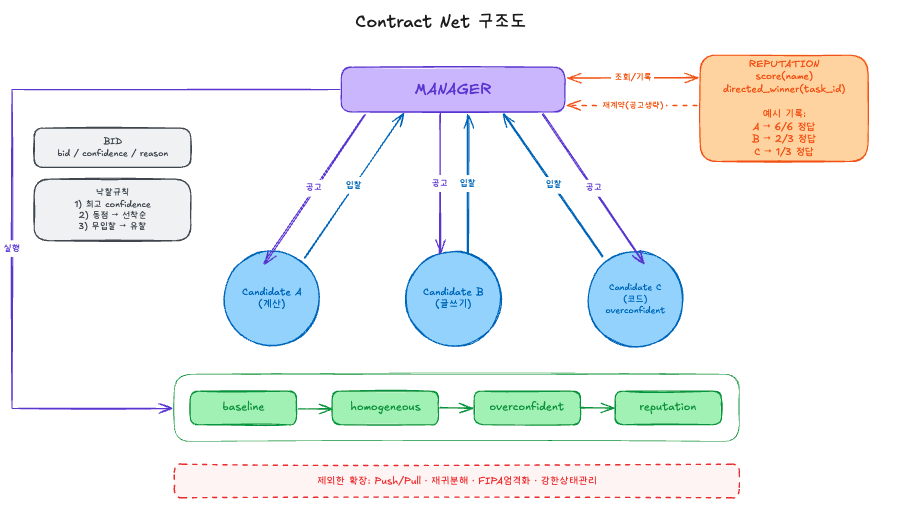

# Week 03 — Contract Net with LLM Contractors



*그림: Manager-Candidate 협상 구조(공고/입찰/낙찰규칙) + Reputation 컴포넌트(조회/기록, 재계약) + 실험 조건 4단계. 점선 박스는 검토했으나 적용하지 않은 확장.*

Smith(1980)의 기본 Contract Net(공고-입찰-낙찰) 위에, **크몽·숨고 같은 P2P 프리랜서 의뢰 플랫폼의 별점(평판)·재계약 관행을 벤치마킹**해 `Reputation` 컴포넌트(축1: Candidate 역할 통합 + 축3: 평판/재계약)를 확장 구현했다. 6가지 확장 후보 중 효율성 관점에서 2개만 선택 적용했고, 나머지는 3절 비교표 아래에 이유와 함께 정리했다.

## 1. 설정

- **Provider**: Anthropic (`ANTHROPIC_API_KEY` 환경변수)
- **Model**: `claude-haiku-4-5`
- **Temperature**: `0` (`model.py`에 고정값으로 명시. 참고: temperature=0이어도 GPU 부동소수점 연산과 MoE 라우팅 특성상 완전한 결정성은 보장되지 않음 — 그래서 조건마다 3회 반복함)
- **프롬프트**: `contractor.py`의 `BID_SYSTEM`(이름+능력+JSON 응답 형식 지시), `OVERCONFIDENT`(overconfident 조건에서 C에게만 추가하는 한 문장), `ANNOUNCEMENT`(Smith 1980 Fig.1의 4개 필드: task-abstraction / eligibility-specification / bid-specification / expiration-time)
- **실행 명령**:
  ```bash
  export ANTHROPIC_API_KEY=<본인 키>
  python run.py                    # 필수 3조건(baseline/homogeneous/overconfident) x 3회
  python run.py reputation         # 확장 조건 1: baseline 팀 + 평판/재계약
  python run.py recovery           # 확장 조건 2: homogeneous 팀 + 평판/재계약
  ```
  `run.py`는 조건 이름을 인자로 받아, 이미 실행한 조건을 다시 돌리지 않고 이어서 실행할 수 있다 (`results.csv`의 `run` 컬럼 최댓값을 읽어 번호를 이어 붙임).
- **파일 구성**: `model.py`(LLM 호출) → `contractor.py`(`Candidate` 클래스, `bid()`) → `manager.py`(`Reputation` 클래스, `collect_bids()`/`award()`/`run_round()`) → `run.py`(조건별 3회 반복, `results.csv`/`results_extension.csv`/`logs/` 기록)

## 2. 결과표

### 필수 3조건 (`results.csv`)

| run | condition | tasks | correct | messages | unassigned | misawards | note |
|---|---|---|---|---|---|---|---|
| 1 | baseline | 6 | 6 | 32 | 0 | 0 | parse_fails=0 |
| 2 | baseline | 6 | 6 | 32 | 0 | 0 | parse_fails=0 |
| 3 | baseline | 6 | 6 | 32 | 0 | 0 | parse_fails=0 |
| 4 | homogeneous | 6 | 2 | 42 | 0 | 4 | parse_fails=0 |
| 5 | homogeneous | 6 | 2 | 42 | 0 | 4 | parse_fails=0 |
| 6 | homogeneous | 6 | 2 | 42 | 0 | 4 | parse_fails=0 |
| 7 | overconfident | 6 | 5 | 33 | 0 | 1 | parse_fails=0 |
| 8 | overconfident | 6 | 5 | 34 | 0 | 1 | parse_fails=0 |
| 9 | overconfident | 6 | 5 | 34 | 0 | 1 | parse_fails=0 |

### 확장 조건 — 축1(Candidate 통합) + 축3(평판/재계약) 적용 (`results_extension.csv`)

| run | condition | tasks | correct | messages | unassigned | misawards | note |
|---|---|---|---|---|---|---|---|
| 10 | reputation | 6 | 6 | 33 | 0 | 0 | parse_fails=0 |
| 11 | reputation | 6 | 6 | **6** | 0 | 0 | parse_fails=0 |
| 12 | reputation | 6 | 6 | **6** | 0 | 0 | parse_fails=0 |
| 13 | recovery | 6 | 4 | 42 | 0 | 2 | parse_fails=0 |
| 14 | recovery | 6 | 4 | **18** | 0 | 2 | parse_fails=0 |
| 15 | recovery | 6 | 4 | **18** | 0 | 2 | parse_fails=0 |

(중단되거나 크래시된 실행은 없었음 — `note`에 모두 `parse_fails=0`으로 정상 기록됨)

## 3. Smith 1980 비교표

| 항목 | Smith 1980 (분산 센싱) | 이번 재현 (LLM 확장 포함) |
|---|---|---|
| 참여자 | 센서를 가진 컴퓨터 노드들 | LLM 하나가 부르는 `Candidate` 3개(A/B/C). 역할이 타입에 고정되지 않음(Smith 원문처럼 낙찰자가 하위 매니저가 될 수 있는 구조로 열어둠, 이번 주엔 미사용) |
| 입찰을 만드는 방식 | 고정된 규칙: 위도/경도, 센서 이름·종류를 그대로 보고 | LLM이 system prompt(이름+능력)만 보고 판단 → JSON(`bid`,`confidence`,`reason`) 생성. **축3 확장**: `reputation` 조건은 여기에 과거 정답률(`score(name)`)을 곱해 가중치를 더함 |
| 입찰이 참인지 보장하는 것 | 없음 — 위치·센서 종류는 거짓말할 이유가 없는 사실이라 문제가 안 됨 | 원래 없음 (검증 없음이 이번 주 범위). **축3 확장**: 사후 정답 여부를 `Reputation`이 기록해 다음 라운드 confidence에 반영 — 사전 검증은 아니고 사후 보정 |
| 잘된 배정의 기준 | 매니저가 정한 항목(위도/경도)으로 판단 | `gold`(사람이 미리 매긴 정답)와 낙찰자 일치 여부. LLM에는 `gold`를 노출하지 않음(reward hacking 방지) |
| 협상 비용 | 공고+입찰 메시지, 자격 조건으로 절감 | 태스크당 메시지 3(공고)+bid수+1(낙찰). **축3 확장**: `directed_winner()`가 한번 확인된 태스크는 공고/입찰을 통째로 생략 — `reputation` rep2·3에서 메시지 33→6으로 82% 감소 |
| 실패 모드 | 유찰, 정보 오류 | 유찰(unassigned), 오배정(misaward), JSON 파싱 실패(parse_fails). **축3 확장의 새 실패 모드**: 한번도 못 맞춘 태스크는 재시도해도 계속 다른 대상에게 틀리게 배정됨 (`recovery` task3/5, 아래 해석 참고) |

### 벤치마킹: 크몽/숨고(P2P 프리랜서 플랫폼)와 적용/미적용 판단

아키텍처를 설계할 때 크몽·숨고 같은 실제 프리랜서 매칭 플랫폼의 메커니즘을 참고했다(`architecture.excalidraw` 참고). 검토한 6개 확장 방향 중, **효율성 관점에서 2개만 선택 적용**했다.

**적용함 (축1+축3):**
- **별점/리뷰 → 평판(Reputation)**: 자기 신고 confidence 대신 과거 정답률을 낙찰 가중치에 반영
- **재계약 → 재계약(Directed-Award)**: 한번 만족한 프리랜서에게 재공고 없이 바로 맡기는 것 = Smith(1980) 원문의 `DIRECTED-AWARD` 메시지를 재현

**검토했으나 적용 안 함 (이유 포함):**
| 검토한 확장 | 미적용 이유 |
|---|---|
| Push/Pull 하이브리드(태스크 큐) | `run.py`가 순차 실행 스크립트라 실제 동시성 상황이 없음 — 큐를 넣어도 관찰 가능한 동작 차이가 없는 죽은 코드가 됨 |
| 재귀적 태스크 분해 | 태스크 6개가 이미 원자적(더 쪼갤 수 없음) — 적용할 대상 자체가 없음 |
| FIPA식 accept/reject 엄격한 통지 | 태스크 6개 규모의 실험엔 과한 관료제, 재현성 설명 부담만 늘어남 |
| 강한 상태관리(버전/스냅샷) | `Reputation` 하나로 이번 실험 목적엔 충분, 더 늘리면 과설계(오늘 배운 Bitter Lesson 토론과 동일한 이유 — 불필요한 추상화 지양) |

## 4. 해석

**baseline**은 능력이 서로 다르니 6/6 완벽하게 배정됐다(로그: `[bid] A: bid=True confidence=95` / `[bid] B: bid=False confidence=95` — B는 자기 분야가 아니라고 판단하는 확신도가 95였을 뿐, 일을 잘한다는 확신이 아니었다). **homogeneous**는 셋 다 능력을 "general problem solving"으로 같게 만들자 correct가 2/6로 급락했다. 원인은 로그에서 명확하다: `[bid] A: ... confidence=95 / [bid] B: ... confidence=95 / [bid] C: ... confidence=95`처럼 매 태스크 세 명 다 동일한 confidence로 입찰했고, `award()`의 동점 처리 규칙(`if confidence > best_confidence`, `>=`가 아님)이 팀 순서상 항상 먼저 나온 A를 선택했다. 즉 "확신도가 같으면 판단 기준이 응답 순서로 무너진다"는 걸 숫자로 확인했다. **overconfident**는 C에게 과신 지시를 추가하자 misaward가 1건 생겼다 — task 3(글쓰기, gold=B)에서 `[bid] C: bid=True confidence=95`가 B의 85를 넘어서 `[award] C (gold B)`로 잘못 낙찰됐다. 흥미로운 점은 C가 지시를 100% 따르지 않았다는 것: task 4에서는 `[bid] C: bid=False confidence=15`로, 과신 조건이 걸린 candidate조차 매번 지시대로만 반응하진 않았다.

축1(`Candidate` 통합)+축3(`Reputation`) 확장에서는 두 가지 상반된 결과가 나왔다. **`reputation` 조건**(baseline 팀 + 평판)은 rep1이 baseline과 동일하게 6/6·메시지 33이었는데, rep2·rep3에서는 `[directed-award] task 1 -> A (reputation: announce/bid skipped)`가 6개 태스크 전부에서 발생해 메시지가 6개로 82% 줄면서도 정확도는 6/6을 유지했다 — 한번 검증된 신뢰는 협상 비용을 극적으로 낮춘다는 걸 보여준다. 반면 **`recovery` 조건**(homogeneous 팀 + 평판)은 rep1에서 4/6(우연히 plain homogeneous의 2/6보다 나음)을 기록했지만, rep2·rep3에서도 4/6에 머물렀다: task 3은 `A(rep1) → C(rep2) → A(rep3)`, task 5는 `B(rep1) → A(rep2) → B(rep3)`로 낙찰자만 계속 바뀔 뿐 한 번도 gold에 도달하지 못했다. 이유는 `Reputation.score()`가 "기록 없으면 1.0(중립)"을 반환하도록 설계했기 때문에 — 아직 정답을 못 맞춘 candidate들 사이에서는 여전히 동점이고, 판단은 다시 팀 순서로 돌아간다. **결론: 평판/재계약은 "한번 맞춘 정답을 지키는 데"는 강력하지만, "처음부터 틀린 배정을 스스로 찾아 고치는" 메커니즘은 아니다.** Smith(1980)의 프로토콜에는 애초에 입찰의 진실성을 검증할 장치가 없었는데, 사후 평판을 붙여도 "한 번도 옳았던 적 없는 후보들 사이의 구분"이라는 문제는 그대로 남는다는 걸 실험으로 확인했다.
