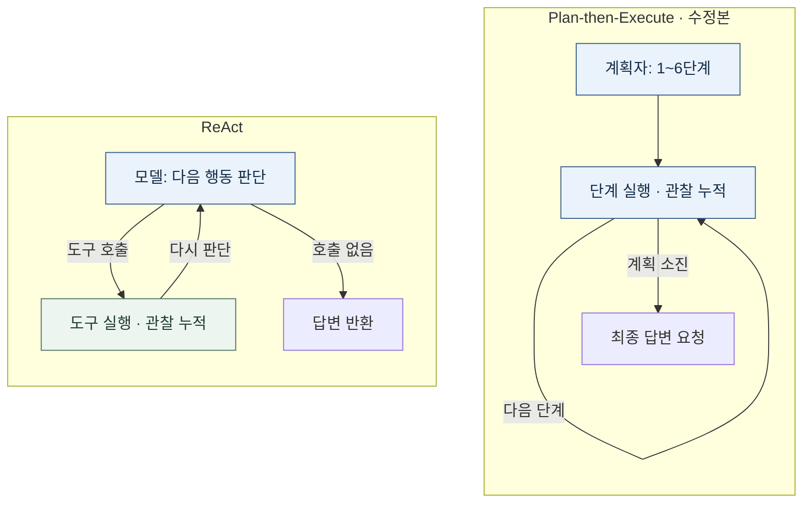

# 2주차 하네스 A/B 실험 보고서

성진호 · 25620027 · 2026-09-09 (실험: 9월 8일)

## 1. 변형 정의

모델 `gpt-5-mini`·입력·도구를 고정하고, 26단계 계획의 과잉 호출을 줄이도록 **관련 작업을 묶어 1~6단계로 계획**하게 했다. 완료 단계+남은 계획이 6을 넘거나 비면 실패로 종료한다(`bd4848f`, 추가 실행 전 커밋). [성공 기준](TASK.md)은 사전 고정한 `14:00` 포함 여부다.

*그림 1. 정상 흐름. 단계 안에서도 모델·도구를 호출한다. 빈·초과 계획은 거절하며 총 호출은 6회 상한이 아니다.*

| 설계 축 | ReAct | 수정 Plan-then-Execute |
|---|---|---|
| 컨텍스트 | 관찰 누적 후 다음 행동 판단 | 계획자·실행자 분리, 실행 기록 누적 |
| 도구 단위 | 파일 읽기·정규식 행 집계 | 같은 도구, 관련 집계를 한 단계로 묶음 |
| 종료 | 도구 호출 없음 또는 최대 8회 | 계획 길이 1~6, 소진 후 최종 답변 |
| 오류 복구 | 오류를 관찰로 반환 | OFF_PLAN 재계획 최대 1회, 빈·초과 계획 실패 |
| 사람 개입 | 승인 대상 공집합: 0회 | 승인 절차 없음: 0회 |

[공통 도구](tools_shared.py)는 `read_file(path)`, `count_pattern(path, pattern)`이며 인수는 필수 문자열이다. 실행은 `./run_lab.sh run --runs 3`. SDK 버전·상한·측정 조건·검증은 [SETUP](SETUP.md)·[RUN_INFO](RUN_INFO.md)에 기록했다.

## 2. 측정표

[CSV](results.csv) 전체 12회: **1–6 starter, 7–12 제한 도입 후**(ReAct는 그대로). tokens=입력+출력, iters=모델 호출, interventions=사람 개입. 빈 note는 `-`다.

| run | harness | success | tokens | iters | interventions | note |
|---:|---|:---:|---:|---:|---:|---|
| 1 | react | O | 7130 | 3 | 0 | - |
| 2 | react | O | 2891 | 2 | 0 | - |
| 3 | react | O | 2561 | 2 | 0 | - |
| 4 | plan_exec | O | 17632 | 9 | 0 | replans=0 |
| 5 | plan_exec | O | 26472 | 10 | 0 | replans=0 |
| 6 | plan_exec | O | 161116 | 53 | 0 | replans=0 |
| 7 | react | O | 3013 | 2 | 0 | - |
| 8 | react | O | 2833 | 2 | 0 | - |
| 9 | react | O | 5781 | 3 | 0 | - |
| 10 | plan_exec | O | 13957 | 6 | 0 | replans=0 |
| 11 | plan_exec | O | 24216 | 9 | 0 | replans=0 |
| 12 | plan_exec | O | 20220 | 8 | 0 | replans=0 |

평균 토큰(기존→후속): ReAct **4,194.0→3,875.7**, 계획형 **68,406.7→19,464.3**. 평균 호출은 **2.33→2.33 / 24.00→7.67**. 모두 성공, 개입·재계획 0회.

## 3. 해석

후속 비교도 ReAct가 적은 토큰·호출로 같은 정답을 냈다. 수정 계획은 3·5·4단계였다. 도구 25회가 동일한 [기존 실행 6](logs/plan_exec-06.txt)의 모델 53회와 [수정 11](logs/plan_exec-11.txt)·[12](logs/plan_exec-12.txt)의 9·8회는 단계 압축에 따른 재호출·누적 문맥 전달 감소를 보여준다. 다만 기존 평균은 실행 6의 영향이 크고, 실제 상한 거절이 없어 압축 지시와 하드 검사의 독립 효과를 분리할 수 없다. 실행 6의 잘못된 중간 집계도 최종 정답만으로 성공 처리됐다. 단일 태스크·조건별 3회·순차 실행이므로 일반적 우열은 단정하지 않는다.
