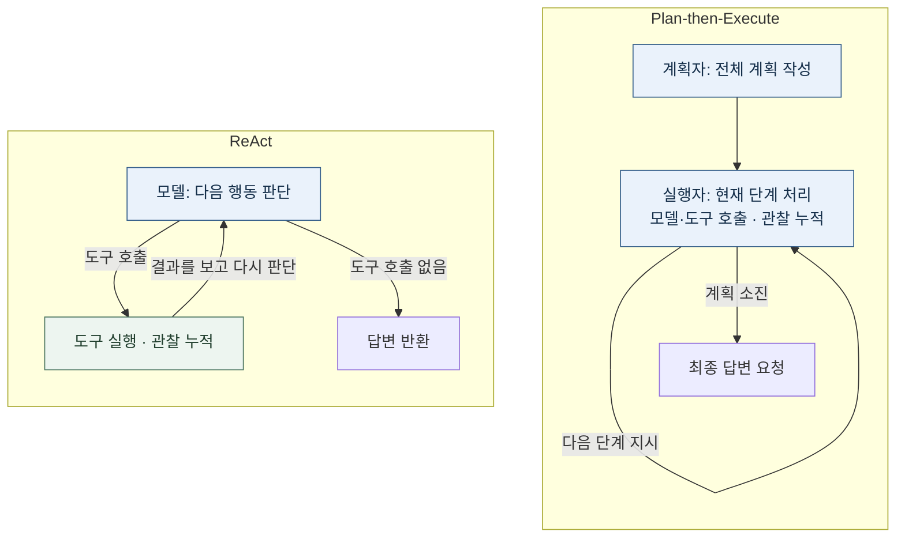

# 2주차 하네스 A/B 실험 보고서

성진호 · 25620027 · 2026-09-08

## 1. 변형 정의

OpenAI `gpt-5-mini`로 기준 `app.log`의 ERROR 최빈 시간대를 찾았다. 모델·입력·공통 도구를 고정하고 하네스만 바꿨다. 입력은 원본 그대로이며, 최종 답에 `14:00`이 포함되면 성공이라는 기준을 [TASK.md](TASK.md)에 적어 실행 전에 커밋했다(`04c6562`).

*그림 1. 정상 실행 흐름. ReAct는 관찰 후 다음 행동을 정하고, 계획형은 계획의 각 단계를 실행한다. 한도·복구는 아래 표 참조.*

| 설계 축 | ReAct | Plan-then-Execute |
|---|---|---|
| 컨텍스트 관리 | 한 대화에 관찰을 누적하며 다음 행동 판단 | 계획자·실행자 문맥 분리, 실행자는 계획·관찰 누적 |
| 도구 단위 | 파일 읽기·정규식 행 집계 | 같은 도구 사용; 계획 단계별로 실행 |
| 종료 조건 | 도구 호출 없는 응답 또는 최대 8회 | 계획 단계 소진 후 최종 응답; 계획 길이 상한 없음 |
| 오류 복구 | 도구 오류를 관찰로 돌려주고 다음 행동 판단 | 공통 오류 관찰, `OFF_PLAN`이면 최대 1회 재계획 |
| 사람 개입 | 승인 훅은 있으나 승인 대상은 공집합 | 승인 절차 없음; 이번 읽기 전용 실험은 둘 다 0회 |

공통 도구: `read_file(path: string)`, `count_pattern(path: string, pattern: string)`; 인수 모두 필수([스키마](tools_shared.py)). Python 3.12.11·openai 3.8.0·anthropic 1.4.0에서 `./run_lab.sh run --runs 3`으로 ReAct 3회 후 계획형 3회를 실행했다. 계획형 단계 내 도구 라운드는 3, 온도·시드·추론 강도는 미지정이다. [세팅](SETUP.md)·[실행 조건과 해시](RUN_INFO.md)를 함께 보존했다.

## 2. 측정표

[results.csv](results.csv) 전체 6회. `tokens`는 입력+출력 토큰, `iters`는 모델 호출, `interventions`는 사람 개입 횟수다. 빈 note는 `-`로 표시했다.

| run | harness | success | tokens | iters | interventions | note |
|---:|---|:---:|---:|---:|---:|---|
| 1 | react | O | 7130 | 3 | 0 | - |
| 2 | react | O | 2891 | 2 | 0 | - |
| 3 | react | O | 2561 | 2 | 0 | - |
| 4 | plan_exec | O | 17632 | 9 | 0 | replans=0 |
| 5 | plan_exec | O | 26472 | 10 | 0 | replans=0 |
| 6 | plan_exec | O | 161116 | 53 | 0 | replans=0 |

ReAct와 계획형의 평균 토큰은 각각 **4,194.0 / 68,406.7**, 토큰 표본표준편차는 **2,548.0 / 80,410.2**, 평균 모델 호출은 **2.33 / 24.00회**였다. 성공은 각각 3/3, 사람 개입은 모두 0회다.

## 3. 해석

이번 태스크에서 성공률·개입 횟수는 같았고 ReAct의 토큰·모델 호출이 적었다. [ReAct 실행 1](logs/react-01.txt)은 도구 25회를 모델 3회 호출로 처리했고, [계획형 실행 6](logs/plan_exec-06.txt)은 같은 도구 25회를 26단계로 나눠 모델 53회·161,116토큰을 썼다. 단계마다 누적 문맥을 재전달하는 구조와 계획 길이 상한이 없는 종료 설계가 토큰 증가를 설명한다. 실행 6이 계획형 평균을 크게 올렸다. 도구 스키마는 같으므로 도구 자체의 단위 차이는 아니다. 또한 실행 6의 `04:.*ERROR`는 `14:04:06 ERROR`도 잡아 중간 집계를 틀렸지만 최빈 시간대는 여전히 14시였다. 정답 문자열만 보는 판정이 과정 오류를 놓친 사례다. 재계획·개입은 없어 그 효과를 평가할 수 없다. 단일 태스크·각 3회이며 여러 축을 함께 바꿨으므로 일반적 우열이나 축별 독립 효과를 입증한 결과는 아니다.
