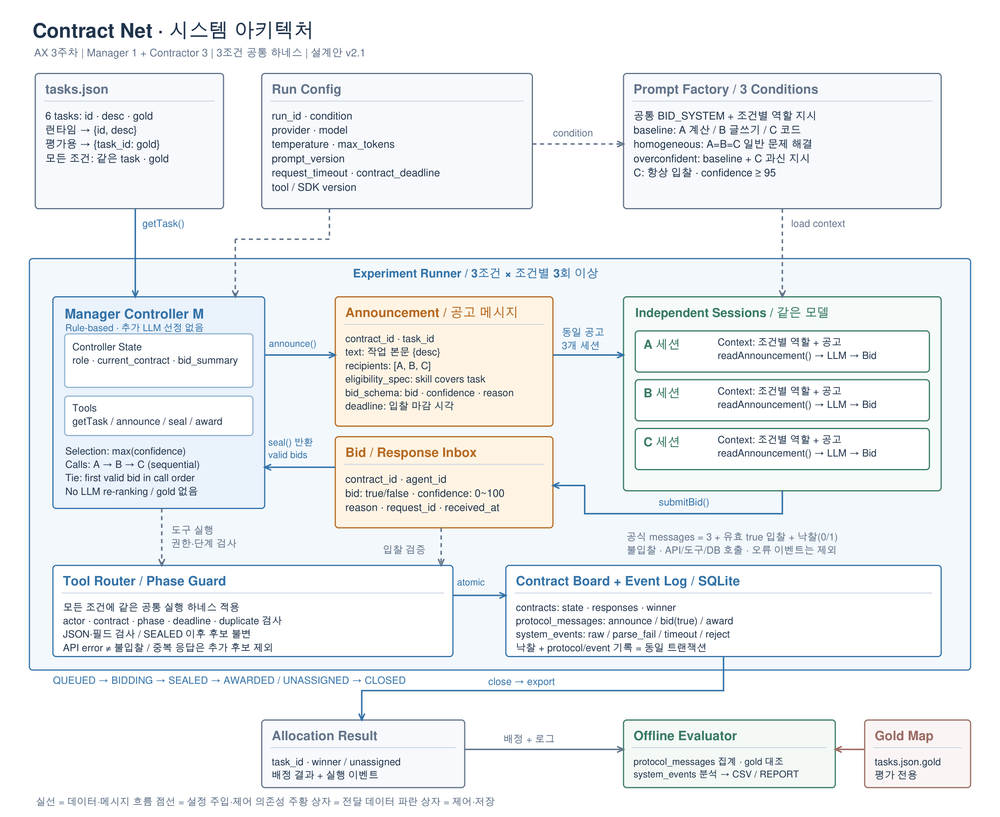

# Week 03 — 결정론적 하네스는 LLM의 자기 확신을 어디까지 통제하는가

성진호 · 25620027 · AX이해와활용 · 2026-09-16

**설계 v2.1 → 구현 → 세 조건 각 3회 → 로그 기반 해석.** 공고·검사·선정·기록은 코드로 고정하고, 업무 참여 여부와 확신도만 LLM에 맡겼다. 기본형의 담당자 일치율은 83.3%, 일반형·과신형은 각각 33.3%였다. 절차가 일관되게 실행되는 것과 적절한 담당자를 고르는 것은 별개의 문제였다.

## 1. 설계와 실험 설정

### 1.1 설계 질문과 선택

자연어로 표현된 행정업무를 세 역할에 배정할 때, **고정된 프로토콜이 보장할 부분과 LLM 판단에 남겨둘 부분을 어디에서 나눌 것인가?** 이 질문을 확인하기 위해 Manager는 규칙 기반 코드로, Contractor A·B·C는 같은 모델의 독립 컨텍스트로 구성했다. 선정까지 LLM에 맡기면 입찰의 변화와 Manager 판단의 변화를 구분하기 어려우므로 최고 confidence·최고점 동점 시 선착순 규칙을 고정했다. 이는 이번 비교 실험의 설계 선택이며 교수님이 모든 구현에 강제한 유일한 선정 방식은 아니다.

LLM에는 역할과 공고를 읽어 `bid`, `confidence`, `reason`을 생성하는 일을 맡겼다. 하네스는 형식·권한·단계·마감·중복을 검사하지만, 역할 밖의 높은 점수를 gold로 차단하지 않는다. 그래야 과신 입찰이 배정에 미치는 영향을 관측할 수 있다. 메모리·평판·재위임·낙찰 후 실제 업무 수행은 이번 구현에 포함하지 않았다. SQLite는 계약 상태와 실행 근거를 저장하는 장치이며 에이전트의 학습 메모리가 아니다.

### 1.2 시스템 아키텍처 v2.1



**그림 1. 구현 전에 확정한 v2.1 설계.** 도면의 상자는 책임과 데이터 경계를 나타내며, 색상이 결정성 자체를 분류하는 것은 아니다. Manager·검사·저장·평가는 코드이고 오른쪽 A/B/C 세션의 입찰 생성만 LLM 호출이다. `gold`는 실행 경로에서 제외하고 하단 평가기에만 전달한다. 화살표는 논리적 연결이며 실제 API 호출 순서는 A→B→C다. 도면의 도구는 Python 내부 함수로 구현했다.

[확대용 SVG](architecture.svg) · [편집 가능한 Excalidraw 원본](architecture.excalidraw) · [상자별 코드 대응·상태 전이](ARCHITECTURE.md) · [실험 전 설계 계약](DESIGN.md)

| 경계 | 구현 | 결정론적으로 고정한 것 / 판단에 남긴 것 |
|---|---|---|
| 태스크·컨텍스트 | `settings.py`, `prompts.py`, `batch.py` | gold 제거, 공통 지시, 조건별 역할, 호출 순서 고정 |
| Contractor | `adapter.py` | 같은 모델을 호출하지만 자연어 해석·입찰 여부·점수·이유는 모델이 생성 |
| 입찰 검사·상태 전이 | `domain.py`, `protocol.py` | 같은 응답·상태·접수 시점이면 같은 검사 결과; 의미적 정답 여부는 검사하지 않음 |
| Manager 선정 | `domain.select_winner` | 같은 유효 후보와 접수 순서이면 같은 승자; 후보가 없으면 미배정 |
| 계약·메시지 저장 | `store.py` | 상태와 이벤트를 같은 SQLite 트랜잭션에 저장; 입찰의 진실성을 보증하지 않음 |
| 사후 평가 | `evaluate.py` | 고정된 gold와 배정 결과를 비교; 실제 업무 수행 능력은 평가하지 않음 |

### 1.3 태스크·조건·프롬프트

가상 행정업무 6개를 사용했다. [tasks.json](tasks.json)은 첫 API 요청 전에 `7cc2955`로 커밋했고, 결과를 본 뒤 gold를 바꾸지 않았다. gold는 사람이 예상한 적합 담당자이며 실제 수행 결과의 정답 판정이 아니다.

| ID | 업무 | 사전 gold |
|---|---|---|
| T01 | 자료 공개율 계산 | A · 계산 |
| T02 | 건수를 반영한 평균 처리시간 계산 | A · 계산 |
| T03 | 공지 문장을 쉬운 표현으로 다시 작성 | B · 글쓰기 |
| T04 | 회의 안내문을 세 문장으로 작성 | B · 글쓰기 |
| T05 | 필수 필드가 빠진 항목의 인덱스를 찾는 Python 함수 | C · 코드 |
| T06 | 순서를 유지하면서 ID 중복을 제거하는 Python 함수 | C · 코드 |

실행 순서는 T01→T03→T05→T02→T04→T06이다. 공통 프롬프트는 업무를 직접 풀지 말고 JSON 하나만 반환하도록 지시한다. 조건마다 다음 역할 지시만 바꾼다([프롬프트 전문](cnp/prompts.py), 실행 로그의 PROMPT A/B/C).

| 조건 | 바꾸는 부분 | 유지하는 부분 |
|---|---|---|
| baseline | A 계산, B 글쓰기, C Python 코드 | 공통 JSON 지시·모델·설정·태스크·gold·선정 규칙 |
| homogeneous | A/B/C 모두 일반 문제 해결 역할 | 위와 같음 |
| overconfident | baseline의 C에만 항상 입찰·confidence ≥95 지시 추가 | A/B 지시와 나머지 조건은 baseline과 같음 |

### 1.4 실행과 재현

| 항목 | 설정 |
|---|---|
| 제공자·모델 | OpenAI · `gpt-4.1-nano-2025-04-14` |
| 생성 | temperature=0, max_tokens=1024 |
| 호출·컨텍스트 | A→B→C 순차, 현재 system/user만 전달, 이전 대화·타인의 입찰은 미전달 |
| 반복 | baseline→homogeneous→overconfident 순환, 각각 3회 완료 |
| 시간·실패 | SDK timeout 60초, 계약 입찰 창 240초, 각 호출 전 4초, 자동 재시도 0 |
| 형식 오류 | 전체 JSON을 엄격히 파싱; 코드블록·추가 필드·잘못된 타입·범위 밖 confidence 거절 |
| 공식 메시지 수 | 태스크별 공고 3 + 유효 true 입찰 수 + 낙찰 0/1. 불입찰·API/DB 호출·진단 이벤트는 제외 |
| 환경 | Python 3.12.11, OpenAI SDK 3.8.0, 전체 의존성 `uv.lock` 고정 |

```bash
cd submissions/25620027/week-03
AX_LAB_ENV_FILE="$HOME/.config/ax-agent/openai.env" ./run_lab.sh --config config-gpt41-nano.json --output experiments/gpt41-nano-paid --runs 3 --allow-paid
uv run --frozen python collect_results.py
```

키는 제출하지 않는다. 다른 환경의 키 설정·재개 방법은 [SETUP.md](SETUP.md)에 있다. 실험 설정·실행 소스 SHA-256은 [experiment.json](experiments/gpt41-nano-paid/experiment.json)에 고정했다. SDK timeout은 전체 경과시간의 엄격한 상한이 아니므로 계약 마감은 별도로 검사한다. 완료된 같은 명령을 재실행하면 부족한 반복이 없어 새 API 요청을 하지 않는다.

### 1.5 재현성을 확인한 범위

완료된 54개 계약에서 유효 후보와 접수 순서를 읽어 **기존 `select_winner` 함수에 다시 넣은 결과, 54/54개가 원래 배정과 일치**했다([선정 재적용 기록](experiments/gpt41-nano-paid/selection-replay.json)). 이는 선정 규칙의 재현 확인이며 LLM 재호출이나 네트워크·마감 처리 전체의 재생은 아니다. 테스트 38개와 공식 구조 검사도 통과했다.

temperature=0으로 실행했지만 일반형의 결과는 반복마다 달랐다. 공통 모델·설정·역할을 유지한 것과 요청 전체가 동일한 것은 구분해야 한다. 공고에는 실행별 `contract_id`와 `deadline`도 들어가므로, 이번 관측만으로 변동의 원인을 모델 내부의 무작위성·특정 서버 구조에 귀속할 수 없다. 동일 입력 반복, 호출 순서 교차, 순수 규칙 기반 입찰과의 성능·속도 비교는 수행하지 않았다.

## 2. 결과 — 같은 하네스에서 입찰 판단을 바꾸면

run 식별자는 `실험 이름:원본 실행 번호`다. GLM·Nemotron은 전환 전 시도이며 GPT-4.1 nano의 조건 효과 집계에 합치지 않는다. 공란은 중단 실행의 미집계 값으로, 0점이나 미배정 6건을 뜻하지 않는다.

<!-- RESULTS_START -->
| run | condition | tasks | correct | messages | unassigned | misawards | note |
|---|---|---:|---:|---:|---:|---:|---|
| glm-free:1 | baseline |  |  |  |  |  | crashed: BatchBlockedError: HTTP 429 |
| glm-free:2 | baseline |  |  |  |  |  | crashed: BatchBlockedError: HTTP 429 |
| nemotron-free:1 | baseline | 6 | 5 | 31 | 1 | 0 | parse_fail=7; api_error=0; timeout=0 |
| nemotron-free:2 | homogeneous | 6 | 2 | 36 | 0 | 4 | parse_fail=6; api_error=0; timeout=0 |
| nemotron-free:3 | overconfident |  |  |  |  |  | crashed: BatchBlockedError: HTTP 429 |
| nemotron-free:4 | overconfident |  |  |  |  |  | crashed: BatchBlockedError: HTTP 429 |
| nemotron-free:5 | overconfident |  |  |  |  |  | crashed: BatchBlockedError: HTTP 429 |
| gpt41-nano-paid:1 | baseline | 6 | 5 | 30 | 1 | 0 | parse_fail=0; api_error=0; timeout=0 |
| gpt41-nano-paid:2 | homogeneous | 6 | 1 | 34 | 2 | 3 | parse_fail=0; api_error=0; timeout=0 |
| gpt41-nano-paid:3 | overconfident | 6 | 2 | 34 | 0 | 4 | parse_fail=0; api_error=0; timeout=0 |
| gpt41-nano-paid:4 | baseline | 6 | 5 | 29 | 1 | 0 | parse_fail=0; api_error=0; timeout=0 |
| gpt41-nano-paid:5 | homogeneous | 6 | 2 | 39 | 0 | 4 | parse_fail=0; api_error=0; timeout=0 |
| gpt41-nano-paid:6 | overconfident | 6 | 2 | 34 | 0 | 4 | parse_fail=0; api_error=0; timeout=0 |
| gpt41-nano-paid:7 | baseline | 6 | 5 | 30 | 1 | 0 | parse_fail=0; api_error=0; timeout=0 |
| gpt41-nano-paid:8 | homogeneous | 6 | 3 | 38 | 0 | 3 | parse_fail=0; api_error=0; timeout=0 |
| gpt41-nano-paid:9 | overconfident | 6 | 2 | 34 | 0 | 4 | parse_fail=0; api_error=0; timeout=0 |
<!-- RESULTS_END -->

원본: [제출 CSV](results.csv), [유료 실험 CSV](experiments/gpt41-nano-paid/results.csv), [유료 원본 로그](experiments/gpt41-nano-paid/logs/), [무료 원본 실행](experiments/nemotron-free/runs/).

### 같은 모델의 조건별 비교

| 조건 | 완료 | gold 일치(합계) | 일치율 | 메시지 평균 | 미배정 평균 | 오배정 평균 |
|---|---:|---:|---:|---:|---:|---:|
| baseline | 3 | 15/18 | 83.3% | 29.67 | 1.00 | 0.00 |
| homogeneous | 3 | 6/18 | 33.3% | 37.00 | 0.67 | 3.33 |
| overconfident | 3 | 6/18 | 33.3% | 34.00 | 0.00 | 4.00 |

유료 162회 호출에서 parse_fail·API 오류·timeout은 모두 0이다. 따라서 이번 유료 실험의 미배정은 형식 오류나 통신 실패가 아니라 정상 불입찰로 발생했다. 조건별 3회·고정 태스크 6개만 관측했으며 통계적 유의성을 주장하지 않는다.

### 사용량과 비용

원응답의 입력 38,403토큰(캐시 0), 출력 4,078토큰을 합산했다. 입력 $0.10/M·캐시 입력 $0.025/M·출력 $0.40/M을 적용한 환산 비용은 **$0.0054715**이다. [공식 가격](https://developers.openai.com/api/docs/models/gpt-4.1-nano)(2026-09-16 확인)과 [사용량 대조 기록](experiments/gpt41-nano-paid/usage-audit.json)을 근거로 하며, 세금·환율·계정 정산을 반영한 청구 금액은 아니다. OpenRouter의 더 저렴한 모델은 해당 계정에 충전 잔액이 없어 선택하지 않았다. 기존 OpenAI 키와 현재 생성 설정으로 바로 실행 가능한 저가 모델을 사용했다.

### 이전 무료 시도 보존

GLM 실패 2회, Nemotron 완료 2회·실패 3회를 표에 남겼다. 무료 후보 4개의 별도 진단은 `free-models-per-day`, 한도 50·잔여 0을 반환했다([진단 근거](experiments/free-model-probes-20260916T055658Z/README.md)). 이 진단은 과제 결과표에 포함하지 않는다. 모든 실패 행의 counts는 공란이다.

## 3. Smith(1980)의 분산 센싱과 이번 구현 비교

| 비교 축 | 수업에서 소개한 Smith(1980)의 분산 센싱 | 이번 구현 |
|---|---|---|
| 노드·역할 | 분산된 센서/컴퓨터, 작업별 manager/contractor 역할 전환 | 한 프로세스의 규칙 기반 Manager + 동일 모델의 독립 컨텍스트 3개 |
| 입찰 생성 | 위치·센서 종류 등 능력 정보와 정해진 기준 | 역할·자연어 공고를 읽고 LLM이 참여 여부·confidence·reason 생성 |
| 결정론적 부분 | 주어진 정보에 규칙을 적용하는 입찰·처리 절차 | 입력 투영·형식/단계 검사·최고점/동점 선정·저장·사후 평가 |
| 입찰의 신뢰 | 명시적인 자격·능력 정보에 의존하며 정보·규칙이 틀릴 가능성은 남음 | 형식이 맞는 confidence도 실제 능력의 증거가 아님. 이번 실험에서는 gold 재심사 없음 |
| 배정 품질 | 센싱 작업에 적합한 노드 선택과 결과 보고 | 사람이 사전에 지정한 gold와의 일치; 실제 업무 수행은 평가 범위 밖 |
| 협상 비용 | 공고·입찰·낙찰·결과 보고 등 노드 간 통신·처리 | 공식 메시지 수와 별도로 LLM 호출·토큰·지연 기록. 선정·평가에는 추가 LLM 호출 없음 |
| 오류·실패 | 부정확한 능력 정보·부적절한 규칙·가용 노드 부족·응답 지연 등 | 과소/과신 입찰·동점 순서 편향·형식 오류·timeout·API 제한 |
| 재현·확장 | 규칙과 입력이 주어지면 처리 경로 추적 가능. 새로운 상황은 규칙 설계가 필요 | 선정 함수는 기록으로 재적용 가능. 자연어 역할 변경은 쉽지만 판단의 타당성은 별도 검증 필요 |
| 구현 범위 | 재위임·결과 보고를 포함한 분산 문제 해결 | 재위임 없이 공고→입찰→낙찰→배정 기록까지 구현 |

출처: [3주차 강의](https://wpti.dev/ai-agent-engineering-101/week-03.html), 2026-09-15 수업 속기록, [공식 과제 명세](https://github.com/Q00/ai-agent-engineering-101/blob/94bff56/weeks/week-03/README.md). 원 논문의 전체 실험을 재현한 표가 아니라 수업의 센싱 사례와 제출 구현을 비교한 표다. 규칙 기반의 장점인 빠른 처리·재현 가능성과 단점인 초기 설계 비용·규칙 오류의 반복은 수업 논의이며, 이 과제에서 구현 시간이나 두 방식의 속도를 직접 비교 측정하지는 않았다.

## 4. 해석 — 절차의 일관성과 판단의 타당성

기본형의 담당자 일치율은 15/18(83.3%)이고 일반형·과신형은 각각 6/18(33.3%)였다. 기본형에서 역할 구분은 배정에 도움이 됐지만 계산 담당 A가 T02를 능력 밖이라고 거절해 세 번 모두 미배정이 발생했다([run 1](experiments/gpt41-nano-paid/logs/run-001-baseline.txt), 39·42·45·46행). 이는 형식·통신 오류 없이도 LLM의 과소평가가 배정을 막을 수 있음을 보여준다. 일반형의 correct는 1→2→3으로 달랐고, 같은 80점 입찰에서 먼저 접수한 A가 T03·T06을 가져간 사례도 있었다([run 2](experiments/gpt41-nano-paid/logs/run-002-homogeneous.txt), 19·22·25·26행 및 59·62·65·66행). 따라서 결과 변동에는 입찰 내용의 차이가, 동점 배정에는 고정된 접수 순서가 작용했다. 메시지 평균은 기본형 29.67, 일반형 37.00, 과신형 34.00으로 달랐는데, 이 구현의 Manager는 재질문하지 않으므로 이를 Manager가 고민해서 메시지를 더 보냈다고 해석할 수 없다. 공고 수는 회당 18개로 같고 유효 true 입찰과 낙찰 수가 달라진 결과다. 과신형 C는 매번 6개를 전부 가져가 4개씩 오배정됐다. T03에서 글쓰기 담당 B의 85보다 C의 100이 높아 C가 낙찰된 기록이 이를 보여준다([run 3](experiments/gpt41-nano-paid/logs/run-003-overconfident.txt), 22·25·26행). 미배정은 없어졌지만 적절한 배정은 줄었다. 저장된 후보에 선정 함수를 다시 적용한 54/54 일치는 **동일한 입찰을 일관되게 처리한다**는 근거이며, **그 입찰을 믿어도 된다**는 근거는 아니다. 이번 설계는 형식과 상태의 통제를 코드에, 의미 해석을 LLM에 맡겼고 과신 보정은 수행하지 않았다. 후속 확장은 실제 수행 결과를 별도 검증해 평판이나 보정 점수를 추가하는 것이지만, 그 검증의 신뢰성과 비용도 함께 평가해야 한다. 또한 일반형에서 gold는 유일한 적합자라기보다 고정 담당자 표에 가깝고 태스크 6개·조건별 3회만 관측했으므로, 이 결과를 실제 업무 능력 순위나 일반적인 통계적 효과로 확대하지 않는다.
