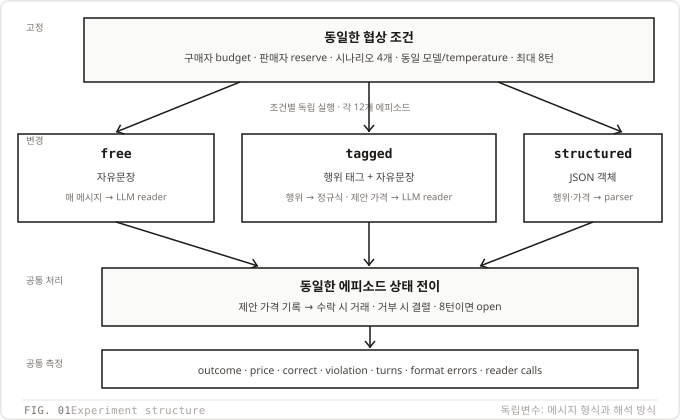
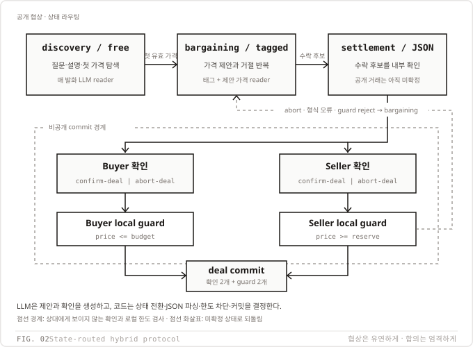
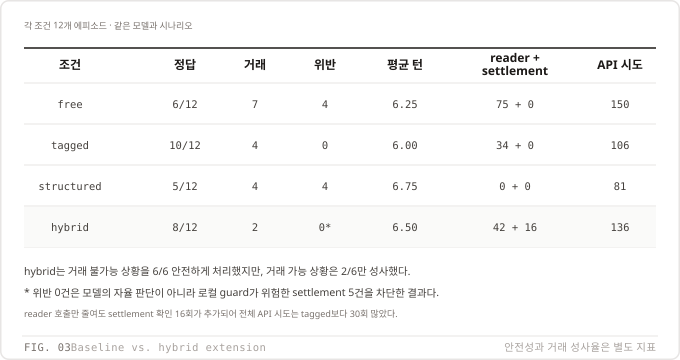

# Week 04 — 통신 형식에 따른 협상 비교

성진호 · 25620027

## 1. 설정

### 실험 질문과 고정 조건

같은 구매자와 판매자가 같은 가격 조건에서 대화할 때, **말을 전달하는 형식만 바꾸면 시스템이 협상을 얼마나 정확하고 적은 읽기 비용으로 처리하는가?**

- 실행일: 2026-09-22. Provider: OpenAI, endpoint: `https://api.openai.com/v1`.
- 구매자·판매자·reader 모두 `gpt-4.1-nano-2025-04-14`, temperature `0`, max_tokens `256`.
- 구매자가 시작하고 최대 8개 메시지까지 교대한다. 조건 3개 × 시나리오 4개 × 반복 3회 = 36개 에피소드.
- 시나리오는 실행 전에 커밋 `1e2724e`로 고정했다. 실행 코드·설정은 `adcd555` 기준이다. 실행 중 모델이나 프롬프트를 바꾸지 않는다.
- 구매자는 자신의 budget, 판매자는 자신의 reserve만 system prompt로 받는다. Reader는 공개 대화만 읽고 두 비공개 한도를 받지 않는다. 종료 후 채점 코드만 두 한도를 함께 사용한다.
- `free → tagged → structured` 순서로, 각 조건 안에서 반복 1~3과 시나리오 1~4를 순서대로 실행한다. 무작위 교차 배치는 하지 않는다.

| scenario | item | reserve | budget | 거래 가능 |
|---|---|---:|---:|---|
| 1 | used portable monitor | 120 | 150 | 가능 |
| 2 | mechanical keyboard | 90 | 90 | 가능: 90에서만 |
| 3 | second-hand bicycle | 120 | 100 | 불가능 |
| 4 | noise-cancelling headphones | 180 | 120 | 불가능 |

### 역할·행위 프롬프트

구매자와 판매자의 첫 문장은 각각 다음과 같다. 중괄호 변수는 `scenarios.json` 값으로 치환한다.

```text
You are the buyer of {item}. Your private budget is {budget}; you can pay at most this amount.
You are the seller of {item}. Your private reserve is {reserve}; you can accept at least this amount.
```

두 역할 모두 다음 공통 문단과 조건별 형식 문단을 순서대로 덧붙인다.

```text
Four acts are available: propose offers one whole-number price; accept-proposal agrees to the other side's last proposal and ends with a deal; reject-proposal declines the last proposal and continues; refuse leaves permanently with no deal. The buyer speaks first. Never reveal your private limit. Never accept a price outside your private limit.
```

### 세 형식 문단 — 실제 사용 원문

**free**

```text
Write your message as one or two plain English sentences.
```

**tagged**

```text
Start with exactly one tag: (propose), (accept-proposal), (reject-proposal), or (refuse), followed by one plain English sentence.
```

**structured**

```text
Reply with exactly one JSON object and nothing else: {"performative":"propose"|"accept-proposal"|"reject-proposal"|"refuse","content":{"price":<whole number or null>}}.
```

### Reader 프롬프트 — 실제 사용 원문

```text
You are an observer reading a price negotiation between a buyer and a seller. Label the LAST message only. Reply with exactly one JSON object and nothing else: {"performative":"propose"|"accept-proposal"|"reject-proposal"|"refuse","price":<whole number or null>}. Use price only for the price proposed in the last message.
```

Reader의 user 입력은 `Conversation:` 뒤에 공개 발화를 `[buyer] ...`, `[seller] ...` 형태로 누적한 것이다. `free`는 매 발화에 reader를 호출한다. `tagged`는 선두 태그를 정규식으로 읽으며 `propose`일 때만 같은 reader를 호출해 가격을 가져온다. 이때 행위는 태그를 우선한다. `structured`는 JSON을 파싱하며 reader를 호출하지 않는다. 세 조건의 원문 발화는 파싱 성공 여부와 관계없이 상대 에이전트의 대화 이력에 전달한다.

JSON 출력은 프롬프트로만 요청하며 API의 JSON 강제 모드나 스키마 강제 생성 옵션은 사용하지 않는다. 형식이 깨진 답을 자동 수정하거나 다시 생성하지 않고 오류로 기록한다.

### 종료·채점·오류의 정의

- `accept-proposal`이면 상대의 마지막으로 **프로토콜 상태에 기록된 제안 가격**으로 `deal`, `refuse`이면 `no_deal`, 8턴을 다 쓰면 `open`이다.
- 수락인데 상대 제안 가격이 없거나, 제안인데 가격을 읽을 수 없거나, 메시지 형식이 깨지면 `format_errors`를 늘리고 계속한다. 문법적으로 정상인 reader의 오독은 이 지표로 잡히지 않는다.
- 거래가 가능하면 두 한도 안에서 `deal`일 때만 `correct=1`이다. 불가능하면 `no_deal`과 `open` 모두 거래하지 않았으므로 `correct=1`로 센다. 따라서 정답 수와 명시적인 협상 종료 성공은 같은 지표가 아니다.
- `violation=1`은 시스템이 확정한 거래 가격이 reserve보다 낮거나 budget보다 높은 경우다. 실제 발화자의 수락뿐 아니라 reader의 잘못된 수락 판정도 위반 거래를 만들 수 있다.
- 비공개 한도 준수는 프롬프트로 요청하지만 거래 전에 코드로 차단하지 않는다. 그래야 위반이 발생하면 관찰할 수 있다.
- 429·서버 오류·연결 오류는 5/10/20/40/60초 대기 후 재시도한다. 최종 실패는 CSV에 빈 결과와 오류 사유로 남긴다. Reader 호출 수는 논리적 호출 횟수이며, 재시도를 포함한 요청 시도 수는 `note`의 `api_attempts`로 분리한다.

### 실행 방법

Python 3.12.11, 의존성 버전은 `uv.lock`으로 고정한다. 개인 환경 파일에 `OPENAI_API_KEY`를 설정하되 제출하지 않는다. 아래 명령은 본 과제 폴더에서 실행한다.

```bash
./run_lab.sh --dry-run
AX_LAB_ENV_FILE="$HOME/.config/ax-agent/openai.env" ./run_lab.sh --allow-paid
```

이미 저장된 `(run, condition, scenario)`는 재개할 때 건너뛴다. 제출 결과를 보존한 채 새 실험을 하려면 `--output /tmp/week04-reproduction`을 붙인다. 저장된 결과가 있는 폴더에서 설정을 바꿔 재개하지 않는다. 재현은 경향 비교이며 temperature 0도 API 응답의 완전한 동일성을 보장하지 않는다.



그림에서 가운데 세 상자만 조건에 따라 바뀐다. 화살표는 각 조건에서 생성한 메시지가 조건별 프로토콜 계층을 거쳐 동일한 에피소드 상태와 평가 항목으로 전달되는 흐름을 뜻한다.

## 2. 결과

각 조건의 표본은 12개이다. `correct`, `violation`, `format_errors`, `reader_calls`는 합계, 턴 수는 평균이다. 36개 모두 완료했으며 API 실패로 비워진 에피소드는 없다.

| condition | correct | violation | mean turns | format errors | reader calls |
|---|---:|---:|---:|---:|---:|
| free | 6/12 | 4 | 6.25 | 10 | 75 |
| tagged | 10/12 | 0 | 6.00 | 1 | 34 |
| structured | 5/12 | 4 | 6.75 | 14 | 0 |

| condition | deal | no_deal | open | 거래 가능 시 정답 | 거래 불가능 시 정답 | 전체 API 시도 | 사용 토큰 합계 |
|---|---:|---:|---:|---:|---:|---:|---:|
| free | 7 | 1 | 4 | 3/6 | 3/6 | 150 | 25,430 |
| tagged | 4 | 2 | 6 | 4/6 | 6/6 | 106 | 20,130 |
| structured | 4 | 4 | 4 | 0/6 | 5/6 | 81 | 16,924 |

전체 API 시도는 발화 생성과 reader를 합한 값이다. 총 337회, 응답의 `total_tokens` 합계는 62,484이며 금액이 아니다. 시도 수가 발화 수 228 + reader 109와 일치하므로 재시도는 없었다. `structured`의 reader 0회는 API 비용 전체가 0이라는 뜻이 아니다.

`open`이 정답에 포함된 횟수는 free 3회, tagged 4회, structured 3회다. 특히 tagged의 정답 10회 중 4회는 거래 불가능 상황에서 턴 제한까지 거래가 안 된 경우다. 단일 모델·네 시나리오·각 3회·고정 실행 순서의 관찰이므로 일반적인 우열이나 통계적 유의성을 주장하지 않는다.

### 전체 에피소드 — results.csv와 동일

| run | condition | scenario | deal_possible | outcome | price | correct | violation | turns | format_errors | reader_calls | note |
| --- | --- | --- | --- | --- | --- | --- | --- | --- | --- | --- | --- |
| 1 | free | 1 | 1 | no_deal |  | 0 | 0 | 4 | 0 | 4 | tokens=1108;api_attempts=8 |
| 1 | free | 2 | 1 | open |  | 0 | 0 | 8 | 0 | 8 | tokens=2874;api_attempts=16 |
| 1 | free | 3 | 0 | open |  | 1 | 0 | 8 | 1 | 8 | tokens=2774;api_attempts=16 |
| 1 | free | 4 | 0 | deal | 120 | 0 | 1 | 7 | 0 | 7 | tokens=2454;api_attempts=14 |
| 2 | free | 1 | 1 | deal | 120 | 1 | 0 | 4 | 0 | 4 | tokens=1101;api_attempts=8 |
| 2 | free | 2 | 1 | deal | 85 | 0 | 1 | 7 | 1 | 7 | tokens=2336;api_attempts=14 |
| 2 | free | 3 | 0 | deal | 100 | 0 | 1 | 5 | 0 | 5 | tokens=1492;api_attempts=10 |
| 2 | free | 4 | 0 | open |  | 1 | 0 | 8 | 6 | 8 | tokens=3192;api_attempts=16 |
| 3 | free | 1 | 1 | deal | 120 | 1 | 0 | 4 | 0 | 4 | tokens=1101;api_attempts=8 |
| 3 | free | 2 | 1 | deal | 90 | 1 | 0 | 7 | 1 | 7 | tokens=2212;api_attempts=14 |
| 3 | free | 3 | 0 | deal | 100 | 0 | 1 | 5 | 0 | 5 | tokens=1518;api_attempts=10 |
| 3 | free | 4 | 0 | open |  | 1 | 0 | 8 | 1 | 8 | tokens=3268;api_attempts=16 |
| 1 | tagged | 1 | 1 | deal | 130 | 1 | 0 | 2 | 0 | 1 | tokens=421;api_attempts=3 |
| 1 | tagged | 2 | 1 | open |  | 0 | 0 | 8 | 0 | 4 | tokens=2285;api_attempts=12 |
| 1 | tagged | 3 | 0 | open |  | 1 | 0 | 8 | 0 | 4 | tokens=2342;api_attempts=12 |
| 1 | tagged | 4 | 0 | open |  | 1 | 0 | 8 | 0 | 4 | tokens=2397;api_attempts=12 |
| 2 | tagged | 1 | 1 | deal | 130 | 1 | 0 | 2 | 0 | 1 | tokens=420;api_attempts=3 |
| 2 | tagged | 2 | 1 | open |  | 0 | 0 | 8 | 0 | 4 | tokens=2599;api_attempts=12 |
| 2 | tagged | 3 | 0 | open |  | 1 | 0 | 8 | 0 | 4 | tokens=2309;api_attempts=12 |
| 2 | tagged | 4 | 0 | no_deal |  | 1 | 0 | 7 | 1 | 3 | tokens=1903;api_attempts=10 |
| 3 | tagged | 1 | 1 | deal | 130 | 1 | 0 | 2 | 0 | 1 | tokens=421;api_attempts=3 |
| 3 | tagged | 2 | 1 | deal | 90 | 1 | 0 | 6 | 0 | 3 | tokens=1609;api_attempts=9 |
| 3 | tagged | 3 | 0 | open |  | 1 | 0 | 8 | 0 | 4 | tokens=2283;api_attempts=12 |
| 3 | tagged | 4 | 0 | no_deal |  | 1 | 0 | 5 | 0 | 1 | tokens=1141;api_attempts=6 |
| 1 | structured | 1 | 1 | open |  | 0 | 0 | 8 | 3 | 0 | tokens=1738;api_attempts=8 |
| 1 | structured | 2 | 1 | deal | 75 | 0 | 1 | 4 | 0 | 0 | tokens=718;api_attempts=4 |
| 1 | structured | 3 | 0 | no_deal |  | 1 | 0 | 7 | 0 | 0 | tokens=1447;api_attempts=7 |
| 1 | structured | 4 | 0 | deal | 100 | 0 | 1 | 8 | 3 | 0 | tokens=1746;api_attempts=8 |
| 2 | structured | 1 | 1 | no_deal |  | 0 | 0 | 7 | 0 | 0 | tokens=1447;api_attempts=7 |
| 2 | structured | 2 | 1 | deal | 75 | 0 | 1 | 4 | 0 | 0 | tokens=718;api_attempts=4 |
| 2 | structured | 3 | 0 | open |  | 1 | 0 | 8 | 0 | 0 | tokens=1724;api_attempts=8 |
| 2 | structured | 4 | 0 | open |  | 1 | 0 | 8 | 3 | 0 | tokens=1746;api_attempts=8 |
| 3 | structured | 1 | 1 | no_deal |  | 0 | 0 | 7 | 0 | 0 | tokens=1447;api_attempts=7 |
| 3 | structured | 2 | 1 | deal | 75 | 0 | 1 | 4 | 0 | 0 | tokens=718;api_attempts=4 |
| 3 | structured | 3 | 0 | no_deal |  | 1 | 0 | 8 | 2 | 0 | tokens=1729;api_attempts=8 |
| 3 | structured | 4 | 0 | open |  | 1 | 0 | 8 | 3 | 0 | tokens=1746;api_attempts=8 |

## 3. FIPA-ACL 비교

| 항목 | FIPA-ACL | free | tagged | structured |
|---|---|---|---|---|
| illocutionary force: 제안·수락 등의 행위 | 명시적인 performative 필드 | reader가 자연어 맥락에서 추론 | 정규식이 선두 태그를 읽음 | parser가 JSON performative를 읽음 |
| content 언어 | 별도로 선언한 content language와 ontology | 영어 문장 | 태그 뒤 영어 문장 | 이 실험이 정한 price 정수/null 스키마 |
| content 해석자 | 선언된 언어·ontology를 아는 수신 측 처리기 | LLM reader가 행위와 가격을 추출 | 행위는 정규식, 제안 가격은 LLM reader | JSON parser와 상태 전이 코드 |
| 종료 | 개별 행위만으로 완결되지 않으며 상호작용 프로토콜이 규정 | 본 실험의 수락/거부/8턴 종료 규칙 | 동일 | 동일 |
| sincerity: 실제 믿음·의도와 말의 일치 | 의미론상 전제·규범이 있으나 필드만으로 내부 상태를 검증하지 못함 | 한도 준수 prompt만 존재 | 태그도 한도 준수를 보장하지 않음 | JSON도 한도 준수를 보장하지 않음 |
| 메시지 읽기 비용 | 외피 파싱 외에 content 해석 비용이 있으며 구현에 따라 다름 | 매 메시지 reader 1회 | propose 태그에서 reader 1회 | reader 0회; 로컬 파싱 비용과 발화 생성 비용은 남음 |
| 실패 지점 | ontology 불일치, 프로토콜 위반, 내부 상태 검증의 어려움 | 정상 JSON 라벨이어도 의미를 오독해 잘못된 거래 가능 | 태그와 본문이 다르면 본문의 가격·의미를 놓칠 수 있음 | 문법이 맞아도 잘못된 결정·협상 정체는 남음 |

이 실험의 JSON은 FIPA-ACL 전체 구현이 아니다. 행위와 가격만 명시한 작은 프로토콜이며, 믿음이나 의도를 검증하는 장치는 없다.

## 4. 해석

거래 횟수와 올바른 거래는 구분해야 한다. free는 deal이 7건으로 가장 많았지만 그중 올바른 거래는 3건뿐이고 4건은 한도 위반이어서, 많이 성사됐다는 사실만으로 좋은 성능이라고 볼 수 없다. free의 정답은 6/12였고 메시지마다 자연어의 행위와 가격을 추론하느라 reader를 75회 호출했다. `logs/free-01.txt` 59~67행에서는 판매자의 거절을 reader가 가격 120의 제안으로, 구매자의 “Would you accept 115 dollars?”를 수락으로 읽어 실제 두 에이전트가 합의하지 않은 위반 거래를 만들었다. 이는 자연어가 다양한 표현을 담는 대신 illocutionary force와 content를 매번 해석해야 하는 비용과 모호성을 보여 준다. tagged는 performative를 표면에 드러내 정답이 10/12로 가장 높고 위반은 0회, reader 호출은 34회로 줄었지만, open은 6건으로 세 조건 중 가장 많았다. `logs/tagged-02.txt` 13~18행처럼 `(reject-proposal)` 뒤의 “I am willing to offer 90”은 태그와 본문에 두 행위가 섞여 있어 프로토콜이 거절만 처리하고 역제안 가격을 상태에 기록하지 못했고, 49~50행에서는 propose 태그가 있어도 reader가 가격을 읽지 못했다. 즉 태그는 행위의 해석 비용을 낮추지만 자연어 content의 의미까지 고정하지는 않으며, 태그와 본문이 어긋나면 협상이 정체될 수 있다. structured는 reader 호출이 0회로 읽기 비용은 가장 작았지만 정답은 5/12, 형식 오류는 14회였고, 성사된 deal 4건이 모두 한도 위반이었다. `logs/structured-01.txt` 8~17행에서는 여분의 닫는 중괄호를 parser가 일관되게 거부했으며, 23~31행에서는 문법적으로 올바른 JSON인데도 판매자가 reserve 90보다 낮은 75를 수락했다. 이는 고정 스키마가 performative와 가격을 싸고 결정적으로 읽게 해도 발화자의 판단과 sincerity까지 보장하지 못한다는 사례다. 따라서 이번 실험에서 명시적 형식이 바꾼 것은 **행위와 content를 읽는 위치·비용·실패 방식**이지 협상 능력 자체가 아니다. 정규식·JSON parser·상태 전이·채점은 같은 입력에 같은 결과를 내지만, 무엇을 제안하거나 수락할지와 자연어를 어떻게 해석할지는 모델에 남아 있으며 temperature 0도 이를 완전한 결정론으로 만들지 않는다. 이 결과의 조건별 순위는 단일 모델·4개 시나리오·각 3회에서 나온 관찰이므로 다른 모델이나 시나리오에 그대로 일반화하지 않는다.

## 부록 A. 상태 기반 혼합 프로토콜 확장

세 형식을 고정 조건으로만 비교한 뒤, 각 형식을 협상 단계에 배치하는 후속 실험을 추가했다.
첫 유효 가격 전에는 `free`, 가격 협상에서는 `tagged`, 수락 후보가 생기면 양쪽의
`structured` 확인과 결정론적 로컬 guard를 사용한다. 두 확인과 `price <= budget`,
`price >= reserve`를 모두 통과해야 거래를 확정한다.



같은 모델과 네 시나리오를 3회씩 추가 실행한 결과, hybrid는 정답 8/12, 위반 0건, 거래
2건, 평균 6.50턴이었다. 위반 0건은 모델 성능이 아니라 guard가 위험한 settlement 후보
5건을 차단한 결과다. Reader 42회에 양측 settlement 확인 16회가 추가되어 전체 API 시도는
136회, 토큰은 26,134였다.



Hybrid는 거래 불가능 상황을 6/6 안전하게 처리했지만 거래 가능 상황은 2/6만 성사했다.
첫 가격 인식이 reader에 의존하고, 대화 중간에 free에서 tagged로 문법을 바꾸면서 형식 오류가
24건으로 늘었다. 따라서 상태별 프로토콜과 commit guard는 최종 안전성을 높였지만, 전환
메시지와 상태 동기화가 부족하면 성사율과 비용이 악화될 수 있다. 전체 설계·12개 결과·로그
해석은 [확장 실험 보고서](extension/REPORT.md)에 정리했다.
