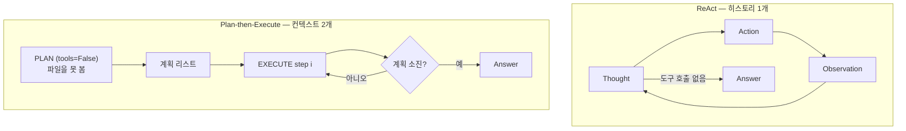
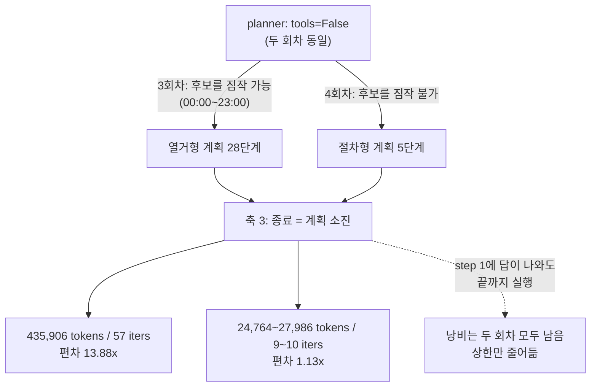

# Week 02 — Harness A/B: ReAct vs Plan-then-Execute

학번 25622005 · 모델·태스크·도구를 고정하고 하네스만 바꾼 A/B 실험.

## Setup

| 항목 | 값 |
|---|---|
| Provider / Model (AGENT_MODEL) | Anthropic SDK / `claude-sonnet-5` |
| Base URL  (ANTHROPIC_BASE_URL) | https://factchat-cloud.mindlogic.ai/v1/gateway/claude |
| 도구 | `read_file(path)`, `count_pattern(path, pattern)` — 두 하네스 공통, `tools_shared.py` |
| 입력 | `app.log` (60줄, 3,022자. 수정 없음) |
| 실행 | `cd submissions/25622005/week-02` 이후, `python run_ab.py --runs 3`  또는 `uv run run_ab.py` |

API 키는 `.env`로만 쓰고 커밋하지 않았다.

---

## 1. Variant Definition

두 하네스가 다르게 잡은 축은 **1번(컨텍스트 관리)과 3번(종료 조건)** 두 개다. 나머지 셋은 통제 변인이다.

| 축 | ReAct | Plan-then-Execute | 차이 |
|---|---|---|---|
| **1 컨텍스트 관리** | `Chat` 1개. 모든 Observation이 하나의 히스토리에 누적된다. | `Chat` 2개로 분리. `planner`는 `tools=False`라 **파일을 볼 수 없다.** | **다름** |
| 2 도구 granularity | `TOOL_SPECS` 동일 | 동일 | 같음 |
| **3 종료 조건** | 모델이 도구 호출을 멈추면 종료, 또는 `max_steps=8` | **계획 리스트 소진** 시 종료 | **다름** |
| 4 에러 복구 | 예외를 `error: ...` Observation으로 되돌림 | 동일 (+ `OFF_PLAN` 시 `max_replan=1`) | 거의 같음 |
| 5 인간 개입 | `IRREVERSIBLE = set()` (도구가 읽기 전용) | 없음 | 양쪽 0, 상수 |

축 5는 12회 성공 실행 모두 `interventions=0`이므로, 이 실험은 개입 지점에 대해 아무것도 말하지 않는다.

---

## 2. Measurements

### 실험 회차

| 회차 | run | 태스크 | 결과 |
|---|---|---|---|
| 1회차 | 1–6 | 시간대 (`expected: 14:00`) | 전부 X — `ModuleNotFoundError: No module named 'openai'` |
| 2회차 | 7–12 | 시간대 | 전부 X — `OpenAIError: Missing credentials` (`.env` 미로드) |
| 3회차 | 13–18 | 시간대 | 전부 O |
| 4회차 | 19–24 | ERROR 메시지 (`expected: {"msg": ..., "count": 7}`) | 전부 O |

1·2회차는 **환경 설정 실패**이지 하네스 실패가 아니다. `tools_shared.py`에 `load_dotenv()`를 추가해 해결했고(커밋 `f635b7a`), 기록은 지우지 않고 남겼다. 지표 비교는 3·4회차만 쓴다.

4회차는 태스크를 바꾼 것이다. 시간대 태스크는 후보 집합(00:00–23:00)이 상식이라 planner가 파일을 안 보고도 계획을 지어낼 수 있다. ERROR 메시지 종류는 파일을 읽지 않으면 후보 자체를 모른다. 각 실행이 어느 기준으로 채점됐는지는 `logs/*.txt`의 `[judge] expected=...` 줄에 남아 있다.

### 3회차 — 시간대 태스크

| run | harness | success | tokens | iters | interventions | note |
|---|---|:---:|---:|---:|---:|---|
| 13 | react | O | 3,277 | 2 | 0 | |
| 14 | react | O | 5,723 | 3 | 0 | |
| 15 | react | O | 5,826 | 3 | 0 | |
| 16 | plan_exec | O | 31,404 | 11 | 0 | replans=0 |
| 17 | plan_exec | O | **435,906** | **57** | 0 | replans=0 |
| 18 | plan_exec | O | 35,512 | 12 | 0 | replans=0 |

### 4회차 — ERROR 메시지 태스크

| run | harness | success | tokens | iters | interventions | note |
|---|---|:---:|---:|---:|---:|---|
| 19 | react | O | 6,528 | 3 | 0 | |
| 20 | react | O | 6,468 | 3 | 0 | |
| 21 | react | O | 6,487 | 3 | 0 | |
| 22 | plan_exec | O | 27,986 | 10 | 0 | replans=0 |
| 23 | plan_exec | O | 24,764 | 9 | 0 | replans=0 |
| 24 | plan_exec | O | 24,919 | 9 | 0 | replans=0 |

### 요약

| 지표 | 3회차 (시간대) | 4회차 (ERROR 메시지) |
|---|---|---|
| 성공률 | 3/3 : 3/3 | 3/3 : 3/3 |
| react tokens 중앙값 | 5,723 | 6,487 |
| plan_exec tokens 중앙값 | 35,512 | 24,919 |
| **중앙값 비** | **6.2×** | **3.8×** |
| plan_exec 편차(최대/최소) | **13.88×** | **1.13×** |
| plan_exec 계획 단계 수 | 5 / **28** / 6 | 5 / 5 / 5 |
| replans | 0, 0, 0 | 0, 0, 0 |

---

## 3. Interpretation

성공률은 네 번의 비교 모두 3/3으로 동점이었고, 승부는 토큰과 반복 횟수에서 났다. 두 회차 모두 ReAct가 이겼지만(중앙값 6.2배, 3.8배), 그 격차를 만든 것은 하네스의 우열이 아니라 **축 1(planner의 실명)과 축 3(종료 = 계획 소진)이 태스크와 맞물리는 방식**이었다. 3회차에서 Plan-then-Execute의 run 17은 00:00부터 23:00까지 일일이 세는 28단계 계획을 세워 435,906토큰을 썼는데, `planner`가 `tools=False`라 `app.log`를 못 본 채 **후보를 상식으로 짐작해 열거했기 때문**이다. 4회차는 후보를 짐작할 수 없게 만든 태스크였고, 예상과 달리 planner는 헤매지 않았다 — 열거를 포기하고 "읽고, 추출하고, 세고, 최댓값을 고르고, 형식에 맞춰 출력한다"는 5단계 절차형 계획을 세 번 모두 동일하게 내놓았다. 즉 **planner의 실명은 그 자체로 해로운 것이 아니라, 태스크가 그럴듯한 열거를 지어낼 단서를 쥐여줄 때 해로워진다.** 그 결과 plan_exec의 편차는 13.88배에서 1.13배로 붕괴했고 격차도 3.8배로 좁혀졌다. 반대로 ReAct는 오히려 비싸졌는데(5,723 → 6,487), 시간대 태스크에서 쓰던 "파일을 한 번 훑고 14시 클러스터를 눈으로 보고 그것만 검증하는" 지름길이 4회차에서는 통하지 않아 네 개 메시지를 전부 세야 했기 때문이다. 이는 3회차에서 ReAct가 크게 이긴 이유가 패턴의 우월함이 아니라 Observation을 곧바로 되먹일 수 있다는 성질, 그리고 그 성질이 잘 먹히는 태스크였다는 점에 있었음을 보여준다. 한편 축 3의 결함은 두 회차 모두 그대로였다. 4회차의 세 실행 전부 `[step 1]`에서 이미 정답 JSON을 완성했는데도 step 5까지 같은 답을 되풀이하며 루프를 돌았다(`logs/plan_exec-22..24.txt`). 계획이 29단계에서 5단계로 짧아지면서 **낭비의 배율이 아니라 낭비의 상한만 줄었을 뿐이다.** 마지막으로 `max_replan=1`은 12회 성공 실행 전부에서 `replans=0`으로, 두 태스크에 걸쳐 한 번도 발동하지 않았다. 재계획은 단계가 `OFF_PLAN`을 반환할 때만 열리는데 run 17의 각 단계는 실패하지 않았다 — `count_pattern`은 정상적으로 `0`을 돌려주었고 0은 유효한 결과다. **계획이 틀린 것이 아니라 불필요했고, `OFF_PLAN`은 "틀림"은 감지해도 "불필요함"은 감지하지 못한다.** 상한을 2나 3으로 올려도 결과는 같았을 것이며, 유연성을 늘리려면 상한값이 아니라 트리거 조건을 바꿔야 한다.

