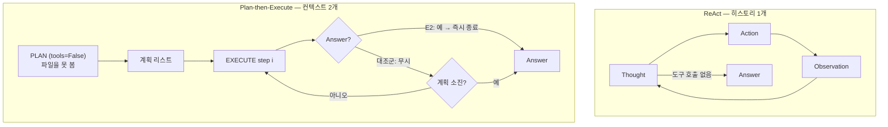
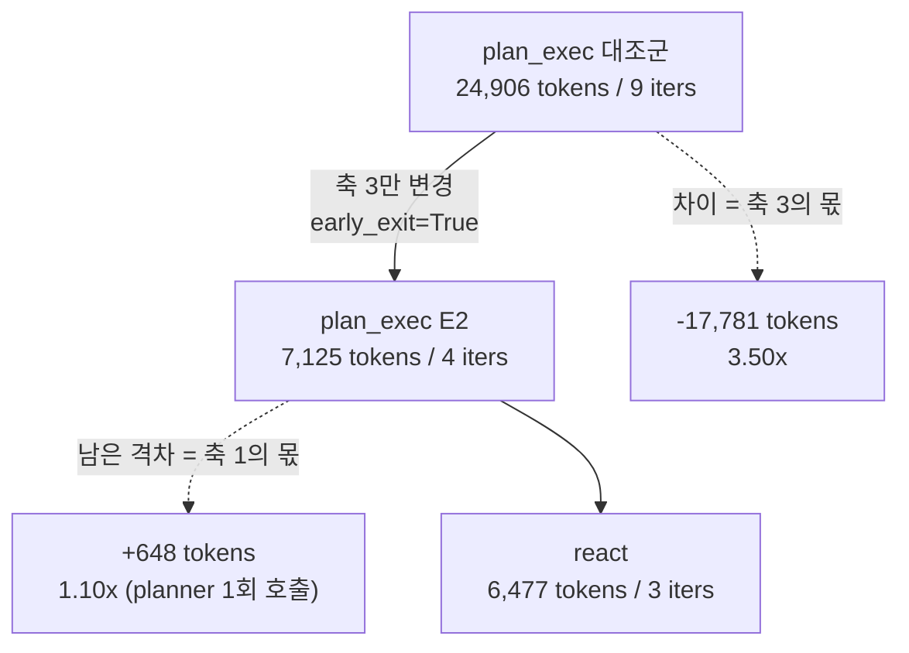

# Week 02 — Harness A/B: ReAct vs Plan-then-Execute

학번 25622005 · 모델·태스크·도구를 고정하고 하네스만 바꾼 A/B 실험.

## Setup

| 항목 | 값 |
|---|---|
| Provider / Model (AGENT_MODEL) | Anthropic SDK / `claude-sonnet-5` |
| Base URL  (ANTHROPIC_BASE_URL) | https://factchat-cloud.mindlogic.ai/v1/gateway/claude |
| 도구 | `read_file(path)`, `count_pattern(path, pattern)` — 두 하네스 공통, `tools_shared.py` |
| 입력 | `app.log` (60줄, 3,022자. 수정 없음) |
| 실행 (대조군) | `cd submissions/25622005/week-02` 이후, `python run_ab.py --runs 3` |
| 실행 (E2 변형) | `python run_ab.py --runs 3 --early-exit` |

API 키는 `.env`로만 쓰고 커밋하지 않았다.

---

## 1. Variant Definition

두 하네스가 다르게 잡은 축은 **1번(컨텍스트 관리)과 3번(종료 조건)** 두 개다. 나머지 셋은 통제 변인이다.

| 축 | ReAct | Plan-then-Execute | 차이 |
|---|---|---|---|
| **1 컨텍스트 관리** | `Chat` 1개. 모든 Observation이 하나의 히스토리에 누적된다. | `Chat` 2개로 분리. `planner`는 `tools=False`라 **파일을 볼 수 없다.** | **다름** |
| 2 도구 granularity | `TOOL_SPECS` 동일 | 동일 | 같음 |
| **3 종료 조건** | 모델이 도구 호출을 멈추면 종료, 또는 `max_steps=8` | **계획 리스트 소진** 시 종료 | **다름** |
| 4 에러 복구 | 예외를 `error: ...` Observation으로 되돌림 | 동일 (+ `OFF_PLAN` 시 `max_replan=1`) | 거의 같음 |
| 5 인간 개입 | `IRREVERSIBLE = set()` (도구가 읽기 전용) | 없음 | 양쪽 0, 상수 |

축 5는 24회 성공 실행 모두 `interventions=0`이므로, 이 실험은 개입 지점에 대해 아무것도 말하지 않는다.

### E2 변형 — 축 3만 분리

축 1과 축 3이 동시에 다르면 격차의 원인을 둘로 나눌 수 없다. 그래서 Plan-then-Execute에
`early_exit` 플래그를 추가해 **축 3만** 움직이는 세 번째 변형을 만들었다
(`harness_plan_execute.py`, 커밋 `df6da92`).

| 변형 | 축 3 (종료 조건) | 나머지 네 축 |
|---|---|---|
| plan_exec (대조군) | 계획 리스트를 끝까지 소진 | — |
| **plan_exec + `--early-exit` (E2)** | **첫 `Answer:`가 나오면 즉시 종료** | 축 1 포함 전부 동일 |

두 변형의 차이는 `if early_exit and reply.text.startswith("Answer:")` 한 블록뿐이다. 따라서
대조군과 E2의 토큰 차이는 **축 3에 전적으로 귀속된다.** 남는 격차가 축 1(planner의 별도 호출)의 값이다.

---

## 2. Measurements

### 실험 회차

| 회차 | run | 태스크 / 변형 | 결과 |
|---|---|---|---|
| 1회차 | 1–6 | 시간대 (`expected: 14:00`) | 전부 X — `ModuleNotFoundError: No module named 'openai'` |
| 2회차 | 7–12 | 시간대 | 전부 X — `OpenAIError: Missing credentials` (`.env` 미로드) |
| 3회차 | 13–18 | 시간대 | 전부 O |
| 4회차 | 19–24 | ERROR 메시지 (`expected: {"msg": ..., "count": 7}`) | 전부 O |
| 5회차 | 25–30 | ERROR 메시지 — **E2 의도, 미적용** | 전부 O (실제로는 대조군 재현) |
| 6회차 | 31–36 | ERROR 메시지 — **E2 적용** (`--early-exit`) | 전부 O |

1·2회차는 **환경 설정 실패**이지 하네스 실패가 아니다. `tools_shared.py`에 `load_dotenv()`를 추가해 해결했고(커밋 `f635b7a`), 기록은 지우지 않고 남겼다.

4회차는 태스크를 바꾼 것이다. 시간대 태스크는 후보 집합(00:00–23:00)이 상식이라 planner가 파일을 안 보고도 계획을 지어낼 수 있다. ERROR 메시지 종류는 파일을 읽지 않으면 후보 자체를 모른다. 각 실행이 어느 기준으로 채점됐는지는 `logs/*.txt`의 `[judge] expected=...` 줄에 남아 있다.

**5회차는 E2를 돌린 줄 알았으나 아니었다.** `early_exit` 파라미터를 하네스에 추가했지만 기본값이
`False`였고, `True`를 넘기던 유일한 호출자 `run_e2.py`를 실행 직전에 지웠다(`871f139`). 남은 호출자
`run_ab.py`는 `fn(task, log=log)`로 부르므로 대조군 경로가 그대로 돌았다. 로그가 증거다 — 25–30번
어디에도 `[early_exit]` 줄이 없고, 세 실행 모두 step 1에서 정답이 나온 뒤 step 5까지 갔다.
`run_ab.py`에 `--early-exit`를 연결(`67ea5e3`)한 뒤 다시 돌린 것이 6회차다. **기본값이 `False`인
플래그는 배선을 끝내야 비로소 실험이 된다** — 5회차는 지우지 않고 그 사고의 기록으로 남긴다.
덤으로 5회차는 4회차와 같은 설정의 독립 재현이 되어, 대조군 표본이 3에서 6으로 늘었다.

### 3회차 — 시간대 태스크

| run | harness | success | tokens | iters | interventions | note |
|---|---|:---:|---:|---:|---:|---|
| 13 | react | O | 3,277 | 2 | 0 | |
| 14 | react | O | 5,723 | 3 | 0 | |
| 15 | react | O | 5,826 | 3 | 0 | |
| 16 | plan_exec | O | 31,404 | 11 | 0 | replans=0 |
| 17 | plan_exec | O | **435,906** | **57** | 0 | replans=0 |
| 18 | plan_exec | O | 35,512 | 12 | 0 | replans=0 |

### 4회차 — ERROR 메시지 태스크

| run | harness | success | tokens | iters | interventions | note |
|---|---|:---:|---:|---:|---:|---|
| 19 | react | O | 6,528 | 3 | 0 | |
| 20 | react | O | 6,468 | 3 | 0 | |
| 21 | react | O | 6,487 | 3 | 0 | |
| 22 | plan_exec | O | 27,986 | 10 | 0 | replans=0 |
| 23 | plan_exec | O | 24,764 | 9 | 0 | replans=0 |
| 24 | plan_exec | O | 24,919 | 9 | 0 | replans=0 |

### 5회차 — 같은 태스크, 대조군 재현 (E2 미적용)

| run | harness | success | tokens | iters | interventions | note |
|---|---|:---:|---:|---:|---:|---|
| 25 | react | O | 6,403 | 3 | 0 | |
| 26 | react | O | 7,072 | 3 | 0 | |
| 27 | react | O | 6,489 | 3 | 0 | |
| 28 | plan_exec | O | 30,877 | 10 | 0 | replans=0 |
| 29 | plan_exec | O | 20,296 | 8 | 0 | replans=0 |
| 30 | plan_exec | O | 24,906 | 9 | 0 | replans=0 |

### 6회차 — 축 3 격리, `--early-exit`

| run | harness | success | tokens | iters | interventions | note |
|---|---|:---:|---:|---:|---:|---|
| 31 | react | O | 6,553 | 3 | 0 | |
| 32 | react | O | 6,445 | 3 | 0 | |
| 33 | react | O | 6,477 | 3 | 0 | |
| 34 | plan_exec | O | **7,125** | **4** | 0 | replans=0 variant=early_exit |
| 35 | plan_exec | O | **7,420** | **4** | 0 | replans=0 variant=early_exit |
| 36 | plan_exec | O | **6,876** | **4** | 0 | replans=0 variant=early_exit |

세 실행 모두 `[early_exit] answer at step 1 of N; skipping N-1 step(s)`가 로그에 찍혔다
(N = 5, 5, 3). 즉 **계획의 첫 단계에서 이미 답이 완성되어 있었다.**

### 요약

| 지표 | 3회차 (시간대) | 4회차 | 5회차 | **6회차 (E2)** |
|---|---|---|---|---|
| 성공률 | 3/3 : 3/3 | 3/3 : 3/3 | 3/3 : 3/3 | 3/3 : 3/3 |
| react tokens 중앙값 | 5,723 | 6,487 | 6,489 | 6,477 |
| plan_exec tokens 중앙값 | 35,512 | 24,919 | 24,906 | **7,125** |
| **중앙값 비 (plan/react)** | **6.2×** | **3.8×** | **3.8×** | **1.10×** |
| plan_exec iters 중앙값 | 12 | 9 | 9 | **4** |
| plan_exec 편차(최대/최소) | **13.88×** | 1.13× | 1.52× | 1.08× |
| plan_exec 계획 단계 수 | 5 / **28** / 6 | 5 / 5 / 5 | 5 / 5 / 5 | 5 / 5 / 3 (전부 1단계에서 종료) |
| replans | 0, 0, 0 | 0, 0, 0 | 0, 0, 0 | 0, 0, 0 |

**축 3 격리의 값** (같은 태스크, 5회차 대조군 대비 6회차): 24,906 → 7,125 토큰으로 **71.4% 감소(3.50배)**, iters 9 → 4.

---

## 3. Interpretation

성공률은 여섯 번의 비교 모두 3/3으로 동점이었고, 승부는 토큰과 반복 횟수에서 났다. 대조군에서는 네 회차 모두 ReAct가 이겼지만(중앙값 6.2배, 3.8배, 3.8배), 그 격차를 만든 것은 하네스의 우열이 아니라 **축 1(planner의 실명)과 축 3(종료 = 계획 소진)이 태스크와 맞물리는 방식**이었고, 6회차는 그 둘의 몫을 실제로 갈라놓았다. 먼저 축 1: 3회차의 run 17은 00:00부터 23:00까지 일일이 세는 28단계 계획으로 435,906토큰을 썼는데, `planner`가 `tools=False`라 `app.log`를 못 본 채 **후보를 상식으로 짐작해 열거했기 때문**이다. 4회차는 짐작을 불가능하게 만든 태스크였고, planner는 열거를 포기하고 "읽고, 추출하고, 세고, 최댓값을 고르고, 형식에 맞춰 출력한다"는 5단계 절차형 계획을 세 번 모두 동일하게 내놓았다. 즉 **planner의 실명은 그 자체로 해로운 것이 아니라, 태스크가 그럴듯한 열거를 지어낼 단서를 쥐여줄 때 해로워진다** — 편차가 13.88배에서 1.13배로 붕괴한 것이 그 증거다. 다음으로 축 3: 4·5회차에서 plan_exec은 여섯 실행 전부 `[step 1]`에서 이미 정답 JSON을 완성하고도 계획이 소진될 때까지 같은 답을 되풀이했다. `early_exit`로 **축 3 하나만** 바꾼 6회차는 24,906 → 7,125토큰(71.4% 감소), iters 9 → 4로 떨어졌고, plan_exec 대 react의 격차는 3.8배에서 **1.10배**로 사라졌다. 이 3.50배가 축 3에 귀속되는 낭비의 크기이고, 남은 1.10배(약 650토큰)가 축 1의 순수 비용, 즉 planner를 따로 한 번 더 호출하는 값이다. **Plan-then-Execute가 비쌌던 것은 계획을 세우기 때문이 아니라 답이 나온 뒤에도 계획을 마저 실행하기 때문이었다.** 다만 이 결론에는 조건이 붙는다 — 6회차에서 계획의 첫 단계가 곧바로 답을 낸 것은 executor가 한 단계 안에서 도구를 여러 번 부를 수 있어(`max_tool_rounds=3`) 5단계짜리 계획을 사실상 한 단계로 압축했기 때문이고, 단계 간 의존이 실재하는 태스크라면 조기 종료는 미완성 답을 확정해 버릴 위험이 있다. 마지막으로 `max_replan=1`은 24회 성공 실행 전부에서 `replans=0`으로 한 번도 발동하지 않았다. 재계획은 단계가 `OFF_PLAN`을 반환할 때만 열리는데 run 17의 각 단계는 실패하지 않았다 — `count_pattern`은 정상적으로 `0`을 돌려주었고 0은 유효한 결과다. **계획이 틀린 것이 아니라 불필요했고, `OFF_PLAN`은 "틀림"은 감지해도 "불필요함"은 감지하지 못한다.** 상한을 2나 3으로 올려도 결과는 같았을 것이며, 유연성을 늘리려면 상한값이 아니라 트리거 조건을 바꿔야 한다 — 6회차가 보여주듯 실제로 필요했던 트리거는 재계획이 아니라 종료였다.

