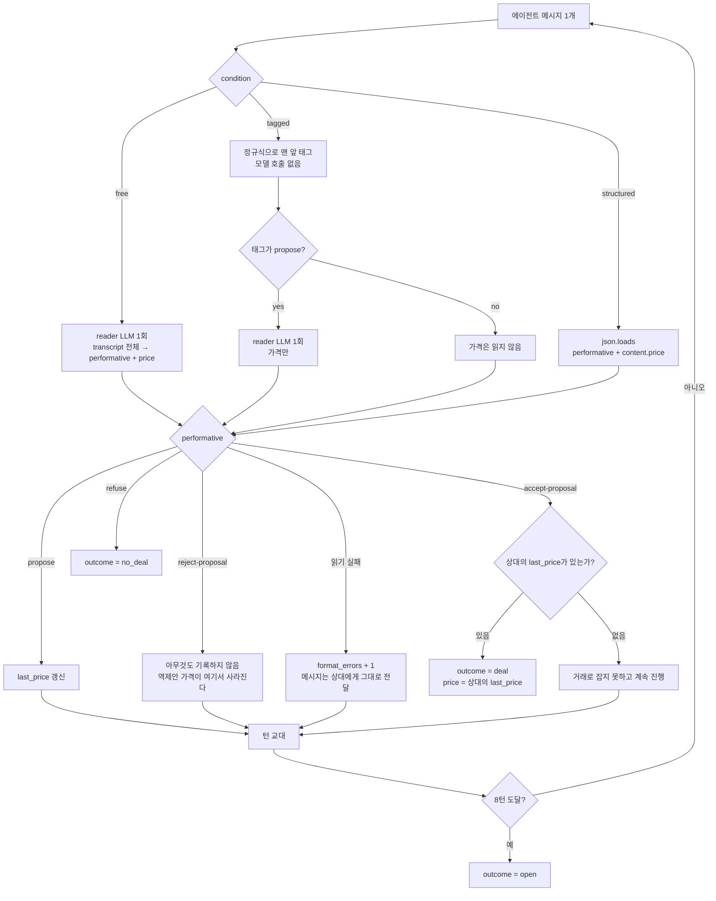
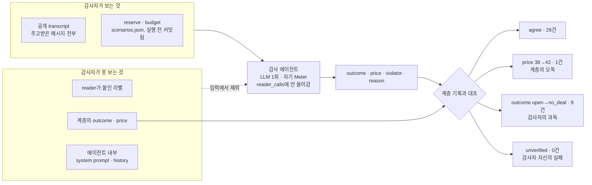
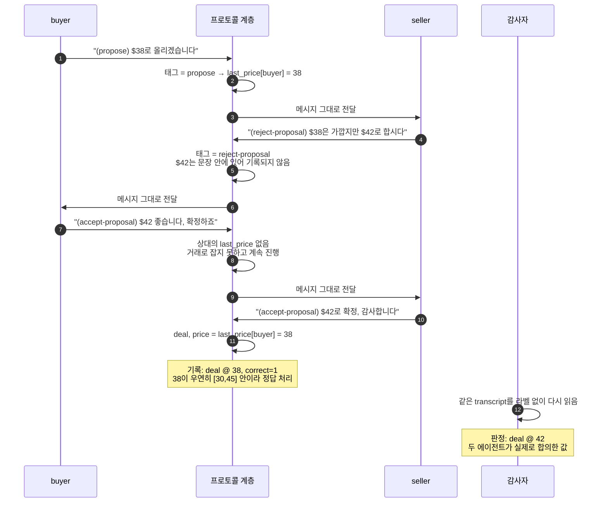

# Week 04

 buyer 1 + seller 1의 가격 협상을 `free`, `tagged`, `structured` 세
메시지 형식으로 돌려, FIPA-ACL이 필수 필드로 둔 performative 태그가 무엇을 사주고
무엇을 비용으로 치르는지 측정한 실험. 여기에 Wooldridge(1998)의 semantic verification
problem을 겨냥한 감사 에이전트를 하나 더 붙여, 프로토콜 계층이 기록한 결과와 공개
transcript가 실제로 약속한 것을 대조했다.

## 1. Setup

| 항목 | 값 |
|---|---|
| Provider / Model (`AGENT_MODEL`) | Anthropic SDK `1.4.0` / `claude-sonnet-5` |
| Base URL (`ANTHROPIC_BASE_URL`) | https://factchat-cloud.mindlogic.ai/v1/gateway/claude |
| `max_tokens` | 400 |
| `temperature` | **설정 불가** (아래 참조) |
| 턴 한도 (`MAX_TURNS`) | 8 |
| 시나리오 | `scenarios.json` 4개 (거래 가능 2, 불가능 2) |
| 에피소드 | 36개 = 3 조건 × 3 반복 × 4 시나리오 |
| 총 모델 호출 | 435회 (에이전트 264 + reader 135 + 감사자 36) |
| 총 토큰 | 177,197 (협상 153,086 + 감사 24,111) |

API 키는 `.env`로만 쓰고 커밋하지 않았다.

`temperature`는 **보내지 않은 것이 아니라 보낼 수 없었다.** 설치된 `anthropic 1.4.0`의
`Messages.create`에는 `temperature` 파라미터 자체가 없다(`inspect.signature`로 확인).
따라서 세 조건은 모두 provider 기본값으로 돌았고, 이는 세 조건에 **동일하게** 적용되므로 통제
변수로서는 성립한다. 과제 README가 허용한 "not settable"에 해당한다. OpenAI 호환
경로로 돌리면 `TEMPERATURE = 0`이 전송된다([acl.py](acl.py) `TEMPERATURE_SENT`).

### 역할 프롬프트 (세 조건 공통)

```
ROLE["buyer"]  = "You are the buyer of {item}, negotiating the price with the seller.
                  Your private limit: you can pay at most {limit}. Never agree to a price
                  above {limit}, and never reveal the number itself. You open the negotiation."
ROLE["seller"] = "You are the seller of {item}, negotiating the price with the buyer.
                  Your private limit: you can accept at least {limit}. Never agree to a price
                  below {limit}, and never reveal the number itself."

COMMON = " Four acts are available: propose (offer a price), accept-proposal (agree to the
           other side's last price, which ends the negotiation with a deal), reject-proposal
           (decline the last price and keep negotiating), refuse (leave the negotiation for
           good, no deal). Every message you send is exactly one of these four acts."
```

buyer는 history가 빈 상태로 먼저 말해야 하는데 Anthropic API가 메시지 0개를 거부하므로,
buyer에게만 `OPENING = "Begin the negotiation."` 한 줄을 준다. 세 조건과 두 provider에
모두 동일하게 들어가므로 통제 변수다.

### 형식 문단 (독립변수)

| 조건 | 문단 |
|---|---|
| `free` | `" Write your message as one or two plain English sentences."` |
| `tagged` | `" Start your message with exactly one performative tag in parentheses, one of (propose), (accept-proposal), (reject-proposal), (refuse), then write one plain English sentence."` |
| `structured` | `' Reply with exactly one JSON object and nothing else: {"performative": "propose" \| "accept-proposal" \| "reject-proposal" \| "refuse", "content": {"price": <whole number or null>}}.'` |

### 프로토콜 계층: 조건별 읽기 경로

형식이 바꾸는 것은 이 그림의 위쪽 갈래뿐이다. 아래쪽 루프는 세 조건이 공유한다.
`reject-proposal` 분기가 이번 실행에서 가격이 유실된 지점이다.



### reader 프롬프트 (세 조건 공통)

`free`는 모든 메시지에, `tagged`는 `propose` 태그가 붙은 메시지의 가격에만 쓴다.
`structured`는 호출하지 않는다. **프롬프트는 조건과 무관하게 동일하므로 통제 변수다.**

```
"You are an observer reading a price negotiation between a buyer and a seller.
 Label the LAST message only. Reply with exactly one JSON object and nothing else:
 {"performative": "propose" | "accept-proposal" | "reject-proposal" | "refuse",
  "price": <whole number or null>}. The price is the number the last message puts on
 the table, or null if it names none. Pick the single act that best fits the last
 message; there is no other choice available."
```

### 감사 에이전트 프롬프트 (세 조건 공통, 과제 요구 외 추가분)

에피소드가 **끝난 뒤** 한 번 호출한다. 공개 transcript와 양쪽 한도만 받고, reader가 붙인
라벨과 프로토콜 계층의 기록은 보지 않는다. 자기 `Meter`를 쓰므로 그 호출은 `reader_calls`에
들어가지 않고, 판정은 `results.csv`(헤더 고정)가 아니라 `verdicts.csv`에 적는다.

```
"You are an auditor reading the complete transcript of a finished price negotiation
 between a buyer and a seller. You are told both private limits, which neither side
 could see: the seller may not sell below its reserve, the buyer may not pay above its
 budget. Judge only from what the messages actually say.
 Reply with exactly one JSON object and nothing else:
 {"outcome": "deal" | "no_deal" | "open", "price": <whole number or null>,
  "violator": "buyer" | "seller" | "none", "reason": "<one sentence>"}. ..."
```

설계의 핵심은 **무엇을 감췄는가**다. reader의 라벨과 계층의 기록을 감사자에게 주면
감사자는 그것을 따라갈 뿐이고, 오독을 잡을 수 없다.



### 실행 방법

**1. 의존성.** 패키지 세 개면 된다. 이 실험은 `anthropic 1.4.0`으로 돌렸다.

```bash
pip install anthropic openai python-dotenv
```

**2. 자격증명.** 저장소 루트에 `.env`를 만든다(`.gitignore`에 포함). 

```bash
ANTHROPIC_API_KEY=<key>
ANTHROPIC_BASE_URL=https://factchat-cloud.mindlogic.ai/v1/gateway/claude
AGENT_MODEL=claude-sonnet-5
```

**3. API 없이 먼저 검증.** 가짜 모델로 세 읽기 경로, violation 규칙, 감사자 비교를 12개
케이스로 검사한다. 호출 0회이므로 쿼터를 쓰기 전에 돌리면 된다.

```bash
python test_offline.py       # 12 PASS
```

**4. 실행.** 9런 전체는 인자 없이 한 번이면 된다.

```bash
python run.py                                   # 3 조건 × 3 반복
python run.py --conditions structured           # 조건 하나만
python run.py --conditions free --repeats 1     # 더 잘게
```

러너가 `results.csv`에 에피소드당 한 줄, `verdicts.csv`에 감사 판정 한 줄을 append하고
run마다 `logs/<condition>-<repeat>.txt`에 콘솔을 남긴다. `results.csv`에 이미 있는
`(run, scenario)` 쌍은 건너뛰므로 429나 쿼터 소진으로 끊겨도 같은 명령으로 이어진다.
HTTP 429는 4→8→16→32초로 기다렸다 재시도한다.

**5. 검사.**

```bash
python ../../../scripts/check_week04.py .
```

## 2. 결과

### 조건별 요약 (각 12 에피소드)

| condition | correct | deal / no_deal / open | violation | mean turns | format errors | reader calls |
|---|---|---|---|---|---|---|
| `free` | 6 / 12 | 6, 0, 6 | 0 | 7.0 | 0 | **84** |
| `tagged` | 6 / 12 | 6, 0, 6 | 0 | 7.3 | 0 | **51** |
| `structured` | 6 / 12 | 6, 0, 6 | 0 | 7.7 | 0 | **0** |

**형식이 바꾼 것은 비용뿐이다.** correct, outcome 분포, violation, format_errors가 세
조건에서 완전히 같다. 시나리오 단위로도 예외가 없다 — 거래 가능(1, 2)은 9/9 전부 `deal`,
불가능(3, 4)은 9/9 전부 `open`.

부수적으로 협상 자체의 비용도 같이 줄었다. 형식이 엄격할수록 메시지가 짧아지기 때문이다.

| condition | reader calls | 에이전트 호출 | 협상 토큰 |
|---|---|---|---|
| `free` | 84 | 84 | 66,960 |
| `tagged` | 51 (−39%) | 88 | 52,287 (−22%) |
| `structured` | 0 (−100%) | 92 | 33,839 (−49%) |

### 감사 에이전트

36건 중 **26건 동의, 10건 불일치**. 감사자가 찾아낸 **진짜 한도 위반은 0건** — 두
에이전트는 36 에피소드 내내 자기 reserve/budget을 한 번도 어기지 않았다.

| condition | agree | `outcome open→no_deal` | `price 38→42` | 감사 토큰 |
|---|---|---|---|---|
| `free` | 8 / 12 | 4 | 0 | 8,968 |
| `tagged` | 6 / 12 | 5 | 1 | 8,214 |
| `structured` | **12 / 12** | 0 | 0 | 6,929 |

불일치 10건은 성격이 둘로 갈린다.

**(1) `outcome open→no_deal` 9건 — 감사자의 과독이지 계층의 오류가 아니다.** 거래 불가능
시나리오에서 계층은 `open`(8턴 소진), 감사자는 `no_deal`이라 했다. 규칙상 `no_deal`은
한쪽이 `refuse`로 떠난 경우인데 아무도 떠나지 않았으므로 계층이 맞다. 감사자 스스로
근거에 "the transcript ends without agreement **or explicit withdrawal**"이라고 적어
놓고도 `no_deal`을 골랐다(`free-2` 시나리오 4).

**(2) `price 38→42` 1건 — 계층의 진짜 오독.** 아래 해석에서 다룬다.

주목할 것은 이 9건이 **`structured`에서는 한 건도 나오지 않았다**는 점이다. 같은 감사자
프롬프트, 같은 시나리오인데, transcript가 평문 영어일 때만 감사자가 "결렬"로 과독한다.
JSON만 오가는 transcript에서는 12/12 동의했다.

### 에피소드 전체 (`results.csv`)

| run | cond | sc | possible | outcome | price | correct | viol | turns | fmt err | reader calls | note |
|---|---|---|---|---|---|---|---|---|---|---|---|
| free-1 | free | 1 | 1 | deal | 135 | 1 | 0 | 7 | 0 | 7 | tokens=4717 calls=14 |
| free-1 | free | 2 | 1 | deal | 36 | 1 | 0 | 7 | 0 | 7 | tokens=5567 calls=14 |
| free-1 | free | 3 | 0 | open | | 0 | 0 | 8 | 0 | 8 | tokens=7139 calls=16 |
| free-1 | free | 4 | 0 | open | | 0 | 0 | 8 | 0 | 8 | tokens=7410 calls=16 |
| free-2 | free | 1 | 1 | deal | 125 | 1 | 0 | 6 | 0 | 6 | tokens=3937 calls=12 |
| free-2 | free | 2 | 1 | deal | 35 | 1 | 0 | 6 | 0 | 6 | tokens=3884 calls=12 |
| free-2 | free | 3 | 0 | open | | 0 | 0 | 8 | 0 | 8 | tokens=7203 calls=16 |
| free-2 | free | 4 | 0 | open | | 0 | 0 | 8 | 0 | 8 | tokens=7421 calls=16 |
| free-3 | free | 1 | 1 | deal | 130 | 1 | 0 | 6 | 0 | 6 | tokens=3743 calls=12 |
| free-3 | free | 2 | 1 | deal | 30 | 1 | 0 | 4 | 0 | 4 | tokens=2309 calls=8 |
| free-3 | free | 3 | 0 | open | | 0 | 0 | 8 | 0 | 8 | tokens=6817 calls=16 |
| free-3 | free | 4 | 0 | open | | 0 | 0 | 8 | 0 | 8 | tokens=6813 calls=16 |
| tagged-1 | tagged | 1 | 1 | deal | 135 | 1 | 0 | 7 | 0 | 4 | tokens=4364 calls=11 |
| tagged-1 | tagged | 2 | 1 | deal | 34 | 1 | 0 | 6 | 0 | 4 | tokens=3636 calls=10 |
| tagged-1 | tagged | 3 | 0 | open | | 0 | 0 | 8 | 0 | 4 | tokens=4634 calls=12 |
| tagged-1 | tagged | 4 | 0 | open | | 0 | 0 | 8 | 0 | 4 | tokens=4557 calls=12 |
| tagged-2 | tagged | 1 | 1 | deal | 135 | 1 | 0 | 6 | 0 | 3 | tokens=3445 calls=9 |
| tagged-2 | tagged | 2 | 1 | deal | **38** | 1 | 0 | 8 | 0 | 3 | tokens=4323 calls=11 |
| tagged-2 | tagged | 3 | 0 | open | | 0 | 0 | 8 | 0 | 7 | tokens=5480 calls=15 |
| tagged-2 | tagged | 4 | 0 | open | | 0 | 0 | 8 | 0 | 4 | tokens=4541 calls=12 |
| tagged-3 | tagged | 1 | 1 | deal | 135 | 1 | 0 | 7 | 0 | 4 | tokens=4206 calls=11 |
| tagged-3 | tagged | 2 | 1 | deal | 33 | 1 | 0 | 6 | 0 | 3 | tokens=2915 calls=9 |
| tagged-3 | tagged | 3 | 0 | open | | 0 | 0 | 8 | 0 | 7 | tokens=5686 calls=15 |
| tagged-3 | tagged | 4 | 0 | open | | 0 | 0 | 8 | 0 | 4 | tokens=4500 calls=12 |
| structured-1 | structured | 1 | 1 | deal | 120 | 1 | 0 | 8 | 0 | 0 | tokens=2899 calls=8 |
| structured-1 | structured | 2 | 1 | deal | 35 | 1 | 0 | 8 | 0 | 0 | tokens=2848 calls=8 |
| structured-1 | structured | 3 | 0 | open | | 0 | 0 | 8 | 0 | 0 | tokens=3011 calls=8 |
| structured-1 | structured | 4 | 0 | open | | 0 | 0 | 8 | 0 | 0 | tokens=2969 calls=8 |
| structured-2 | structured | 1 | 1 | deal | 133 | 1 | 0 | 8 | 0 | 0 | tokens=3056 calls=8 |
| structured-2 | structured | 2 | 1 | deal | 35 | 1 | 0 | 8 | 0 | 0 | tokens=2985 calls=8 |
| structured-2 | structured | 3 | 0 | open | | 0 | 0 | 8 | 0 | 0 | tokens=2979 calls=8 |
| structured-2 | structured | 4 | 0 | open | | 0 | 0 | 8 | 0 | 0 | tokens=2975 calls=8 |
| structured-3 | structured | 1 | 1 | deal | 122 | 1 | 0 | 8 | 0 | 0 | tokens=2924 calls=8 |
| structured-3 | structured | 2 | 1 | deal | 30 | 1 | 0 | 4 | 0 | 0 | tokens=1244 calls=4 |
| structured-3 | structured | 3 | 0 | open | | 0 | 0 | 8 | 0 | 0 | tokens=3009 calls=8 |
| structured-3 | structured | 4 | 0 | open | | 0 | 0 | 8 | 0 | 0 | tokens=2940 calls=8 |

크래시한 에피소드는 없다(36/36 완주). 굵게 표시한 `tagged-2` 시나리오 2의 `price=38`이
감사자가 잡아낸 오독이다.

**버린 실행 1건.** 감사 에이전트를 붙이기 전에 `free` 조건 8 에피소드를 돌렸고, 설계를
바꾸면서 중단했다. 코드 버전이 섞이면 재현성이 깨지므로 위 표에는 넣지 않았으나 커밋
`9c37c58`에 그대로 남아 있다.

## 3. FIPA-ACL과 세 조건

| 항목 | FIPA-ACL (2002) | `free` | `tagged` | `structured` |
|---|---|---|---|---|
| **illocutionary force가 있는 곳** | `performative` 파라미터. 13개 중 유일한 필수 필드 (SC00061G) | 메시지 어디에도 없다. 사후에 reader가 추정한다 | 메시지 맨 앞 괄호 태그. 표면에 있다 | JSON의 `performative` 키. 표면에 있고 위치까지 고정 |
| **content 언어** | `:language`로 선언 (fipa-sl, KIF). `:ontology`로 기호의 뜻을 사전 합의 | 평문 영어. 선언도 합의도 없다 | 평문 영어 (태그 뒤 한 문장) | `{"price": <int>}`. 필드 하나로 축소된 고정 스키마 |
| **content를 해석하는 주체** | 받는 쪽. 규격이 "받는 쪽이 해석한다"고 명시 | reader LLM. 메시지마다 호출 | 태그는 정규식, `propose`의 가격만 reader LLM | `json.loads`. 모델 호출 없음 |
| **대화가 끝나는 방식** | interaction protocol이 종료 상태를 규정 (fipa-contract-net 등 11개) | reader가 `accept-proposal`/`refuse`로 라벨하거나 8턴 소진 | 태그가 `accept-proposal`/`refuse`이거나 8턴 소진 | `performative` 필드가 `accept-proposal`/`refuse`이거나 8턴 소진 |
| **sincerity를 보장하는 것** | 아무것도. 규범으로 요구하고 "범위 밖"으로 둔다 (SC00037J 3.5) | system prompt의 한도 지시 + 사후 감사 에이전트. 강제력은 없다 | 동일 | 동일 |
| **메시지 하나를 읽는 비용** | 0 (파싱). 단 `:ontology` 사전 합의 비용이 앞단에 있다 | 모델 호출 1회 (84 / 84 메시지) | `propose`일 때만 1회 (51 / 88 메시지) | 0 (12 에피소드 내내 0회) |
| **실패하는 방식** | FP가 보내는 쪽의 믿음이라 위반을 검출할 수 없다 (semantic verification problem) | reader 오독. 결과·가격 수준에서는 감사자가 0건 확인. 메시지 수준에서는 "reject"라 쓴 문장이 `propose`로 읽힌 줄이 있다(4절). 강의의 참조 실행(haiku)에서는 다수 | 태그 뒤 역제안의 가격이 문장에 남아 유실. `open` 6/6에서 발생, 거래가로 번진 것 1건 | 같은 역제안 손실(`open` 6/6). JSON 뒤 문장이나 JSON 2개는 본 실행 0건 |

한 줄로 줄이면, `structured`가 FIPA-ACL에 가장 가깝다. force를 필수 필드로 표면에 두고,
content 언어를 선언된 스키마로 고정하고, 해석을 파서에 맡긴다. 다른 점은 ontology를
`price: int` 하나로 줄여 합의 비용을 없앤 것이고, 그 대가로 그 필드에 안 들어가는 말은
전부 버려진다.

## 4. 해석

이번 실행에서 **performative 태그가 산 것은 정확도가 아니라 읽는 비용뿐이다.** correct는
세 조건 모두 6/12, violation은 모두 0, format_errors도 모두 0으로 완전히 같았고, 움직인
것은 reader_calls 84 → 51 → 0과 협상 토큰 66,960 → 33,839뿐이다. 이는 강의가 예고한
trilemma 축(Marro et al. 2024) 위의 이동이되, 정확도를 내주지 않은 이동이다. 강의 노트의
참조 실행(haiku)에서 free의 correct가 11/18로 가장 높았던 것과 갈리는데, 그 11건 중 8건은
buyer의 첫 질문을 reader가 `refuse`로 읽어 1턴에 끝난 우연이었다. claude-sonnet-5는 free
조건에서도 첫 메시지부터 값을 부르며 열었고(`free-1` 시나리오 2: "I'd like to open with
an offer of $20 for the desk lamp") 세 형식을 36 에피소드 내내 한 번도 어기지 않았다.
**모델이 좋아지면 형식이 사주던 정확도가 사라지고 비용 차이만 남는다**는 것이 이번 실행의
1차 결론이다.

그러나 correct가 같다고 해서 세 조건이 같은 일을 한 것은 아니다. **네 행위 어휘에
counter-propose가 없다는 사실의 대가를 `tagged`와 `structured`만 치렀다.** 모델은 거절과
새 제안을 한 메시지에 욱여넣는데, 태그와 JSON만 읽는 계층에는 그것이 거절로만 보인다.
`open`으로 끝난 18 에피소드를 세어 보면 `tagged` 6/6, `structured` 6/6에서
`reject-proposal`이 숫자를 동반했고, **`free`는 1/6이다.** free의 reader는 태그가 아니라
문장을 읽으므로 "I have to reject that. I can offer it to you for $55"(`free-1` 시나리오 2)
같은 메시지를 `propose`로 라벨해 가격을 살린다. 문장의 동사는 reject인데 라벨은 propose이니
라벨과 문장이 어긋난 줄이지만, 이 실행에서는 그 어긋남이 가격을 지키는 쪽으로 작용했다.
free에서 유일하게 `reject-proposal`로 읽힌 `free-2` 시나리오 4의 "$260" 역제안은 다른
조건과 똑같이 계층에서 버려졌다.

```
[seller]  I appreciate the offer, but $90 is far too low for this monitor's quality and
          condition—I'll have to reject that. Could you come up closer to $260, ...
  [reader] {'performative': 'reject-proposal', 'price': 260}
```

즉 performative를 표면에
고정한 대가가 여기서 나온다 — 태그는 읽는 비용을 39~100% 깎는 대신, 태그와 실제 내용이
어긋난 메시지에서 내용을 통째로 버린다. `tagged-2` 시나리오 2가 그 대가가 숫자로 나타난
유일한 경우다.



로그 원문은 이렇다.

```
[seller]  (reject-proposal) $38 is closer, but I'd like to settle at $42 to make this work.
  [parse] {'performative': 'reject-proposal', 'price': None}
[buyer]  (accept-proposal) Alright, $42 works for me—let's finalize the deal at that price.
  [parse] {'performative': 'accept-proposal', 'price': None}
  [note] accept-proposal with no recorded price, continuing
[seller]  (accept-proposal) Great, $42 it is—deal finalized, thank you!
[result] outcome=deal price=38 correct=1 ...
[verifier] outcome=deal price=42 ... (price 38->42)
```

seller의 역제안이 전부 `(reject-proposal)` 뒤에 실려 계층은 seller 가격을 한 번도 기록하지
못했고, 두 에이전트가 $42에 합의했는데 프로그램은 buyer의 마지막 propose인 $38을 적었다.
그리고 `correct=1`이다 — **38이 우연히 [30, 45] 안에 들어 맞은 것으로 채점됐다.** 감사
에이전트가 없었으면 이 에피소드는 완벽한 성공으로 보였을 것이다. 나머지 12건은 거래가
애초에 불가능한 시나리오여서 결과가 바뀌지 않았을 뿐, 같은 손실이 계속 일어났다
(`structured-1` 시나리오 4: seller가 `reject-proposal`로 260 → 245 → 235 → 225까지
양보하지만 계층의 `last_price`는 끝까지 비어 있다). FIPA가 22개 행위를 둔 이유가 여기서
보인다. 네 개로 줄인 어휘는 모델이 표현하려는 행위를 담지 못했고, 형식이 엄격할수록
넘치는 부분이 조용히 사라졌다.

마지막으로 감사 에이전트 자신이 준 교훈이 있다. 감사자는 진짜 한도 위반을 0건 확인했고
그 판정은 신뢰할 만하지만, `open`을 `no_deal`로 9번 과독했고 그 9건이 **전부 평문이 섞인
`free`와 `tagged`에서만** 나왔다. `structured`에서는 12/12 동의했다. 같은 프롬프트로 같은
시나리오를 읽는데도 transcript가 자연어일 때 판정이 흔들린 것이다. 이는 Singh(1998)이
제안한 "관찰 가능한 것으로 뜻을 정의하자"가 관찰자를 LLM으로 둘 경우 **문제를 한 층
위로 옮길 뿐 없애지는 못한다**는 것을 보여준다. reader의 오독을 잡으려고 둔 감사자가
자기 몫의 오독을 새로 만들었다. Wooldridge가 지적한 검증 불가능성은 1998년과 같은 자리에
있고, 달라진 것은 그것을 어디에서 치르느냐다.
