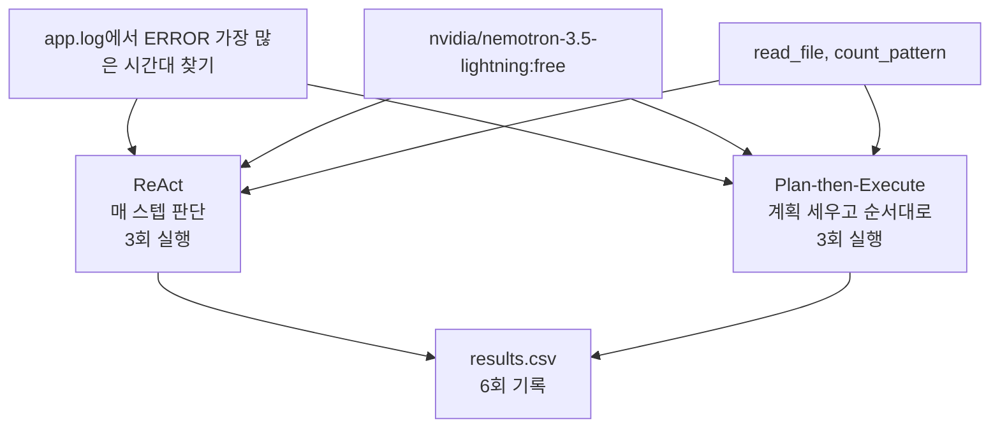

# Week 02 A/B 실험 보고서

## 1. 변형 정의

모델(nvidia/nemotron-3.5-lightning:free), 도구(read_file, count_pattern), 태스크는 동일하게 고정하고 하네스만 바꿨다.

같은 점: 도구 세분화 — 둘 다 같은 tools_shared.py를 import한다.

다른 점:
- 컨텍스트 관리: ReAct는 대화를 통째로 누적하고, plan_exec는 planner와 executor를 분리해서 쓴다.
- 종료 조건: ReAct는 모델이 "Answer:"를 출력하거나 max_steps=8이면 종료, plan_exec는 계획 단계를 다 밟으면 종료
- 에러 복구: ReAct는 도구 에러가 텍스트로 돌아와서 모델이 알아서 대응. plan_exec는 OFF_PLAN 시 재계획 1회만 허용.
- 사람 개입: ReAct는 IRREVERSIBLE 집합으로 승인 요청 가능(현재 비어있음). plan_exec는 개입 지점 없음.

## 2. 측정표

results.csv:

- react 1: O, 3595 tokens, 2 iters
- react 2: O, 4016 tokens, 2 iters
- react 3: O, 4263 tokens, 2 iters
- plan_exec 4: O, 46794 tokens, 12 iters
- plan_exec 5: O, 39978 tokens, 10 iters
- plan_exec 6: X, 73 tokens, 1 iter — JSON 파싱 실패(빈 응답)

## 3. 해석

이번 태스크에서는 ReAct가 더 좋은 성능을 보였다. react는 3번 다 성공, 토큰 평균 ~4000, 2번 반복이면 끝났다. plan_exec는 성공한 경우에도 토큰이 4만 넘고 반복이 10회 이상이었다. plan_exec-04 로그를 보면 step 3에서 이미 14:00이라는 답이 나왔는데 남은 step을 계속 실행했다. 계획을 먼저 세우고 순서대로 따라가는 구조라 중간에 답을 알아도 멈출 수가 없는 거다. 이게 종료 조건 차이가 만든 결과다. run 6은 모델이 빈 응답을 줘서 계획 파싱 자체가 실패했다. plan_exec는 모델이 JSON 형식을 지켜야 시작이라도 되는데, 무료 모델이라 그걸 못한 경우다. ReAct는 이런 형식 제약이 없어서 실패가 없었다. 단순한 작업에서는 plan_exec의 계획 단계가 오히려 오버헤드였다.

---
모델: nvidia/nemotron-3.5-lightning:free (OpenRouter), 도구: read_file, count_pattern
