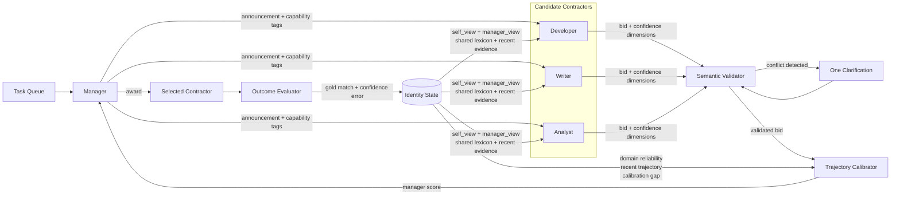
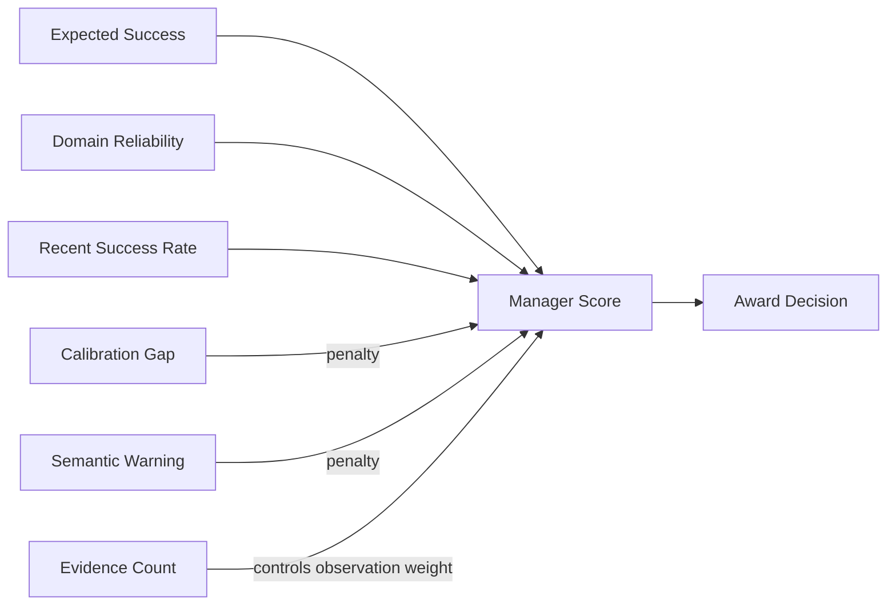

# Week 03 Contract Net

이 구현은 과제에서 요구한 Contract Net과 행위 이력 기반 정체성 확장 실험을 분리한다.

## 필수 실험

`run.py`와 `contract_net.py`가 `baseline`, `homogeneous`, `overconfident` 조건을 실행한다. Manager는 각 작업을 세 Contractor에게 공고하고, 각 Contractor는 서로 독립된 LLM 호출 한 번으로 입찰한다. 유효한 입찰 중 confidence가 가장 높은 후보가 낙찰되며 동률이면 응답 순서가 빠른 후보가 선택된다.

Manager가 보내는 공고에는 `id`와 `desc`만 있고 `gold`는 없다. JSON으로 파싱할 수 없는 응답은 입찰 포기로 처리한다. 메시지는 Contractor별 공고 1회, `participate=true`인 입찰 1회, 실제 낙찰 1회로 센다. 모델 호출 횟수와 협상 메시지 수는 별개다.

```bash
python3 run.py --condition baseline --smoke --limit 1
python3 run.py --all --runs 3
```

첫 명령은 `results.csv`에 기록하지 않는 확인용 실행이다. 두 번째 명령은 제출용 9회를 실행한다. 실행기는 저장소 루트의 `.env`에서 OpenRouter 키를 읽지만 키나 `.env`를 커밋하지 않는다.

API 응답 대기 제한은 기본 180초다. 필요하면 `AGENT_TIMEOUT_SECONDS` 환경 변수로 바꿀 수 있으며, 실제 값은 각 실행 로그의 setup event에 기록된다.

OpenRouter 무료 모델은 계정 상태에 따라 일일 호출 수가 작을 수 있다. HTTP 429가 발생하면 해당 실패 로그와 결과 행을 남기고 나머지 실행을 멈춘다. 한도가 갱신된 뒤 부족한 조건만 이어서 실행한다.

```bash
python3 run.py --condition baseline --runs 1
python3 run.py --condition homogeneous --runs 2
```

## 동적 정체성 확장

`run_extended.py`는 필수 세 조건에 영향을 주지 않는 별도 실험이다. `identity_seed.json`은 자기 서술, Manager의 관찰 평가, 양측이 공유하는 사건 기록을 분리한다.



Manager의 보정 점수는 다음 정보가 합쳐진 결과다.



- `self_view`: 당사자가 선언한 기술, 경험, 지위, 언어 습관
- `manager_view`: 입찰과 낙찰 결과를 관찰한 Manager의 가변 평가
- `shared_events`: 두 관점의 근거가 되는 입찰, 재질문, 낙찰 사건

`claimed_status`와 `derived_status`도 분리한다. 예를 들어 Contractor가 자신을 specialist라고 선언한 사실은 유지되지만, veteran은 최소 3회 낙찰과 80% 이상의 gold 일치율이 관찰된 뒤에만 Manager의 평가로 생긴다.

언어 오인을 줄이기 위해 공유 단어장만 사용하지 않고 입찰의 의미를 네 값으로 분리한다.

- `task_understanding`: 요구 사항을 이해한 정도
- `capability`: 필요한 기술을 보유했다고 판단하는 정도
- `expected_success`: 실제 성공 가능성의 추정
- `willingness`: 작업에 참여하려는 의사

Manager는 이 값들의 모순과, 작업의 공개 capability tag에 근거하지 않은 높은 능력 주장을 검사한다. 문제가 있으면 한 번만 재질문한다. 그래도 모순이 남으면 입찰은 보존하되 선택 점수를 낮춘다. 낙찰 후에는 gold 일치 여부를 공유 사건과 `manager_view`에 반영한다.

`manager_view`는 Contractor의 궤적을 세 가지로 누적한다.

- `domain_reliability`: capability tag별 낙찰 수와 gold 일치율
- `calibration`: 주장한 confidence의 평균, 실제 결과와의 평균 오차, Brier score
- `recent_trajectory`: 최근 8회 낙찰의 작업, confidence, expected success, 결과

Manager의 선택 점수는 처음에는 Contractor의 `expected_success`를 주로 사용한다. 특정 분야의 관찰 횟수가 늘면 분야별 성공률과 최근 성공률의 비중을 높이고, confidence 오차와 의미 경고를 감점한다. 관찰 가중치는 `n / (n + 4)`라서 한두 번의 결과만으로 평가가 급격하게 고정되지 않는다. 현재 실험에서는 낙찰된 Contractor의 결과만 관찰하므로, 선택되지 않은 후보의 실제 능력은 알 수 없다는 제한이 있다.

```bash
python3 run_extended.py --smoke --limit 1
python3 run_extended.py
python3 run_extended.py --continue-state
```

기본 실행은 같은 seed에서 시작하고, `--continue-state`를 사용하면 앞 실행의 관찰 기록을 이어받는다. 실행 상태는 `state/`에 저장되며 제출 파일에는 포함하지 않는다.

## 파일 구성

- `tasks.json`: 여섯 작업과 gold Contractor, 공개 capability tag
- `contract_net.py`: 필수 협상과 낙찰 규칙
- `run.py`: OpenRouter 호출, 로그, `results.csv` 기록
- `identity_seed.json`: 자기 서술, Manager 평가, 공유 단어장의 초기값
- `identity_state.py`: 자기 서술, 관찰 평가, 사건 기록과 신뢰도 갱신
- `extended_contract_net.py`: 의미 분리, 모순 탐지, 재질문, 평판 가중 낙찰
- `run_extended.py`: 확장 실험 실행기
- `extended_results.csv`, `extended_logs/`: 필수 결과와 분리한 확장 실험 기록
- `test_*.py`: 모델 호출 없이 확인하는 프로토콜 테스트

오프라인 검증은 다음과 같이 실행한다.

```bash
python3 -m unittest discover -p 'test_*.py' -v
```
