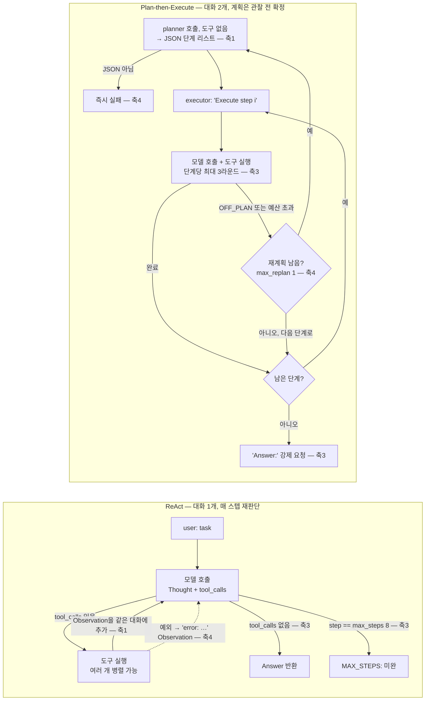
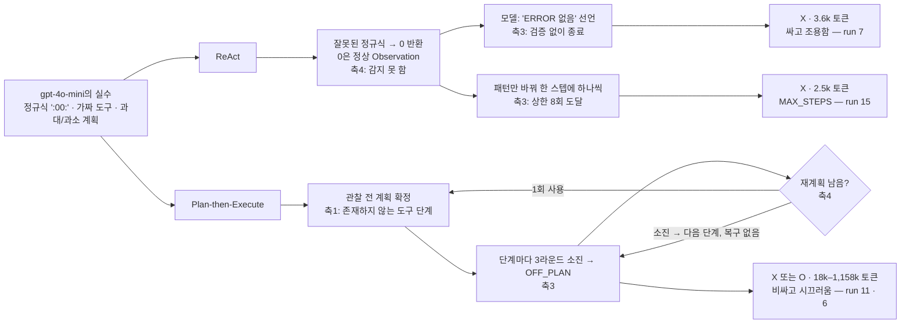
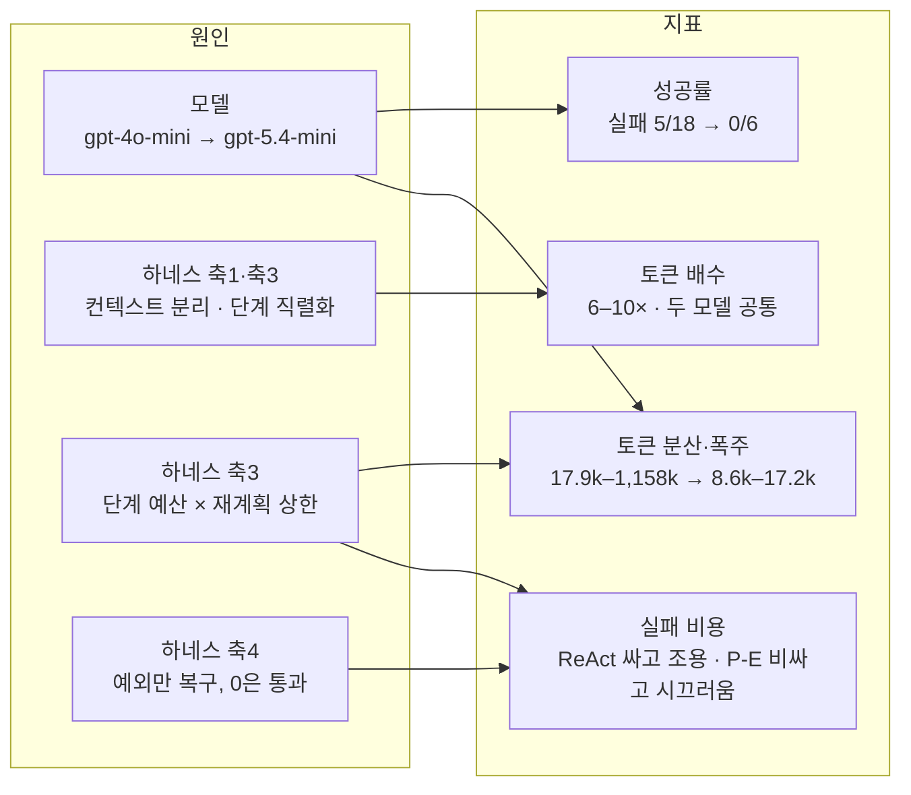

# Week 02 — 하네스 A/B: ReAct vs Plan-then-Execute

**태스크** `app.log`에서 ERROR 줄이 가장 많은 시간대(HH:00). 정답 `14:00`(14시 6건, 다음이 12시 3건). `TASK.md`의 `expected:`는 첫 실행 전에 커밋해 고정했다(`20a01e3`).
**고정 변수** 도구(`read_file`, `count_pattern`)·모델 호출·`Meter`는 두 하네스가 같은 `tools_shared.py`를 import. 스타터 코드 무수정.
**모델** 기본 18회는 `gpt-4o-mini`(행 1–18). 여기서 나온 실패 5건을 로그로 보니 하네스가 아니라 모델이 못 해서 생긴 것으로 보여, 하네스·태스크·도구·설정을 전부 그대로 두고 **모델만** `AGENT_MODEL=gpt-5.4-mini`로 바꿔 각 3회를 더 돌렸다(행 19–24). 그래서 표는 {하네스}×{모델} 2×2가 된다.

## (1) 변형 정의 — 다섯 축 중 어디가 다른가

| 축 | ReAct (`harness_react.py`) | Plan-then-Execute (`harness_plan_execute.py`) | 판정 |
|---|---|---|---|
| 1 컨텍스트 관리 | 대화 1개. 전체 이력을 매 호출에 재전송 | 대화 2개(planner는 도구 없음 / executor). **계획은 데이터를 보기 전에 확정**. executor는 "Execute step i"를 단계마다 받으며 이력이 누적 | **다름** |
| 2 도구 granularity | `tools_shared.TOOL_SPECS` 공유 | 동일 | 같음 |
| 3 종료 조건 | `max_steps=8` 상한 + 모델이 도구 호출 없이 답하면 종료 | 계획 소진 + **단계당 `max_tool_rounds=3`** + **재계획 `max_replan=1`** + 마지막에 "Answer:" 강제 | **다름** |
| 4 에러 복구 | 예외 → Observation으로 되돌려 다음 Thought가 고침 | 동일 메커니즘 + `OFF_PLAN:` 선언 시 재계획 1회. JSON 파싱 실패는 즉시 실패. 재계획 소진 후엔 복구 없이 다음 단계 | **다름** |
| 5 인간 개입 | `IRREVERSIBLE=set()` — 훅은 있으나 비어 있음 | 훅 자체가 없음 | 값 0/0으로 같고 구조만 다름 |

핵심 함정: `count_pattern`은 정규식에 매칭되는 **줄 수**만 돌려주고 시간대별 집계는 못 한다. 정답에 이르려면 (a) 시간대마다 한 번씩 9번 부르거나 (b) `read_file`로 읽은 3,022바이트를 모델이 직접 집계해야 한다. **이 판단을 데이터를 본 뒤에 하는가(ReAct), 보기 전에 하는가(Plan-Execute)** 가 축 1의 실질적 차이다.

### 두 하네스의 제어 흐름



축 2(도구)와 축 5(개입 훅, 둘 다 실효 0)는 두 그림에서 같으므로 표시하지 않았다. ReAct의 루프는 한 호출에 도구 여러 개를 실을 수 있어 `count_pattern` 9개를 한 번에 던질 수 있고, Plan-Execute는 "Execute step i"가 단계를 직렬화한다 — 토큰·호출 수 차이의 구조적 원인이다.

## (2) 측정표

### 요약 (토큰 = 입력+출력, 호출 = 모델 호출 수)

| model | harness | n | 성공 | 토큰 중앙값 | 토큰 평균 | 토큰 범위 | 호출 중앙값 | 호출 범위 | 개입 |
|---|---|---|---|---|---|---|---|---|---|
| gpt-4o-mini | react | 9 | **7/9** | 3,754 | 4,981 | 2,552–11,031 | 3 | 3–8 | 0 |
| gpt-4o-mini | plan_exec | 9 | **6/9** | 39,183 | 260,040 | 17,900–1,157,879 | 21 | 11–86 | 0 |
| gpt-5.4-mini | react | 3 | **3/3** | 1,886 | 2,604 | 1,860–4,065 | 2 | 2–3 | 0 |
| gpt-5.4-mini | plan_exec | 3 | **3/3** | 11,524 | 12,448 | 8,573–17,248 | 8 | 7–9 | 0 |

### 전체 24행 (`results.csv` 그대로; 행 1–18은 model 태그 도입 전이라 비어 있음 = gpt-4o-mini)

| run | harness | success | tokens | iters | interventions | note |
|---|---|---|---|---|---|---|
| 1 | react | O | 3,715 | 3 | 0 |  |
| 2 | react | O | 7,212 | 5 | 0 |  |
| 3 | react | O | 3,812 | 3 | 0 |  |
| 4 | plan_exec | O | 147,023 | 27 | 0 | replans=1 |
| 5 | plan_exec | O | 29,246 | 13 | 0 | replans=1 |
| 6 | plan_exec | O | 1,157,879 | 86 | 0 | replans=1 |
| 7 | react | X | 3,642 | 3 | 0 |  |
| 8 | react | O | 3,754 | 3 | 0 |  |
| 9 | react | O | 11,031 | 6 | 0 |  |
| 10 | plan_exec | O | 35,779 | 15 | 0 | replans=1 |
| 11 | plan_exec | X | 808,708 | 83 | 0 | replans=1 |
| 12 | plan_exec | X | 17,900 | 11 | 0 | replans=1 |
| 13 | react | O | 5,399 | 4 | 0 |  |
| 14 | react | O | 3,710 | 3 | 0 |  |
| 15 | react | X | 2,552 | 8 | 0 |  |
| 16 | plan_exec | X | 37,287 | 21 | 0 | replans=1 |
| 17 | plan_exec | O | 67,358 | 21 | 0 | replans=1 |
| 18 | plan_exec | O | 39,183 | 13 | 0 | replans=1 |
| 19 | react | O | 1,860 | 2 | 0 | model=gpt-5.4-mini |
| 20 | react | O | 1,886 | 2 | 0 | model=gpt-5.4-mini |
| 21 | react | O | 4,065 | 3 | 0 | model=gpt-5.4-mini |
| 22 | plan_exec | O | 11,524 | 8 | 0 | model=gpt-5.4-mini;replans=0 |
| 23 | plan_exec | O | 17,248 | 9 | 0 | model=gpt-5.4-mini;replans=0 |
| 24 | plan_exec | O | 8,573 | 7 | 0 | model=gpt-5.4-mini;replans=0 |

### gpt-4o-mini의 실패 5건 — 모델을 바꿔 다시 돌린 이유

| run | harness | 토큰 | 로그에서 본 것 | 걸린 축 |
|---|---|---|---|---|
| 7 | react | 3,642 | 정규식 `2026-09-01 09:00:.*ERROR`(분=00 리터럴) → 9개 시간대 전부 0 → *"There are no ERROR lines"* 라고 **확신하며 종료**. 직전 `read_file`로 ERROR 줄을 봤는데도 | 4(0은 정상값이라 무증상) + 3(자기 선언 종료 신뢰) |
| 15 | react | 2,552 | `ERROR [0-9]{1,2}:00`, `:01`, `:02`… **분 단위로** 매 스텝 1개씩 → 8회 상한 → `MAX_STEPS` | 3(상한이 작동, 무한루프는 막았으나 답은 없음) + 4 |
| 11 | plan_exec | 808,708 | **28단계** 계획, 매칭 불가 패턴 `'ERROR 00:00'`(로그는 시각이 ERROR 앞) → OFF_PLAN 25회 → 83회 호출 | 1(관찰 전 과대계획) + 3(단계 수 × 라운드 예산) |
| 12 | plan_exec | 17,900 | **2단계** 계획(`read_file`, `count_pattern('ERROR')`)뿐 → 시간대 집계 불가 → 예산 소진 → 포기 | 1(과소계획) + 3 |
| 16 | plan_exec | 37,287 | `analyze_result_for_hours()` 등 **존재하지 않는 도구** 3단계 → OFF_PLAN 5 → 재계획해도 가짜 → *"No ERROR lines"* | 1 + 4(재계획 1회 소진 후 무복구) |

gpt-4o-mini의 plan_exec 계획 9개 중 **8개에 실행 불가능한 단계**(가짜 함수 또는 3-인자 `count_pattern`)가 있었다. 성공한 6건도 예외가 아니며(OFF_PLAN 3–5회), 성공은 계획 *덕에* 아니라 executor가 단계 안에서 즉흥한 *덕에* 나왔다. gpt-5.4-mini의 계획 3개는 모두 3단계 자연어("Read app.log", "Count ERROR lines by hour", …)로 **가짜 도구 0, OFF_PLAN 0, 재계획 0**.

### 실패 경로 — 같은 모델 실수가 하네스마다 어떻게 다르게 끝나는가



## (3) 해석

먼저 `gpt-4o-mini`로 각 9회를 돌린 결과, 성공률은 ReAct 7/9와 Plan-Execute 6/9로 한 건 차이였지만 토큰은 Plan-Execute가 중앙값 10.4배(39,183 vs 3,754), 호출은 7배(21 vs 3)였다. 그런데 실패 5건을 로그로 뜯어보면 하네스가 아니라 **모델이 못 해서** 생긴 것이 대부분이었다 — 정규식에 분을 리터럴 `:00:`으로 박아 9개 시간대 전부 0을 받고도 "ERROR가 없다"고 답한 것(행 7), 시간대가 아니라 분 단위로 패턴을 바꿔가며 8회 상한까지 헛돈 것(행 15), `analyze_result_for_hours()`처럼 존재하지 않는 도구로 계획을 짠 것(행 16 — 성공한 계획 9개 중 8개도 같은 증상), 28단계 과대계획으로 809k 토큰을 태운 것(행 11)이다. 이것이 정말 모델의 한계인지 하네스 탓인지 가리기 위해 하네스·태스크·도구·설정을 전부 그대로 두고 `AGENT_MODEL`만 `gpt-5.4-mini`로 바꿔 각 3회를 더 돌렸다. **모델을 바꿔 진행한 실험에서는** 위 실수가 하나도 재현되지 않았다. 6회 전부 성공했고, 계획은 가짜 도구 없는 3단계 자연어("Read app.log", "Count ERROR lines by hour", …)로 OFF_PLAN 0·재계획 0이었으며, ReAct 3회 중 2회는 `count_pattern`을 아예 부르지 않고 읽은 파일을 직접 집계해 2회 호출·1,860토큰으로 끝냈다(행 19·20). **그런데 비용 격차는 그대로 남았다.** 둘 다 성공한 조건에서도 Plan-Execute는 ReAct의 토큰 6.1배(11,524 vs 1,886), 호출 4배(8 vs 2)를 썼다. 두 결과를 겹치면 지표가 갈린다 — **성공률과 분산은 모델이 움직였고, 비용 배수는 하네스가 움직였다.** 비용 배수의 출처는 축 1과 3이다. ReAct는 대화 1개에서 데이터를 본 뒤 `count_pattern` 9개를 **한 호출에 병렬로** 던져 끝내는 반면(행 1·3·8·14·21), Plan-Execute는 planner→"Execute step i"×N→"Answer:" 강제라는 **구조가 최소 호출 수를 강제**하고(완벽한 계획인 행 22조차 8회) 매 호출에 누적된 executor 이력을 재전송한다. 그리고 4o-mini의 토큰 폭주(147k·809k·1,158k, 행 4·11·6)는 모델 실수 단독이 아니라 **하네스가 그 실수를 비용으로 증폭한 결과**다. Plan-Execute의 축 3(단계당 3라운드 × 재계획 1회)은 나쁜 계획을 멈추지 않고 단계마다 예산을 태우게 해서 "종료 조건"이 아니라 "낭비 상한"으로 작동했다. ReAct의 실패는 정반대로 싸고 조용했다(3.6k·2.5k) — 축 4의 에러 복구는 예외만 잡기 때문에 잘못된 정규식이 돌려준 `0`은 정상 Observation으로 통과했고, 축 3은 모델의 "Answer:" 선언을 검증 없이 믿었다. 두 하네스 모두 **결과 검증 단계가 없다**는 점은 같아서, 둘 다 `read_file`로 ERROR 줄을 본 직후에 "ERROR가 없다"는 답을 내보낼 수 있었다(행 7·16). 정리하면 이 태스크에서 **ReAct가 토큰·호출 수로 이겼고 그 원인은 축 1(단일 컨텍스트, 관찰 후 결정)과 축 3(단계 경계 없음 → 병렬 도구 호출)**이다. 성공률 차이는 하네스보다 모델이 설명하며, 하네스의 몫은 모델의 약점을 **얼마나 비싸게 실패시키느냐**에서 드러났다.
### 축 → 지표 대응



| 지표 | 무엇이 움직였나 | 근거 |
|---|---|---|
| 토큰 | **하네스** (축 1 컨텍스트 분리·재전송, 축 3 단계 직렬화) | 두 모델 모두 Plan-Exec가 6–10× — 성공 여부와 무관 |
| 토큰 분산·폭주 | **모델 × 하네스** (계획 품질 × 축 3 단계 예산·재계획 상한) | 4o-mini plan_exec 17.9k–1,158k vs 5.4-mini 8.6k–17.2k |
| 호출 수 | **하네스 구조** (축 3: plan→N steps→final 최소 ~7 vs ReAct 최소 2) | 행 22 완벽 계획도 8회 |
| 성공률 | **모델** | 5/18 실패 → 0/6, 하네스 내 차이는 1건 |
| 실패 비용 | **하네스** — ReAct 싸고 조용(축 4 무증상 + 축 3 자기선언), Plan-Exec 비싸고 시끄러움(축 1 + 축 3) | 행 7·15 vs 11·12·16 |
| 개입 | 측정 불가 (둘 다 0) | 축 5는 react만 훅이 있고 plan_exec는 없음 — 파괴적 도구 추가 시 갈릴 지점 |

### 한계

- gpt-5.4-mini는 각 3회뿐이다(스펙 최소치). 0/6 실패는 표본이 작아 "실패율이 낮다"까지만 말할 수 있다.
- ReAct의 "읽고 머릿속으로 집계" 전략(행 19·20)은 `app.log`가 3,022바이트로 `read_file`의 4,000자 캡 안에 들기 때문에 가능했다. 로그가 더 크면 `count_pattern`이 필수가 되고 ReAct의 우위 폭은 줄 것이다 — 축 2가 갈리는 조건이며 이번엔 재지 않았다.
- 스펙이 예고한 Plan-Execute 실패 모드(JSON 파싱 실패)는 24회 중 0번 났다. 실제 실패는 전부 계획 **내용**(가짜 도구, 과대/과소)이었다.
- 두 하네스 모두 개입 도구가 없어 축 5는 비교하지 못했다.

## 재현

```bash
pip install openai
export OPENAI_API_KEY=<key>                       # 커밋 안 함
cd submissions/26510124/week-02
python run_ab.py --runs 3                        # 행 1–6, 7–12, 13–18: 3번 실행 (gpt-4o-mini, 기본값)
AGENT_MODEL=gpt-5.4-mini python run_ab.py --runs 3   # 행 19–24
```

| 항목 | 값 |
|---|---|
| provider | openai (`ANTHROPIC_API_KEY` 미설정 → `tools_shared.py`가 자동 선택), `OPENAI_BASE_URL` 미설정 |
| model | `gpt-4o-mini` (행 1–18, 기본값) / `gpt-5.4-mini` (행 19–24, `AGENT_MODEL`), 5.4-mini는 reasoning effort 기본 `none` |
| 하네스 설정 | `max_steps=8`, `max_replan=1`, `max_tool_rounds=3` (스타터 기본값, 무수정) |
| 도구 스키마 | `tools_shared.TOOL_SPECS` 그대로 |
| 코드 변경 | `run_ab.py`에 `note`열 `model=` 태그 1줄(`571fcfd`)만. 행 1–18은 그 전 실행 |
| 입력 | `app.log` 스타터 원본, `TASK.md` `expected: 14:00` 선커밋 |
| 로그 | `logs/<harness>-<run>.txt` 24개, `run_ab.py`가 기록, 무편집 |

코딩 에이전트(Claude, Fable 5.1)를 실행·집계·초안에 사용했다. 무엇을 시켰고 무엇을 버렸는지는 커밋 히스토리에 있다(첫 6회를 실수로 돌려 폐기한 것 포함, 커밋 전이라 히스토리엔 없고 본 보고서에만 적는다).
