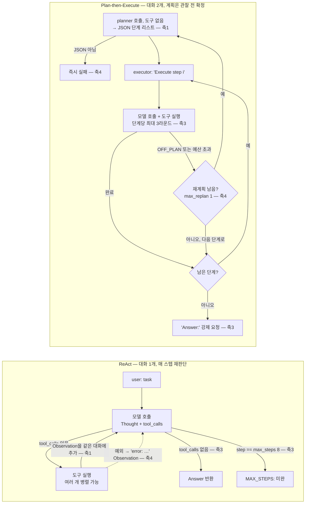
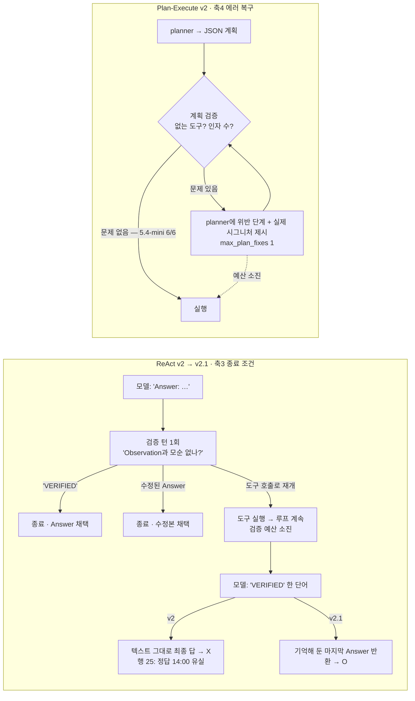
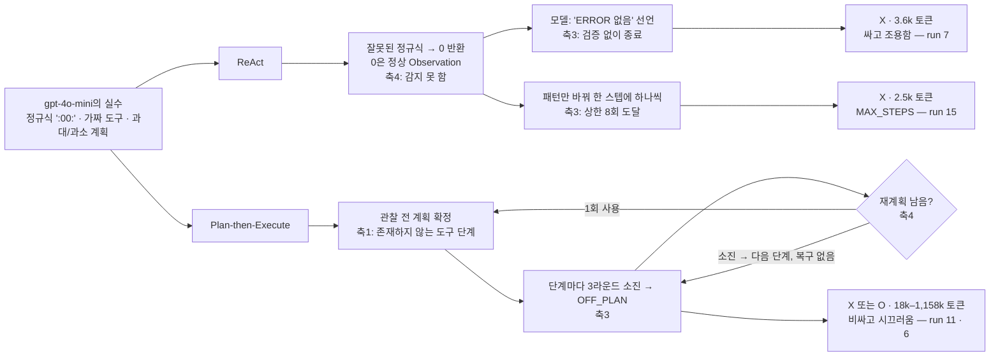
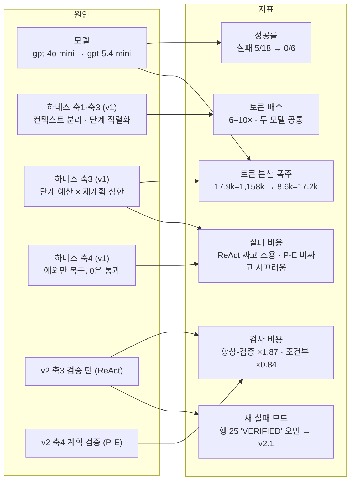

# Week 02 — 하네스 A/B: ReAct vs Plan-then-Execute (스타터 v1 → 직접 설계한 v2)

**태스크** `app.log`에서 ERROR 줄이 가장 많은 시간대(HH:00). 정답 `14:00`(14시 6건, 다음 12시 3건). `TASK.md`의 `expected:`는 첫 실행 전에 커밋해 고정했다(`20a01e3`).
**고정 변수** 도구(`read_file`, `count_pattern`)·모델 호출·`Meter`는 두 하네스가 같은 `tools_shared.py`를 import. 태스크·입력 파일 무수정.

**진행 구조 — 총 42회, 세 단계**

| 단계 | 하네스 | 모델 | 회수 | 행 | 성격 |
|---|---|---|---|---|---|
| **v1** | 스타터 그대로 | gpt-4o-mini | 9+9 | 1–18 | 처음에는 이것을 과제로 이해하고 돌렸다. 수업 재설명으로 "하네스를 **직접 설계**해 비교"가 요구임을 확인한 뒤, 지우지 않고 **통제군**으로 남겼다 |
| v1 | 스타터 그대로 | gpt-5.4-mini | 3+3 | 19–24 | v1 실패가 모델 한계인지 가리기 위한 모델 교체 |
| **v2** | **하네스당 축 하나씩 바꿈** | gpt-5.4-mini | 6+6 | 25–36 | 과제 본체 |
| v2.1 | v2 ReAct의 종료 결함 수정 | gpt-5.4-mini | ReAct 6 | 37–42 | 행 25에서 드러난 결함을 고친 뒤 재측정 |

v1 하네스 원본은 `v1_unmodified/`에 보존했다. 최상위 `harness_*.py`는 v2.1이다.

## (1) 변형 정의

### 1-a. v1 — 스타터의 두 하네스가 다섯 축 중 어디가 다른가

| 축 | ReAct | Plan-then-Execute | 판정 |
|---|---|---|---|
| 1 컨텍스트 관리 | 대화 1개. 전체 이력을 매 호출에 재전송 | 대화 2개(planner는 도구 없음 / executor). **계획은 데이터를 보기 전에 확정**. executor는 "Execute step i"를 단계마다 받으며 이력 누적 | **다름** |
| 2 도구 granularity | `tools_shared.TOOL_SPECS` 공유 | 동일 | 같음 |
| 3 종료 조건 | `max_steps=8` 상한 + 모델이 도구 호출 없이 답하면 종료 | 계획 소진 + **단계당 `max_tool_rounds=3`** + **재계획 `max_replan=1`** + 마지막에 "Answer:" 강제 | **다름** |
| 4 에러 복구 | 예외 → Observation으로 되돌려 다음 Thought가 고침 | 동일 메커니즘 + `OFF_PLAN:` 선언 시 재계획 1회. JSON 파싱 실패는 즉시 실패. 재계획 소진 후엔 복구 없이 다음 단계 | **다름** |
| 5 인간 개입 | `IRREVERSIBLE=set()` — 훅은 있으나 비어 있음 | 훅 자체가 없음 | 값 0/0으로 같고 구조만 다름 |

핵심 함정: `count_pattern`은 정규식에 매칭되는 **줄 수**만 돌려주고 시간대별 집계는 못 한다. 정답에 이르려면 (a) 시간대마다 한 번씩 9번 부르거나 (b) `read_file`로 읽은 3,022바이트를 모델이 직접 집계해야 한다. 이 판단을 **데이터를 본 뒤에 하는가(ReAct), 보기 전에 하는가(Plan-Execute)** 가 축 1의 실질적 차이다.

### 두 하네스의 제어 흐름 (v1)



### 1-b. v2 — 내가 바꾼 축 (하네스당 하나, 나머지는 v1과 동일)

| 하네스 | 바꾼 축 | v1 | v2 | 겨냥한 v1 실패 |
|---|---|---|---|---|
| **ReAct** | **3 종료 조건** | 모델이 도구 없이 답하면 즉시 종료 | Answer 뒤 **검증 턴 1회**(`max_verify=1`): "Observation과 모순이 없는지 확인. 없으면 `VERIFIED`, 있으면 계속 작업해 수정된 Answer". `VERIFIED`→종료 / 수정 Answer→종료 / 도구 호출→루프 계속 | 행 7·16형 — 읽은 파일에 ERROR가 있는데 "ERROR 없음"을 **확신하며 종료** |
| **Plan-Execute** | **4 에러 복구** | 계획을 그대로 실행 | 실행 전 **계획 검증**: `name(...)` 꼴 단계가 실제 도구 이름·인자 수(`read_file` 1, `count_pattern` 2)와 맞지 않으면 위반 단계와 실제 시그니처를 planner에 되돌려 수정 요구(`max_plan_fixes=1`). 산문 단계("Count ERROR lines by hour")는 통과 — 그 실행 방법은 executor 몫. 재계획 결과에도 같은 검사 | 4o-mini 계획 9개 중 8개의 가짜 도구 단계(`extract_hour_from_timestamp(...)`, 3-인자 `count_pattern`) |

둘 다 "검사 단계 하나 추가"라는 대칭 설계이고, 도구(축 2)·프롬프트·예산 상한은 건드리지 않았다. 검증 문구는 태스크 지식을 담지 않는다(계획 검증의 도구 목록은 `TOOL_SPECS`에서 생성).

**v2.1** — v2 ReAct 행 25에서 드러난 종료 프로토콜 결함(아래 2절)을 고친 것. 마지막 `Answer:` 줄을 기억해 두고, 검증 예산 소진 뒤 모델이 `VERIFIED` 한 단어로 답하면 그 Answer를 반환한다. 축 3 안의 보정이며 다른 축은 그대로.



## (2) 측정표

### 요약 (토큰 = 입력+출력, 호출 = 모델 호출 수, 개입은 전부 0)

| variant | model | harness | n | 성공 | 토큰 중앙값 | 토큰 평균 | 토큰 범위 | 호출 중앙값 | 호출 범위 |
|---|---|---|---|---|---|---|---|---|---|
| v1 | gpt-4o-mini | react | 9 | **7/9** | 3,754 | 4,981 | 2,552–11,031 | 3 | 3–8 |
| v1 | gpt-4o-mini | plan_exec | 9 | **6/9** | 39,183 | 260,040 | 17,900–1,157,879 | 21 | 11–86 |
| v1 | gpt-5.4-mini | react | 3 | **3/3** | 1,886 | 2,604 | 1,860–4,065 | 2 | 2–3 |
| v1 | gpt-5.4-mini | plan_exec | 3 | **3/3** | 11,524 | 12,448 | 8,573–17,248 | 8 | 7–9 |
| v2 | gpt-5.4-mini | react | 6 | **5/6** | 3,534 | 3,900 | 3,483–5,780 | 3 | 3–4 |
| v2 | gpt-5.4-mini | plan_exec | 6 | **6/6** | 9,719 | 11,999 | 8,694–21,895 | 7 | 7–11 |
| v2.1 | gpt-5.4-mini | react | 6 | **6/6** | 3,606 | 4,386 | 3,501–6,102 | 3 | 3–4 |

### v1 gpt-4o-mini의 실패 5건 — 모델을 바꿔 다시 돌린 이유

| run | harness | 토큰 | 로그에서 본 것 | 걸린 축 |
|---|---|---|---|---|
| 7 | react | 3,642 | 정규식 `2026-09-01 09:00:.*ERROR`(분=00 리터럴) → 9개 시간대 전부 0 → *"There are no ERROR lines"* 라고 **확신하며 종료**. 직전 `read_file`로 ERROR 줄을 봤는데도 | 4(0은 정상값이라 무증상) + 3(자기 선언 종료 신뢰) |
| 15 | react | 2,552 | `ERROR [0-9]{1,2}:00`, `:01`, `:02`… **분 단위로** 매 스텝 1개씩 → 8회 상한 → `MAX_STEPS` | 3(상한이 작동, 무한루프는 막았으나 답은 없음) + 4 |
| 11 | plan_exec | 808,708 | **28단계** 계획, 매칭 불가 패턴 `'ERROR 00:00'`(로그는 시각이 ERROR 앞) → OFF_PLAN 25회 → 83회 호출 | 1(관찰 전 과대계획) + 3(단계 수 × 라운드 예산) |
| 12 | plan_exec | 17,900 | **2단계** 계획(`read_file`, `count_pattern('ERROR')`)뿐 → 시간대 집계 불가 → 예산 소진 → 포기 | 1(과소계획) + 3 |
| 16 | plan_exec | 37,287 | `analyze_result_for_hours()` 등 **존재하지 않는 도구** 3단계 → OFF_PLAN 5 → 재계획해도 가짜 → *"No ERROR lines"* | 1 + 4(재계획 1회 소진 후 무복구) |

gpt-4o-mini의 plan_exec 계획 9개 중 **8개에 실행 불가능한 단계**가 있었다. 성공한 6건도 예외가 아니며(OFF_PLAN 3–5회), 성공은 계획 *덕에* 아니라 executor가 단계 안에서 즉흥한 *덕에* 나왔다. gpt-5.4-mini의 계획(v1 3개, v2 6개)은 모두 3–4단계 산문으로 **가짜 도구 0**.

### v1 실패 경로 — 같은 모델 실수가 하네스마다 어떻게 다르게 끝나는가



### v2의 실패 1건 — 행 25, 하네스 결함

| run | harness | 토큰 | 로그에서 본 것 | 걸린 축 |
|---|---|---|---|---|
| 25 | react v2 | 5,780 | `Answer: 14:00`(정답) → 검증 턴 → 모델이 **`count_pattern` 9개로 재확인**(14시=6, 전부 정답 방향) → 다음 턴에 **`VERIFIED` 한 단어** → 검증 예산이 소진된 하네스가 이 텍스트를 **최종 답으로 수용** → 판정기가 "VERIFIED"에서 14:00을 못 찾음 | **3** — 내가 추가한 종료 프로토콜의 결함. 검증 신호(`VERIFIED`)가 검증 턴 밖에서도 나올 수 있는데 하네스가 마지막 Answer를 기억하지 않았다 |

정답을 찾고, 도구로 재확인까지 하고, **하네스가 잃어버린** 경우다. v2.1에서 수정했고(`2e96e69`), 재측정 6회는 6/6.

### 전체 42행 (`results.csv` 그대로; 행 1–18은 model/variant 태그 도입 전 = v1·gpt-4o-mini, 행 19–24는 v1)

| run | harness | success | tokens | iters | interventions | note |
|---|---|---|---|---|---|---|
| 1 | react | O | 3,715 | 3 | 0 |  |
| 2 | react | O | 7,212 | 5 | 0 |  |
| 3 | react | O | 3,812 | 3 | 0 |  |
| 4 | plan_exec | O | 147,023 | 27 | 0 | replans=1 |
| 5 | plan_exec | O | 29,246 | 13 | 0 | replans=1 |
| 6 | plan_exec | O | 1,157,879 | 86 | 0 | replans=1 |
| 7 | react | X | 3,642 | 3 | 0 |  |
| 8 | react | O | 3,754 | 3 | 0 |  |
| 9 | react | O | 11,031 | 6 | 0 |  |
| 10 | plan_exec | O | 35,779 | 15 | 0 | replans=1 |
| 11 | plan_exec | X | 808,708 | 83 | 0 | replans=1 |
| 12 | plan_exec | X | 17,900 | 11 | 0 | replans=1 |
| 13 | react | O | 5,399 | 4 | 0 |  |
| 14 | react | O | 3,710 | 3 | 0 |  |
| 15 | react | X | 2,552 | 8 | 0 |  |
| 16 | plan_exec | X | 37,287 | 21 | 0 | replans=1 |
| 17 | plan_exec | O | 67,358 | 21 | 0 | replans=1 |
| 18 | plan_exec | O | 39,183 | 13 | 0 | replans=1 |
| 19 | react | O | 1,860 | 2 | 0 | model=gpt-5.4-mini |
| 20 | react | O | 1,886 | 2 | 0 | model=gpt-5.4-mini |
| 21 | react | O | 4,065 | 3 | 0 | model=gpt-5.4-mini |
| 22 | plan_exec | O | 11,524 | 8 | 0 | model=gpt-5.4-mini;replans=0 |
| 23 | plan_exec | O | 17,248 | 9 | 0 | model=gpt-5.4-mini;replans=0 |
| 24 | plan_exec | O | 8,573 | 7 | 0 | model=gpt-5.4-mini;replans=0 |
| 25 | react | X | 5,780 | 4 | 0 | variant=v2;model=gpt-5.4-mini;verify=rejected-then-accepted |
| 26 | react | O | 3,535 | 3 | 0 | variant=v2;model=gpt-5.4-mini;verify=confirmed |
| 27 | react | O | 3,534 | 3 | 0 | variant=v2;model=gpt-5.4-mini;verify=confirmed |
| 28 | react | O | 3,541 | 3 | 0 | variant=v2;model=gpt-5.4-mini;verify=confirmed |
| 29 | react | O | 3,483 | 3 | 0 | variant=v2;model=gpt-5.4-mini;verify=confirmed |
| 30 | react | O | 3,530 | 3 | 0 | variant=v2;model=gpt-5.4-mini;verify=confirmed |
| 31 | plan_exec | O | 8,839 | 7 | 0 | variant=v2;model=gpt-5.4-mini;replans=0;planfix=0;invalid_left=0 |
| 32 | plan_exec | O | 8,694 | 7 | 0 | variant=v2;model=gpt-5.4-mini;replans=0;planfix=0;invalid_left=0 |
| 33 | plan_exec | O | 9,583 | 7 | 0 | variant=v2;model=gpt-5.4-mini;replans=0;planfix=0;invalid_left=0 |
| 34 | plan_exec | O | 9,855 | 7 | 0 | variant=v2;model=gpt-5.4-mini;replans=0;planfix=0;invalid_left=0 |
| 35 | plan_exec | O | 13,130 | 8 | 0 | variant=v2;model=gpt-5.4-mini;replans=0;planfix=0;invalid_left=0 |
| 36 | plan_exec | O | 21,895 | 11 | 0 | variant=v2;model=gpt-5.4-mini;replans=0;planfix=0;invalid_left=0 |
| 37 | react | O | 3,626 | 3 | 0 | variant=v2.1;model=gpt-5.4-mini;verify=revised |
| 38 | react | O | 3,585 | 3 | 0 | variant=v2.1;model=gpt-5.4-mini;verify=confirmed |
| 39 | react | O | 6,001 | 4 | 0 | variant=v2.1;model=gpt-5.4-mini;verify=confirmed |
| 40 | react | O | 3,503 | 3 | 0 | variant=v2.1;model=gpt-5.4-mini;verify=confirmed |
| 41 | react | O | 3,501 | 3 | 0 | variant=v2.1;model=gpt-5.4-mini;verify=confirmed |
| 42 | react | O | 6,102 | 4 | 0 | variant=v2.1;model=gpt-5.4-mini;verify=revised |

## (3) 해석

먼저 스타터 하네스 그대로(v1) `gpt-4o-mini`로 각 9회를 돌린 결과, 성공률은 ReAct 7/9와 Plan-Execute 6/9로 한 건 차이였지만 토큰은 Plan-Execute가 중앙값 10.4배(39,183 vs 3,754), 호출은 7배(21 vs 3)였다. 실패 5건을 로그로 뜯어보면 하네스가 아니라 **모델이 못 해서** 생긴 것이 대부분이었다 — 정규식에 분을 리터럴 `:00:`으로 박아 9개 시간대 전부 0을 받고도 "ERROR가 없다"고 답한 것(행 7), 분 단위로 패턴을 바꿔가며 8회 상한까지 헛돈 것(행 15), 존재하지 않는 도구로 계획을 짠 것(행 16, 성공한 계획 8/9도 같은 증상), 28단계 과대계획으로 809k 토큰을 태운 것(행 11). 그래서 하네스·태스크·도구를 그대로 두고 `AGENT_MODEL`만 `gpt-5.4-mini`로 바꿔 각 3회를 돌렸더니 위 실수가 하나도 재현되지 않았고(6/6), **그런데 비용 격차는 그대로 남았다**(Plan-Execute가 토큰 6.1배, 호출 4배). 여기까지의 결론은 **성공률과 분산은 모델이, 비용 배수는 하네스가 움직였다**는 것이고, 비용 배수의 출처는 축 1과 3이다 — ReAct는 데이터를 본 뒤 `count_pattern` 9개를 한 호출에 병렬로 던지는 반면, Plan-Execute는 planner→"Execute step i"×N→"Answer:" 강제라는 구조가 최소 호출 수를 강제하고(완벽한 계획인 행 22도 8회) 매 호출에 누적 이력을 재전송한다. 4o-mini의 토큰 폭주(147k·809k·1,158k)는 모델 실수 단독이 아니라 축 3(단계당 3라운드 × 재계획 1회)이 나쁜 계획을 멈추지 않고 단계마다 예산을 태우게 한 **하네스의 증폭**이었고, ReAct의 실패는 반대로 싸고 조용했다 — 축 4가 예외만 잡아 잘못된 정규식의 `0`을 정상 Observation으로 통과시키고, 축 3이 모델의 "Answer:" 선언을 검증 없이 믿었기 때문이다. **그래서 v2에서 바로 그 두 지점을 고쳤다.** ReAct에는 축 3에 검증 턴을, Plan-Execute에는 축 4에 계획 검증을 넣고 `gpt-5.4-mini`로 각 6회를 돌렸다. 결과는 두 검사의 **비용 구조가 정반대**라는 것이다. ReAct의 검증 턴은 **항상** 실행되므로 호출이 정확히 +1(2→3), 토큰이 ×1.87(1,886→3,534)로 거의 두 배가 됐다 — 전체 컨텍스트를 한 번 더 보내는 값이다 — 반면 잡아낸 오류는 0건이었다(5.4-mini는 v1에서도 틀리지 않았으므로). Plan-Execute의 계획 검증은 **오류가 있을 때만** 비용이 드는데 5.4-mini의 계획은 6개 모두 산문이라 검사에 걸리는 것이 없었고(`planfix=0`), 토큰은 ×0.84(11,524→9,719, n=3 vs 6이라 노이즈 범위)로 사실상 변화가 없었다. 두 검사 모두 이 모델에서는 **성공률을 올리지 못했다 — 올릴 실패가 없었기 때문이다.** 검증 단계의 가치는 모델이 틀릴 때만 실현되므로, 강한 모델 위에서는 항상-검증(ReAct v2)은 순비용이고 조건부-검증(Plan-Execute v2)은 공짜에 가깝다. 그리고 v2는 예상 밖의 것을 하나 더 보여줬다. 행 25에서 ReAct v2는 정답을 낸 뒤 검증 턴에 반응해 도구로 재확인까지 했는데, 마지막에 모델이 `VERIFIED` 한 단어로 답하자 예산이 소진된 하네스가 그 단어를 최종 답으로 수용해 **정답을 잃었다.** 하네스에 단계를 하나 추가하면 그 단계의 신호 파싱이 **새 종료 조건 실패 지점**이 된다 — 스펙이 Plan-Execute의 JSON 파싱 실패를 예고했던 것과 같은 종류의 실패가, 내가 넣은 검증 프로토콜에서 나왔다. v2.1에서 마지막 Answer를 기억하도록 고치자 6/6(토큰 중앙 3,606, 검증 4건 confirmed·2건 revised)이 됐다. 정리하면 이 태스크에서 **ReAct가 토큰·호출로 이겼고 그 원인은 축 1·3(단일 컨텍스트, 관찰 후 결정, 병렬 도구 호출)**이며, 성공률은 하네스보다 모델이 설명하고, 내가 추가한 검증은 이 모델에서는 비용만 남겼다 — 그 비용이 얼마인지(항상-검증 ×1.87, 조건부-검증 ×1.0)를 재고, 검증 자체가 새 실패를 만들 수 있음을 확인한 것이 v2의 소득이다.

### 축 → 지표 대응



| 지표 | 무엇이 움직였나 | 근거 |
|---|---|---|
| 토큰 배수 (P-E / ReAct) | **하네스 v1 축 1·3** | 두 모델 모두 6–10× — 성공 여부와 무관 |
| 토큰 분산·폭주 | **모델 × 하네스 축 3** | 4o-mini P-E 17.9k–1,158k vs 5.4-mini 8.6k–17.2k |
| 호출 수 | **하네스 구조(축 3)** | P-E 최소 ~7 vs ReAct 최소 2; 행 22 완벽 계획도 8회 |
| 성공률 | **모델** | 5/18 실패 → 0/6; 하네스 내 차이는 1건 |
| 실패 비용 | **하네스** | ReAct 2.5–3.6k 조용 / P-E 18k–809k 시끄러움 |
| ReAct 검증 턴 (v2, 축 3) | 호출 +1, **토큰 ×1.87** | 컨텍스트 전체 재전송; 잡은 오류 0 (5.4-mini) |
| 검증 프로토콜 결함 (v2, 축 3) | 성공 1건 유실 (행 25) | `VERIFIED`를 답으로 오인 → v2.1 (6/6) |
| 계획 검증 (v2, 축 4) | 비용 0 (`planfix` 0/6), 토큰 ×0.84 | 산문 계획은 검사 대상이 아님 → 5.4-mini에서 무작동 |
| 개입 | 측정 불가 (전부 0) | 축 5는 react만 훅이 있고 plan_exec는 없음 |

### 한계

- **v2·v2.1은 gpt-5.4-mini에서만 돌렸다.** 두 검증이 겨냥한 실패(행 7·16형, 가짜 도구 계획)는 4o-mini에서만 났으므로, 검증이 그 실패를 실제로 **막는지**는 측정하지 않았다. 여기서 잰 것은 검증의 **비용**과 새 실패 모드다.
- 5.4-mini 표본은 v1 3회, v2 6회, v2.1 6회(ReAct)다. "실패율 0"은 표본 크기 안에서의 진술이다. Plan-Execute v2의 토큰 ×0.84는 노이즈 범위다.
- ReAct의 "읽고 머릿속으로 집계"(v1 행 19·20, v2 다수: `count_pattern` 0회)는 `app.log`가 3,022바이트로 `read_file`의 4,000자 캡 안에 들기 때문에 가능했다. 로그가 더 크면 축 2가 갈리는 조건이 되며 이번엔 재지 않았다.
- 스타터 executor의 `startswith("OFF_PLAN")` 판정은 모델이 `Answer: OFF_PLAN: …`으로 쓰면 걸리지 않는다(행 31·32). v1부터 있던 프로토콜 모호성이고 v2는 손대지 않았다.
- 스펙이 예고한 JSON 파싱 실패는 42회 중 0번. 축 5(개입)는 두 하네스 모두 훅이 비어 비교하지 못했다.

## 재현

```bash
pip install openai
export OPENAI_API_KEY=<key>                       # 커밋 안 함
cd submissions/26510124/week-02

# v1 (행 1–24): 최상위 harness_*.py는 지금 v2.1이므로 v1 원본을 먼저 되돌린다
cp v1_unmodified/harness_react.py v1_unmodified/harness_plan_execute.py .
python run_ab.py --runs 3 --tag v1                # ×3 → gpt-4o-mini (기본값)
AGENT_MODEL=gpt-5.4-mini python run_ab.py --runs 3 --tag v1

# v2 (행 25–36): git checkout a7b4fdf -- harness_react.py harness_plan_execute.py
AGENT_MODEL=gpt-5.4-mini python run_ab.py --runs 6 --tag v2

# v2.1 (행 37–42): git checkout 2e96e69 -- harness_react.py   (= 현재 최상위 파일)
AGENT_MODEL=gpt-5.4-mini python run_ab.py --runs 6 --tag v2.1 --only react
```

| 항목 | 값 |
|---|---|
| provider | openai (`ANTHROPIC_API_KEY` 미설정 → `tools_shared.py` 자동 선택), `OPENAI_BASE_URL` 미설정 |
| model | `gpt-4o-mini`(행 1–18, 기본값) / `gpt-5.4-mini`(행 19–42, `AGENT_MODEL`; reasoning effort 기본 `none`) |
| v1 하네스 설정 | `max_steps=8`, `max_replan=1`, `max_tool_rounds=3` (스타터 기본값) |
| v2 추가 설정 | ReAct `max_verify=1`; Plan-Execute `max_plan_fixes=1` |
| 도구 스키마 | `tools_shared.TOOL_SPECS` 무수정 |
| 코드 변경 커밋 | `571fcfd` run_ab note에 `model=` · `a7b4fdf` v2 하네스 + `--tag` + `v1_unmodified/` · `2e96e69` v2.1 + `--only` |
| 실행 커밋 | v1 `68de802` `195903a` `dcdfa84` `bd715c8` · v2 `6d591b0` · v2.1 `ff8a15b` |
| 입력 | `app.log` 스타터 원본, `TASK.md` `expected: 14:00` 선커밋 |
| 로그 | `logs/<harness>-<run>.txt` 42개, `run_ab.py`가 기록, 무편집 |

코딩 에이전트(Claude, Fable 5.1)를 세팅·실행·집계·초안에 썼다. 무엇을 시켰고 무엇을 버렸는지는 커밋 히스토리에 있다 — 첫 6회를 계획 확정 전에 돌려 폐기한 것(커밋 전이라 히스토리엔 없음), `max_tool_rounds` 3→9 변형을 검토 후 취소한 것, v1을 과제로 오해했다가 통제군으로 돌린 것, v2 ReAct의 종료 결함(행 25)과 v2.1 수정까지.
