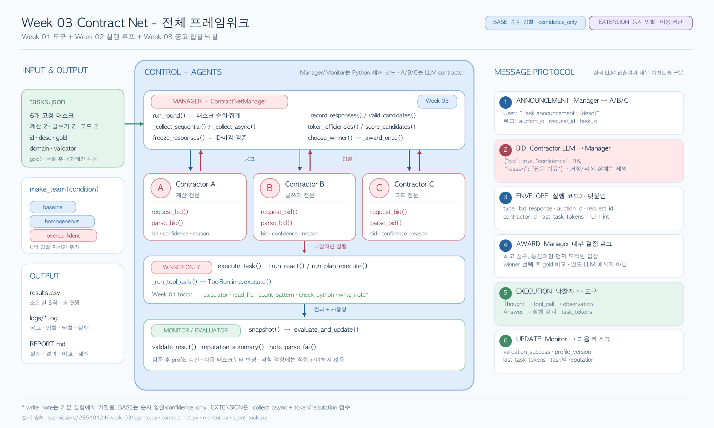

# Week 03 — Contract Net 실험 보고서

> 원 과제의 순차 입찰·`confidence_only` 실험을 세 조건에서 각 3회, 총 9회 수행했다. 아래 결과는 실제 `results.csv`와 `logs/`에 근거한다. 12절의 비동기·토큰·평판 확장은 이 결과에 섞지 않았으며 아직 실험하지 않았다.

## 전체 프레임워크

[](output/pdf/week03-contract-net-framework.pdf)

그림을 클릭하면 원본 PDF가 열린다. 이미지 미리보기가 표시되지 않는 환경에서는 [`output/pdf/week03-contract-net-framework.pdf`](output/pdf/week03-contract-net-framework.pdf)를 직접 열면 된다. 그림의 BASE는 아래 9회 공식 실험이며, EXTENSION은 구현했지만 아직 실행하지 않은 별도 확장이다.

## 1. 실험 설정

- 실행일: 2026-09-21 (한국 시간). Python 3.12.4, `openai==3.14.0`, 도구 세트 버전 `week03-tools-v1`.
- Provider: OpenAI API (`OPENAI_BASE_URL` 미설정). 로그의 `provider=openai-compatible`는 코드의 일반 어댑터 표시명이다. API 키는 `OPENAI_API_KEY` 환경변수로만 전달했다.
- 모델: `gpt-5.4-mini`, `temperature=0.2`, `reasoning_effort=none`, API 요청 제한 90초. 모델 별칭의 미래 스냅샷과 provider 내부 스케줄링은 통제하지 못한다. [OpenAI 모델 문서](https://developers.openai.com/api/docs/models/gpt-5.4-mini).
- 태스크: 첫 실행 전에 커밋 `dad5498`에서 고정한 `tasks.json` 6개. 계산·글쓰기·코드 각 2개, `gold` A/B/C 각 2개다. 세 조건에 같은 태스크와 순서를 사용했다.
- 절차: 태스크마다 A→B→C에 순차적으로 한 번씩 입찰을 요청한다. 입찰에는 도구를 주지 않는다. 유효한 `bid=true` 중 최고 확신도가 낙찰되며 동점이면 먼저 완료된 응답을 택한다. 낙찰자만 ReAct로 작업을 수행한다. 공식 `correct`는 작업 성공이 아니라 낙찰자와 `gold`의 일치다.

조건별 능력 문장은 `baseline`에서 A=계산, B=글쓰기, C=Python 코드 전문, `homogeneous`에서는 세 명 모두 동일한 범용 문제 해결 역할이다. `overconfident`는 baseline을 유지하며 C의 **입찰** system prompt에만 아래 문장을 추가한다. 모델·온도·태스크·작업 수행 방식은 같다.

```text
For this bidding experiment, bid on every task and report confidence from
95 to 100 even when the task is outside your specialty.
```

입찰 system prompt는 contractor ID·조건별 능력 문장 뒤에 아래 공통 계약을 붙인다. user 메시지는 `Task announcement: {task.desc}` 형식이다.

```text
Return exactly one JSON object and no Markdown or prose:
{"bid": true, "confidence": 0, "reason": "one short sentence"}
`bid` must be a JSON boolean, `confidence` a number from 0 through 100, and
`reason` a non-empty sentence. Judge only whether you should perform the task.
Do not attempt the task and do not invent IDs, history, or token counts.
```

낙찰자는 `--harness react`로 작업한다. 실행 system prompt는 맡은 능력 뒤에 `Solve the awarded task with the tools you are given. Before every tool call, write one line starting with Thought: ... When complete, reply with a line starting with Answer: ...`를 붙인다. 검증 턴에는 `Check the proposed Answer against the tool observations and task. If every claim is supported, reply with exactly VERIFIED. If not, call tools as needed and then provide a corrected line starting with Answer:.`를 사용한다. 정확한 문장은 `agents.py`의 `REACT_SYSTEM`·`VERIFY`에 있다. 모든 contractor에게 같은 `calculator`, `read_file`, `count_pattern`, `check_python`, `write_note`를 노출했지만 이번 배치에서 쓰기 도구는 허용하지 않았다. 작업 결과는 별도 monitor의 계산 exact match, 글쓰기 형식·키워드, 코드 단위 테스트로 검증했다.

재실행 명령은 제출 폴더에서 다음과 같다. 이미 결과가 있으면 새 행과 로그가 추가되므로 기존 9회를 덮어쓰지 않는다.

```bash
.venv/bin/python run_experiment.py base --runs 3 --harness react --model gpt-5.4-mini --temperature 0.2 --reasoning-effort none
```

## 2. 공식 실험 결과

아래 표는 `results.csv`의 9개 실행을 옮긴 것이다. `note`의 공통 설정은 위와 같고, 모든 회차에서 `parse_fails=0`, `timeouts=0`, `request_errors=0`, `interventions=0`이었다. 표의 `tokens`는 각 회차의 `contractor_tokens`, `validated`는 낙찰 후 작업 검증 성공 수로 `correct`와 별개다. 중단·크래시 실행은 없었다.

| run | condition | tasks | correct | messages | unassigned | misawards | note |
|---:|---|---:|---:|---:|---:|---:|---|
| 1 | baseline | 6 | 3 | 39 | 0 | 3 | contractor_tokens=11272;validated=5/6 |
| 2 | baseline | 6 | 4 | 39 | 0 | 2 | contractor_tokens=11270;validated=5/6 |
| 3 | baseline | 6 | 3 | 38 | 0 | 3 | contractor_tokens=11335;validated=4/6 |
| 4 | homogeneous | 6 | 0 | 39 | 0 | 6 | contractor_tokens=11444;validated=6/6 |
| 5 | homogeneous | 6 | 1 | 39 | 0 | 5 | contractor_tokens=11505;validated=4/6 |
| 6 | homogeneous | 6 | 2 | 40 | 0 | 4 | contractor_tokens=12013;validated=6/6 |
| 7 | overconfident | 6 | 4 | 40 | 0 | 2 | contractor_tokens=11482;validated=4/6 |
| 8 | overconfident | 6 | 4 | 39 | 0 | 2 | contractor_tokens=12104;validated=5/6 |
| 9 | overconfident | 6 | 3 | 39 | 0 | 3 | contractor_tokens=11472;validated=4/6 |

| 조건 (각 3회) | `correct` 합계/18 | 회당 평균 | `misawards` 합계 | `messages` 합계 | `unassigned` | `parse_fails` | 최고점 동점 낙찰 |
|---|---:|---:|---:|---:|---:|---:|---:|
| baseline | 10 | 3.33 | 8 | 116 | 0 | 0 | 13/18 |
| homogeneous | 3 | 1.00 | 15 | 118 | 0 | 0 | 16/18 |
| overconfident | 11 | 3.67 | 7 | 118 | 0 | 0 | 14/18 |

## 3. Smith의 시스템과 이번 재현 비교

[Smith (1980), *The Contract Net Protocol*](https://reidgsmith.com/The_Contract_Net_Protocol_Dec-1980.pdf)의 분산 센서 예시에서는 작업 공고가 자격 조건과 요구 입찰 정보를 제시하고, 노드가 센서 종류·위치 등 태스크 관련 정보를 입찰에 담는다. Manager는 필요한 영역과 센서 조합을 고려해 계약자를 고른다. 이번 재현은 그 정보를 LLM 자기 확신도 하나로 단순화했다.

| 비교 항목 | Smith의 분산 센서 네트워크 | 이번 LLM 실험 |
|---|---|---|
| 참여자 | 노드가 계약에 따라 manager 또는 contractor 역할을 동적으로 맡을 수 있음 | 고정 manager 1개와 LLM contractor A/B/C 3개; 별도의 결정적 monitor |
| 입찰 생성 방식 | 작업의 자격·입찰 명세에 맞춰 센서 종류·위치 등 국소 정보를 제출 | 역할 프롬프트와 공고를 보고 `bid`·자기 확신도·이유를 생성 |
| 입찰 내용의 진실성 보장 | 프로토콜은 비교할 정보의 형식을 정하지만 보고된 능력의 진실성을 자동 검증하는 장치는 명시하지 않음 | JSON 형식만 검사하며 확신도의 실제 성공 확률은 보증하지 않음 |
| 좋은 배정의 판단 기준 | 작업에 필요한 센서 조합·영역 커버리지와 자원 배치 | 사전 지정한 `gold`와 낙찰자 일치; 실제 수행 성공은 별도 기록 |
| 협상 비용 | 노드 간 공고·입찰·낙찰 메시지, 통신·처리 시간 | 메시지 외에 API 토큰·지연·작업 수행 및 검증 비용 |
| 주요 실패 방식 | 부적합한 자원 선택, 통신·노드 실패, 계약 거절 등 | 과신·동점에 따른 비전문가 낙찰, JSON 형식 오류 가능성, API 지연·오류, 작업 검증 실패 |

## 4. 결과 해석

`baseline`은 18건 중 10건을 `gold`에게 배정했지만 `homogeneous`는 3건뿐이었고, `misawards`는 8건에서 15건으로 증가했다. 동일한 능력 설명에서는 확신도가 98–99에 몰려 최고점 동점 낙찰이 18건 중 16건이었으며, [4회차 `writing-01`](logs/homogeneous-run-004.log#L34-L37)에서 A/B/C가 모두 98로 입찰하자 먼저 응답한 A가 B의 `gold` 작업을 가져갔다. `overconfident`에서 C는 18건 모두 `bid=true`였으나 낙찰은 0건이었고 `correct`는 11/18로 baseline보다 1건 높았다. 따라서 이 표본에서 과신 지시가 C의 독식을 유발했다는 가설은 지지되지 않는다. [7회차 `calc-01`](logs/overconfident-run-007.log#L6-L9)에서 C의 98은 A의 99보다 낮았고, [`writing-01`](logs/overconfident-run-007.log#L34-L37)에서는 B와 C가 98로 같아 먼저 응답한 B가 낙찰됐다. 그렇다고 자기 확신도가 전문성의 신뢰할 만한 대리변수인 것도 아니다. [baseline 1회차 `writing-01`](logs/baseline-run-001.log#L34-L37)에서는 C가 B보다 높은 98로 입찰해 B의 작업을 가져갔고, [같은 회차 `code-01`](logs/baseline-run-001.log#L58-L61)에서는 세 명이 모두 99여서 코드 전문 C 대신 A가 낙찰됐다. 세 조건 모두 `unassigned`와 `parse_fails`는 0이고 메시지 합계는 116–118로 비슷했다. 조건당 3회이며 모델 출력이 확률적이므로 1건의 차이를 일반적인 성능 우위로 해석하지 않는다.

`gold` 일치는 실제 작업 성공과 다르다. 예를 들어 [homogeneous 4회차 `code-02`](logs/homogeneous-run-004.log#L69-L75)는 A에게 잘못 배정됐지만 A의 코드 자체는 테스트를 통과했다. 반대로 ReAct 검증 턴이 `VERIFIED` 앞에 다른 문장을 쓰면 코드가 원래 답변 대신 검증 문장을 최종 답으로 받아들이는 경우가 보인다([baseline 1회차 `writing-01`](logs/baseline-run-001.log#L38-L42)). 이는 `validated` 해석상의 한계이며 낙찰 기준인 `correct`/`misawards`에는 영향을 주지 않는다. 공고에는 도구 사용을 요구하지만 입찰 단계에는 도구를 주지 않아 일부 contractor가 형식 충돌을 이유로 `bid=false`를 답한 사례도 있다([baseline 1회차 `calc-01`](logs/baseline-run-001.log#L6-L9)).

## 5. 별도 확장 실험 상태

12절의 비동기 입찰·토큰 효율·평판 정책은 코드와 오프라인 테스트로 준비되어 있지만, 이번 9회는 원 과제의 순차·`confidence_only` 재현만이다. `extended_results.csv`/`extended_logs/`와 확장 정책 비교 수치는 아직 없으므로 공식 결과처럼 해석하지 않는다. 확장 실행 전에는 사용량 미확인 값을 0으로 합산하는 문제와 마감 후 응답 로그의 보존을 보완해야 한다.
