# Week 02 — Harness A/B: ReAct vs Plan-then-Execute

Student 26510126. Task, tools and success criterion are fixed in `TASK.md`
and were committed before the first run.

---

## 1. Variant definition

This section describes the two harnesses the assignment compares, as they
were run in sets A and B: same task from `TASK.md`, same model through the
same `Chat` wrapper, same two tools from `tools_shared.py`. Of the five
elements, two are set differently and three are held constant. Set C changes
one of the constants — the tool set — and the appendix adds a third harness;
both are noted where they arise.

### Structure

```mermaid
flowchart TB
  subgraph SH["tools_shared.py — one tool set per experiment, shared by both harnesses"]
    TS{"AGENT_TOOLSET"}
    TS -->|fine| FI["read_file + count_pattern<br/>one call per hour to tally"]
    TS -->|coarse| CO["read_file + count_by_hour<br/>whole tally in one call"]
    RT["Chat.run_tools — a tool exception<br/>becomes the observation (element 4)"]
    MT["Meter — tokens, iters, interventions<br/>shared by every Chat in a run"]
  end

  subgraph RA["harness_react.py — the model decides when it is done"]
    R1["Chat — one history,<br/>every step sees all earlier ones (element 1)"]
    R1 --> R2{"step &lt; max_steps = 8 ?<br/>(element 3)"}
    R2 -->|no| R7(["MAX_STEPS reached: incomplete"])
    R2 -->|yes| R3["send"]
    R3 --> R4{"tool calls in the reply ?"}
    R4 -->|no| R5(["Answer — element 3, model chose to stop"])
    R4 -->|yes| R6["run_tools"]
    R6 --> R2
  end

  subgraph PE["harness_plan_execute.py — the plan decides when it is done"]
    P1["planner Chat — tools=False,<br/>never sees a tool result (element 1)"]
    P1 --> P2{"reply parses as a JSON list ?"}
    P2 -->|no| P3(["plan parse failed"])
    P2 -->|yes| P4["executor Chat — plan up front,<br/>every step accumulates (element 1)"]
    P4 --> P5["execute step i"]
    P5 --> P6{"tool rounds &lt; max_tool_rounds = 3 ?"}
    P6 -->|exceeded| P7["OFF_PLAN"]
    P7 --> P9{"replans &lt; max_replan = 1 ?<br/>(element 3)"}
    P9 -->|yes| P1
    P9 -->|no| P8
    P6 -->|ok| P8{"steps remaining ?<br/>no early exit (element 3)"}
    P8 -->|yes| P5
    P8 -->|no| P10["forced call: give the final answer"]
    P10 --> P11(["Answer"])
  end
```



The two loops differ in what ends them. ReAct's exit is a property of the
reply — no tool calls means done — with the step cap as a backstop.
Plan-then-Execute's exit is a property of the plan: the loop runs once per
step the planner wrote, and a step that already contains the answer does not
shorten it. The diagram covers those two harnesses; the third one in the
appendix is the right-hand loop with one branch added.

### Held constant

**Tool granularity (element 2).** Both import whatever `tools_shared.py`
exposes; `TOOL_SPECS` is a single module-level list neither harness modifies,
so the two always see the same tools. In sets A and B that is `read_file` and
`count_pattern`, and counting ERROR lines per hour therefore costs one
`count_pattern` call per hour in either harness. Set C switches the list to
`read_file` and `count_by_hour` for both harnesses at once, which keeps the
element constant within each set while making it the variable between them.

**Human intervention point (element 5).** `IRREVERSIBLE` is the empty set in
`harness_react.py:20`, so the approval branch at `:43` is never entered.
Plan-then-Execute has no approval branch at all. `interventions` is 0 in all
eighteen runs; on a read-only task this element cannot vary.

**Tool-level error recovery (element 4).** Every tool call in both harnesses
goes through `Chat.run_tools` (`tools_shared.py:181`), which wraps the call
in `try/except` and turns the exception text into the observation:

```python
except Exception as e:           # error recovery: the error is an Observation
    out = f"error: {e}"
```

Neither harness stops on a tool error, and neither sees a different error
than the other would.

### Set differently

**Context management (element 1).** ReAct keeps one conversation. `Chat` is
constructed once (`harness_react.py:30`) and every assistant reply and tool
result is appended to the same message list, so step *n* sees everything from
steps 1..*n*-1.

Plan-then-Execute keeps two. The `planner` (`harness_plan_execute.py:42`) is
built with `tools=False`: it sees the task and the tool *names* but never a
tool result. The `executor` (`:53`) receives the task and the whole plan as
JSON up front (`:54`), then one `Execute step N` user message per step
(`:58`), accumulating across every step. On a replan the failure text is
appended to the **planner's** history (`:73`), not the executor's, so the two
conversations hold different views of the run from that point on.

Both `Chat` objects share one `Meter`, so `iters` counts model calls across
the planner and the executor together.

**Termination condition (element 3).** ReAct has two exits: the model returns
a reply with no tool calls (`harness_react.py:38`), or the loop reaches
`max_steps=8` (`:33`, falling through to `:52`). The model decides when the
task is done.

Plan-then-Execute is bounded by the plan instead. The outer loop runs
`while i < len(plan)` (`harness_plan_execute.py:57`) — the number of
iterations is fixed by how many steps the planner wrote, and there is no
early exit: a step that already contains the final answer does not stop the
loop. After the plan is exhausted the harness forces one more call asking for
the answer (`:85`), and one more again if that call still requests tools
(`:87`). Two inner bounds apply: `max_tool_rounds=3` per step (`:65`) and a
hard exit if the plan does not parse as a JSON list (`:47`).

### Where the replan path belongs

Plan-then-Execute has a second recovery path that ReAct does not: a step
whose reply starts with `OFF_PLAN` triggers one rebuild of the remaining plan
(`harness_plan_execute.py:71`–`:82`, `max_replan=1`). It is counted here
under the termination condition (element 3), not error recovery (element 4).

The lecture defines element 4 as what the harness does when a tool throws an
exception or is called with malformed arguments, and that path is the shared
`try/except` in `Chat.run_tools` described above — identical in both
harnesses. `OFF_PLAN` is not raised by a tool. It comes either from the model
declaring the step impossible as planned, or from the harness itself when a
step exceeds `max_tool_rounds` (`:65`), and its remedy is a counter that caps
how many times the loop may restructure itself. `max_replan=1` bounds that
count and nothing else: it does not constrain how long the replacement plan
may be. The appendix records a run where the one permitted replan returned a
plan almost twice the length of the original.

Across the eighteen runs the two paths fired three times between them, never
in the same run. The only genuine tool error is in `logs/plan_exec-10.txt` —
`count_pattern() missing 1 required positional argument: 'pattern'` — which
went through `run_tools`, came back as an observation, and was corrected on
the next call; that is element 4, and ReAct would have handled it the same
way. `OFF_PLAN` fired twice, both in Plan-then-Execute and both after a step
ran past the tool-round budget: `logs/plan_exec-05.txt`, where the plan was
rebuilt from six steps to five, and `logs/plan_exec-17.txt` in the coarse
tool set, the only run in that set with `replans=1`.

## 2. Measurements

Eighteen runs in three sets of six, three per harness in each set. Failed
runs are kept. `interventions` is 0 in every row and is omitted from the
tables below.

### Run conditions

Each set holds everything constant but one variable. Set B is the assignment's
A/B: model, task and tools fixed, harness varied. Set A is the same comparison
on a free model and is incomplete. Set C repeats set B with one change, the
tool set, so that tool granularity becomes the variable instead.

| | Set A (1–6) | Set B (7–12) | Set C (13–18) |
|---|---|---|---|
| model | `nvidia/nemotron-3.5-lightning:free` | `claude-sonnet-5` | `claude-sonnet-5` |
| provider | OpenRouter | Anthropic | Anthropic |
| tool set (`AGENT_TOOLSET`) | `fine` | `fine` | `coarse` |
| tools | `read_file`, `count_pattern` | same | `read_file`, `count_by_hour` |
| `max_steps` (ReAct) | 8 | 8 | 8 |
| `max_tool_rounds` (plan_exec) | 3 | 3 | 3 |
| `max_replan` (plan_exec) | 1 | 1 | 1 |
| task | `TASK.md`, unchanged | same | same |
| success criterion | `TASK.md`, unchanged | same | same |

The three system prompts are unchanged from the starter and live in
`harness_react.py:10` (`SYSTEM`) and `harness_plan_execute.py:13`
(`SYSTEM_PLAN`) and `:17` (`SYSTEM_EXEC`). The bounds above are the defaults
in `run_react` (`harness_react.py:28`) and `run_plan_execute`
(`harness_plan_execute.py:37`–`:38`); no run overrode them.

The `note` column carries `provider:model` from run 7 and `tools=` from run
13, the runs after each was added to `run_ab.py`. Earlier rows are covered by
this table and by the commits that added them.

### Set A — `nvidia/nemotron-3.5-lightning:free` via OpenRouter

| run | harness | success | tokens | iters | wall | note |
|---:|---|:---:|---:|---:|---:|---|
| 1 | react | X | 22,803 | 8 | 56.3s | MAX_STEPS reached |
| 2 | react | O | 3,833 | 2 | 43.1s | |
| 3 | react | O | 3,785 | 2 | 26.4s | |
| 4 | plan_exec | O | 53,613 | 13 | 395.5s | replans=0 |
| 5 | plan_exec | X | — | — | 449.1s | 429 free-tier daily cap |
| 6 | plan_exec | X | — | — | 1.4s | 429 free-tier daily cap |

### Set B — `claude-sonnet-5` via the Anthropic API

| run | harness | success | tokens | iters | wall | note |
|---:|---|:---:|---:|---:|---:|---|
| 7 | react | O | 6,154 | 3 | 9.1s | |
| 8 | react | O | 5,895 | 3 | 6.6s | |
| 9 | react | O | 5,861 | 3 | 6.6s | |
| 10 | plan_exec | O | 55,054 | 12 | 50.4s | replans=0 |
| 11 | plan_exec | O | 24,088 | 9 | 22.5s | replans=0 |
| 12 | plan_exec | O | 34,920 | 11 | 31.2s | replans=0 |

### Set C — `claude-sonnet-5`, coarse tool set

Identical to Set B except that `AGENT_TOOLSET=coarse` swaps `count_pattern`
for `count_by_hour`, which returns the whole per-hour tally in one call.

| run | harness | success | tokens | iters | wall | note |
|---:|---|:---:|---:|---:|---:|---|
| 13 | react | O | 1,688 | 2 | 4.0s | |
| 14 | react | O | 1,744 | 2 | 3.2s | |
| 15 | react | O | 1,704 | 2 | 3.1s | |
| 16 | plan_exec | O | 31,956 | 11 | 28.8s | replans=0 |
| 17 | plan_exec | O | 41,006 | 14 | 40.4s | replans=1 |
| 18 | plan_exec | O | 28,841 | 11 | 24.7s | replans=0 |

### Harness comparison within Set B

Set B is the comparable one: the model, the task and the tools are fixed and
both harnesses completed three runs.

| | react | plan_exec | ratio |
|---|---:|---:|---:|
| success | 3/3 | 3/3 | — |
| tokens, median | 5,895 | 34,920 | 5.9× |
| tokens, total | 17,910 | 114,062 | 6.4× |
| iters, median | 3 | 11 | 3.7× |
| wall, median | 6.6s | 31.2s | 4.7× |
| tokens, spread | 5,861–6,154 (±2%) | 24,088–55,054 (±44%) | |

### Tool granularity, Set B against Set C

Same model, same task, same harnesses; only the tool set differs.

| | ReAct B → C | plan_exec B → C |
|---|---|---|
| tokens, median | 5,895 → **1,704** (−71%) | 34,920 → **31,956** (−8%) |
| iters, median | 3 → 2 | 11 → 11 |
| wall, median | 6.6s → 3.1s | 31.2s → 28.8s |
| success | 3/3 → 3/3 | 3/3 → 3/3 |

### Same harness across models

| harness | metric | Set A (free) | Set B (Sonnet 5) |
|---|---|---|---|
| react | success | 2/3 | 3/3 |
| react | iters | 2, 2, 8 | 3, 3, 3 |
| react | tokens | 3,785–22,803 | 5,861–6,154 |
| plan_exec | success | 1/1 measured | 3/3 |
| plan_exec | iters | 13 | 9, 11, 12 |

### Cost

Set B consumed 131,972 tokens (react 17,910; plan_exec 114,062) and Set C
106,939 (react 5,136; plan_exec 101,803). At the Claude Sonnet 5 rate of
$2 / $10 per MTok, and assuming 80–90% of those tokens are input — an agent
loop resends its history on every call, and no prompt caching was used — Set
B cost roughly **$0.37–$0.48** and Set C **$0.30–$0.39**, about $0.67–$0.86
for the two together. Per run that is roughly $0.02 for ReAct and $0.12 for
Plan-then-Execute in Set B, falling to under $0.01 and about $0.11 in Set C.
The coarse tool paid for itself on one harness and not the other.

The estimate is a range rather than a figure because `Meter.add` sums input
and output into one counter, so the split cannot be recovered from
`results.csv`.

### How to reproduce

```bash
cp -r weeks/week-02/starter/. submissions/26510126/week-02
cd submissions/26510126/week-02

# Set A
env -u ANTHROPIC_API_KEY \
    OPENAI_BASE_URL=https://openrouter.ai/api/v1 \
    OPENAI_API_KEY=<openrouter key> \
    AGENT_MODEL=nvidia/nemotron-3.5-lightning:free \
    python run_ab.py --runs 3

# Set B
ANTHROPIC_API_KEY=<console key> AGENT_MODEL=claude-sonnet-5 \
    python run_ab.py --runs 3

# Set C
ANTHROPIC_API_KEY=<console key> AGENT_MODEL=claude-sonnet-5 \
    AGENT_TOOLSET=coarse python run_ab.py --runs 3

# Appendix — the early-exit harness
ANTHROPIC_API_KEY=<console key> AGENT_MODEL=claude-sonnet-5 \
    python run_early.py --runs 3
```

Python 3.12.14; `openai` 3.6.0 for Set A, `anthropic` 1.4.0 for Sets B and C
and for the appendix. Console captures are one file per run: `logs/` for the
eighteen runs in `results.csv`, named `<harness>-<run>.txt`, and `logs_early/`
for the three in `results_early.csv`.

### Reading the tables

Four things about the measurements themselves, before any interpretation:

1. **Runs 5 and 6 did not fail at the task.** They hit OpenRouter's free-tier
   daily cap of 50 requests (`X-RateLimit-Remaining: 0`). The cause is the
   account, not the harness, so Set A cannot be used to compare success rates
   between the two harnesses. Set B exists for that reason.
2. **Crashed runs report no metrics.** `run_ab.py` discards the `Meter` when
   it catches an exception, so runs 5 and 6 have empty token and iteration
   cells even though run 5 had made roughly eleven model calls before dying.
   Set A's plan_exec token figure is therefore an undercount of what was
   actually spent.
3. **The `note` column was filled in gradually.** `provider:model` appears
   from run 7 and `tools=` from run 13, each starting with the runs after it
   was added to `run_ab.py`. Rows before those points are covered by the run
   conditions table above and by the commits that produced them.
4. **The success criterion checks the last `Answer:` line, not the whole
   response.** A plain substring match over the full text would score a run O
   whenever it named 14:00 anywhere while concluding otherwise, and the two
   harnesses do not end the same way, so that error would not have fallen
   equally on them. Changed in `run_ab.py` and stated in `TASK.md` before the
   first run.

---

## 3. Interpretation

The element that moved the numbers is the termination condition. ReAct ends
when the model stops asking for tools, so the model decides it is finished as
soon as it holds the answer; Plan-then-Execute ends when the plan list runs
out, so the number of model calls is fixed by how many steps the planner
happened to write, and the answer arriving early changes nothing. All three
Sonnet runs show that directly — `plan_exec-10`, `-11` and `-12` each print
`Answer: 14:00` at `[step 1]` and then walk the remaining steps anyway,
finishing at 9, 11 and 12 iterations against ReAct's flat 3. The token gap
follows from that gap rather than standing on its own: it is the same
difference compounding, because every extra step is both one more call and
one more block of history carried into every call after it, which is why
tokens grew 6.4× while calls grew only 3.7×. Success is where the two
elements meet instead of acting alone. Both harnesses answered correctly in
every Sonnet run, and ReAct's single failure — `react-01` on the free model —
was not caused by its step cap by itself: the harness spent one
`count_pattern` call per hour because that is the only counting tool it has,
reached `MAX_STEPS` at the eighth step with 09:00 through 15:00 counted, and
stopped holding the correct answer of 6 errors at 14:00 without ever
reporting it. A coarser tool would have fit inside eight steps, and a higher
cap would have let the fine-grained approach finish; neither the termination
condition nor the tool granularity produced that failure alone. The same tool
set cost Plan-then-Execute nothing, because it has no global step cap for a
long chain of calls to run into — the rigidity that made it expensive is also
what kept it from failing this way.

Set C tests that last claim directly. Swapping `count_pattern` for
`count_by_hour` — one call for the whole tally instead of one per hour —
changes nothing about either harness's code, and the two harnesses respond
very differently: ReAct's median tokens fall 71% (5,895 to 1,704) and its
iterations 3 to 2, while Plan-then-Execute's fall 8% (34,920 to 31,956) with
iterations unchanged at 11. Tool granularity mattered to ReAct because the
number of calls it makes is determined by what the work needs, so making the
work cheaper makes the loop shorter. It barely mattered to Plan-then-Execute
because the number of calls is determined by the length of the plan, which a
better tool does not shorten: the planner wrote six steps in each of the three
Set C runs, as it had in Set B, and the executor still walked all of them. The same element moved one harness and
not the other, and which one it moved was decided by the termination
condition.

---

## Appendix — a third harness, Plan-then-Execute with an early exit

Sets A, B and C compare two harnesses that were given. This set adds one that
was not: `harness_plan_execute_early.py`, which differs from
`harness_plan_execute.py` by a single branch. When a step's reply already
carries a line beginning with `Answer:`, the run returns there instead of
walking the rest of the plan and then asking for the answer again. Nothing
else moves — the same two-Chat context arrangement, the same tools, the same
shared `run_tools`, still no intervention point, and `parse_plan` imported
from the original so plan parsing cannot drift.

The point is to separate the two elements that section 3 leans on. Sets A–C
compare harnesses that differ in *both* termination condition and context
management, so attributing the token and iteration gap to termination alone
is inference. Here the context arrangement is identical and only the
termination branch changes.

Conditions match Set B: `claude-sonnet-5`, `AGENT_TOOLSET=fine`, same task and
success criterion. Results are in `results_early.csv` and `logs_early/`, kept
out of `results.csv` because `check_week02.py` counts any harness value other
than `react|plan_exec` as a malformed row.

| run | success | tokens | iters | wall | plan | exited | skipped | replans |
|---:|:---:|---:|---:|---:|---|---|---:|---:|
| 1 | O | 10,666 | 4 | 19.3s | 27 steps | step 1 | 26 | 0 |
| 2 | O | 876,769 | 103 | 235.8s | 28 → 52 steps | step 50 | 2 | 1 |
| 3 | O | 8,967 | 4 | 13.8s | 28 steps | step 1 | 27 | 0 |

Against Set B's Plan-then-Execute (median 34,920 tokens, 11 iterations):

| | Set B plan_exec | early exit | |
|---|---:|---:|---|
| tokens, median | 34,920 | 10,666 | −69% |
| iters, median | 11 | 4 | −64% |
| tokens, worst | 55,054 | 876,769 | 16× worse |

The planner's output length is not stable between the two groups. Counting
the steps in every plan logged: the nine Plan-then-Execute runs in sets A, B
and C produced plans of five or six steps, while the three early-exit runs
produced 27, 28 and 28. The planner's system prompt, its first user message,
the model and the tool set are identical across both groups — `SYSTEM_PLAN`
and the `planner.add_user` string are byte-identical between
`harness_plan_execute.py` and `harness_plan_execute_early.py`, both groups ran
`claude-sonnet-5`, and `results_early.csv` records `tools=fine`. The
difference is in what the model returned, not in the harness. The medians
below are therefore compared across plans of unequal length: the Set B runs
walked five or six steps, and the early-exit runs skipped 26 or 27.

Two of the three runs behave the way the branch was meant to: the model
volunteers an answer at step 1 and the remaining 26 or 27 steps are dropped,
bringing the harness to 4 model calls, close to ReAct's 3. That supports
section 3 — with context management held identical, changing only where the
loop stops moves iterations and tokens together.

The third run says the branch is not a bound. Its planner wrote 28 steps, the
pattern those steps used was `HH:00 ERROR`, which matches nothing because the
timestamps carry real minutes, and every count came back 0. The step that
noticed raised `OFF_PLAN`, and the replan — the flexibility cap allows one —
returned **52** steps rather than a shorter list. `max_replan` counts replans,
not their size, and `plan = plan[:i] + new_steps` splices the new list in
whole, so a single permitted replan roughly doubled the work. The early exit
never fired until the model finally wrote an `Answer:` line at step 50, by
which point the run had made 103 model calls and spent 876,769 tokens.

An early exit that waits for the model to volunteer a keyword is a termination
condition that depends on the model's phrasing, not a limit the harness
enforces. Plan-then-Execute's step cap is the plan's own length, and this
variant does not add one; a `max_steps`-style bound of the kind ReAct has is
what would have stopped run 2.

Cost: the three runs together came to 896,402 tokens, roughly **$2.51–$3.23**
at the Claude Sonnet 5 rate — more than Sets B and C combined, with 98% of it
in run 2 alone.

One instrumentation note: the deciding `Answer:` line in run 2 is not visible
in `logs_early/plan_exec_early-02.txt`. The runner truncates each step's reply
to 300 characters when logging, and in that reply the answer falls past the
cut. `answer_line()` and the judge both read the untruncated text, so the O is
correct, but the log does not show the evidence for it.
