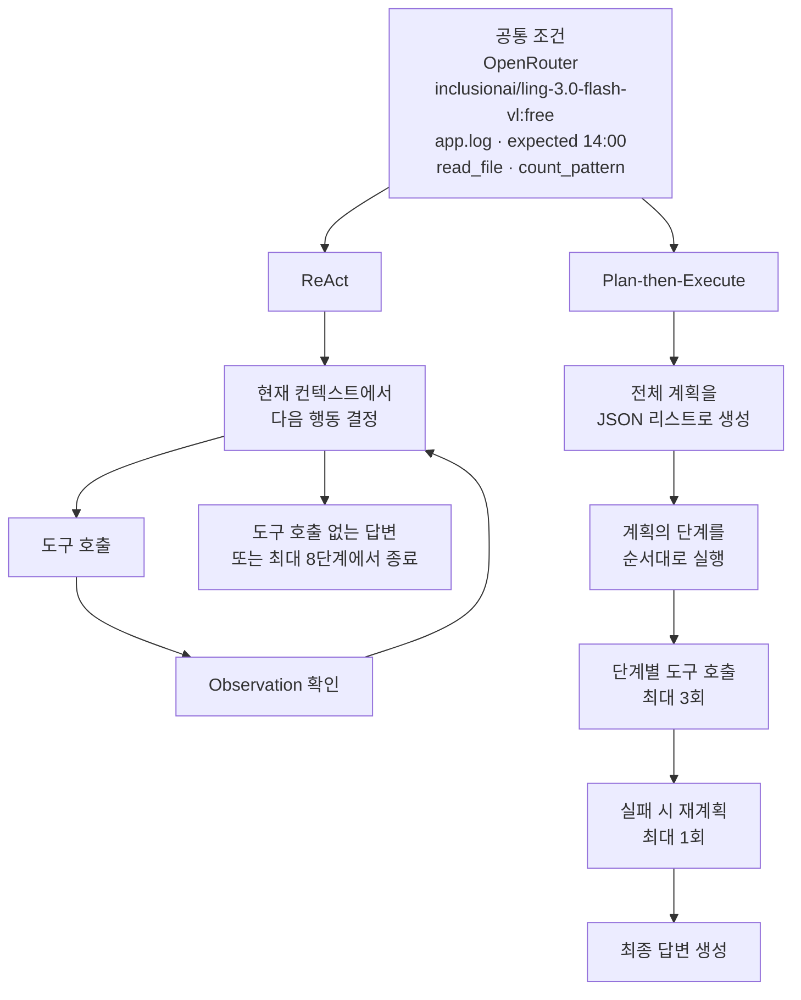

# Week 02 — Harness A/B Experiment Report

## 1. 변형 정의

### 공통 조건

- Provider: OpenRouter
- Model: `inclusionai/ling-3.0-flash-vl:free`
- Task: `app.log`에서 ERROR가 가장 많은 시간 찾기
- Expected answer: `14:00`
- 공통 도구: `read_file`, `count_pattern`
- 실행 횟수: 하네스별 3회
- 입력 파일과 성공 판정 기준은 모든 실행에서 동일하게 유지했다.



### 하네스 차이

ReAct는 매 단계에서 도구의 실행 결과를 확인한 후 다음 행동을 다시 결정한다. Plan-then-Execute는 전체 계획을 JSON 리스트로 먼저 고정하고 각 단계를 순서대로 실행한다.

| 하네스 설계 축 | ReAct | Plan-then-Execute |
|---|---|---|
| 컨텍스트 관리 | 전체 대화와 Observation을 다음 판단에 사용 | planner와 executor를 분리하고 사전 계획을 executor에 전달 |
| 도구 granularity | `read_file`, `count_pattern` | ReAct와 동일 |
| 종료 조건 | 도구 호출 없는 답변 또는 최대 8단계 | 계획 완료 후 최종 답변, 단계별 도구 호출 최대 3회 |
| 에러 복구 | 도구 오류를 Observation으로 전달하고 다음 행동 재판단 | `OFF_PLAN` 발생 시 최대 1회 재계획 |
| 인간 개입 지점 | 읽기 전용 도구이므로 없음 | ReAct와 동일 |

도구 granularity와 사람 개입 지점은 두 하네스에서 같았다. 주요 독립변수는 컨텍스트 관리, 종료 조건, 에러 복구 방식이었다.

## 2. 측정 결과

최종 비교에는 provider, model, task, tools 및 성공 기준을 동일하게 고정한 Run 43–48을 사용했다.

| Run | Harness | Success | Tokens | Iterations | Interventions | Note |
|---:|---|:---:|---:|---:|---:|---|
| 43 | react | O | 2,932 | 2 | 0 | |
| 44 | react | O | 5,756 | 3 | 0 | |
| 45 | react | O | 6,371 | 3 | 0 | |
| 46 | plan_exec | O | 6,166 | 4 | 0 | `replans=0` |
| 47 | plan_exec | X | 267 | 1 | 0 | 계획 JSON 파싱 실패 |
| 48 | plan_exec | O | 6,508 | 4 | 0 | `replans=0` |

| 지표 | ReAct | Plan-then-Execute |
|---|---:|---:|
| 성공률 | 100% (3/3) | 66.7% (2/3) |
| 성공 실행 평균 토큰 | 5,020 | 6,337 |
| 성공 실행 평균 반복 횟수 | 2.67 | 4.00 |
| 사람 개입 횟수 | 0 | 0 |

Run 1–42는 준비 과정에서 발생한 실패 기록이므로 `logs/`에 그대로 보존했다. 여기에는 잘못 남아 있던 Anthropic 인증 정보로 인한 401 오류, 무료 provider의 429 오류, OpenRouter 응답의 `choices` 누락 및 최종 모델 고정 전에 발생한 실행이 포함된다. 이 실행들은 하네스 자체의 성능을 나타내지 않으므로 최종 A/B 비교에서는 제외했다.

## 3. 결과 해석

ReAct는 세 번 모두 `14:00`을 반환해 성공률에서 우세했다. 성공한 실행끼리 비교해도 ReAct는 평균 5,020토큰과 2.67회의 모델 호출을 사용해, 평균 6,337토큰과 4회의 호출을 사용한 Plan-then-Execute보다 효율적이었다. Plan-then-Execute는 계획 생성과 최종 답변 생성이 별도 호출로 추가되기 때문에 성공한 실행의 반복 횟수가 많았다. 또한 Run 47에서는 모델이 JSON 리스트 대신 `1. read_file("app.log")` 형식의 문자열을 반환하여 실제 도구 실행 전에 실패했다. 이는 계획을 먼저 고정하고 엄격하게 파싱하는 구조가 예측 가능한 실행 순서를 제공하는 동시에, 계획 형식이 어긋나면 전체 실행이 시작되지 못하는 취약점도 만든다는 것을 보여준다. 이번 태스크에서는 Observation을 확인하면서 다음 행동을 결정하는 ReAct의 컨텍스트 관리와 유연한 종료 방식이 더 높은 성공률과 낮은 실행 비용으로 이어졌다.

## 재현 방법

`openai` 패키지를 사용했다.

```powershell
$env:ANTHROPIC_API_KEY = $null
$env:OPENAI_API_KEY = OpenRouter API 키
$env:OPENAI_BASE_URL = "https://openrouter.ai/api/v1"
$env:AGENT_MODEL = "inclusionai/ling-3.0-flash-vl:free"

python .\run_ab.py --runs 3
```

공통 도구 schema는 다음 두 개다.

- `read_file(path: str)`: 현재 작업 디렉터리의 텍스트 파일에서 처음 4,000자를 읽는다.
- `count_pattern(path: str, pattern: str)`: 정규식과 일치하는 파일의 행 수를 반환한다.