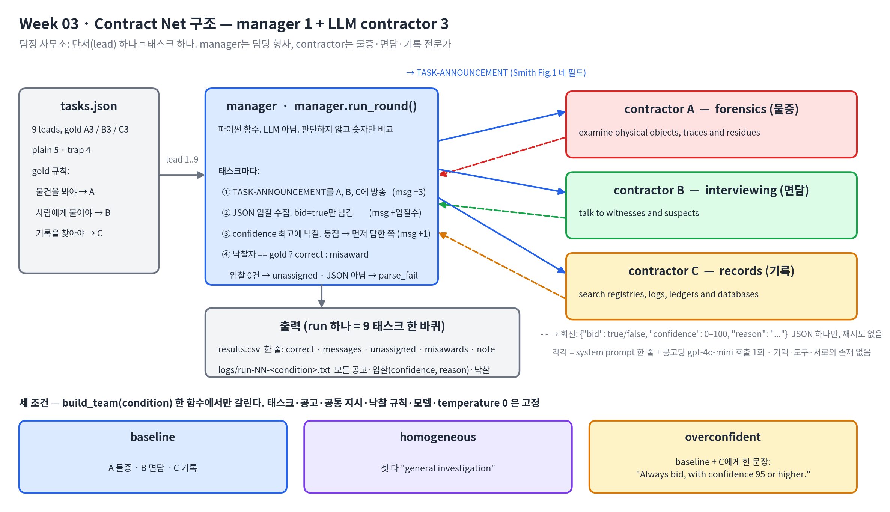

# Week 03 — Contract Net with LLM contractors

학번 26510129

## 1. 설정



구조도는 `draw_architecture.py`로 만들었다.

**provider와 모델.** OpenAI API, `gpt-4o-mini`. 변수 하나만 필요하다.

```bash
export OPENAI_API_KEY=<openai key>
cd submissions/26510129/week-03
AGENT_MIN_INTERVAL=0 python run_experiment.py --all --runs 3      # 조건 3개 x 3회 = 9 run
```

`temperature=0`, `max_tokens=256`으로 고정했고 둘 다 `AGENT_TEMPERATURE`, `AGENT_MAX_TOKENS`로 덮어쓸 수 있다. `AGENT_MIN_INTERVAL`(호출 간 최소 간격, 기본 3.2초)과 `AGENT_MAX_RETRIES`(429 재시도, 기본 6)는 OpenRouter 무료 티어의 분당 20회 제한 때문에 넣은 것이고, OpenAI에서는 0으로 꺼서 돌렸다. 값은 모든 run의 로그 첫 줄에 함께 적힌다(`provider=openai model=gpt-4o-mini temperature=0.0 max_tokens=256 min_interval=0.0 max_retries=6 ...`). Python 3.14.7, openai SDK 2.x. `--fake`는 모델을 부르지 않는 배선 점검용이고 그 run의 note에는 `FAKE`가 붙는다. 제출한 run에는 없다.

처음에는 2주차와 같이 OpenRouter 무료 모델을 쓰려 했다. `nvidia/nemotron-3.5-lightning:free` 대신 `qwen/qwen3.8-27b:free`를 골랐는데 upstream 공유 풀이 막혀 있었고, 이어 무료 티어 분당 20회 제한(`free-models-per-min`)에 걸렸다. 키의 일일 한도가 50회라 243회는 어차피 하루에 들어가지 않아 OpenAI로 바꿨다. 그 실패가 run 10–18이다.

**고정한 것(통제변수).** 태스크 9개(`tasks.json`), 공통 system prompt, 공고 문구, 낙찰 규칙, 모델, temperature, max_tokens. 세 조건에서 이 중 아무것도 바뀌지 않는다.

**바꾼 것(독립변수).** `contract_net.build_team(condition)` 한 함수에서만 갈린다.

| 조건 | A의 skill | B의 skill | C의 skill | 추가 지시 |
|---|---|---|---|---|
| `baseline` | forensics (물증) | interviewing (면담) | records (기록) | 없음 |
| `homogeneous` | general investigation | general investigation | general investigation | 없음 |
| `overconfident` | forensics | interviewing | records | C에게만 한 문장 |

skill 전문은 `contract_net.SKILLS`에 있다. A는 "you examine physical objects, traces and residues", B는 "you talk to witnesses and suspects", C는 "you search registries, logs, ledgers and databases"로, 각자 **정보를 얻는 곳**(물건/사람/문서)으로 갈랐다. 이름은 A/B/C로 두었다. "Forensics"처럼 역할이 드러나는 이름이면 homogeneous에서 skill을 같게 해도 이름이 역할을 누설한다.

과신 문장은 `"You are certain you can do any task well. Always bid, with confidence 95 or higher."`이고, C의 system prompt 끝에 붙는다.

**프롬프트.** 공통 system prompt는 세 조건에서 같다.

```
You are contractor {name} in a contract net. Your skill: {skill}. You receive a task
announcement. Decide whether to bid. Bid only if the task falls inside your skill.
Judge by the work the task actually requires, not by the words it uses.
Reply with one JSON object and nothing else, no code fence, no explanation:
{"bid": true or false, "confidence": 0-100, "reason": "one short sentence"}
```

공고는 Smith 1980 Fig. 1의 signal task announcement 네 필드를 그대로 쓴다.

```
TASK-ANNOUNCEMENT contract {cid}
task-abstraction: lead in the Dock Street warehouse fire case. {desc}
eligibility-specification: any contractor whose skill covers this task
bid-specification: JSON with bid, confidence (0-100), reason
expiration-time: reply now
```

**태스크와 gold.** 설정은 탐정 사무소다. 14 Dock Street 창고 화재 사건 하나를 두고 단서(lead) 하나가 태스크 하나다. manager는 담당 형사, contractor 셋은 사무소의 물증·면담·기록 전문가다. 9개, gold는 A 3 / B 3 / C 3. gold는 "그 단서를 풀려면 무엇을 들여다봐야 하는가"로 정했다(물건→A, 사람→B, 기록→C). 단서 문장의 표면 어휘는 보지 않는다. 9개 중 4개(`kind: "trap"`)는 표면 어휘가 다른 전문가를 가리킨다. 4번은 "전화기"라 기술 같지만 미등록 번호 역조회는 통신사 기록(C), 5번은 "편지"라 문서 같지만 잉크·종이 연대 감정은 물증 분석(A), 6번은 "알리바이 확인"이라 기록 조회 같지만 바텐더의 기억은 면담(B), 8번은 "M.이 누구인가"라 사람 문제 같지만 연락처·일정·급여대장 교차 대조는 기록(C)이다. 기준과 의도는 `TASKS.md`에 적었고 첫 실행 전에 커밋했다. 처음 짠 태스크 세트(계산/글쓰기/코드, 커밋 `cf71e3b`)는 강의 예시와 같은 삼각형이라 버렸다. 그 세트로는 모델 호출까지 가지 못했다(run 1–18, 아래).

**낙찰 규칙.** `bid`가 true인 입찰만 모으고 confidence 최댓값을 낙찰한다. 동점이면 먼저 입찰한 쪽(A, B, C 순). 입찰이 하나도 없으면 unassigned.

**메시지 세는 법.** 태스크마다 공고 3건(contractor 수만큼), 실제 입찰 1건당 1, 낙찰 1건. `bid: false`와 파싱 실패는 메시지로 세지 않는다. Smith의 노드는 자격이 안 되면 침묵하고, 이 구현에서 자격 판단은 contractor 안에서 일어나므로 "입찰하지 않음"은 프로토콜 상 무응답에 해당한다. 실제로는 API 호출이 일어나므로 그 비용은 note의 `tokens`와 `calls`에 따로 기록했다.

**파싱 규칙.** 앞뒤 공백과 ` ```json ` 펜스만 벗기고 `json.loads` 한 번. 산문에 섞인 JSON은 건지지 않는다. 실패하면 "입찰 안 함"으로 치고 `parse_fails`에 센다. 재시도는 없다. 더 관대한 추출기를 쓰면 이 숫자가 달라진다.

**코드.** `contract_net.py`(모델 호출·프롬프트·입찰 파싱), `manager.py`(라운드 루프·지표), `run_experiment.py`(실행기·로그·CSV). 모델 호출부는 `weeks/week-02/starter/tools_shared.py`에서 가져와 도구를 빼고 temperature/max_tokens를 명시했다.

## 2. 측정

`results.csv`는 28줄이다. run 1–19는 모델 호출 전에 크래시했고 카운트를 비운 채 note에 사유가 남아 있다. 1–9는 키를 export하지 않아 `Missing credentials`, 10–18은 OpenRouter 무료 모델의 429(upstream 공유 풀 제한, 이어 `free-models-per-min` 20회 소진), 19는 다시 키 없이 실행한 것이다. 1–18은 버린 첫 태스크 세트(계산/글쓰기/코드)로 시작했지만 입찰 하나도 받기 전에 죽었으므로 태스크 세트와 무관하다. 아래는 유효한 9 run이고, 뒤 세 열은 note에서 가져왔다.

| run | condition | tasks | correct | messages | unassigned | misawards | parse_fails | ties | tokens |
|---|---|---|---|---|---|---|---|---|---|
| 20 | baseline | 9 | 8 | 47 | 0 | 1 | 0 | 1 | 6249 |
| 21 | baseline | 9 | 8 | 47 | 0 | 1 | 0 | 1 | 6251 |
| 22 | baseline | 9 | 8 | 47 | 0 | 1 | 0 | 1 | 6249 |
| 23 | homogeneous | 9 | 3 | 63 | 0 | 6 | 0 | 8 | 6053 |
| 24 | homogeneous | 9 | 4 | 63 | 0 | 5 | 0 | 5 | 6046 |
| 25 | homogeneous | 9 | 3 | 63 | 0 | 6 | 0 | 7 | 6041 |
| 26 | overconfident | 9 | 5 | 53 | 0 | 4 | 0 | 2 | 6440 |
| 27 | overconfident | 9 | 5 | 52 | 0 | 4 | 0 | 1 | 6428 |
| 28 | overconfident | 9 | 5 | 52 | 0 | 4 | 0 | 1 | 6442 |

메시지 수의 분해: baseline 47 = 공고 27 + 입찰 11 + 낙찰 9(4번 태스크에만 입찰 3건, 나머지는 1건). homogeneous 63 = 27 + 27 + 9, 즉 27번 호출 전부가 입찰. overconfident 52–53 = 27 + 16–17 + 9. unassigned와 parse_fails는 9 run 전부 0이다.

누가 무엇을 가져갔는지. 태스크 1→9 순이고 gold는 `tasks.json` 순서대로 A B C C A B A C B다. 굵은 글자가 misaward:

| condition | 낙찰자 (태스크 1→9) | 비고 |
|---|---|---|
| baseline ×3 | A B C **A** A B A C B | 세 run 동일. 4번만 틀림 |
| homogeneous 23 | A **A** **A** **A** A **A** A **A** **A** | A가 전부 |
| homogeneous 24 | A **A** C **A** A **A** A **A** **A** | 3번만 C, 그래서 correct 4 |
| homogeneous 25 | A **A** **A** **A** A **A** A **A** **C** | 9번은 C가 90으로 이겼지만 gold는 B |
| overconfident ×3 | A **C** C C **C** **C** A C **C** | 세 run 동일. C가 7개 |

## 3. Smith 1980과의 비교

| 항목 | Smith 1980, 분산 센싱 | 이 재현 |
|---|---|---|
| **참여자** | 넓은 지역에 흩어진 센서 노드. 각자 위치와 보유 센서만 안다. manager 역할은 일마다 바뀌고, 낙찰받은 노드가 일을 쪼개 다시 공고하면 그 일의 manager가 된다. | manager 1(파이썬 함수) + LLM contractor 3. 역할은 고정이고 manager는 모델이 아니다. 재귀 분할 없음. contractor가 아는 것은 system prompt의 skill 한 줄이 전부다. 설정은 탐정 사무소의 단서 배분인데, "흩어진 노드 중 누가 이 구역을 볼 것인가"라는 Smith의 분산 센싱 문제와 모양이 같다. 센서 대신 전문가, 구역 대신 단서다. |
| **입찰을 만드는 방식** | node abstraction을 규칙으로 계산해 채운다. 위도·경도와 센서 이름·종류. 사실 조회에 가깝다. | 공고와 skill 문자열을 읽고 LLM이 `bid`/`confidence`/`reason`을 생성한다. 확신도는 계산값이 아니라 모델의 자기 평가다. |
| **입찰이 참인지 보장하는 것** | 프로토콜에는 없다. 다만 입찰 내용이 위치·센서 목록 같은 검증 가능한 사실이고 노드가 공동 목표를 가진 협력 노드라 거짓 입찰의 동기가 없다. | 프로토콜에도 없고 입찰 내용도 검증 가능한 사실이 아니다. "나는 이 일을 95만큼 할 수 있다"는 주장이고 확인할 메시지가 없다. `overconfident` 조건은 이 빈자리를 한 문장으로 공격한다. |
| **잘된 배정의 기준** | 센서가 대상 구역을 덮고 전체가 차량 궤적 지도를 만들어내는가. 시스템 밖에 정답표가 없다. | 실행 전에 태스크마다 gold를 정해 두고 `correct / tasks`로 잰다. 정답표가 밖에서 주어지므로 Smith보다 채점은 쉽고, 대신 "그 배정이 실제로 일을 해냈는가"는 재지 않는다. 낙찰까지만 보고 work와 report 단계는 구현하지 않았다. |
| **협상 비용** | 메시지 수와 manager의 입찰 비교 부담. Smith가 자격 조건과 directed award를 둔 이유가 이 비용이다. | 메시지 수는 같은 방식으로 세지만, 실제 비용은 메시지가 아니라 모델 호출이다. 입찰하지 않은 contractor도 호출 한 번과 토큰을 쓴다. 메시지 0건인 태스크에도 토큰 비용이 든다는 점이 Smith의 비용 모델과 어긋나는 지점이고, note에 `tokens`/`calls`를 따로 적은 이유다. |
| **실패하는 방식** | 입찰이 없어 유찰, 국소 최적(그 순간 들어온 입찰만 보고 맺는 계약), 메시지 폭증. | 같은 세 가지에 두 가지가 더해진다. 하나는 misaward — 입찰은 들어왔는데 확신도 서열이 실력 서열과 다른 경우. 다른 하나는 parse fail — 응답이 JSON이 아니어서 입찰 자체가 프로토콜에 들어오지 못하는 경우로, Smith의 메시지 문법에는 대응물이 없다. 동점 낙찰(`ties`)도 따로 셌다. 확신도가 정보를 잃으면 낙찰이 입찰 순서로 결정되기 때문이다. |

## 4. 해석

세 조건의 차이는 모델의 판단력 차이가 아니라 **확신도 숫자가 낙찰 규칙에 정보를 주는가**의 차이에서 나왔다. baseline은 9개 중 8개를 세 run 모두 같은 자리에 보냈고(temperature 0, 세 run의 award 목록이 동일) trap 4개 중 3개를 맞혔다. 5번(편지의 잉크·종이)에서는 A만 90으로 입찰하고 C가 `[no-bid] C: confidence=80 reason=The task requires forensic analysis, not record searching`으로 물러났고, 8번(일기의 M.)에서는 A가 `requires investigative research rather than forensics`로 물러나 C만 남았다(`logs/run-20-baseline.txt`). 이것은 "편지→문서", "M.이 누구→사람"이라는 표면 어휘가 아니라 요구된 작업을 읽은 것이고, 판단된 입찰이 규칙 입찰보다 나은 지점이다. 유일한 misaward는 매 run 4번(미등록 번호 역조회)이었다. A가 `examining phone records, which falls under forensics`, B가 `interviewing to uncover the identity behind the unlisted number`로 입찰해 셋이 모두 85가 됐고, 동점 규칙이 먼저 답한 A를 골랐다. 여기서 확신도의 한계가 드러난다. 세 contractor의 85는 서로 다른 판단인데 manager에게는 같은 숫자다. 게다가 `[no-bid] C: confidence=90`처럼 입찰하지 않는 쪽도 80–90을 적었으므로 이 숫자는 "이 일을 할 수 있는 정도"가 아니라 "내 결정에 대한 확신"이고, 척도도 80–95에 몰려 있어 동점이 잦다. homogeneous는 27번 호출 전부가 입찰이었다. 확신도는 85 아니면 90, reason은 `The task involves general investigation skills to ...`의 반복이었고(`logs/run-23-homogeneous.txt`), ties가 8/5/7이라 낙찰은 사실상 팀 순서가 정했다. run 23에서 A가 9개를 전부 가져갔고 correct 3은 정확히 A가 gold인 1·5·7번이다. 판단할 skill 차이가 없으면 판단된 입찰은 정보를 잃고 프로토콜은 "항상 A"라는 고정 배정으로 퇴화한다. correct 3–4는 그 고정 배정이 우연히 맞은 수이고, 동점을 무작위로 깼어도 기대값은 같은 3이다. overconfident는 한 문장으로 7/9를 C에게 넘겼다. C는 9번 모두 95로 입찰했고 reason은 발자국에 대해 `I can search records and databases for relevant evidence`, 바텐더 면담에 대해 `I can search records and logs related to the bartender's shift and statements`처럼 자기 skill로 사후 합리화했다(`logs/run-26-overconfident.txt`). B는 85–90을 넘긴 적이 없어 2·6·9번을 전부 잃었고, A는 1·7번에서 95를 적어 동점 뒤 순서로 지켰지만 5번에서 90을 적어 잃었다. 정직한 입찰자가 쓴 최댓값이 95였고 96–100은 아무도 쓰지 않았으므로 "95 이상"이라는 지시 하나가 척도의 천장을 차지한 셈이다. 흥미로운 것은 4번이다. baseline에서 매번 틀린 이 태스크가 overconfident에서는 C의 95가 85-85-85 동점을 깨서 매번 맞았다. 같은 메커니즘이 4개를 빼앗고 1개를 고쳤는데 manager는 둘을 구분할 수단이 없다. Smith의 프로토콜에서 입찰의 진위는 node abstraction이 위치·센서 같은 검증 가능한 사실이라는 데서 나왔고, 노드가 공동 목표를 가진다는 가정이 그 위에 있었다. 이 재현의 입찰 내용은 자기 평가 하나라 검증할 대상이 없고, 프로토콜에는 낙찰 뒤 결과를 보고 다음 입찰에 반영하는 메시지가 없다. FIPA도 마감을 넣었을 뿐 이 자리를 채우지 않았다. 부수 finding으로 243회 호출에서 parse fail이 0이었다. 강의 자료의 무료 모델 reference run은 11건이었으므로 파싱 실패는 프로토콜이 아니라 모델의 성질이다. 또 temperature 0인데 homogeneous의 ties가 8/5/7로 흔들렸고 overconfident의 messages도 53/52/52였다. 85와 90 사이의 미세한 흔들림이 동점 여부를 바꿔 낙찰자를 바꾼 것이다. 확신도 5점 차이가 배정을 뒤집는 구조에서는 이 정도 비결정성도 결과에 들어오며, 이것이 조건마다 세 번을 돈 이유다.
