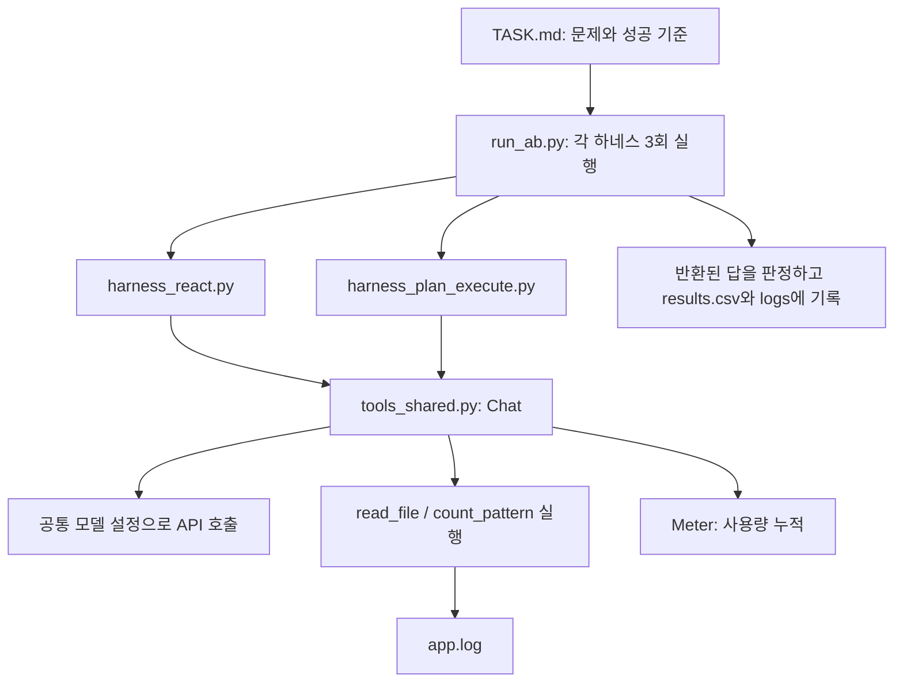
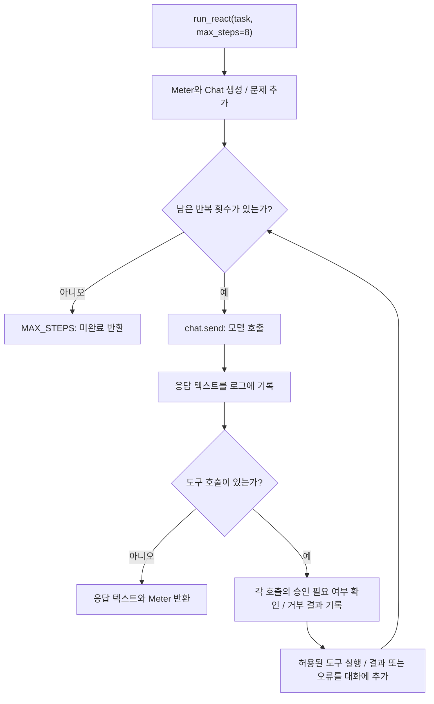
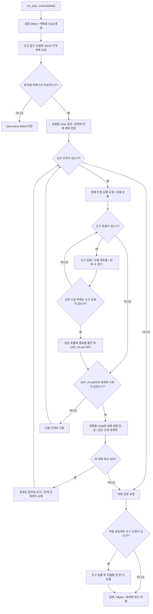

# Week 02 starter 코드 읽기

이 문서는 실행 전 코드 구조를 설명한다. 실험 결과나 REPORT.md의 해석을 대신하지 않는다.
starter의 여섯 파일은 원본 그대로 복사했다.

## 전체 구조

하네스는 모델에 무엇을 요청하고, 도구를 언제 실행하며, 언제 종료할지를 정한다.
두 하네스는 같은 `tools_shared.py`의 모델 설정과 도구를 사용한다.



이 그림의 화살표는 호출·의존 관계다. 실제 실행에서는 모델 응답과 도구 결과가
`Chat`의 대화 기록에 누적되어 다음 모델 호출의 입력으로 들어간다.

공통 객체부터 이해하면 두 파일이 짧게 읽힌다.

| 이름 | 역할 |
|---|---|
| `Chat(system, meter)` | 시스템 지시문, 대화 기록, 모델 호출, 도구 결과 전달을 관리한다. |
| `chat.add_user(text)` | 다음 호출에 사용할 사용자 메시지를 추가한다. 이 자체로 API를 호출하지는 않는다. |
| `chat.send()` | 모델을 한 번 호출하고 응답과 사용량을 기록한다. `Reply`를 반환한다. |
| `reply.text` | 모델이 작성한 설명 또는 답변 텍스트다. |
| `reply.tool_calls` | 모델이 요청한 도구 호출 목록이다. 도구 이름과 인자를 포함하며, 여러 호출이 올 수 있다. |
| `chat.run_tools(reply, log)` | 도구를 실행하고 결과를 기록에 추가한다. 도구 오류도 결과 메시지로 돌려준다. |
| `Meter` | 입력·출력 토큰 합계, 모델 호출 횟수, 사람 개입 횟수를 담는다. |

## ReAct: 결과를 보고 다음 행동을 결정

읽을 함수: [harness_react.py의 run_react](harness_react.py).



1. `SYSTEM`은 도구 호출 전에 `Thought:` 한 줄로 현재 정보와 다음 행동을 설명하고,
   끝낼 때는 `Answer:`로 답하면서 도구를 호출하지 말라고 지시한다.
2. `Meter()`와 `Chat(SYSTEM, meter)`를 만들고 `chat.add_user(task)`로 문제를 넣는다.
   이후 같은 `Chat` 객체를 계속 사용하므로 이전 대화와 도구 결과가 유지된다.
3. `for step in range(max_steps)`에서 모델을 호출한다. 기본값은 최대 8회다.
4. `if not reply.tool_calls`이면 응답 텍스트를 반환한다. 코드가 직접 검사하는 종료 조건은
   **도구 호출의 부재**다. `Answer:` 형식이나 정답 여부를 여기서 검사하지 않으며,
   별도의 `finish` 도구도 이 starter에는 없다.
5. 도구 요청이 있으면 승인 처리를 거쳐 `chat.run_tools()`로 실행한다.
   다음 반복에서 모델은 그 결과를 읽고 다음 행동을 결정한다.
6. 8회를 모두 쓰면 미완료 문자열을 반환한다. 마지막 도구 결과까지 받은 뒤
   추가 답변 호출을 자동으로 제공하지는 않는다.

예상 흐름은 `파일 읽기 → 결과를 본 모델이 집계 방법 선택 → 집계 결과 확인 → 답변`이다.
이는 이해를 위한 예시이며, 실제로 어떤 도구를 몇 번 호출할지는 모델 응답으로 정해진다.

`IRREVERSIBLE`은 승인 대상 도구 이름의 집합이다. 현재는 빈 집합이므로 승인 질문이
발생하지 않고 `interventions`도 0이다. 현재 구현에서 카운터가 증가하는 위치는
승인 요청이 **거부된 분기**뿐이다. 나중에 승인 대상 도구를 추가한다면,
승인과 거부를 모두 세려는 측정 정의에 맞는지 별도로 검토해야 한다.

## Plan-then-Execute: 계획을 만든 뒤 단계별 실행

읽을 함수: [harness_plan_execute.py의 run_plan_execute](harness_plan_execute.py).



첫 단계는 **계획 생성**이다. `planner = Chat(SYSTEM_PLAN, meter, tools=False)`에서
도구를 끈다. 계획자는 도구의 이름과 인자 설명은 받지만 직접 로그를 읽지는 않는다.
모델에는 다음과 같은 문자열 목록을 요구한다. 아래는 응답 형식을 보여 주는 예시다.

```json
["app.log를 읽는다", "시간대별 ERROR 수를 센다", "가장 많은 시간대를 답한다"]
```

`parse_plan()`은 코드 블록 표시를 제거한 뒤 JSON 파싱을 시도하고, 문자열 목록인지
검사한다. 형식이 맞지 않으면 본 실행을 시작하지 않고 실패를 반환한다.
계획 내용이 타당한지까지 이 함수가 검사하는 것은 아니다.

두 번째 단계는 **계획 실행**이다. `executor = Chat(SYSTEM_EXEC, meter)`라는 별도
대화에 문제와 전체 계획을 넣는다. `while i < len(plan)`은 계획의 단계를 순회하며,
안쪽 `while reply.tool_calls`는 한 단계 안에서 필요한 도구 사용을 처리한다.
따라서 **계획 한 단계가 모델 호출 한 번과 같지는 않다.**

세 번째는 필요한 경우의 **재계획**이다. 실행 응답이 `OFF_PLAN`으로 시작하고
`replans < max_replan`이면 계획자에게 실패한 단계와 설명을 전달한다.
기본 `max_replan=1`은 전체 실행에서 재계획을 한 번 허용한다는 뜻이다.
`plan = plan[:i] + new_steps`는 완료된 앞부분을 보존하고 현재 단계 이후를 바꾼다.
`continue`로 돌아가므로 교체된 현재 단계부터 실행한다.

코드의 재계획 동작은 다음 범위로 이해해야 한다.

- 계획자는 실패 단계 설명을 받으며, 실행기의 전체 도구 기록을 공유받지는 않는다.
- 이미 재계획 기회를 쓴 상태에서 다시 `OFF_PLAN`이 나면 `i += 1`로 다음 단계로 간다.
- 새 계획의 JSON 파싱이 실패하면 단계 실행 루프를 나와 최종 답변 요청으로 이동한다.
- 실행용 대화에는 최초 전체 계획과 기존 기록이 남고, 이후 단계 지시는 새 계획을 따른다.

마지막에는 실행용 대화에 최종 답변을 요청한다. 그 응답에도 도구 호출이 있으면
도구를 실행하고 모델을 한 번 더 호출한 뒤 반환한다. 반환한 답의 정답 판정은
`run_ab.py`가 `TASK.md`의 기준으로 수행한다.

## 두 구조를 비교할 때 읽어야 하는 부분

| 비교 항목 | ReAct | Plan-then-Execute |
|---|---|---|
| 다음 행동 결정 | 누적 결과를 보고 매번 결정 | 계획의 현재 단계 안에서 결정 |
| 대화 구성 | 실행용 대화 하나 | 계획용 대화와 실행용 대화 분리 |
| 모델 설정 | 공통 `tools_shared.py`의 모델 | 같은 모델 설정을 두 대화가 사용 |
| 반복 제한 | `max_steps=8` | 단계별 `max_tool_rounds=3`, 전체 재계획 `max_replan=1` |
| 초기 계획 파싱 | 없음 | 문자열 JSON 목록 필요 |
| 반환값 | 답변, Meter | 답변, Meter, 재계획 횟수 |

`max_tool_rounds=3`을 도구 함수 호출 총 3회로 읽으면 안 된다. 한 모델 응답에 여러
도구 호출이 들어올 수 있고, 이 구현은 상한을 확인할 때 남아 있는 요청에도 도구 결과를
붙인 후 `OFF_PLAN`을 만든다. 상한에 도달한 경로에서는 네 번째 요청 묶음도 실행될 수 있다.
또한 전체 계획의 단계 수를 제한하는 별도 상한은 없다.

`Meter.iters`는 **모델 호출 횟수**다. Plan-then-Execute의 계획·재계획·실행·최종 답변
호출은 같은 `Meter`에 누적된다. `replans`는 모델이 계획을 다시 만든 횟수이며,
사람 개입 횟수인 `interventions`와 다르다.

두 방식 중 어느 쪽이 토큰을 더 쓰거나 성공률이 높은지는 아직 정하지 않는다.
코드에서 확인한 구조 차이를 기록해 두고, 실제 실험 로그와 측정값으로 확인한다.
