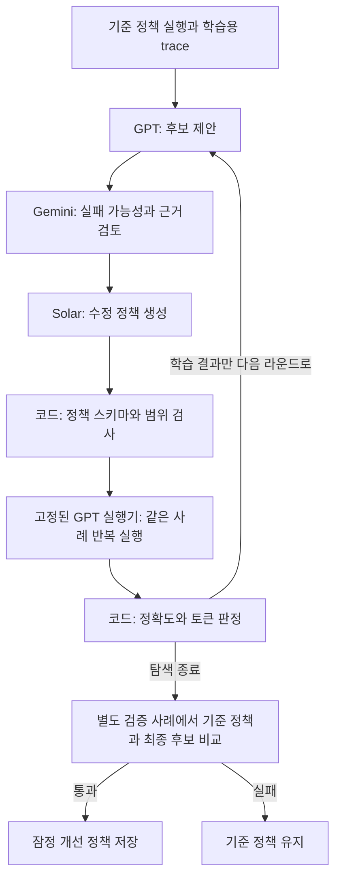

# GPT · Gemini · Solar로 하네스를 개선하는 방법

목표는 여러 모델이 하네스 설정을 제안·비평·수정하고, 실제 실행 결과로 개선 여부를
판정하는 시스템이다. 현재 구현은 로그 분석 에이전트의 정책을 탐색하는 작은 메타 하네스다.
여기서 선택한 정책은 이 평가 사례들에 대한 잠정 개선안이며, 보편적으로 최고의 하네스를 뜻하지 않는다.

## 흐름



역할은 초기 구성이다. GPT가 항상 제안을 가장 잘하고 Solar가 항상 수정을 가장 잘한다는
가정은 검증하지 않았다. 역할별 모델명은 `.env`의 `META_*_MODEL`로 바꿀 수 있다.
실행기는 한 탐색 동안 고정되며 현재 GPT 제안자와 같은 모델을 사용한다.

| 역할 | 기본 모델 | 하는 일 |
|---|---|---|
| 제안 | `gpt-5.6-luna` | 현재 정책·학습용 실행 기록을 보고 변경 후보 제안 |
| 비평 | `gemini-3.8-flash` | 후보의 실패 가능성, 증거 부족, 성능 퇴행 검토 |
| 수정 | `solar-pro4` | 제안과 비평을 반영한 정책 JSON 생성 |
| 실행 | `gpt-5.6-luna` | 기준 정책과 후보를 같은 도구·문제로 실행 |
| 판정 | Python | 정답·형식·도구 사용·성공 수·토큰 검사 |

GPT 연결은 [OpenAI 함수 호출 API](https://developers.openai.com/api/docs/guides/function-calling)를,
Gemini 연결은 [공식 OpenAI 호환 API](https://ai.google.dev/gemini-api/docs/openai)를 사용한다.
Solar는 [Upstage 공식 cookbook](https://github.com/UpstageAI/Solar-Pro4-Cookbook)의
OpenAI 호환 Chat Completions 연결 방식을 따른다. 기본적인 텍스트·도구 호출 인터페이스를
사용하며, 세 제공자의 모든 옵션이 같은 의미로 동작한다고 가정하지 않는다.
클라이언트마다 키와 엔드포인트를 명시한다. GPT는 `reasoning_effort=none`, Gemini는 `low`,
Solar는 `none`을 사용한다. Solar는 처음 `medium`에서 8192토큰을 모두 추론에 사용하고
본문을 반환하지 못했다. 이 작은 정책 수정 작업에서는
[공식 매개변수 가이드](https://github.com/UpstageAI/Solar-Pro4-Cookbook/tree/main/capabilities/parameters)의
`none` 설정으로 변경했다. GPT·Gemini의 제안/비평에는 API JSON 스키마를
지정하고, Solar를 포함한 모든 출력은 로컬에서도 필드와 범위를 검사한다. 출력이 잘리거나
형식 검증에 실패하면 후보를 실행하지 않는다.

## 개선할 수 있는 것과 고정한 것

모델 출력은 다음 네 필드를 가진 정책으로 검증한다. 임의 Python 코드나 임의 시스템 프롬프트는 실행하지 않는다.

| 필드 | 범위 | 의미 |
|---|---|---|
| `max_steps` | 2–12 | 실행기의 모델 호출 상한 |
| `history_turns` | 0–8 | 0은 전체 기록, 양수는 최근 완결된 대화 묶음 수 |
| `observation_chars` | 256–4000 | 모델에게 전달하는 도구 결과 길이 |
| `error_recovery` | `feedback`, `stop` | 도구 오류를 다음 판단에 전달할지 종료할지 |

도구 호출과 그 응답을 한 묶음으로 잘라 대화 형식을 유지한다. 도구는 메모리에 있는 해당 사례의
`app.log`만 읽을 수 있다. `read_file`은 원본의 처음 4000자를 반환하고 `count_pattern`은 전체
파일을 검색한다. 이 확장에서는 길이 120 이하, 그룹·중괄호 없는 단순 정규식만 허용한다.
도구의 이름·정의와 실행기 프롬프트는 모든 후보에 공통이다. 파일 쓰기 도구는 없다.

정답은 실제 로그의 ERROR 레벨 행을 코드로 집계한다. INFO 메시지 안의 ERROR 문자열은 제외하고,
동률이면 가장 이른 시간을 정답으로 삼는다. `Answer: HH:00` 형식을 정확히 지키고 최소 한 번
도구를 사용해야 성공이다. 이 확장의 판정은 기존 과제 `TASK.md`의 부분 문자열 판정과 별개다.

## 채택 규칙

1. 기준 정책을 학습 사례 3개에서 반복 측정한다.
2. 제안·비평·수정으로 후보를 만들고 같은 학습 사례에서 같은 횟수로 실행한다.
3. 어느 사례에서도 성공 횟수가 줄지 않아야 한다. 성공 횟수가 늘거나, 같으면서 실행 토큰이
   10% 이상 줄어야 후보를 유지한다. 모두 실패한 후보와 사용량이 미측정인 후보는 채택하지 않는다.
4. 모든 제안 라운드를 끝낸 뒤에만 별도 검증 사례 2개에서 기준 정책과 최종 후보를 비교한다.
   같은 규칙을 통과하면 잠정 개선안으로 저장하고, 실패하면 기준 정책을 유지한다.
5. 검증 사례의 결과는 이 탐색의 제안 모델들에게 다시 전달하지 않는다.

첫 학습 사례는 기존 `app.log`이고, 나머지는 긴 로그·잘못 세기 쉬운 레벨 문자열·동률 등으로
구성한 합성 사례다. 별도 검증은 같은 실행 안에서 탐색으로부터 분리한 것으로, 외부 벤치마크가 아니다.
같은 검증 사례를 여러 번 보고 수동으로 튜닝하면 그 분리는 사라지므로 최종 확인용 새 사례가 필요하다.
`result.json`의 잠정 개선 판정에는 통계적 유의성이나 다른 업무로의 일반화 보장이 없다.

## 실행

아래 명령은 `submissions/26510358/week-02/`에서 실행한다. 기존 `.venv`와 의존성을 사용한다.

```bash
# 키 설정 여부만 확인하며 API를 호출하지 않는다.
.venv/bin/python -m meta_harness --check

# API 없는 실행 경로 확인. 모의 모델 응답과 가상 토큰 수치를 사용한다.
.venv/bin/python -m meta_harness --demo --rounds 1 --repeats 1

# GPT + Gemini + Solar 실제 연결: 세 API 키가 모두 있어야 시작한다.
.venv/bin/python -m meta_harness --run --rounds 2 --repeats 3 --max-calls 200

# 실제 API 호출 없는 테스트
.venv/bin/python -m unittest discover -s meta_harness/tests -v
```

`.env`에 `OPENAI_API_KEY`, `GEMINI_API_KEY`, `UPSTAGE_API_KEY`를 설정한다. 예제는 상위
`.env.example`에 있다. `.env`는 Git에서 제외된다. `--check`는 키 설정 여부만 확인하며,
Gemini와 Solar의 실제 모델 접근 권한은 아직 검증하지 않았다.

기본값은 제안 2라운드, 사례별 3회 반복, 전체 API 요청 최대 200회이다. 한 요청의 출력 상한과
타임아웃은 GPT 2048토큰/45초, Gemini 8192토큰/60초, Solar 8192토큰/90초이다.
제공자별 출력 상한에는 추론 토큰이 영향을 줄 수 있다. SDK 자동 재시도는 끄고,
API 오류도 호출 예산에 포함한다. 모든 후보 생성이 형식/API 오류로 실패하면
`search_failed`와 종료 코드 1을 반환하며, 정상 평가에서 탈락한 `baseline_retained`와 구분한다.
호출 예산은 금액 한도가 아니다. 예산 소진 시 진행 중 증거를 보존하고 해당 탐색을 중단한다.
서비스 오류는 가짜 모델 답변으로 대체하지 않는다.

## 기록을 읽는 방법

실행마다 새 디렉터리를 만들고 기존 기록을 덮어쓰지 않는다.

- 실제 실행: `logs/meta-harness-live/<실행 ID>/`
- 오프라인 데모: `logs/meta-harness-demo/<실행 ID>/`
- `manifest.json`: 실행 모드, 역할별 모델·공개 설정, 사례 해시, 실행 코드 파일별 해시.
- `events.jsonl`: 요청·응답, 종료 사유와 제공자 원본 사용량, 후보, 실패, 실행 trace와 채택 판단.
- `result.json`: 선택 정책과 검증 결과, 전체 요청 시도 수, 개선 과정과 실행기의 사용량을 나눈 집계.

**`mode=demo` 기록은 실제 GPT·Gemini·Solar 성능 자료가 아니다.** 데모는 손으로 정의한 응답과
가상 토큰 수치로 흐름을 검사한다. 기존 과제 `results.csv`에는 이 값을 넣지 않는다.

실제 사용에서는 실행기의 절감량뿐 아니라 제안·비평·수정에 든 비용도 봐야 한다. 이 구현은
모델별 단가로 금액을 계산하지 않으며, 토큰·요청 수와 실행 시간을 기록한다. 여러 업무에서 충분히
반복 사용할 때 개선 과정의 비용을 회수할 수 있는지도 따로 평가해야 한다.

## 다음 확장

현재 검색 범위는 네 설정에 한정된다. 다음에는 실제 업무 사례를 늘리고, 역할별 기여도를 검증한 뒤,
도구의 묶음 크기·명시적 종료·재계획 정책을 각각 구현 가능한 후보로 추가한다. 코드 자체를 수정하는
단계에서는 후보마다 별도 작업 공간에서 테스트를 실행하고, 판정 코드와 검증 자료를 수정 대상으로
노출하지 않는 구조가 필요하다.
