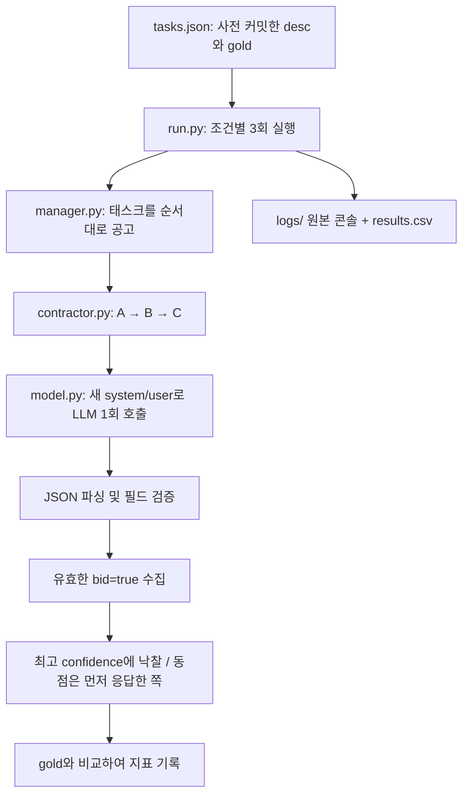

# Week 03 — Contract Net 실습

manager 1개와 LLM contractor 3개로 공고·입찰·낙찰을 구현함
실측 결과와 Smith 비교는 [REPORT.md](REPORT.md), 실행 전 설계는 [EXPERIMENT.md](EXPERIMENT.md)에 기록함

## 코드 흐름



| 파일 | 책임 |
|---|---|
| `contractor.py` | 수업 프롬프트, 조건별 능력 구성, 원본 응답 파싱 |
| `model.py` | OpenAI Chat Completions 1회 호출과 API 사용량 계측 |
| `manager.py` | 입찰 수집, 낙찰 결정, correct/messages/unassigned/misawards 계측 |
| `run.py` | CLI, 입력 검증, 실행 번호, 즉시 로그 저장, CSV 추가 |
| `test_lab.py` | 모의 응답으로 동점·거절·파싱 오류·중단 처리 등 검증 |
| `verify_results.py` | 실제 원본 응답을 다시 파싱하고 지표·입찰 순서·토큰을 CSV와 대조 |

낙찰은 Python 코드가 결정하므로 manager를 위한 추가 LLM 호출은 없음
공고마다 대화 이력을 새로 만들고 gold는 LLM에게 보내지 않음
낙찰 알림은 프로토콜 이벤트로 기록하며 낙찰 후 contractor를 다시 호출하거나 태스크를 실행하지 않음

## 재현

저장소 루트에서 실행함
`OPENAI_API_KEY`가 현재 환경에 설정되어 있어야 함
비공개 dotenv를 사용한다면 `--env-file /path/to/private.env`를 명시함
다른 제출물이나 week-02 코드에 대한 런타임 의존은 없음
환경 폴더를 제출 디렉터리 밖에 두어 과제 검사기가 SDK 전체를 검사하지 않게 함

```bash
uv venv --python 3.13.15 /tmp/ai-agent-week03-venv
uv pip install --python /tmp/ai-agent-week03-venv/bin/python \
  -r submissions/26510358/week-03/requirements.txt

export AGENT_PROVIDER=openai
export OPENAI_BASE_URL=https://api.openai.com/v1
export AGENT_MODEL=gpt-5.6-luna
export AGENT_TEMPERATURE=0.7
export AGENT_MAX_TOKENS=512
export AGENT_REASONING_EFFORT=none

/tmp/ai-agent-week03-venv/bin/python submissions/26510358/week-03/run.py --check
/tmp/ai-agent-week03-venv/bin/python submissions/26510358/week-03/run.py --runs 3
```

`--runs 3`은 조건당 3회, 총 9회를 의미함
`--condition baseline`처럼 한 조건만 실행할 수도 있음
결과는 덮어쓰지 않고 기존 실행 번호의 최댓값 다음부터 추가함
기존 제출 결과와 분리하려면 `--output /tmp/week03-new-results`를 사용함
원본 응답은 로그의 `[raw]`에 JSON 문자열로 저장하여 줄바꿈까지 복구할 수 있음
CSV의 note에는 parse_fails, API 호출 수, 토큰, 완료 태스크 수, 로그 경로, 태스크 해시를 남김
API 오류·Ctrl-C·SIGTERM은 해당 실행을 빈 계수와 이유로 기록하고 종료함
강제 종료(SIGKILL)·전원 손실은 CSV 최종 행 기록을 보장하지 못하지만, 남은 로그는 이후 실행에서도 덮어쓰지 않음
파일 잠금에 POSIX `fcntl`을 사용하므로 Linux/macOS/WSL 환경에서 실행함

## 검증

아래 검증은 API 호출 없이 실행됨
단위 테스트의 모의 로그는 임시 폴더에만 쓰며 실제 실험 기록과 섞이지 않음

```bash
python3 -m unittest discover -s submissions/26510358/week-03 -v
python3 submissions/26510358/week-03/verify_results.py
python3 scripts/check_week03.py submissions/26510358/week-03
```

공식 검사기는 파일 형식만 확인하므로, 원본 로그 재집계와 행동 검증도 함께 수행함
