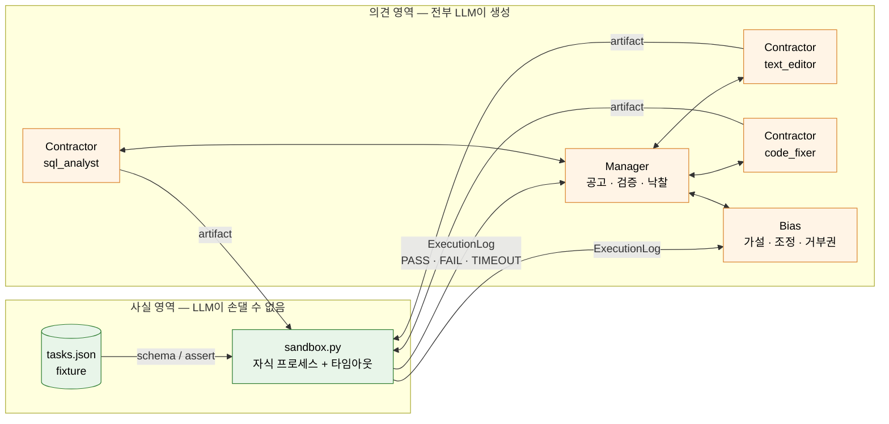
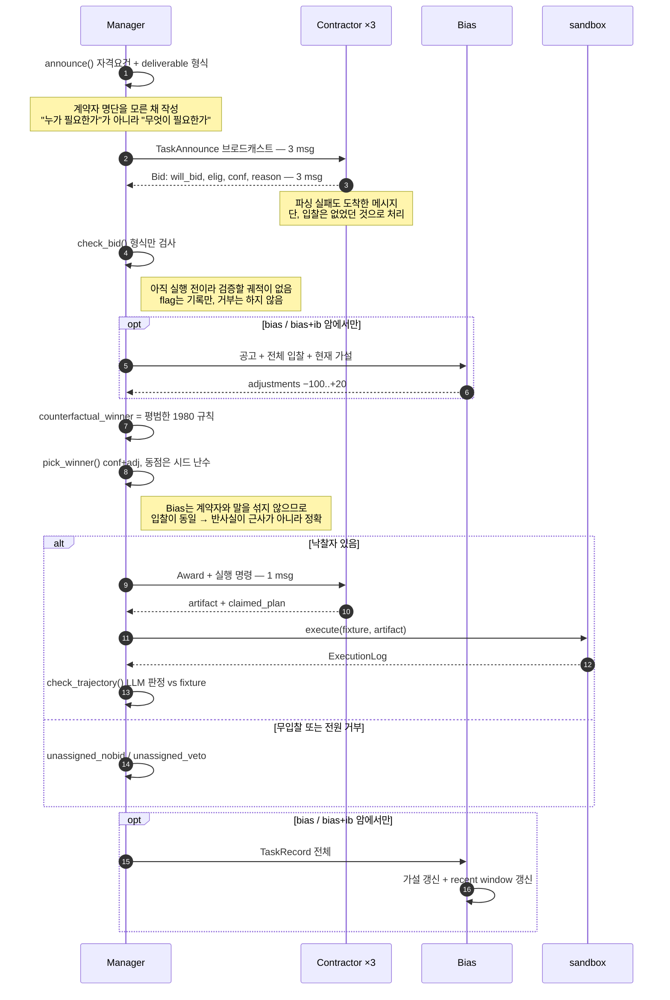
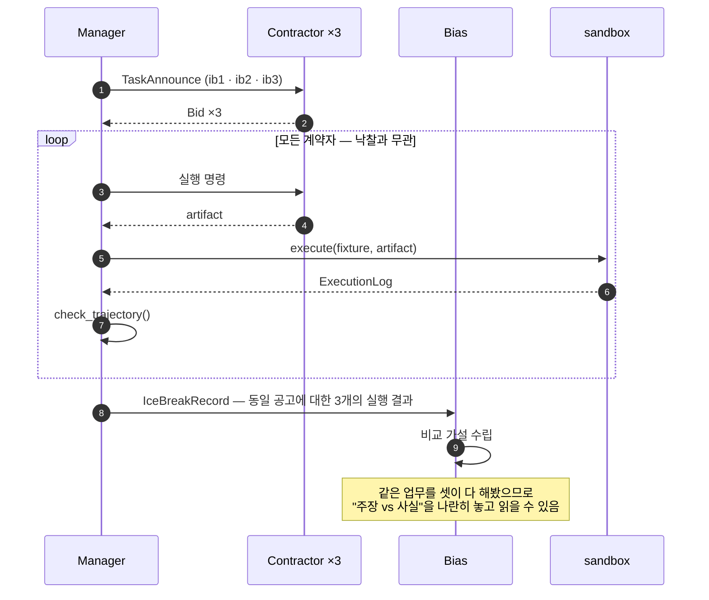
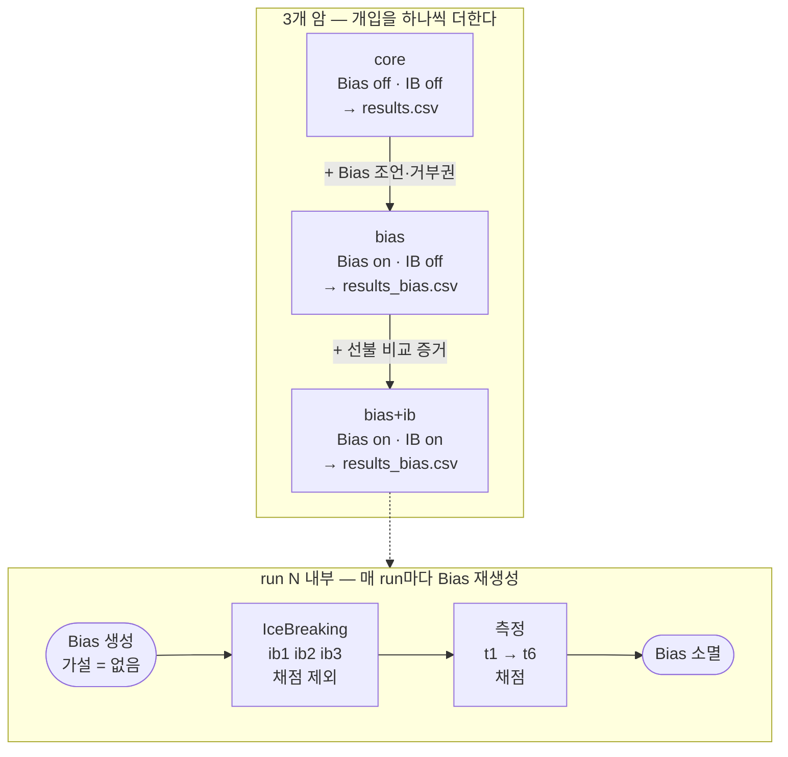
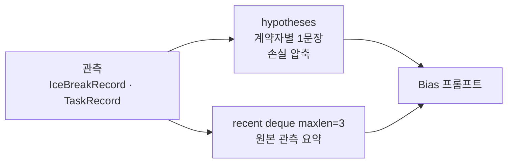
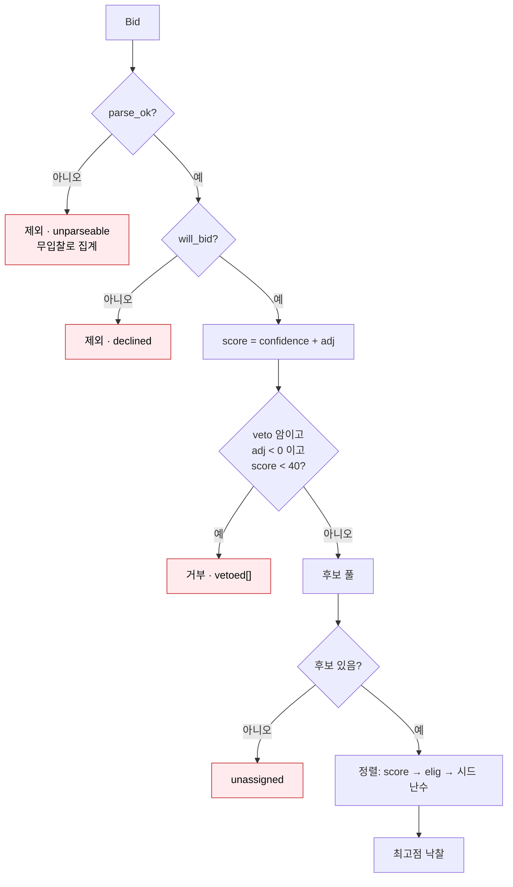
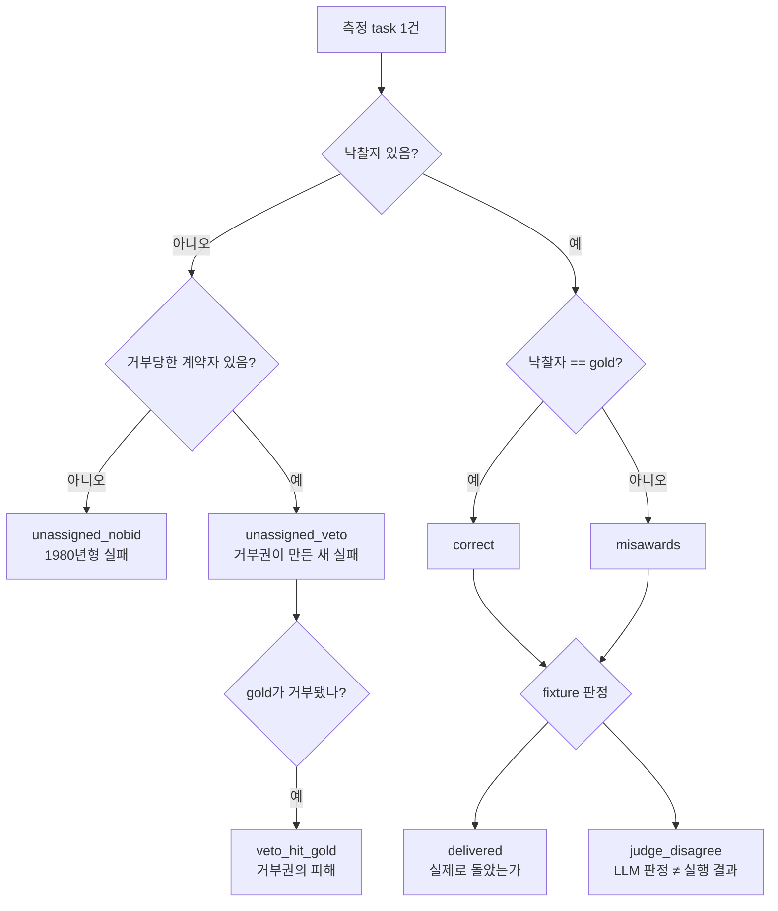
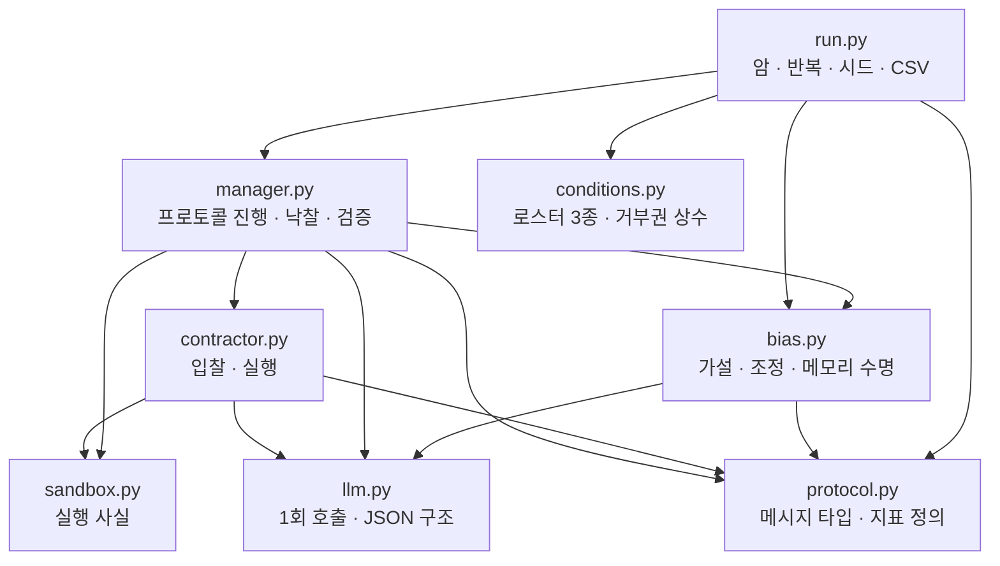

# Contract Net with a Bias agent — 설계 구조

Smith(1980)의 contract net을 재현하되, 1980년에는 **계산되던** 입찰 자격이 여기서는
LLM이 **스스로 판단해서 신고하는 값**이 된다. 이 한 가지 교체에서 나머지 설계가 전부
따라 나온다. 원 프로토콜에는 자기 신고를 검증할 장치가 없기 때문이다.

---

## 1. 신뢰 경계

이 시스템에서 가장 중요한 구분은 **누가 한 말인가**이다.



| 출처 | 신뢰도 | 근거 |
|---|---|---|
| `Bid.confidence` | 주장 | 계약자가 자기에 대해 한 말 |
| `ExecResult.claimed_plan` | 주장 | 계약자가 자기가 한 일에 대해 한 말 |
| `TrajectoryCheck.supports_output` | 의견 | LLM이 결과물을 읽고 내린 판정 |
| `Bias.hypotheses` | 의견 | LLM이 관측을 압축한 것 |
| **`ExecutionLog.passed`** | **사실** | **코드가 실제로 돌았거나 안 돌았거나** |

`claimed_plan`을 지우지 않고 남겨둔 이유는, 주장과 사실의 **격차 자체가 관측 대상**이기
때문이다. `TrajectoryCheck.verdict`는 fixture가 있으면 항상 fixture를 따르고, LLM 판정은
`judge_agrees`를 세기 위해서만 보관한다. 그 불일치 횟수가 이 시스템의 다른 LLM 판정들을
얼마나 믿어도 되는지에 대한 유일한 정직한 지표다.

---

## 2. 측정 task 하나의 흐름



`messages`는 **① 공고 N + ② 입찰 N + ③ 낙찰 1**만 센다. Bias 왕복과 아이스브레이킹은
`bias_messages` / `icebreak_messages`로 따로 잡는다. 추가 장치의 비용을 프로토콜 자체의
비용 안에 숨기면 `messages` 컬럼이 다른 재현물과 비교 불가능해지기 때문이다.

---

## 3. IceBreaking — 낙찰자만 실행되는 구조의 구멍 메우기

평범한 라운드에서는 **이긴 쪽만 실행**한다. 그래서 과신 계약자가 전부 쓸어가면 Bias는
평생 그 한 명의 실행만 보게 되고, 나머지가 실제로 뭘 할 수 있었는지는 영영 관측되지
않는다. 감점하려면 증거가 필요한데 증거를 얻으려면 감점해서 기회를 넘겨야 하는 순환이다.

IceBreaking은 그 증거를 **선불로 산다.**



- 아이스브레이킹 task(`ib1`–`ib3`)는 측정 task(`t1`–`t6`)와 **겹치지 않는다.** 겹치면
  Bias가 채점 대상 task의 답을 들고 측정에 들어가는 누수가 된다.
- 세 개가 세 skill을 하나씩 덮는다. 빠진 skill이 있으면 그 분야에 대한 Bias의 사각지대가
  측정 구간까지 그대로 따라간다.
- 낙찰이 없으므로 `correct` / `misawards`에 들어가지 않는다. 산출물은 오직 Bias의 가설.

---

## 4. 암(arm) 구성과 Bias 메모리 수명



**메모리가 run 경계를 넘지 않는 것이 이 실험이 성립하는 조건이다.** 가설이 run 1 → 2 → 3으로
누적되면 그 3개는 반복 측정이 아니라 학습 곡선이 되고, 암 사이의 차이가 개입 때문인지
누적 학습 때문인지 분리할 수 없다. run 안에서만 누적되므로 세 run은 독립 반복으로 남고,
"몇 번째 task에서 Bias가 처음 개입했나"(`first_intervention`)는 매 run 새로 측정된다.

Bias 프롬프트에 들어가는 기억은 두 층이다.



가설만 넘기면 task 5의 갱신이 task 2의 발견을 조용히 덮어쓴다 — 모델은 그걸 유지해야 한다는
사실을 모르기 때문이다. 원본 관측 3건을 같이 실어 보내 망각을 몇 task 뒤로 미룬다. 창이
유한하므로 프롬프트는 무한히 자라지 않고, 꼬리는 여전히 사라지지만 한 번에 사라지지는 않는다.

---

## 5. 낙찰 규칙과 거부권



**동점은 시드 난수로 깬다.** `homogeneous` 조건은 셋이 같은 프롬프트를 쓰므로 동점이
기본값이고, 결정적 정렬을 쓰면 이름이 먼저 오는 계약자가 전부 가져간다. 그러면 그 조건은
프로토콜이 아니라 정렬 함수를 측정하게 된다. 난수원은 run마다 시드가 고정되고 로그 첫머리에
찍힌다.

**거부권은 Bias가 실제로 감점한 경우에만 발동한다** (`adj < 0`). 절대 임계값만 쓰면 겸손하게
`confidence: 35`를 부른 정직한 계약자가 Bias가 손대지도 않았는데 거부되고, `unassigned_veto`가
Bias 탓이 아닌 유찰을 세게 된다. 조정 폭이 −100..+20으로 비대칭인 것도 같은 이유다.
`confidence: 95`를 −40까지밖에 못 깎으면 거부권은 도달 불가능한 장치가 되고, 애초에 Bias의
임무는 과잉 주장을 잡는 것이지 유망주를 밀어주는 것이 아니다.

---

## 6. 지표



`unassigned`를 쪼개지 않으면 유찰이 늘었을 때 **Bias가 나쁜 낙찰을 막은 것인지, 좋은 낙찰을
망친 것인지 읽을 수 없다.** `correct`(배정이 맞았나)와 `delivered`(실제로 작동하는 물건이
나왔나)도 분리한다. 맞는 계약자가 고장난 결과물을 낼 수도 있고, 틀린 계약자가 우연히 맞출
수도 있다.

Bias 암에서는 반사실이 공짜로 나온다. Bias는 계약자에게 말을 걸지 않으므로 입찰 내용이
Bias 유무에 영향을 받지 않고, 같은 입찰에 평범한 규칙을 적용하기만 하면
`counterfactual_winner`가 된다. 추가 LLM 호출 0회. **모든 Bias run이 자기 안에 정확한
대조군을 품고 있다** — `bias_helped` / `bias_hurt` / `first_flip`이 여기서 나온다.

| 파일 | 내용 |
|---|---|
| `results.csv` | `core` 암만. 헤더 고정, `messages`가 표준 정의를 지킴 |
| `results_bias.csv` | `bias` · `bias+ib` 암. 거부권·반사실 지표 포함 |
| `logs/<run>.txt` | 콘솔 전문. 공고·입찰·조정·거부·실행 판정 전부 |
| `history/<run>.json` | Bias가 읽은 기록 원본 + 최종 가설 |

---

## 7. 모듈



| 파일 | 역할 |
|---|---|
| `llm.py` | 무상태 1회 호출. temperature 명시, JSON 구조. 온도 기본값 0.7 |
| `protocol.py` | 프로토콜 메시지를 dataclass로. 지표 판정이 전부 여기 property |
| `sandbox.py` | 유일한 사실 공급원. 자식 프로세스 + 타임아웃 |
| `conditions.py` | 로스터 3종, `ADJ_MIN/ADJ_MAX/VETO_THRESHOLD` |
| `contractor.py` | 입찰(주장)과 실행(artifact). 궤적은 쓰지 않음 |
| `bias.py` | 가설, 조정, run 단위 메모리 |
| `manager.py` | 공고·수집·검사·낙찰·검증·기록. 메시지 회계 |
| `run.py` | 암 3개, run 반복, 시드, CSV/로그/history |

---

## 8. 실행

```bash
export OPENAI_BASE_URL=https://openrouter.ai/api/v1
export OPENAI_API_KEY=<key>
export AGENT_MODEL=nvidia/nemotron-3.5-lightning:free
export AGENT_TEMPERATURE=0.7          # 기본값. 0으로 두면 3반복이 사실상 1반복

python run.py --arms core --runs 1     # 먼저 감을 잡고
python run.py                          # 전체
```

LLM 호출 수 (계약자 3, 측정 task 6, 아이스브레이킹 task 3 기준):

| 구간 | task당 | run당 |
|---|---|---|
| `core` 측정 | 공고1 + 입찰3 + 실행1 + 검증1 = 6 | 36 |
| `bias` 측정 | + 조언1 + 관측1 = 8 | 48 |
| IceBreaking | 공고1 + 입찰3 + 실행3 + 검증3 + Bias1 = 11 | 33 |

`core` 3조건 × 3run = 324, `bias` 2조건 × 3run = 288, `bias+ib` 2조건 × 3run = 486.
**합계 약 1,100회.** 무료 모델의 분당 제한에 걸리므로 `--runs 1`로 시작할 것.

---

## 9. 아직 열려 있는 설계 문제

**IceBreaking이 노리는 증거가 안 나올 수 있다.** 목적은 능력 차이 관측인데, fixture를
넣으면서 `ib1`·`ib3`는 실행 판정이 가능해졌지만 **웬만한 모델은 페르소나와 무관하게 이
정도를 풀 수 있다.** 그러면 셋 다 PASS가 나오고 Bias가 능력에 대해 배우는 것은 없다.
실제로 관측 가능한 신호가 능력이 아니라 **입찰 정직성뿐**일 가능성이 남아 있고, 그 경우
IceBreaking은 비싼 값을 치르고 이미 입찰만 봐도 알 수 있는 것을 사게 된다.
첫 실행에서 `history/*.json`의 아이스브레이킹 구간을 보고, 비전문가가 정말 실패하는지
확인한 뒤에 task 난이도를 올릴지 페르소나에 능력 제약을 명시할지 정한다.

**텍스트 task에는 지면이 없다.** `ib2`·`t2`·`t5`는 fixture가 없어 LLM 판정만 남는다.
`judge_disagree`는 fixture가 있는 task에서만 측정되므로, 텍스트 판정이 얼마나 믿을 만한지는
간접 추론밖에 안 된다.

**온도 0.7에서 전사(transcript) 재현은 불가능하다.** 이 API들은 시드를 받지 않는다.
여기서 재현성은 전사가 아니라 **추세**를 뜻하며, 코드가 스스로 내리는 결정(동점 처리)만
시드로 고정된다.

**`sandbox.py`는 진짜 샌드박스가 아니다.** 모델이 생성한 코드를 자식 프로세스에서
타임아웃과 함께 실행할 뿐이다. 신뢰할 수 없는 task 정의를 물리면 안 된다.
