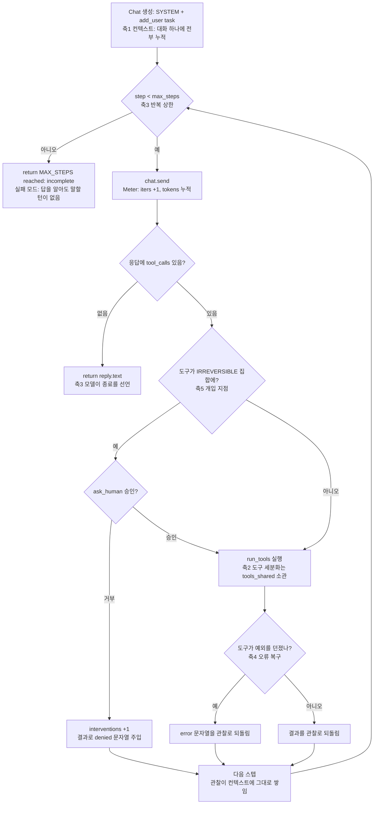
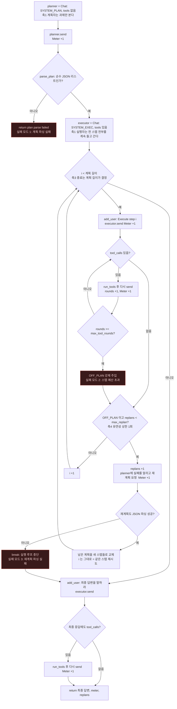
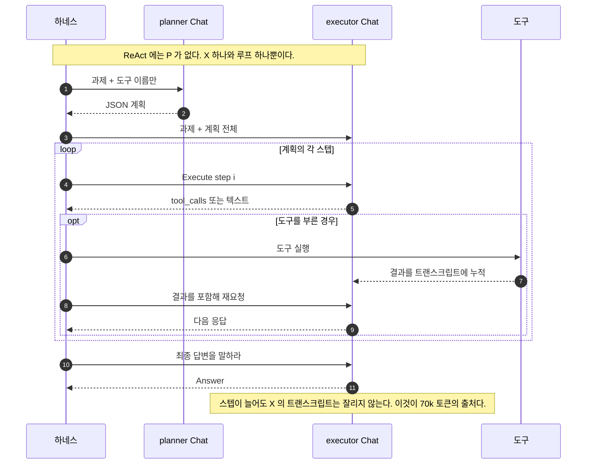

# Week 02 — 하네스 A/B 비교: ReAct vs Plan-then-Execute

모델, 과제, 도구는 고정하고 하네스만 바꿨다.

- **제공자 / 모델:** OpenRouter (OpenAI 호환 API), `nvidia/nemotron-3.5-lightning:free`
- **과제:** `TASK.md` — "In app.log, which hour (HH:00) has the most ERROR lines?"
- **성공 기준:** 최종 답변에 `expected:` 문자열 `14:00`이 포함되면 성공 (`run_ab.py:judge`). `app.log`의 실제 정답은 14시, ERROR 6줄이다.
- **도구 (두 하네스 동일, `tools_shared.py`):**
  - `read_file(path)` — 작업 디렉터리 내 파일의 앞 4000자
  - `count_pattern(path, pattern)` — 정규식에 매칭되는 줄 수
- **실행 방법:**

  ```bash
  cd submissions/26512071/week-02
  export OPENAI_BASE_URL=https://openrouter.ai/api/v1
  export OPENAI_API_KEY=<본인 openrouter 키>
  export AGENT_MODEL=nvidia/nemotron-3.5-lightning:free
  python run_ab.py --runs 3
  ```

## 1. 변형 정의 — 다섯 축 중 무엇이 다른가

| 축 | ReAct (`harness_react.py`) | Plan-then-Execute (`harness_plan_execute.py`) | 차이? |
|---|---|---|---|
| 1 컨텍스트 관리 | `Chat` 하나. 매 호출마다 전체 히스토리(생각, 도구 호출, 관찰)를 다시 보낸다 | `Chat` 두 개. 도구 없는 planner와 executor로 분리. executor는 전체 트랜스크립트를 유지하면서 스텝마다 `Execute step i` 유저 메시지를 하나씩 받고, planner는 과제와 실패 메시지만 본다 | **O** |
| 2 도구 세분화 | `read_file` + `count_pattern`, 동일 | 동일 | X (고정) |
| 3 종료 조건 | 모델이 결정. 도구 호출 없는 응답을 내면 종료. 상한 `max_steps=8` | 플랜이 결정. JSON 플랜의 모든 스텝을 실행하면 종료하고, 마지막에 최종 답변 호출 1회를 강제. 스텝별 상한 `max_tool_rounds=3` | **O** |
| 4 오류 복구 | 도구 오류가 그냥 관찰(Observation)로 돌아오고, 다음 행동은 모델이 판단. 별도 복구 경로 없음 | 스텝이 `OFF_PLAN:`을 보고하거나 도구 호출 예산을 넘기면 재계획 1회(`max_replan=1`). planner에게 남은 스텝의 JSON 리스트를 새로 요청. 그 응답이 파싱 가능한 JSON이 아니면 루프가 끊긴다 | **O** |
| 5 인간 개입 지점 | `IRREVERSIBLE` 집합. 여기서는 비어 있음(읽기 전용 도구)이라 승인 프롬프트가 뜨지 않는다 | 아예 없음 | 실질적으로 X (양쪽 개입 0회) |

즉 움직인 축은 세 개다: **컨텍스트 관리, 종료 조건, 오류 복구.** 도구 세분화는 설계상 고정했고, 인간 개입 지점은 두 도구가 모두 읽기 전용이라 이 실험으로는 검증되지 않는다.

### 1-1. ReAct 하네스의 제어 흐름

`harness_react.py`의 실제 분기다. 다섯 축이 어느 지점에 박혀 있는지 표시했다.



이 실험에서 `IRREVERSIBLE`은 빈 집합이므로 `ASK` 경로는 한 번도 실행되지 않았고, 그래서 모든 런의 개입이 0이다.

### 1-2. Plan-then-Execute 하네스의 제어 흐름

`harness_plan_execute.py`의 실제 분기다. 강조한 세 곳이 이 하네스에만 있는 실패 모드다.



`plan_exec-03.txt`가 실패 모드 2를 거쳐 실패 모드 3으로 빠진 런이다. `BRK`에서 실행 루프가 끊겼는데도 `FA`는 실행되므로 최종 답변은 나왔다.

### 1-3. 축1 컨텍스트 관리의 차이

같은 과제를 푸는 동안 두 하네스가 모델에게 무엇을 보여 주는지가 다르다. `Meter`는 `send` 호출마다 1씩 오르므로, 아래에서 모델을 향한 화살표의 개수가 곧 `iters`다.



계획자는 도구도 관찰도 보지 못한다. 그래서 재계획을 요청받았을 때 실행 중 무슨 일이 있었는지를 실패 메시지 한 줄로만 안다.

## 2. 측정치

`results.csv` 원본 (`O` = 성공, `X` = 실패):

| run | harness | success | tokens | iters | interventions | note |
|---|---|---|---|---|---|---|
| 1 | react | O | 4243 | 2 | 0 | |
| 0 | react | O | 3967 | 2 | 0 | |
| 1 | react | X | 20123 | 8 | 0 | |
| 2 | react | O | 4146 | 2 | 0 | |
| 3 | plan_exec | O | 21050 | 8 | 0 | replans=1 |
| 4 | plan_exec | O | 70752 | 13 | 0 | replans=0 |
| 5 | plan_exec | O | 75626 | 14 | 0 | replans=0 |

스타터 6런(0~5행) 집계:

| harness | 성공 | 토큰 (최소 / 중앙값 / 최대) | 반복 (최소 / 중앙값 / 최대) | 개입 |
|---|---|---|---|---|
| react | 2/3 | 3967 / 4146 / 20123 | 2 / 2 / 8 | 0 |
| plan_exec | 3/3 | 21050 / 70752 / 75626 | 8 / 13 / 14 | 0 |

**실험 조건 기록.** `conditions.py`가 배치 시작 시 제공자·모델·도구 스키마·시스템
프롬프트·하네스 상한(`max_steps` / `max_replan` / `max_tool_rounds`)·과제·성공 기준을
모아 sha1 앞 8자리 지문으로 압축하고, `conditions/<지문>.json`에 저장한다. 같은
지문이 각 런 로그 첫 줄들(`[cond] ...`)과 `results.csv`의 `note` 칼럼(`cond=<지문>`)에
동시에 남으므로, 어느 행이 어느 조건에서 나왔는지 로그 하나만 봐도 알 수 있다.
상한 값은 하드코딩이 아니라 `inspect.signature`로 하네스에서 읽으므로, 하네스를
수정하면 지문이 자동으로 바뀐다. API 키는 기록하지 않고 어떤 환경변수가 설정되어
있는지(이름과 참/거짓)만 남긴다.

아래 6런의 조건 지문은 **`22a2fd16`** 이다. 이 값은 기록기를 붙이기 전에 실행된
런이라 `note` 칼럼에는 남아 있지 않고, 무수정 스타터 파일과 위 실행 환경에서
사후 재구성한 값이다. 기록기가 실제로 note와 로그에 지문을 남기는 것은 다음
배치부터다.

**런 내역.** 0~5행은 `python run_ab.py --runs 3` 한 번으로 나온 채점 대상 6런이고, 각 런의 콘솔 캡처는 `logs/react-00.txt`, `react-01.txt`, `react-02.txt`, `plan_exec-03.txt`, `plan_exec-04.txt`, `plan_exec-05.txt`다. `logs/console-0908-2033.txt`는 그 배치 전체의 `tee` 캡처다. `results.csv` 맨 위의 `1`번 행은 그보다 앞선 ReAct 런이며, 삭제하지 않고 그대로 남겼다. <!-- TODO(hb): 이 첫 행이 어떻게 나온 런인지 한 줄로 밝히기 (단독 `python harness_react.py`? 더 이전의 run_ab 실행?). 기록의 정직성을 위해 밝히거나, 행을 지우고 지웠다고 적기. -->

## 3. 해석

해석에 들어가기 전, 로그에 남은 증거:

- `react-00.txt`, `react-02.txt` — 2 반복, 약 4k 토큰. `read_file` 한 번 하고 모델이 머릿속으로 시간대를 세서 답했다. `count_pattern`은 아예 호출하지 않았다.
- `react-01.txt` — 유일한 실패. 모델이 `count_pattern`으로 시간대를 하나씩 셌고(`09:`→1, `10:`→2, `11:`→1, `12:`→3, `13:`→2, `14:`→6, `15:`→2), 8스텝을 전부 도구 호출에 쓴 뒤 `MAX_STEPS reached: incomplete`로 끝났다. 필요한 숫자는 이미 트랜스크립트 안에 다 있었고, 그것을 말할 턴이 없었을 뿐이다. 20123 토큰, 성공한 ReAct 런의 5배.
- `plan_exec-03.txt` — 스텝 1이 `max_tool_rounds`에 걸려 하네스가 `OFF_PLAN: step exceeded the tool-call budget`을 냈다. 재계획 응답이 산문(`"Here's a thinking process:\n\n1. **Analyze User Input:**…"`)으로 와서 `parse_plan`이 `None`을 반환하고 실행 루프가 끊겼다. 그런데도 강제 최종 답변 호출이 `Answer: 14:00`을 만들어 21050 토큰에 `O` 판정을 받았다.
- `plan_exec-04.txt`, `plan_exec-05.txt` — 스텝 1에서 이미 `Answer: 14:00`이 나왔는데도 루프가 스텝 2~6을 계속 실행하며 `app.log`를 두세 번 더 읽었다. 13~14 반복, 70~76k 토큰. `plan_exec-04.txt`는 스텝 2에서 `12:00`(오답)을 말하고 스텝 5에서는 계산 과정을 그대로 노출했지만, 최종 답은 맞았다.
- 모든 행에서 개입은 0이다. `IRREVERSIBLE`이 비어 있고 Plan-then-Execute에는 승인 훅 자체가 없으므로, 이 A/B는 축 5에 대해 아무것도 말해주지 않는다.

<!-- TODO(hb): 여기에 본인 문장으로 한 문단. 위 증거를 근거로 세 가지에 답할 것:
     (a) 성공률에서 이긴 하네스는 무엇이고, 그 원인이 되는 축은 무엇인가;
     (b) 토큰/반복에서 이긴 하네스는 무엇이고, 그 원인이 되는 축은 무엇인가;
     (c) plan_exec-03의 재계획 파싱 실패가 축 4에 대해 무엇을 보여주는가 — 복구 경로는 실패했는데 런은 통과했다는 점에 주목.
     단순히 승자 선언으로 끝내지 말 것. -->
