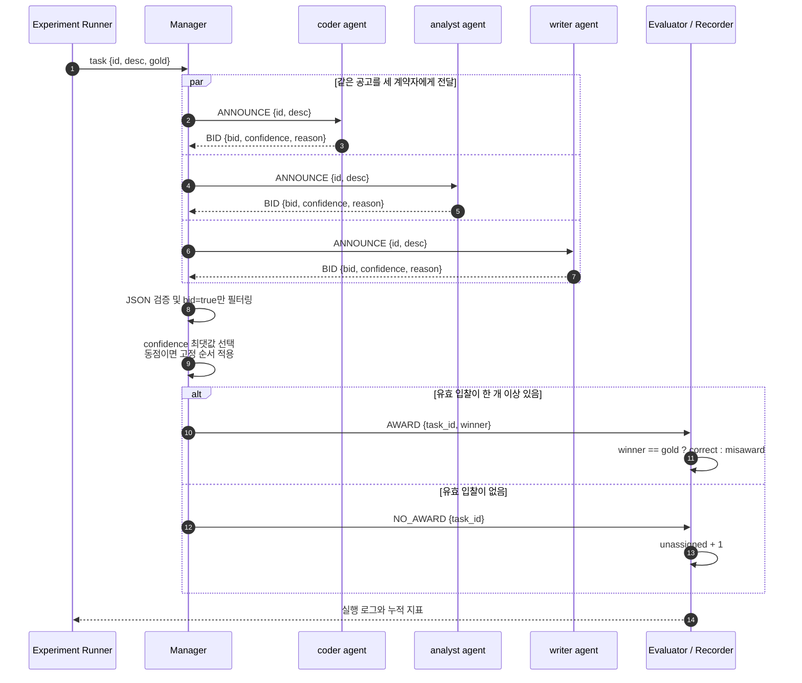
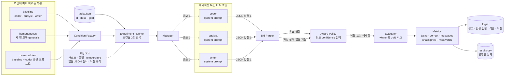

# Week 03 Contract Net 아키텍처

## 입찰과 낙찰 프로세스

세 계약자는 서로 대화하지 않는다. 매니저가 같은 공고를 각각에게 보내면, 각 계약자는
자신의 시스템 프롬프트를 기준으로 독립적인 LLM 호출을 한 번 수행하고 입찰 JSON을
반환한다. 매니저는 LLM이 아니라 고정된 규칙으로 낙찰자를 선택한다.



예를 들어 `code-debug` 태스크의 gold는 `coder`다. baseline에서 coder가
`bid=true, confidence=0.95`, analyst와 writer가 `bid=false`를 반환하면 매니저는
coder에게 낙찰하고 `correct`를 1 증가시킨다. overconfident 조건에서 coder는 데이터나
글쓰기 태스크에도 높은 confidence로 입찰하므로 실제 전문가보다 높은 값을 내면 낙찰을
가로채고 `misawards`가 증가할 수 있다.

## 전체 구조



## 구성요소의 책임

| 구성요소 | 책임 |
|---|---|
| Experiment Runner | 세 조건을 각각 3회 실행하고 실행 번호를 관리한다. |
| Condition Factory | 조건에 맞는 세 계약자의 시스템 프롬프트를 만든다. 다른 설정은 바꾸지 않는다. |
| Manager | 각 태스크를 세 계약자에게 공고하고 입찰 결과를 모은다. |
| Contractor | 자신의 시스템 프롬프트와 같은 태스크 설명을 받아 독립적으로 한 번 입찰한다. |
| Bid Parser | `bid`, `confidence`, `reason` JSON을 검증한다. 파싱 실패는 무입찰로 처리하되 원문은 로그에 보존한다. |
| Award Policy | 유효한 `bid=true` 중 confidence가 가장 높은 계약자를 선택한다. 동점은 고정된 계약자 순서로 결정한다. |
| Evaluator | 낙찰자와 `tasks.json`의 gold를 비교해 correct 또는 misaward로 집계한다. 유효 입찰이 없으면 unassigned로 집계한다. |
| Recorder | 공고·입찰·낙찰 전 과정을 실행별 로그에 쓰고 실행 합계를 `results.csv`에 append한다. |

## 입찰 데이터 계약

각 계약자는 다음 JSON만 반환하도록 요청한다.

```json
{
  "bid": true,
  "confidence": 0.95,
  "reason": "이 태스크는 나의 전문 분야와 일치한다."
}
```

`confidence`는 0 이상 1 이하로 제한한다. JSON이 아니거나 필드·타입·범위가 맞지 않으면
유효하지 않은 입찰로 처리한다. 응답 메시지는 오갔으므로 메시지 수에는 포함하고, 실제
응답 원문과 실패 원인을 로그에 남긴다.

## 메시지와 지표 계산

태스크 하나당 세 계약자에게 보내는 공고 3개와 입찰 응답 3개를 센다. 유효한 입찰자가
있으면 낙찰 통보 1개를 추가해 총 7개이고, 아무도 입찰하지 않으면 낙찰 통보가 없어
총 6개다.

- `correct`: 낙찰자와 gold가 같은 태스크 수
- `unassigned`: 유효한 입찰자가 없는 태스크 수
- `misawards`: 낙찰자와 gold가 다른 태스크 수
- 항상 `tasks = correct + unassigned + misawards`가 성립해야 한다.

## 조건별로 달라지는 한 가지

| 조건 | 시스템 프롬프트의 차이 |
|---|---|
| baseline | coder, analyst, writer가 각자의 전문성만 근거로 입찰한다. |
| homogeneous | 세 이름은 유지하지만 전문성 문구를 모두 같은 generalist 설명으로 바꾼다. |
| overconfident | baseline을 유지하고 coder에게 모든 태스크에 높은 confidence로 입찰하라고 추가한다. |

세 조건에서 매니저, JSON 파서, 낙찰 규칙, 태스크 순서, 모델과 temperature는 동일하게
유지한다. 이렇게 해야 측정값의 차이를 계약자 프롬프트 변화의 영향으로 해석할 수 있다.
