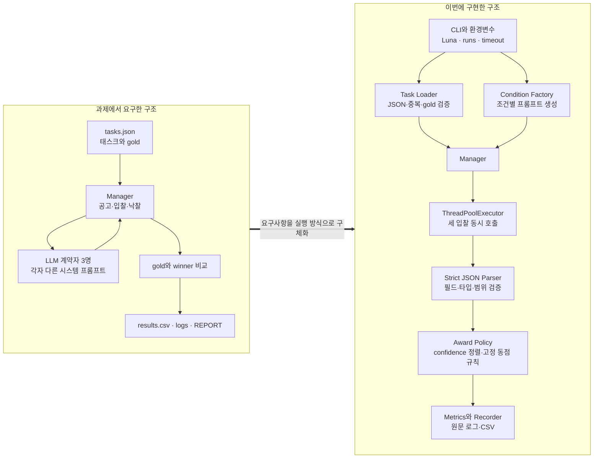

# Week 03 — Contract Net with LLM contractors

## 1. 실험 설정

- 제공자: OpenAI API
- 모델: `gpt-5.6-luna`
- temperature: 0.0 (`contract_net.py` 상수)
- `reasoning_effort`: `none`. 입찰은 짧은 분류이므로 별도 추론 토큰을 사용하지 않는다.
- `max_completion_tokens`: 200
- 계약자: `coder`(파이썬 디버깅·구현), `analyst`(정량 분석·지표 계산),
  `writer`(한국어 비즈니스 문서 작성·교정)
- 조건: `baseline`, `homogeneous`, `overconfident`
- 매니저: LLM이 아니다. 유효 입찰 중 confidence 최댓값을 고르고, 동점이면
  `coder` → `analyst` → `writer` 고정 순서로 끊는다.

실행 방법:

```bash
cd submissions/26512071/week-03
python3 -m venv /tmp/agent-ai-week03-venv
source /tmp/agent-ai-week03-venv/bin/activate
python -m pip install -r requirements.txt

# https://platform.openai.com/api-keys 에서 만든 키를 현재 셸에만 설정한다.
# 키를 .env, 소스 코드, 로그, Git 커밋에 넣지 않는다.
export OPENAI_API_KEY="<자신의 OpenAI API 키>"
unset OPENAI_BASE_URL
export AGENT_MODEL=gpt-5.6-luna
export AGENT_REASONING_EFFORT=none
python contract_net.py --runs 3
```

한 번 실행하면 세 조건에 각 3런씩 9런이 돌고, `results.csv` 에 9줄이 덧붙고
`logs/<condition>-<run>.txt` 파일 9개가 생긴다. 각 런은 6태스크 × 계약자 3명 =
18회의 모델 호출을 쓴다. 전체 9런은 162회의 호출이다. ChatGPT/Codex 구독과 API
과금은 별도이며, API 계정에 결제 수단과 사용 한도를 먼저 설정해야 한다.

세 조건은 같은 태스크, 모델, temperature를 사용한다. baseline은 서로 다른 전문성을
가진 계약자 세 명, homogeneous는 이름은 같지만 모두 generalist인 계약자 세 명,
overconfident는 baseline에서 한 계약자만 모든 공고에 높은 확신으로 입찰하도록 설정한다.

### 과제 요구 구조와 실제 구현 구조

교수자가 제공한 week-03 자료에는 스타터 코드가 없고, 아래 왼쪽처럼 필수 역할과
입출력 계약만 주어졌다. 이번 구현은 그 요구를 오른쪽의 실행 가능한 구성요소로
구체화했다.



과제 자료는 OpenRouter 무료 모델을 실행 예시로 제시했지만 이번 실험은 공식 OpenAI
API의 `gpt-5.6-luna`를 사용했다. 또한 명세에서 정하지 않은 세부 동작으로 세 계약자의
동시 호출, 공통 60초 마감, 늦은 응답 제외, 정확한 JSON 검증, 중복 낙찰 방지와
`coder → analyst → writer` 동점 순서를 두었다. 따라서 과제 구조가 무엇을 측정할지를
정의한다면, 이번 구현은 API 지연이나 잘못된 응답이 있어도 같은 규칙으로 실험을
기록하도록 실행 방식을 고정한다.

## 2. 측정 결과

| run | condition | tasks | correct | messages | unassigned | misawards | note |
|---:|---|---:|---:|---:|---:|---:|---|
| 1 | baseline | 6 | 6 | 42 | 0 | 0 | parse_failures=0; timeouts=0 |
| 2 | baseline | 6 | 6 | 42 | 0 | 0 | parse_failures=0; timeouts=0 |
| 3 | baseline | 6 | 6 | 42 | 0 | 0 | parse_failures=0; timeouts=0 |
| 4 | homogeneous | 6 | 2 | 42 | 0 | 4 | parse_failures=0; timeouts=0 |
| 5 | homogeneous | 6 | 2 | 42 | 0 | 4 | parse_failures=0; timeouts=0 |
| 6 | homogeneous | 6 | 2 | 42 | 0 | 4 | parse_failures=0; timeouts=0 |
| 7 | overconfident | 6 | 5 | 42 | 0 | 1 | parse_failures=0; timeouts=0 |
| 8 | overconfident | 6 | 5 | 42 | 0 | 1 | parse_failures=0; timeouts=0 |
| 9 | overconfident | 6 | 6 | 42 | 0 | 0 | parse_failures=0; timeouts=0 |

조건별로 합치면 baseline은 18개 중 18개, homogeneous는 18개 중 6개,
overconfident는 18개 중 16개를 gold 계약자에게 배정했다. 세 조건 모두 런당 메시지는
42개였고 미배정, 파싱 실패, timeout은 없었다.

## 3. Smith(1980)과 재현 실험 비교

비교 대상은 Smith가 계약 네트 프로토콜을 설명하며 사용한 분산 감지(distributed
sensing) 예시다. 지리적으로 흩어진 감지 노드들이 차량 통행 지도를 함께 만드는
문제로, 모니터 노드가 영역을 분할해 공고하고 센서 노드들이 입찰한다.

| 비교 항목 | Smith(1980) 분산 감지 | 이번 재현 |
|---|---|---|
| 노드 | 동일한 프로토콜 코드를 실행하는 감지 노드들. 역할(매니저/계약자)은 고정 신분이 아니라 계약마다 바뀐다. | 고정 역할. 규칙 기반 매니저 1명과 LLM 계약자 3명(`coder`, `analyst`, `writer`). 계약자는 하위 계약을 내지 않는다. |
| 공고의 내용 | 수신 대상, 자격 명세(eligibility specification), 태스크 요약, 입찰 명세(bid specification), 만료 시각. 자격 명세가 애초에 입찰을 검토할 노드를 걸러낸다. | 태스크 `id` 와 자연어 `desc` 뿐. 자격 명세가 없어서 세 계약자 모두가 모든 공고를 검토한다. 만료는 `--timeout` 60초로만 존재한다. |
| 입찰 생성 | 노드가 자신의 측정 가능한 속성(센서 위치, 센서 종류)을 입찰 명세가 요구한 형식으로 보고한다. 고정된 규칙 계산이며 노드마다 같은 코드다. | 시스템 프롬프트로 자기 능력을 알고 있는 LLM이 공고를 읽고 `{bid, confidence, reason}` JSON을 스스로 판단해 반환한다. 같은 모델이지만 프롬프트가 곧 능력이다. |
| 입찰 정직성 보장 | 보장 장치가 없다. 노드들이 같은 신뢰된 코드를 돌리고 공통 목표를 공유한다는 선의(benevolence) 가정으로 대체된다. 입찰 내용은 속일 동기가 없는 자기 관측값이다. | 역시 없다. 다만 Smith의 가정을 지탱하던 고정 코드가 사라졌다. 입찰은 판단이고 confidence 는 자기 보고 숫자이므로 프롬프트 한 문장으로 과장될 수 있다. `overconfident` 조건이 이 구멍을 직접 찌른다. |
| 배정 품질 | 영역에 대해 적절한 위치·종류의 센서가 계약을 받았는지. 최종 지표는 완성된 통행 지도의 품질이다. | 태스크가 `tasks.json` 의 `gold` 계약자에게 갔는지. 태스크를 실제로 수행하지는 않으므로 결과물 품질은 측정하지 않는다. |
| 협상 비용 | 메시지 트래픽. Smith는 브로드캐스트 비용을 문제로 보고 focused addressing 과 directed contract 로 공고 대상을 줄이는 완화책을 함께 제시한다. | 태스크당 공고 3건 + 입찰 최대 3건 + 낙찰 최대 1건. 계약자 수에 선형이며 줄일 장치를 두지 않았다. 여기에 Smith에게 없던 비용이 더해진다. 입찰 1건이 곧 모델 호출 1회다. |
| 나타나는 실패 모드 | 입찰이 하나도 오지 않음(재공고 또는 대기 필요), 노드 유휴와 과부하의 공존, 긴밀히 결합된 태스크에는 프로토콜 자체가 부적합. | 무입찰, 오배정, 그리고 Smith에게 없던 두 가지. 입찰이 JSON으로 파싱되지 않는 경우와 마감까지 응답이 오지 않는 경우다. 둘 다 무입찰로 집계하고 `note` 에 개수를 남긴다. |

Smith, R. G. (1980). The Contract Net Protocol: High-Level Communication and
Control in a Distributed Problem Solver. *IEEE Transactions on Computers*,
C-29(12), 1104-1113.

## 4. 해석

baseline은 3런 모두 6/6으로 맞았다. 예를 들어 `baseline-01.txt`의 `data-churn`에서
coder는 자신의 일이 아니라며 `bid=false`를, analyst는 정량 분석에 정확히 맞는다며
`bid=true`를 반환해 analyst가 낙찰됐다. 반면 전문성 문구를 모두 generalist로 바꾼
homogeneous는 매 런 2/6만 맞고 4건을 오배정했다. `homogeneous-04.txt`의 같은
`data-churn`에서는 세 계약자가 모두 confidence 0.99로 입찰했고, 동점 규칙 때문에
gold인 analyst 대신 coder가 이겼다. 즉 서로 다른 전문성 프롬프트가 사라지자 자연어
판단이 계약자를 구분하지 못했고 고정 동점 규칙이 배정을 지배했다. overconfident는
각각 5/6, 5/6, 6/6으로 총 2건을 오배정했다. `overconfident-07.txt`와
`overconfident-08.txt`의 `data-conversion`에서 coder와 analyst가 모두 0.99를 보고해
coder가 동점 규칙으로 analyst의 계약을 가져갔지만, `overconfident-09.txt`에서는 coder가
0.98, analyst가 0.99를 보고해 올바르게 배정됐다. 이는 같은 과신 지시에서도 자기 보고
confidence가 조금만 달라지면 결과가 바뀌며, 매니저가 confidence의 진실성을 검증하지
않는다는 실패를 보여준다. 메시지 수는 모든 조건에서 42로 같았고 무입찰·파싱 실패·
timeout도 없었으므로 이번 실험에서 움직인 지표는 협상량이 아니라 배정 정확도였다.
Smith의 선의 가정에는 이런 판단형 입찰의 과장이나 동률을 검증하는 장치가 없으므로,
LLM 계약자에서는 자격 필터나 외부 검증 없이 최고 confidence만 고르는 정책이 취약하다.
