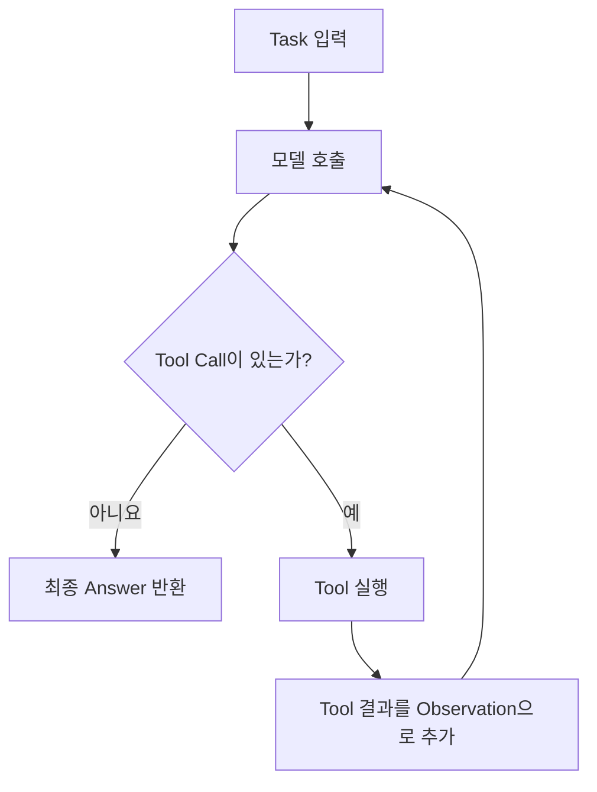
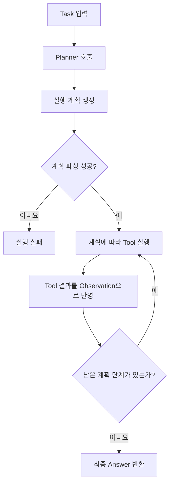

# Week 02 — Harness A/B 실험 보고서

## 1. 변형 정의와 실험 조건

이 실험은 **모델, 태스크, 도구, 성공 판정 기준을 고정하고 하네스만 변경한 A/B 실험**이다. 두 하네스 모두 동일한 모델과 `tools_shared.py`에 정의된 `read_file(path)`, `count_pattern(path, pattern)` 도구를 사용했다.

태스크는 `app.log`에서 **`ERROR`가 가장 많이 발생한 시간대를 찾는 것**이며, 성공 여부는 `TASK.md`에 정의된 정답 `14:00`을 기준으로 판정했다. ReAct와 Plan-then-Execute는 교수님이 제공한 조건을 그대로 사용했으며, 실험을 위해 별도의 조건이나 기능을 추가하지 않았다.

ReAct는 모델이 도구를 호출한 뒤 그 결과를 Observation으로 받고, 이를 바탕으로 **다음 행동을 다시 결정하는 방식**이다. 도구 호출이 없으면 최종 답변을 반환하며, 최대 8 iterations까지 실행한다.

Plan-then-Execute는 먼저 모델이 **도구를 사용하지 않고 실행 계획을 생성**한 뒤, 생성된 계획에 따라 도구를 순차적으로 실행하는 방식이다. 따라서 두 하네스는 동일한 모델과 도구를 사용하지만, **실행 전에 계획을 생성하는지와 실행 과정에서 다음 행동을 결정하는 방식**에서 차이가 있다.

각 하네스를 3회씩 실행하여 `success`, `tokens`, `iters`, `interventions`를 측정했다. 모든 실행에서 별도의 인간 개입은 발생하지 않았다.

### ReAct 하네스 구조

### Plan-then-Execute 하네스 구조

## 2. 측정 결과

각 하네스를 3회씩 실행하여 총 6회의 결과를 측정했다. 각 실행에서 성공 여부, 사용 토큰 수, iterations, 인간 개입 횟수를 기록했으며, 결과는 `results.csv`에 저장했다.

| run | harness | success | tokens | iters | interventions | note |
|---:|---|:---:|---:|---:|---:|---|
| 1 | react | O | 3,108 | 2 | 0 | |
| 2 | react | O | 3,229 | 2 | 0 | |
| 3 | react | O | 6,244 | 3 | 0 | |
| 4 | plan_exec | O | 19,904 | 7 | 0 | replans=0 |
| 5 | plan_exec | X | 226 | 1 | 0 | replans=0 |
| 6 | plan_exec | X | 1,401 | 1 | 0 | replans=0 |
| **평균: ReAct** | | **100%** | **4,194** | **2.33** | **0** | |
| **평균: Plan-then-Execute** | | **33.3%** | **7,177** | **3.0** | **0** | |

ReAct는 3회 모두 정답을 반환하여 **100%의 성공률**을 기록했다. 반면 Plan-then-Execute는 3회 중 1회만 성공하여 **33.3%의 성공률**을 기록했다.

전체 실행의 평균을 비교하면 Plan-then-Execute는 ReAct보다 약 **1.7배 많은 토큰**을 사용했으며, 평균 iterations도 ReAct의 2.33회에서 Plan-then-Execute의 3.0회로 증가했다.

ReAct의 토큰 사용량은 3,108~6,244 범위였으며, Plan-then-Execute는 19,904 tokens를 사용한 성공 실행과 226, 1,401 tokens를 사용한 실패 실행으로 실행별 차이가 크게 나타났다. 실패한 두 실행은 실제 도구 실행 과정까지 진행하지 못하고 계획 파싱 단계에서 종료되었다.

## 3. 해석

이번 태스크에서는 **ReAct가 Plan-then-Execute보다 안정적으로 문제를 해결했다.** ReAct는 세 번의 실행에서 모두 `app.log`를 확인하고 필요한 도구를 사용하여 `14:00`을 찾아 최종 답변을 반환했다.

첫 번째와 두 번째 ReAct 실행에서는 `read_file`로 로그를 읽은 뒤 바로 정답을 반환하여 각각 2 iterations로 종료되었다. 세 번째 실행에서는 추가적으로 `count_pattern`을 사용하여 `ERROR` 발생 횟수를 확인한 뒤 `14:00`을 답했다. 실행마다 모델이 선택한 도구 사용 방식에는 차이가 있었지만 세 실행 모두 성공했다.

반면 Plan-then-Execute에서는 **실제 태스크를 수행하기 전에 실행 계획을 먼저 생성해야 하기 때문에 계획 생성 단계가 추가된다.** 성공한 4번 실행에서는 계획에 따라 도구를 실행하여 최종적으로 `14:00`을 찾았지만, 총 7 iterations와 19,904 tokens를 사용했다.

특히 5번과 6번 실행에서는 Planner가 요구된 형식의 계획을 정상적으로 생성하지 못해 **plan parsing에 실패**했다. 이 때문에 실제 도구를 이용한 태스크 수행까지 진행하지 못했고, 각각 1 iteration에서 종료되어 실패로 기록되었다.

이 결과를 통해 이번 실험에서는 Plan-then-Execute의 **계획 생성 단계가 실행 성공 여부에 영향을 줄 수 있으며**, 계획이 정상적으로 생성된 경우에도 계획을 생성하고 실행하는 추가 과정으로 인해 더 많은 토큰과 iterations가 사용될 수 있음을 확인했다.

반면 ReAct는 도구 실행 결과를 Observation으로 받은 후 다음 행동을 결정하기 때문에 사전에 전체 실행 계획을 생성할 필요가 없다. 이번처럼 로그 파일을 확인하고 필요한 정보를 찾아 답하는 비교적 단순한 태스크에서는 이러한 방식이 효과적으로 동작했다.

다만 이번 결과만으로 **Plan-then-Execute가 항상 ReAct보다 열등하다고 판단할 수는 없다.** 이번 실험의 태스크가 비교적 단순했기 때문에 ReAct의 방식이 유리했을 가능성이 있다. 여러 단계의 작업을 미리 구조화하거나 실행 순서를 명확하게 정하는 것이 중요한 태스크에서는 Plan-then-Execute의 사전 계획 방식이 장점으로 작용할 수 있다.

결론적으로 **이번 실험 조건에서는 ReAct가 Plan-then-Execute보다 높은 성공률과 낮은 평균 실행 비용을 보였다.** 특히 단순한 도구 사용 태스크에서는 실행 결과를 확인하면서 필요한 행동을 결정하는 ReAct 방식이 사전에 전체 계획을 생성하는 Plan-then-Execute 방식보다 안정적으로 동작했다.