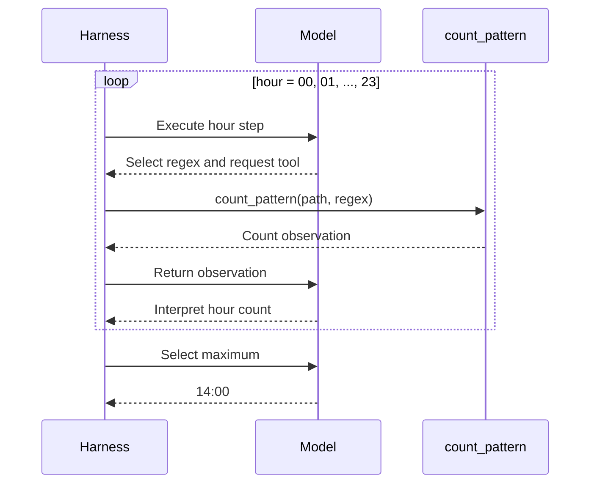
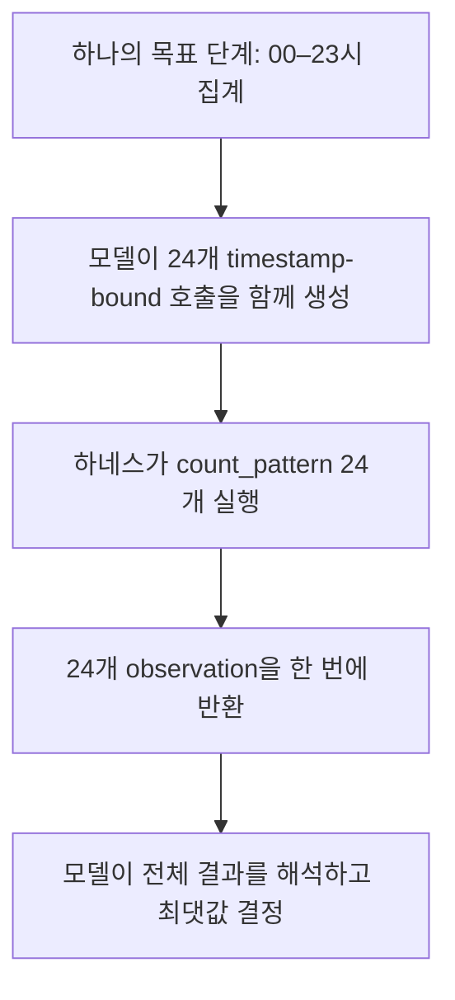
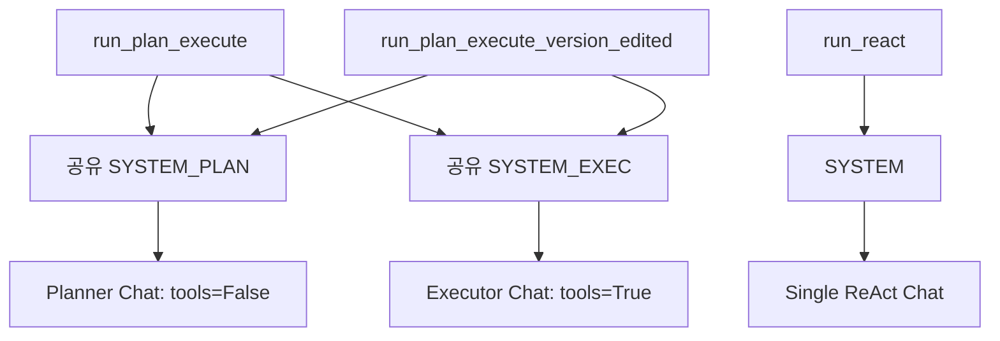
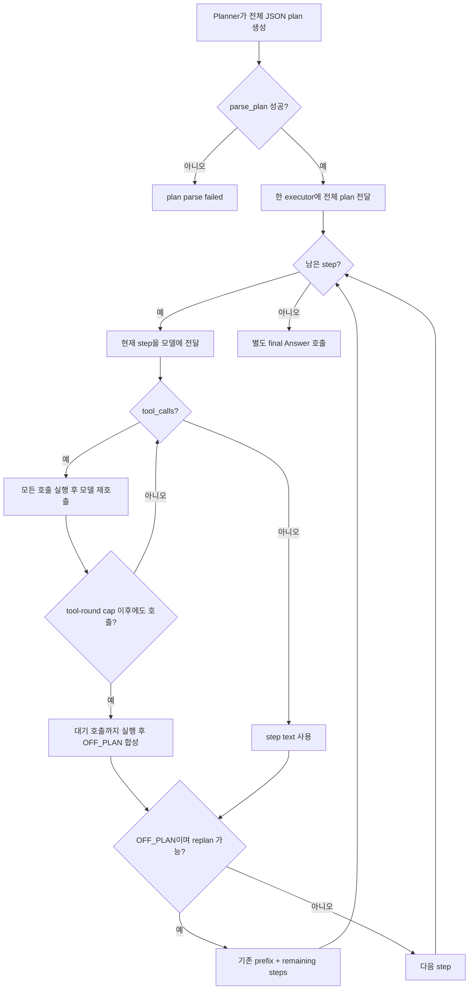
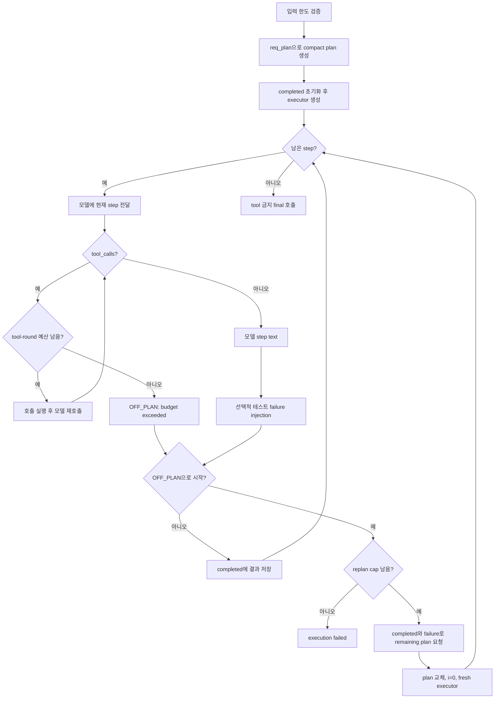
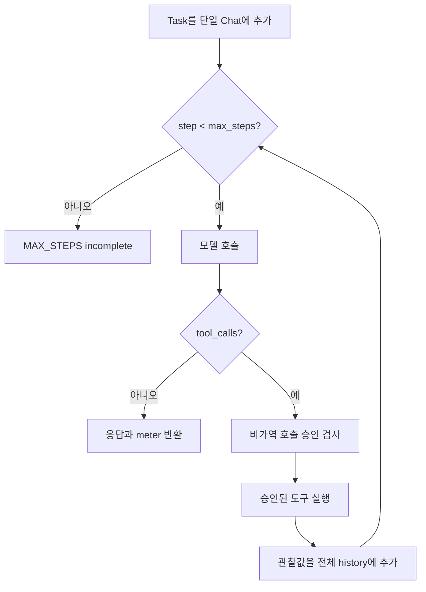
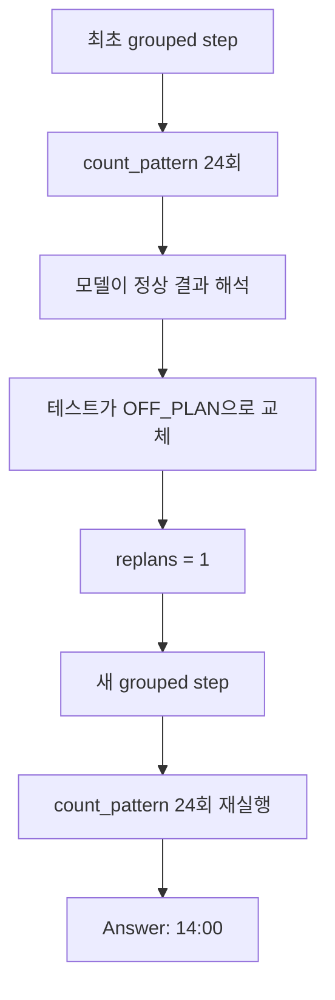
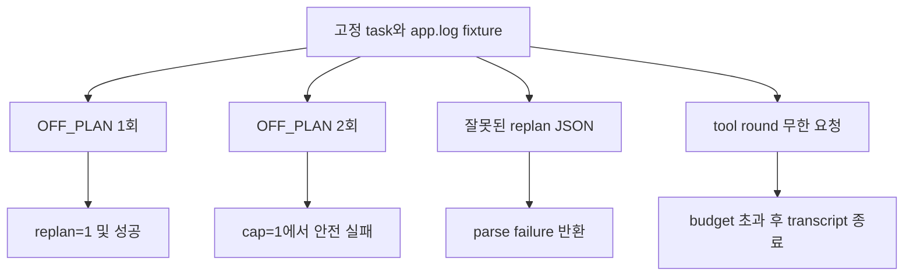

# Plan–Execute 및 ReAct 하네스 실험 리포트

## 0. 리포트 목적

이 리포트는 동일한 로그 집계 태스크를 실행하는 다음 세 하네스를 비교한다.

- `run_react`
- `run_plan_execute`
- `run_plan_execute_version_edited`

분석의 핵심은 단순 정답률 비교가 아니다. 다음 네 가지를 분리해 확인한다.

1. 00시부터 23시까지의 검증이 실제로 어떤 모델·도구 상호작용으로 수행되는가
2. 각 하네스가 계획, 실행, 실패, 재계획을 어떻게 제어하는가
3. 정상 경로와 강제 실패 경로의 tokens, model iterations, replans가 어떻게 다른가
4. 비용 감소가 검증 축소에서 왔는지, LLM 제어 단계 축소에서 왔는지

평가 태스크는 다음과 같다.

> `app.log`에서 `ERROR`가 가장 많은 시간대를 찾아 `HH:00` 형식으로 반환한다.

정답은 `14:00`이며 시간대별 참값은 다음과 같다.

| 시간 | 00–08 | 09 | 10 | 11 | 12 | 13 | 14 | 15 | 16 | 17 | 18–23 |
| --- | ---: | ---: | ---: | ---: | ---: | ---: | ---: | ---: | ---: | ---: | ---: |
| ERROR 수 | 0 | 1 | 2 | 1 | 3 | 2 | **6** | 2 | 1 | 1 | 0 |

---

## 1. 데이터 범위와 실험 구간

주 측정 파일은 `results.csv`, 실행 추적 파일은 logs/ 파일 이다.

### 1.1 `results.csv` 구간

| 구간 | 실행 | 용도 | 분석 포함 여부 |
| --- | --- | --- | --- |
| Setup-1 | runs 1–12 | credential 미설정 | 성능 분석 제외 |
| Setup-2 | runs 13–24 | `PROVIDER` 미정의 | 성능 분석 제외 |
| Normal-1 | runs 25–36 | 정상 A/B 3회씩 | 정상군 포함 |
| Setup-3 | runs 37–48 | `MODEL_API_KEY` 미설정 | 성능 분석 제외 |
| Normal-2 | runs 49–60 | 정상 A/B 3회씩 | 정상군 포함 |
| Injected | runs 61–84 | edited Plan에 강제 `OFF_PLAN` 주입 | 복구군 포함 |

정상군은 변형별 6회, 강제 실패군도 변형별 6회다.
모든 정상 및 강제 실패 실행은 최종 정답 `14:00`에 성공했다.

### 1.2 log 범위

최신 runs 73–84의 상세 실행 12개를 담는다.
따라서 다음 항목은 이 12개에 한해 직접 추적할 수 있다.

- 모델이 생성한 계획
- 시간대별 정규식
- 실행된 tool call 수
- `OFF_PLAN` 발생 위치
- 재계획 후 중복 계산
- wall-clock 시간

---

## 2. 변형 정의

### 2.1 세 하네스

| 변형 | 계획 | 실행 상태 | 실패 처리 | 종료 |
| --- | --- | --- | --- | --- |
| `run_react` | 별도 planner 없음 | 하나의 전체-history Chat | 도구 오류를 observation으로 받고 다음 행동 선택 | tool call이 없거나 `max_steps` 도달 |
| `run_plan_execute` | 전체 JSON plan 1회 | 같은 executor를 계속 재사용 | `OFF_PLAN`이면 기존 prefix에 새 단계 연결 | 계획 종료 후 별도 final 호출 |
| `run_plan_execute_version_edited` | compact plan 요청 | 완료 증거를 별도 저장 | `OFF_PLAN`이면 remaining plan 생성 후 새 executor | 엄격한 final 호출 |

edited 변형은 추가로 다음 정책을 사용한다.

- 같은 종류의 독립적인 tool call을 한 단계에 묶는다.
- 전체 파일 읽기보다 `count_pattern`으로 직접 집계하는 것을 선호한다.
- 정규식을 모호한 hour substring이 아니라 timestamp의 hour field에 결합한다.
- 재계획 시 이미 완료된 증거를 제한된 길이로 전달한다.

### 2.2 세분화된 24시간 검증

원래의 세분화된 계획은 다음과 같다.

> 00시 계산 → 01시 계산 → … → 23시 계산 → 최댓값 반환

각 시간대 계산은 단순한 Python loop가 아니다. LLM 하네스에서는 매 단계마다
다음 제어 과정이 반복될 수 있다.

> 모델이 도구 호출 결정 → `count_pattern` 실행 → 모델이 결과 해석



이 방식은 각 시간대의 증거를 명확히 추적할 수 있지만, 24개의 시간을
24개의 LLM-controlled step으로 만들면 도구 요청과 결과 해석만으로
최대 48회의 executor 호출이 필요하다.

### 2.3 Grouped 24시간 검증

검증 커버리지를 줄이지 않고도 모델 왕복은 줄일 수 있다.



따라서 다음 지표는 서로 구분해야 한다.

| 지표 | 의미 |
| --- | --- |
| 검증 커버리지 | 24개 시간대 중 실제로 확인한 수 |
| tool calls | `count_pattern` 또는 `read_file` 실행 횟수 |
| tool rounds | 한 모델 응답에서 함께 요청된 tool-call 묶음 수 |
| model iterations | planner, executor, final을 포함한 LLM 호출 수 |

**24개의 tool call은 24개의 model iteration을 뜻하지 않는다.**

### 2.4 정규식 정의

모호한 패턴은 timestamp의 minute field를 hour로 오해할 수 있다.

| 구분 | 예시 | 위험 |
| --- | --- | --- |
| 모호한 패턴 | `04:.*ERROR` | `14:04:06 ERROR`의 minute `04`와 충돌 가능 |
| timestamp-bound | `[0-9]{4}-[0-9]{2}-[0-9]{2} 04:[0-5][0-9]:[0-5][0-9] ERROR` | timestamp hour가 04인 ERROR만 집계 |

edited planner prompt의 field-binding 규칙은 이전 실험의 잘못된 정규식과
불필요한 재계획을 사전에 차단하기 위한 도구 계약이다.

---

## 3. 실제 하네스 구조

### 3.1 공통 연결



두 Plan–Execute 함수는 같은 system prompt를 공유하지만 planner에 전달하는
user prompt는 다르다.

- Original: task와 사용할 수 있는 도구 이름만 전달
- Edited: 도구 의미, Python regex 계약, timestamp field-binding 규칙 전달

따라서 현재 A/B는 순수 controller-only 비교가 아니다. 다음 효과가 함께
포함된다.

1. planner user prompt 차이
2. `parse_plan`과 `req_plan` 차이
3. 기존 executor 재사용과 fresh executor 생성 차이
4. completed evidence 전달 차이
5. 실패 및 final 호출의 엄격성 차이

### 3.2 `run_plan_execute`



주요 특성:

- 재계획 후에도 기존 executor의 대화 이력을 유지한다.
- `plan[:i] + new_steps`로 계획을 연결한다.
- tool-round cap에 도달한 뒤 pending tool calls를 한 번 더 실행하므로
  hard execution cap은 아니다.
- 재계획 실패 후에도 final 단계로 갈 수 있는 느슨한 경로가 존재한다.

### 3.3 `run_plan_execute_version_edited`

현재 테스트 버전은 `OFF_PLAN` 감지를 수정했고, 강제 실패 주입으로 복구
경로를 실행했다.



현재 코드의 `startswith("OFF_PLAN")`은 주입된 `OFF_PLAN: ...`을 정상적으로
감지한다.

정상 실행에서 `replans=0`인 것은 실패가 없었다는 뜻이다.
강제 실패 실행에서 `replans=1`이 된 것이 감지 조건 수정의 실제 검증이다.

### 3.4 `run_react`



ReAct는 실행마다 검증 범위가 달랐다.

- `read_file`만 보고 종료
- 14시만 정밀 확인
- 로그에 존재하는 시간만 비교
- 00–23시 전체를 호출

따라서 ReAct의 비용이 낮더라도 Plan–Execute와 같은 24/24 검증 계약을
항상 만족했다고 해석할 수는 없다.

### 3.5 남아 있는 구현 문제

1. `if plan is None`은 빈 리스트를 거르지 않는다. `req_plan`이 빈 계획을
   반환할 가능성까지 방어하려면 `if not plan`이 안전하다.

---

## 4. 측정값

### 4.1 지표 정의

| 지표 | 정의 | 한계 |
| --- | --- | --- |
| success | judge가 `14:00`을 정답으로 인정 | 검증 커버리지를 보장하지 않음 |
| tokens | `Meter.tokens` 누적량 | 긴 history 재전송에 민감 |
| iters | `Meter.iters`, 모델 호출 횟수 | tool call 수와 다름 |
| interventions | 사람 승인 거절 횟수 | 분석 실행에서 모두 0 |
| replans | 실제 재계획 실행 횟수 | 실패 주입 여부와 함께 해석해야 함 |
| elapsed | 전체 wall-clock 시간 | 상세 로그가 있는 실행만 계산 가능 |

### 4.2 정상군 — runs 25–36 및 49–60

설정 오류 구간을 제외한 정상 실행은 변형별 6회다.

| 변형 | n | 성공 | tokens 평균 | 중앙값 | 표본 SD | 범위 | iters 평균 |
| --- | ---: | ---: | ---: | ---: | ---: | ---: | ---: |
| `a_react` | 6 | 6/6 | 10,112.8 | 10,674.5 | 4,539.0 | 3,468–16,404 | 4.00 |
| `a_plan_exec` | 6 | 6/6 | 15,190.2 | 14,141.0 | 3,131.7 | 13,057–21,428 | 4.67 |
| `b_react` | 6 | 6/6 | 12,336.7 | 11,384.0 | 5,462.8 | 6,871–21,422 | 4.17 |
| `b_plan_exec_edited` | 6 | 6/6 | **13,843.8** | **13,679.0** | **695.1** | 13,248–15,197 | **4.33** |

정상 Plan–Execute 비교:

| 비교 | Original | Edited | 변화 |
| --- | ---: | ---: | ---: |
| 평균 tokens | 15,190.2 | 13,843.8 | **−8.9%** |
| 중앙값 tokens | 14,141.0 | 13,679.0 | **−3.3%** |
| 평균 iters | 4.67 | 4.33 | **−7.1%** |
| tokens 표본 SD | 3,131.7 | 695.1 | **−77.8%** |
| 성공률 | 100% | 100% | 동일 |

edited의 가장 뚜렷한 정상 경로 효과는 평균 비용보다 **분산 감소**다.
compact/grouped plan이 반복 실행의 계획 모양을 안정화했다.

단, `a_react`와 `b_react`는 같은 함수의 반복 baseline인데도 평균 tokens가
10,112.8과 12,336.7로 약 22% 차이 난다. 따라서 6회 표본의 작은 평균
차이를 모두 controller 효과로 해석하면 안 된다.

### 4.3 강제 `OFF_PLAN` 복구군 — runs 61–84

이 구간에서 `b_plan_exec_edited`만 첫 실행 경로에 테스트용
`OFF_PLAN: injected failure for replan test`를 주입했다.

| 변형 | n | 성공 | tokens 평균 | 중앙값 | 표본 SD | 범위 | iters 평균 | replans |
| --- | ---: | ---: | ---: | ---: | ---: | ---: | ---: | --- |
| `a_react` | 6 | 6/6 | 8,443.8 | 7,802.0 | 2,329.9 | 6,039–12,032 | 3.67 | 해당 없음 |
| `a_plan_exec` | 6 | 6/6 | 15,145.3 | 15,099.5 | 1,002.3 | 13,713–16,598 | 5.33 | 0, 0, 0, 0, 0, 0 |
| `b_react` | 6 | 6/6 | 9,099.5 | 9,672.5 | 3,328.5 | 3,801–12,788 | 3.67 | 해당 없음 |
| `b_plan_exec_edited` | 6 | **6/6** | 22,284.8 | 22,940.5 | 2,391.4 | 18,626–25,416 | 7.67 | **1, 1, 1, 1, 1, 1** |

복구 결과:

| 검증 항목 | 결과 |
| --- | ---: |
| 강제 `OFF_PLAN` 감지 | 6/6 |
| planner 재호출 | 6/6 |
| fresh executor로 재시작 | 6/6 |
| 최종 정답 `14:00` | 6/6 |
| replan cap `max_replan=1` 준수 | 6/6 |

따라서 이전 리포트의 “재계획 경로 미검증” 결론은 이제 다음처럼 수정된다.

> **모델 텍스트 기반 `OFF_PLAN` 감지와 1회 재계획 성공 경로는
> 강제 실패 조건에서 검증됐다.**

### 4.4 강제 재계획 비용

같은 edited 함수의 정상군과 주입군을 비교한다.

| Edited Plan–Execute | 정상군 | 강제 재계획군 | 증가 |
| --- | ---: | ---: | ---: |
| tokens 평균 | 13,843.8 | 22,284.8 | **+61.0%** |
| iters 평균 | 4.33 | 7.67 | **+76.9%** |
| 성공률 | 100% | 100% | 동일 |

이 증가는 재계획 구현 실패가 아니라 테스트 주입 위치와 관련된다.
현재 주입은 첫 step의 도구 실행과 모델 해석이 끝난 뒤 성공 결과를
`OFF_PLAN`으로 교체한다. 따라서 이미 계산한 증거가 있어도 새 계획에서
같은 계산을 반복할 수 있다.

### 4.5 최신 상세 로그 — runs 73–84

log에서 직접 확인한 최신 세 개의 injected Plan 실행은 다음과 같다.

| run | tokens | iters | replans | tool calls | elapsed | 특징 |
| ---: | ---: | ---: | ---: | ---: | ---: | --- |
| 76 | 23,288 | 7 | 1 | **48** | 93.8s | 24시간 집계 후 주입, 재계획에서 24시간 재집계 |
| 80 | 22,593 | 7 | 1 | **48** | 87.5s | 24시간 집계 후 주입, 재계획에서 24시간 재집계 |
| 84 | 18,626 | 7 | 1 | **25** | 74.2s | format 확인 1회 후 주입, 재계획에서 24시간 집계 |

run 76과 80은 다음 경로를 따른다.



48회 tool call은 하네스가 무한 반복한 것이 아니라
`24회 최초 검증 + 24회 복구 검증`이다.

### 4.6 별도 초기 세분화 실험

이전 대화에서 제공된 초기 실험은 현재 `results.csv`와 run-number
공간이 다른 별도 실험이다. 혼동을 피하기 위해 Legacy-A/B/C로 표기한다.

| legacy 실행 | 결과 | tokens | iters | replans |
| --- | :---: | ---: | ---: | ---: |
| Legacy-A | O | **292,414** | **64** | 1 |
| Legacy-B | O | 17,277 | 7 | 0 |
| Legacy-C | O | 23,587 | 9 | 1 |

Legacy-A의 64 iterations 구성:

| 구성 | 모델 호출 |
| --- | ---: |
| 최초 plan | 1 |
| read 및 00–04시의 6개 도구 단계, 요청/해석 각 2회 | 12 |
| 잘못된 정규식 이후 replan | 1 |
| 수정된 24시간 단계, 요청/해석 각 2회 | 48 |
| 계획 내부의 반환 단계 | 1 |
| 하네스 final 호출 | 1 |
| **합계** | **64** |

현재 injected 실행의 평균 7.67 iterations와 비교하면, 같은 1회 재계획이라도
검증을 grouped step으로 구성했을 때 모델 왕복이 크게 줄어든다.

---

## 5. 결과 해석

### 5.1 정상 경로 개선

정상군에서 edited Plan–Execute는 original보다 평균 tokens가 8.9%,
평균 iterations가 7.1% 낮았다. 더 중요한 결과는 token SD가
77.8% 낮아졌다는 점이다.

이는 edited prompt와 `req_plan`이 계획을 다음 형태로 수렴시켰기 때문이다.

> 한 단계에서 여러 timestamp-bound `count_pattern` 호출  
> → 한 번의 observation 묶음  
> → 한 번의 모델 해석

다만 두 함수는 planner user prompt까지 다르므로 감소량 전체를
fresh-executor controller 구조의 효과로 귀속할 수 없다.

### 5.2 재계획 경로는 이제 검증됨

이전에는 조건문만 고쳤고 자연 실행에서 `OFF_PLAN`이 발생하지 않아
`replans=0`이었다. 이번에는 6회 모두 명시적으로 `OFF_PLAN`을 주입했고:

1. prefix가 감지됐다.
2. `replans`가 정확히 1 증가했다.
3. remaining plan이 생성됐다.
4. fresh executor가 시작됐다.
5. 최종 정답이 유지됐다.

따라서 `startswith("OFF_PLAN")` 수정이 실제 제어 흐름을 복구한다는 것은
이제 실험으로 확인됐다.

### 5.3 재계획 비용 증가는 예상된 결과

주입군의 tokens +61.0%, iterations +76.9%는 실패 유연성의 비용이다.
특히 성공적인 24시간 계산이 끝난 뒤 실패를 주입한 실행은 같은 24개
tool call을 다시 수행했다.

이 값은 edited가 정상 조건에서 original보다 비효율적이라는 근거가 아니다.
주입군 B와 비주입군 A는 서로 다른 처치를 받았으므로 efficiency A/B로
직접 비교하면 안 된다.

### 5.4 현재 failure injection이 검증한 것과 검증하지 않은 것

| 항목 | 상태 | 근거 |
| --- | --- | --- |
| `OFF_PLAN` 텍스트 감지 | 검증됨 | 6/6 감지 |
| replan 1회 실행 | 검증됨 | 모든 B edited에서 `replans=1` |
| 새 executor 복구 | 검증됨 | replan 후 step 1부터 성공 |
| 최종 정답 보존 | 검증됨 | 6/6 `14:00` |
| 자연 발생 `OFF_PLAN` | 미검증 | 모두 테스트 문자열 주입 |
| tool-round budget 초과 | 미검증 | 모델이 추가 round를 요구하지 않음 |
| replan cap 소진 | 미검증 | 두 번째 실패를 주입하지 않음 |
| replan JSON parse failure | 미검증 | 모든 재계획 JSON 정상 |
| final tool-call 거부 | 미검증 | final에서 추가 호출 없음 |

### 5.5 ReAct와의 비교 한계

ReAct는 정상군에서 Plan–Execute보다 평균 tokens가 낮지만 검증 범위가
모델 재량이다. 일부 실행은 전체 24시간을 확인하고, 일부는 `read_file`
또는 후보 시간만으로 종료했다.

따라서 공정한 비교에는 두 종류의 평가가 필요하다.

1. **자유 실행:** 각 하네스가 스스로 비용과 검증 수준을 선택
2. **검증 계약 실행:** 모든 하네스에 24/24 timestamp-bound 검증을 강제

현재 결과는 주로 자유 실행 비교이며, edited Plan의 prompt만 검증 계약에
더 가깝다.

---

## 6. 다음 실험 설계

### 6.1 Failure injection 위치 분리

현재 방식은 도구 실행 이후에 결과를 실패로 교체하므로 recovery cost와
중복 tool cost가 함께 측정된다. 다음 두 모드로 분리하는 것이 좋다.

| 모드 | 주입 위치 | 측정 목적 |
| --- | --- | --- |
| Control-path injection | 첫 executor reply 직후, tool 실행 전 | 감지·재계획·fresh executor만 검증 |
| Post-evidence injection | tool 결과 해석 후 | 완료 증거 재사용과 중복 계산 정책 검증 |

### 6.2 추가 실패 시나리오



필수 assertion:

```python
assert result.replans == expected_replans
assert result.answer.startswith("Answer:") or result.failed
assert result.meter is meter
assert unresolved_tool_calls == 0
```

tuple 반환보다 명시적인 결과 타입을 사용하면 실패 경로의 타입 오류를
줄일 수 있다.

```python
@dataclass
class HarnessResult:
    answer: str
    meter: Meter
    replans: int
    failed: bool = False
    failure_kind: str | None = None
```

### 6.3 측정 항목 보강

| 분류 | 권장 필드 |
| --- | --- |
| 품질 | 정답, 24/24 coverage, ambiguous-regex count |
| 모델 | planner calls, executor calls, final calls, tokens |
| 도구 | tool calls, tool rounds, duplicate tool calls |
| 복구 | off_plan_events, replans, injected_failure, cap_exhausted |
| 상태 | completed evidence 수, fresh executor 수 |
| 시간 | model latency, tool latency, total elapsed |

`replans`만으로는 실패 발생 횟수와 복구 성공을 구분할 수 없다.
`off_plan_events`와 `recovery_success`를 별도 기록하는 것이 좋다.

---

## 7. 최종 결론

| 질문 | 결론 |
| --- | --- |
| 정답을 유지했는가 | 정상군과 주입군 모두 100% |
| grouped 검증이 비용을 줄였는가 | 정상 Plan 비교에서 tokens −8.9%, iters −7.1% |
| 실행이 안정화됐는가 | edited 정상군 token SD −77.8% |
| `OFF_PLAN` 수정이 작동했는가 | 강제 실패 6/6 감지, 모두 `replans=1` |
| 복구 후 정답을 유지했는가 | 6/6 `14:00` |
| 재계획 비용은 얼마인가 | edited 정상군 대비 tokens +61.0%, iters +76.9% |
| 모든 실패 경로가 검증됐는가 | 아님: budget, cap 소진, parse failure, final-tool 경로가 남음 |

이번 실험으로 다음 두 결론을 분리할 수 있다.

1. **정상 효율:** 24시간 검증을 grouped tool calls로 구성하면 LLM 왕복과
   실행 변동성을 줄일 수 있다.
2. **복구 유연성:** `OFF_PLAN`을 강제한 경우 edited 하네스는 명시된
   `max_replan=1` 범위 안에서 6회 모두 복구하고 정답을 유지했다.

다음 우선순위는 반복 횟수를 늘리는 것이 아니라, 두 번째 `OFF_PLAN`,
잘못된 replan JSON, tool-round 초과를 각각 주입해 **실패해야 할 때
안전하게 실패하는지** 검증하는 것이다.