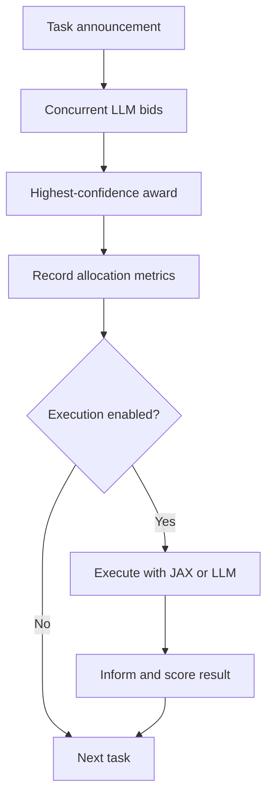

# LLM Contract Net

This project implements a confidence-based Contract Net Protocol (CNP) with one manager and three LLM contractors. The required experiment measures whether the contractor with the highest self-reported confidence matches a pre-registered gold contractor. An optional post-award extension then executes the task and records whether allocation correctness and execution success agree.

The six tasks are balanced across three specialties:

- **A** - numeric calculation and exact arithmetic
- **B** - writing and plain-language prose
- **C** - programming and Python source code

## Workflow


```
Phase 1 — Required allocation experiment

announce → bid collection → award → freeze allocation metrics
                 ↑
          asyncio.gather


Phase 2 — Optional execution extension

execute awarded tasks → inform
          ↑
 asyncio orchestration
 JAX numerical compute
```



Each contractor returns one JSON bid:

```json
{"bid": true, "confidence": 95, "reason": "one short sentence"}
```

The manager collects the three bids with `asyncio.gather`. `gather` preserves the team order `A -> B -> C`; Python's stable sort therefore resolves equal confidence in that same order. Allocation metrics are updated at award time, before the optional execution result is scored.

## Experimental conditions

Only the contractor skill description or the designated overconfidence sentence changes between conditions.

| Condition | Contractor configuration |
|---|---|
| `baseline` | A = calculation, B = writing, C = code |
| `homogeneous` | A, B, and C all receive `general problem solving` |
| `overconfident` | Baseline skills plus an overconfidence instruction for C |

The task list, model, temperature, maximum output tokens, bid schema, selection rule, execution code, and metric definitions remain fixed. Each condition is run three times.

## Project structure

```text
week-03/
├── chat.py          # Stateless async OpenAI-compatible model client and token meter
├── contractor.py    # Contractor definitions, condition setup, bid prompt, JSON parser
├── execute.py       # Optional JAX compute execution and LLM write/code execution
├── manager.py       # Concurrent bid collection, award rule, and metrics
├── run_exp.py       # CLI runner for 3 conditions x 3 repetitions
├── tasks.json       # Six balanced tasks with gold contractors
├── result.csv       # One row per completed experimental run
├── logs/            # CFP, bid, award, inform, and run metadata
├── README.md        # Setup and implementation guide
├── REPORT_en.md     # Experimental analysis and Smith comparison (en)
└── REPORT.md        # Experimental analysis and Smith comparison (ko)
```

`tools_shared.py` is retained as a reference adaptation of the earlier starter harness; the experiment imports `Chat` and `Meter` from `chat.py`.

## Setup

Python 3.10 or newer is recommended.

```bash
python -m venv .venv
source .venv/bin/activate       # Windows: .venv\Scripts\activate
python -m pip install openai python-dotenv
python -m pip install "jax[cpu]"   # optional; compute tasks have a local fallback
```

Configure the OpenAI-compatible endpoint:

```bash
export MODEL_API_KEY="..."
export META_API_BASE_URL="https://api.meta.ai/v1"
export AGENT_MODEL="muse-spark-1.3"
export CNP_TEMP="0"
export CNP_MAX_TOKENS="2048"
```

On Windows PowerShell, use `$env:NAME="value"` instead of `export`.

## Run

Run commands from this directory so the timestamped logs are written to the local `logs/` folder.

```bash
# All conditions, three repetitions each
python run_exp.py

# Allocation experiment without post-award execution
python run_exp.py --no-execute

# One condition only
python run_exp.py --condition homogeneous --repeats 3
```

A complete run recreates `result.csv` and appends nine timestamped log files. A condition-only run appends its rows to the existing CSV.

## Metrics

Required allocation metrics are recorded before execution scoring.

| Metric | Definition |
|---|---|
| `correct` | Awarded contractor equals the task's gold contractor |
| `messages` | Announcements + positive bids + award messages |
| `unassigned` | No valid positive bid was received |
| `misawards` | Awarded contractor differs from gold |
| `parse_fails` | Model response could not be parsed as a valid bid |

The optional extension adds the following diagnostics:

| Metric | Definition |
|---|---|
| `execution_success`, `execution_fail` | Whether the awarded task passed its lightweight checker |
| `execution_messages` | Inform messages emitted by awarded executions |
| `gold_ok_exec_ok` | Correct allocation and successful execution |
| `gold_ok_exec_fail` | Correct allocation and failed execution |
| `misaward_exec_ok` | Incorrect allocation but successful execution |
| `misaward_exec_fail` | Incorrect allocation and failed execution |

## Current results

The committed results contain nine completed runs with no unassigned tasks, parse failures, or API errors.

| Condition | Correct | Messages | Misawards | Execution success |
|---|---:|---:|---:|---:|
| `baseline` | 6/6 in all runs | 32 | 0 | 6/6 |
| `homogeneous` | 2/6 in all runs | 42 | 4 | 6/6 |
| `overconfident` | 6/6 in all runs | 32 | 0 | 6/6 |

The homogeneous condition caused all three contractors to bid with equal or near-equal confidence. Deterministic tie-breaking consequently selected A for every task, producing correct awards only for the two calculation tasks. The overconfidence prompt produced out-of-specialty bids from C on calculation tasks, but it did not displace A under the confidence and tie-breaking rule.

See [REPORT.md](./REPORT.md) for the full analysis, log evidence, limitations, and comparison with Smith's Contract Net.