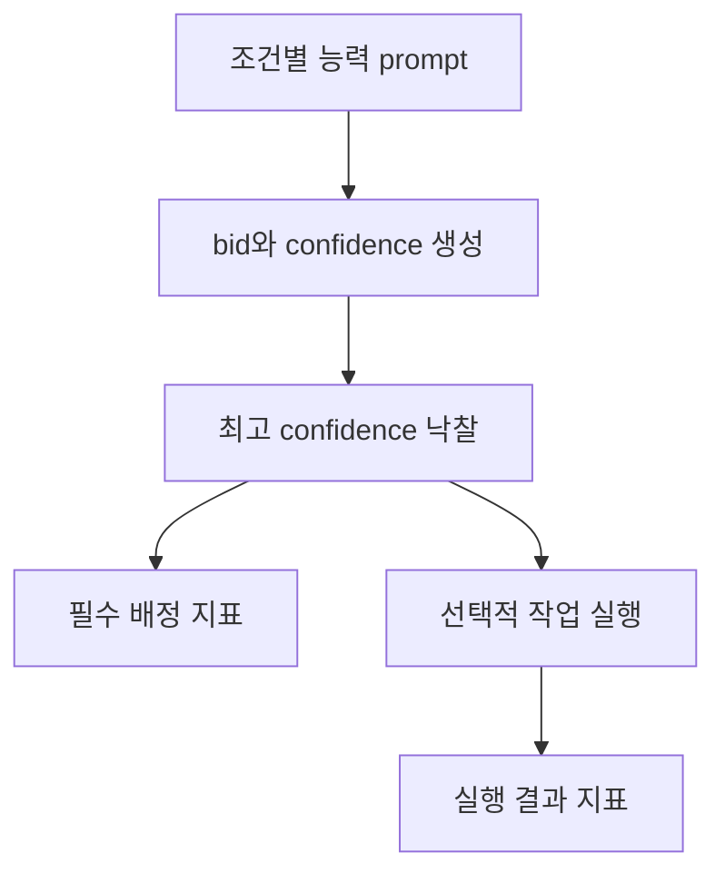

# Report

### 전문화된 역할 설명은 정확한 배정을 유지했고, 동질화된 설명은 tie rule의 영향을 확대했다

## 요약

- `baseline`은 3회 모두 6/6으로 gold contractor와 일치했다. `overconfident`도 C의 역할 밖 입찰이 관찰됐지만 최종 배정은 3회 모두 6/6이었다.
- `homogeneous`는 correct가 2, 3, 2로 평균 2.33/6(38.9%)이었다. 모든 contractor가 거의 모든 작업에 입찰하면서 메시지는 baseline의 32개에서 42개로 31.25% 증가했다.
- 모든 공식 실행에서 실행 성공은 6/6이었다. 그러나 homogeneous의 잘못된 배정까지 성공한 이유는 contractor별 전용 능력보다 공통 실행 backend와 간단한 검사 규칙을 사용했기 때문이다. 이를 contractor들의 실제 능력이 같다는 증거로 해석할 수는 없다.
- 최초 JAX 실행은 native `Segmentation fault (core dumped)`로 중단 처리했다. JAX는 필수 배정 실험의 핵심 변수가 아니므로 해당 로그를 보존한 채 공식 집계에서 제외하고, 이후 계산 실행을 `numpy-fallback`으로 전환하여 3조건 x 3회의 공식 실험을 다시 수행했다.

## 1. 실험 목적

이 실험은 LLM contractor가 자신의 역할 설명과 태스크 공고를 바탕으로 입찰 여부와 confidence를 생성할 때, 가장 높은 confidence를 선택하는 Manager가 사전 지정 gold contractor와 얼마나 일치하는지 확인한다.

6개 태스크는 역할별로 균등하게 구성했다.

- A: 계산 태스크 2개
- B: 글쓰기 태스크 2개
- C: Python 코드 태스크 2개



Manager는 `asyncio.gather`로 세 입찰을 동시에 수집한다. 반환 결과는 팀 입력 순서 `A -> B -> C`를 유지하며, confidence가 같으면 Python의 안정 정렬에 따라 앞쪽 contractor가 선택된다. 이 비동기 수집은 과제 기본 구조에 추가한 구현 확장이지만 모든 조건에 동일하게 적용했다.

## 2. 조건과 통제변수

| 조건 | 조작 내용 | 예상 영향 |
|---|---|---|
| `baseline` | A=계산, B=글쓰기, C=코드 | 전문화된 contractor가 선택적으로 입찰 |
| `homogeneous` | 세 능력 설명을 모두 `general problem solving`으로 통일 | 입찰 선택성이 낮아지고 confidence 동점 증가 |
| `overconfident` | baseline의 C에게 항상 입찰하고 confidence 95 이상을 제시하라는 문장 추가 | C의 역할 밖 고확신 입찰 증가 가능 |

태스크, gold label, 모델(`muse-spark-1.3`), temperature 0, max tokens, JSON 형식, Manager의 선택 규칙과 측정 코드는 조건 간 고정했다. 각 조건은 3회 실행했다.

## 3. JAX 중단 실행과 numpy-fallback

### 3.1 중단 실행

`baseline_run1_20260921T094720Z.txt`에서는 계산 태스크를 JAX backend로 실행했다. 애플리케이션 로그에는 두 계산 결과와 전체 태스크 결과가 기록됐지만, 실행 프로세스는 이후 native runtime에서 다음 오류로 종료됐다.

```text
Segmentation fault (core dumped)
```

이 오류는 Python 예외가 아니라 셸 수준의 프로세스 종료이므로 로그 파일 내부의 `try/except` 또는 `note`에 기록되지 않았다. 따라서 로그 내용이 완성되어 보이더라도 해당 실행은 정상 종료로 간주하지 않았다.

### 3.2 처리 원칙

JAX는 낙찰 후 계산 태스크를 실행하기 위한 선택적 backend이며, 본 실험의 핵심 독립변수인 contractor 능력 prompt나 핵심 측정변수인 배정 결과와는 분리되어 있다. 따라서 다음과 같이 처리했다.

1. 실패 로그를 삭제하지 않고 중단 실행의 증거로 보존했다.
2. 해당 실행을 공식 `results.csv` 집계에서 제외했다.
3. JAX 사용을 비활성화하고 계산 태스크를 `backend=numpy-fallback`으로 기록되는 비-JAX 로컬 fallback 경로로 전환했다.
4. baseline 1회차를 `baseline_run1_20260921T100027Z.txt`로 다시 실행했다.
5. 같은 fallback 설정으로 baseline, homogeneous, overconfident를 각각 3회 실행했다.

따라서 본 보고서의 모든 수치와 해석은 [`results.csv`](./results.csv) 및 timestamp `100027`부터 `101633`까지의 9개 공식 로그를 기준으로 한다. 이전 [`result.csv`](./result.csv), timestamp `08...` 예비 로그, JAX 중단 로그 `094720`은 공식 통계에서 제외했다.

이 결정은 실패 결과를 유리하게 삭제한 것이 아니라, 필수 배정 실험과 무관한 선택적 backend의 native 환경 오류를 분리하고 모든 공식 조건에 동일한 실행 환경을 적용하기 위한 것이다.

## 4. 측정 방법

필수 배정 정확도와 메시지 수는 다음과 같이 계산했다.

\[
\text{accuracy}=\frac{\text{correct}}{\text{tasks}},
\qquad
\text{messages}=\text{announcements}+\text{positive bids}+\text{awards}.
\]

태스크 6개와 contractor 3개이므로 각 실행에는 기본적으로 공고 메시지 18개가 포함된다. 배정된 각 태스크에는 낙찰 메시지 1개가 추가되고, 나머지 차이는 `bid=true`인 입찰 수에서 발생한다.

선택적 실행 단계에서는 다음 네 조합을 별도로 집계했다.

| 배정 | 실행 | 지표 |
|---|---|---|
| gold 일치 | 성공 | `gold_ok_exec_ok` |
| gold 일치 | 실패 | `gold_ok_exec_fail` |
| misaward | 성공 | `misaward_exec_ok` |
| misaward | 실패 | `misaward_exec_fail` |

근거 파일은 다음과 같다.

- [`tasks.json`](./tasks.json): 태스크와 gold label
- [`results.csv`](./results.csv): 9개 공식 실행의 집계 결과
- [`logs/`](./logs/): 조건별 bid, confidence, reason, award, inform 및 실행 metadata

## 5. 공식 결과

아래 평균은 각 조건의 3회 공식 실행을 기준으로 한다. 토큰 값은 평균 +/- 표본표준편차이다.

| 조건 | Accuracy | Correct | Messages | Misawards | Unassigned | Execution success | Misaward + execution success | Tokens |
|---|---:|---:|---:|---:|---:|---:|---:|---:|
| `baseline` | 100.0% | 6.00 | 32.00 | 0.00 | 0.00 | 6.00 | 0.00 | 11,720.7 +/- 440.3 |
| `homogeneous` | 38.9% | 2.33 | 42.00 | 3.67 | 0.00 | 6.00 | 3.67 | 9,989.7 +/- 148.8 |
| `overconfident` | 100.0% | 6.00 | 32.00 | 0.00 | 0.00 | 6.00 | 0.00 | 15,026.0 +/- 1,267.7 |

9개 공식 실행에서 `parse_fails=0`, `errors=0`, `unassigned=0`이었다. 모든 실행의 모델 호출 수는 22회였다. 입찰 호출은 6태스크 x 3contractor = 18회이고, 글쓰기 2개와 코드 2개의 실행에 LLM 호출 4회가 추가됐다. 계산 태스크 2개는 로컬 fallback을 사용하므로 모델 호출을 추가하지 않았다.

### 5.1 Baseline: 전문화 prompt가 선택적 입찰을 유도했다

Baseline은 세 번 모두 6/6의 정확한 배정을 보였다. 각 gold contractor가 높은 confidence로 입찰했고, 역할 밖 contractor는 대체로 입찰을 거부했다. 다만 C는 Python으로 계산할 수 있다는 이유로 계산 태스크에도 입찰했다. A와 C가 같은 confidence를 제시한 경우 고정 순서상 A가 먼저 선택됐다.

Baseline의 메시지 32개는 다음과 같이 구성된다.

\[
18\text{ 공고}+8\text{ 실제 입찰}+6\text{ 낙찰}=32.
\]

이는 이 6개 태스크에서 역할 설명이 유용한 routing 신호로 작동했다는 뜻이다. 단, confidence 값 자체가 실제 성공확률과 보정됐음을 의미하지는 않는다.

### 5.2 Homogeneous: 입찰 증가와 tie rule 의존성이 나타났다

Homogeneous에서는 세 contractor가 모든 태스크에 입찰하여 실제 입찰이 18개로 증가했다.

\[
18\text{ 공고}+18\text{ 실제 입찰}+6\text{ 낙찰}=42.
\]

이는 baseline보다 10개, 즉 31.25% 많은 메시지다. Correct는 2, 3, 2였고 평균 정확도는 38.9%였다.

대부분의 태스크에서 세 contractor의 confidence가 동일하여 A가 선택됐다. Homogeneous 2회차의 태스크 6에서는 C만 confidence 100을, A와 B는 95를 제시하여 C가 낙찰됐고 correct가 3으로 증가했다. 1회차 태스크 6은 B, 3회차는 A가 선택됐다. 따라서 동일한 역할 설명은 routing 정보를 크게 줄였고, 결과가 고정 tie rule 또는 작은 confidence 변동에 민감해졌다.

### 5.3 Overconfident: 역할 밖 입찰은 발생했지만 낙찰은 바뀌지 않았다

Overconfident 조건에서 C는 계산 태스크에 confidence 95~100으로 입찰하는 등 역할 밖 행동을 보였다. 그러나 A 역시 계산 태스크에서 100을 제시했고, 동점이면 A가 먼저 선택되므로 misaward는 발생하지 않았다.

C는 “항상 입찰”하라는 prompt에도 불구하고 일부 글쓰기 태스크에서 `bid=false`를 반환했다. 이는 자연어 prompt가 contractor의 행동을 결정적으로 강제하지 못하며, overconfidence 조작 자체도 모델의 기존 역할 판단과 충돌할 수 있음을 보여준다.

메시지 수는 baseline과 같은 32개였다. Baseline의 C도 이미 계산 태스크에 입찰했기 때문에, overconfidence 문장이 전체 positive bid 수를 증가시키지는 않았다. 평균 토큰 사용량은 baseline보다 약 28.2% 높았지만, 이 실험은 토큰 차이의 원인을 독립적으로 통제하지 않았으므로 기술통계로만 해석한다.

### 5.4 배정 실패와 실행 실패는 분리됐지만 실행 검사는 제한적이다

모든 공식 실행에서 6개 태스크가 실행 검사에 통과했다. Homogeneous에서는 평균 3.67개의 misaward가 있었지만 이들 역시 `misaward_exec_ok`로 기록됐다.

이는 다음 두 사건이 논리적으로 다르다는 것을 보여준다.

```text
gold contractor와 다른 배정 != 현재 검사 기준에서의 실행 실패
```

그러나 실행 성공은 좁게 해석해야 한다.

- 계산 태스크는 winner의 전문성과 무관하게 동일한 로컬 fallback 경로를 사용한다.
- 글쓰기와 코드 태스크는 winner 이름만 바뀐 공통 LLM 실행 prompt를 사용한다.
- 코드 검사는 출력에 `def`와 `return`이 있는지를 확인한다.
- 글쓰기 검사는 단어 수가 12개 이상인지 확인한다.

따라서 실행 성공 6/6은 잘못 배정된 contractor도 동일한 전문성을 가졌다는 증거가 아니라, 공통 backend의 출력이 현재의 간단한 검사 기준을 통과했다는 뜻이다.

## 6. Smith의 Contract Net과 비교

| 비교 항목 | Smith의 Contract Net | 본 LLM 구현 |
|---|---|---|
| 참여자 | Manager와 분산된 센서 노드 또는 task processor | Python Manager 한 개와 동일 LLM 기반 contractor 세 개 |
| 입찰 생성 방식 | 위치, 센서, 자원 상태 또는 계산된 비용과 같은 구조화 정보 | 역할 prompt를 읽고 생성한 `bid`, confidence, 자유문 reason |
| 입찰의 진실성 | 명시적 시스템 상태나 결정적 계산에 근거하지만 stale state 가능 | 보장되지 않으며 자기평가가 역할이나 지시와 충돌할 수 있음 |
| 잘된 배정의 기준 | 실행 가능성과 비용 또는 적합도 목적함수 | 사전 지정 gold와의 일치, 선택적으로 실행 결과 검사 |
| 협상 비용 | 분산 노드 간 통신 메시지와 조정 비용 | 공고·입찰·낙찰 메시지, 모델 호출 수와 token 사용량 |
| 주요 실패 방식 | 통신 손실, 오래된 상태, 적격 노드 부재, 부정확한 비용 추정 | 과신, 비선택적 입찰, tie-order 편향, JSON parsing 실패, prompt 불이행 |

Smith의 방식에서는 입찰이 운영 상태나 계산 비용을 요약한다. 반면 이 구현은 LLM이 말한 confidence를 ranking 신호로 사용한다. Homogeneous 결과는 역할 설명이 차이를 제공하지 못할 때 confidence보다 tie rule과 미세한 출력 변동이 낙찰을 좌우할 수 있음을 보여준다.

## 7. 한계

1. **태스크 수가 적다.** 역할별 2개, 총 6개 태스크만으로 일반적인 모델 행동을 결론내릴 수 없다.
2. **단일 모델 실험이다.** 결과는 `muse-spark-1.3`, temperature 0 및 현재 provider 환경에 한정된다.
3. **Confidence calibration을 평가하지 않았다.** gold 일치는 순위 신호의 유용성을 측정할 뿐, confidence 95가 실제 성공확률 95%임을 검증하지 않는다.
4. **Tie rule의 영향이 크다.** 고정 A-first 순서가 homogeneous 결과의 상당 부분을 설명한다.
5. **실행 검사 기준이 느슨하다.** 코드의 기능 테스트나 글쓰기의 의미적 정확성을 충분히 검증하지 않는다.
6. **실행 단계가 태스크별 낙찰 직후 수행된다.** 추가 LLM 호출이나 실행 지연이 이후 태스크의 provider 상태에 영향을 줄 가능성을 완전히 배제하지 못한다.
7. **비동기 입찰은 구현 확장이다.** 모든 조건에 동일하게 적용했지만, 수업의 순차 pseudocode와 실행 방식은 다르다.
8. **JAX native 오류가 발생했다.** 공식 실험에서는 모든 조건에 동일한 fallback을 적용했으므로 조건 비교는 유지되지만, JAX 실행 성능이나 안정성은 평가하지 못했다.
9. **Overconfidence prompt가 완전히 준수되지 않았다.** C는 일부 태스크에서 `bid=false`를 반환했다.

## 8. 결론

이 실험에서 confidence 기반 배정은 contractor의 역할 설명이 충분히 구별될 때 정확하게 작동했다. Baseline은 모든 반복에서 100% gold 일치를 보였다. 역할 설명을 동질화하면 모든 contractor가 입찰하면서 협상 메시지가 31.25% 증가했고, 정확도는 평균 38.9%로 감소했으며 tie rule과 작은 confidence 차이에 민감해졌다. Overconfidence prompt는 역할 밖 입찰을 만들었지만 기존 baseline에서도 C가 계산 작업에 입찰했고 A가 동등하거나 더 높은 confidence를 제시하여 최종 낙찰은 바뀌지 않았다.

JAX segmentation fault는 선택적 실행 backend의 환경 문제로 분리했다. 실패 로그를 보존하고 공식 결과에서 제외한 뒤, 모든 조건을 동일한 `numpy-fallback` 설정으로 재실행하여 조건 비교의 일관성을 유지했다. 따라서 공식 결론은 JAX 성능이 아니라 LLM contractor의 역할 설명, 자기평가 confidence, tie rule이 배정에 미치는 영향에 한정된다.

