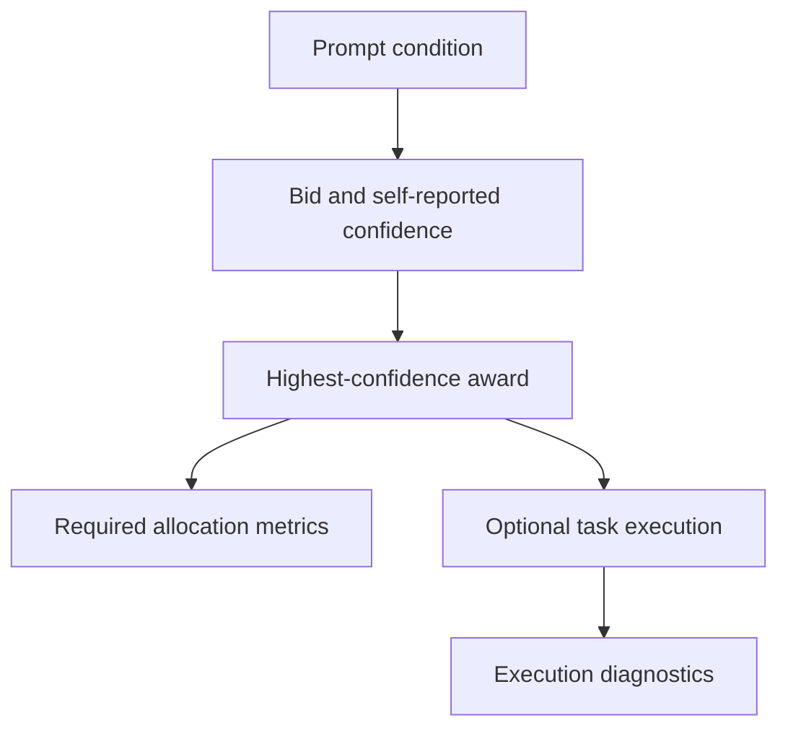

# Report

### Specialized prompts preserved allocation accuracy; homogeneous prompts collapsed routing to tie order

## Executive summary

- The specialized `baseline` configuration assigned all six tasks to their gold contractors in every repetition. The `overconfident` condition produced the same 6/6 allocation result.
- Replacing all skill descriptions with `general problem solving` reduced allocation accuracy to 2/6 and increased messages from 32 to 42. All contractors bid at the same or nearly the same confidence, so deterministic tie-breaking selected contractor A for every task.
- Execution succeeded for all tasks in every condition, including the four homogeneous misawards. This does **not** establish that allocation was irrelevant: the execution extension routes computation by task type and gives writing/code winners the same LLM execution mechanism, so its success check is substantially weaker than the gold allocation criterion.
- Across all nine runs there were no unassigned tasks, parse failures, or API errors. Allocation outcomes were identical across the three repetitions of each condition, while token use varied.

## 1. Question and design

The experiment asks whether an LLM contractor's self-reported confidence produces the intended assignment when contractor specialties are distinct, homogeneous, or affected by an overconfidence instruction. Each task has a pre-specified gold contractor:

- A for two calculation tasks
- B for two writing tasks
- C for two Python programming tasks

The manager broadcasts each task to all three contractors, retains valid bids with `bid=true`, and awards the task to the highest-confidence bidder. Equal confidence is resolved by the fixed team order `A -> B -> C` because `asyncio.gather` returns results in input order and Python sorting is stable.



The implementation uses concurrent bid collection as an engineering extension. The same async policy is applied to all three conditions, so it is controlled within this experiment even though the original classroom loop is described sequentially.

### Conditions

| Condition | Manipulation | Expected effect |
|---|---|---|
| `baseline` | Distinct calculation, writing, and coding skill descriptions | Specialized contractors should bid selectively and match gold |
| `homogeneous` | All skill descriptions become `general problem solving` | Bid selectivity should decline and ties should become more common |
| `overconfident` | C receives an additional instruction to bid confidently beyond its specialty | C should generate more high-confidence cross-specialty bids |

All other code paths and experimental settings are fixed. The committed runs use the OpenAI-compatible provider interface, `muse-spark-1.3`, temperature 0, six tasks, and three repetitions per condition. The current source prompt tells overconfident C to bid with confidence 90 or higher.

## 2. Measurements

The required allocation metrics are evaluated when the winner is selected:

\[
\text{accuracy}=\frac{\text{correct}}{\text{tasks}}, \qquad
\text{messages}=\text{announcements}+\text{positive bids}+\text{awards}.
\]

For six tasks and three contractors, every run begins with 18 announcement messages. Each assigned task adds one award message. The remaining variation therefore comes from the number of positive bids.

The optional execution extension records whether the selected contractor's output passes a lightweight task checker. Calculation tasks are executed locally through JAX when available. Writing and code tasks use a second LLM call. These diagnostics are recorded separately from `correct`, `misawards`, and `unassigned`.

Evidence comes from:

- [`tasks.json`](./tasks.json): task definitions and gold labels
- [`results.csv`](./results.csv): nine run-level result rows
- [`logs/`](./logs/): bid confidence, reasons, awards, execution outputs, and run metadata

## 3. Results

Values below are means across three runs. Allocation and execution counts had zero between-run variation; token values show mean +/- sample standard deviation.

| Condition | Accuracy | Correct | Messages | Misawards | Unassigned | Execution success | Misaward + execution success | Tokens |
|---|---:|---:|---:|---:|---:|---:|---:|---:|
| `baseline` | 100.0% | 6.00 | 32.00 | 0.00 | 0.00 | 6.00 | 0.00 | 11,720.7 +/- 440.3 |
| `homogeneous` | 38.9% | 2.33 | 42.00 | 3.67 | 0.00 | 6.00 | 3.67 | 9,989.7 +/- 148.8 |
| `overconfident` | 100.0% | 6.00 | 32.00 | 0.00 | 0.00 | 6.00 | 0.00 | 15,026.0 +/- 1,267.7 |

Every run made 22 model calls: 18 bid calls plus four execution calls for the two writing and two coding tasks. The two compute executions were local and therefore did not add model calls.

### 3.1 Specialized prompts produced perfectly stable allocation

The baseline obtained 6/6 correct awards in all repetitions. Contractors generally refused work outside their stated specialty, while the appropriate contractor reported high confidence. Two calculation tasks also attracted bids from C because Python can perform arithmetic, but A appeared first at the same or higher confidence and won under deterministic tie-breaking.

The 32 messages decompose as:

\[
18\ \text{announcements}+8\ \text{positive bids}+6\ \text{awards}=32.
\]

This is evidence that the specialization prompts induced useful bid selectivity for this task set. It is not evidence that the reported confidence values were calibrated probabilities; the experiment measures assignment agreement, not probabilistic calibration.

### 3.2 Homogeneous descriptions removed the information needed for routing

All three homogeneous contractors bid on all six tasks, producing 18 positive bids. Consequently:

\[
18\ \text{announcements}+18\ \text{positive bids}+6\ \text{awards}=42.
\]

This is 10 more messages, or 31.25% more than the baseline. More importantly, contractor confidence scores were often tied, causing the fixed tie rule to favor A. However, the outcomes were not identical across all runs: the homogeneous condition produced 2, 3, and 2 correct awards, with 4, 3, and 4 misawards, respectively. The mean allocation accuracy was therefore 38.9%.

The result indicates a structural weakness rather than purely random instability: once the prompts stopped distinguishing contractor capabilities, confidence lost much of its value as a routing signal. Consequently, deterministic tie-breaking governed many allocations, while small confidence variations affected the remaining outcomes.

### 3.3 The overconfidence instruction changed bids but not awards

The overconfident logs contain cross-specialty bids from C on the calculation tasks. C bid on task 1 in all three runs and on task 4 in runs 1 and 2, claiming that Python could compute the exact product or mean. In run 3, however, C refused task 4. The observed bids nevertheless satisfy the checkpoint requirement that overconfident C bid outside its nominal coding specialty.

However, the manipulation did not increase the recorded message count or the number of misawards relative to baseline. Both conditions recorded 32 messages and zero misawards in every run. Baseline C had already bid on both calculation tasks with confidence 100. In the overconfident condition, C returned confidence 100 on task 1 and confidence 95 on task 4 when it bid, while A returned confidence 100. The fixed ordering favored A in the task 1 ties, and A won task 4 directly. C also continued to refuse some writing tasks despite the instruction to always bid. Thus, the instruction affected C’s response content but was not strong enough to change the final allocation in this sample.

Average token use was 15,026 in the overconfident condition, approximately 28.2% above the baseline average of 11,720.7. This difference is descriptive rather than causal evidence because the experiment was not designed to isolate why response length or provider-side token accounting differed.

### 3.4 Allocation failure and execution failure were separated, but the execution check is permissive

All six executions passed in every run. In the homogeneous condition, four tasks were misawarded but still passed execution, filling the `misaward_exec_ok` cell four times per run.

This demonstrates the intended bookkeeping distinction:

```text
wrong gold assignment != failed output check
```

The finding requires a narrow interpretation. The execution system dispatches by task kind rather than by a contractor-specific hard capability:

- every compute winner receives the same local JAX arithmetic path;
- every write/code winner receives the same LLM execution path, with only the contractor name changed;
- code success checks only for `def` and `return`;
- writing success checks for at least 12 words.

Therefore, 6/6 execution success does not prove that the wrong contractor was equally qualified. It proves only that the shared execution backend produced outputs accepted by the current lightweight checks.

## 4. Comparison with Smith's Contract Net

| Dimension | Smith-style Contract Net | This LLM implementation |
|---|---|---|
| Participants | Manager and distributed task processors or sensor nodes | One Python manager and three prompted instances of one LLM |
| Bid construction | Structured state such as location, available sensors, eligibility, or computed cost | Model-generated `bid`, confidence, and free-text reason from a skill prompt |
| Truth guarantee | Bid fields are grounded in explicit system state or deterministic calculations, subject to stale or faulty state | No guarantee; confidence is a self-report and can conflict with the stated skill or instruction |
| Good-allocation criterion | Feasible execution and a domain-specific cost or suitability objective | Agreement with a manually assigned gold contractor; optional output check after award |
| Negotiation cost | Communication messages and decentralized coordination overhead | Announcement, positive-bid, and award counts, plus model calls and tokens |
| Typical failure | Missing/stale state, communication loss, no eligible processor, or suboptimal cost estimate | Overconfidence, non-selective bids, tie-order bias, malformed JSON, or prompt noncompliance |

Smith's design assumes that bids summarize operational facts or computed costs. Here, the manager instead treats an LLM's verbal confidence as the ranking signal. The homogeneous result exposes the consequence: when self-descriptions carry no differentiating information, confidence ties and implementation order dominate the allocation.

## 5. Limitations and validity

1. **Small task set.** Six hand-authored tasks and two examples per specialty cannot establish broad model behavior.
2. **Single model and setting.** Results are limited to `muse-spark-1.3`, temperature 0, and the configured provider endpoint.
3. **Confidence is not calibrated.** Gold agreement tests ranking utility, not whether confidence 95 corresponds to a 95% success probability.
4. **Stable tie bias.** The fixed A-first order explains the homogeneous 2/6 result. Randomized or rotating tie-breaking would answer a different question.
5. **Permissive execution checks.** The writing and code validators can accept outputs that have not been semantically or functionally tested.
6. **Execution is interleaved with allocation.** Each winner executes immediately after award. Although its allocation metrics are already recorded, the extra model call can affect timing or provider load before later tasks. A strict two-phase implementation would allocate every task first and execute afterward.
7. **Async collection is an extension.** Concurrency is held constant across conditions, but it differs from the sequential classroom pseudocode.
8. **Prompt compliance is imperfect.** Overconfident C sometimes refused tasks despite the instruction to always bid, showing that the manipulated sentence was not deterministically enforced.

## 6. Conclusion

The strongest result is not that one prompt was universally better, but that confidence-based allocation depended on informative role descriptions. Specialized prompts produced selective bidding and 100% agreement with the gold assignments on this task set. Homogeneous prompts caused universal bidding, increased negotiation messages by 31.25%, and reduced mean allocation accuracy to 38.9%. Most allocations became dependent on deterministic A-first tie-breaking, while small confidence variations produced limited run-to-run differences. The overconfidence instruction generated visible cross-specialty behavior but did not change the final awards because baseline C already cross-bid on the calculation tasks and A retained equal or higher confidence.

The asynchronous bidding and optional execution extension separated award correctness from downstream output checks. However, the initial JAX execution encountered a native segmentation fault, so the official experiments used the same NumPy fallback for all conditions. Moreover, the shared execution backends and permissive validators limit what successful execution can establish about contractor-specific capability. Future work should preserve the required allocation experiment while introducing contractor-sensitive execution capabilities, stronger functional validators, randomized or capability-aware tie-breaking, and a fully separated allocate-then-execute phase.
